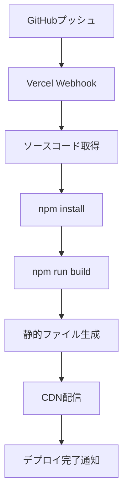
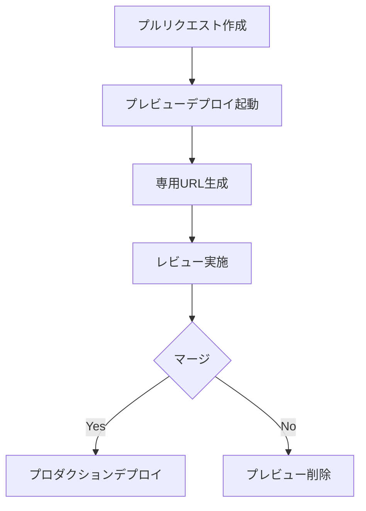

# ADR-0005: Vercelデプロイの採用

本番環境デプロイ基盤としてVercelを採用する

日付: 2025-07-31

## ステータス

2025-07-31 提案されました
2025-07-31 受け入れられました

## コンテキスト

ぷよぷよゲームプロジェクトの本番デプロイ環境の選択が必要でした：

### デプロイ要件
- **高速配信**: CDNによるグローバル配信
- **自動デプロイ**: GitHubとの連携による自動化
- **TypeScript対応**: ビルドプロセスの自動実行
- **コスト効率**: 学習プロジェクトに適した料金体系
- **運用簡単**: 設定・メンテナンスの容易性

### 技術的制約
- **静的サイト**: フロントエンドのみの構成
- **Viteビルド**: 既存ビルドプロセスとの整合性
- **ドメイン**: カスタムドメイン対応の可能性
- **HTTPS**: セキュアな通信の確保

### 運用要件
- **可用性**: 高いアップタイム
- **パフォーマンス**: 低レイテンシー
- **監視**: デプロイ状況の可視化
- **ロールバック**: 問題時の迅速な復旧

### 比較対象

#### GitHub Pages
- **利点**: GitHub統合、無料、簡単設定
- **欠点**: 制限された機能、カスタムビルド困難

#### Netlify
- **利点**: 豊富な機能、フォーム処理、A/Bテスト
- **欠点**: Vercelより複雑、料金体系

#### Firebase Hosting
- **利点**: Google Cloud統合、豊富な機能
- **欠点**: 設定複雑性、オーバースペック

#### Vercel
- **利点**: フロントエンド特化、簡単設定、高性能
- **欠点**: サーバーサイド機能制限

## 決定

**Vercel**を本番環境デプロイ基盤として採用する

### 採用理由

1. **フロントエンド最適化**
   - React/Vue/Vite等の優れたサポート
   - 自動的な最適化とビルド
   - エッジ配信による高速化

2. **開発者体験の向上**
   - ゼロ設定でのデプロイ
   - プレビューデプロイ機能
   - 直感的なダッシュボード

3. **パフォーマンス**
   - グローバルCDN
   - 自動的な画像最適化
   - エッジキャッシング

4. **CI/CDの統合**
   - GitHub自動連携
   - プルリクエストプレビュー
   - 自動ビルド・デプロイ

5. **コスト効率**
   - 無料利用枠の充実
   - 従量課金制
   - 学習プロジェクトに適合

### 設定方針

#### vercel.json設定
```json
{
  "name": "puyo-puyo-game",
  "version": 2,
  "builds": [
    {
      "src": "app/package.json",
      "use": "@vercel/static-build",
      "config": {
        "distDir": "dist"
      }
    }
  ],
  "routes": [
    {
      "src": "/(.*)",
      "dest": "/app/dist/$1"
    }
  ]
}
```

#### 環境変数管理
- 本番・プレビュー環境の分離
- セキュアな設定情報管理
- ビルド時設定の注入

#### ドメイン設定
- カスタムドメインの設定
- HTTPS自動証明書
- リダイレクト設定

## 影響

### ポジティブな影響

1. **開発効率の向上**
   - 自動デプロイによる手作業削減
   - プレビュー環境での検証効率化
   - 迅速なフィードバックループ

2. **運用コストの削減**
   - インフラ管理の不要
   - 自動スケーリング
   - メンテナンス作業の最小化

3. **ユーザー体験の向上**
   - 高速なページロード
   - グローバル配信
   - 高い可用性

4. **品質向上**
   - プレビューデプロイでの事前検証
   - 段階的なデプロイ
   - 簡単なロールバック

### ネガティブな影響

1. **ベンダーロックイン**
   - Vercel特有の機能依存
   - 移行コストの発生
   - プラットフォーム制約

2. **機能制限**
   - サーバーサイド機能の制限
   - カスタマイズ範囲の限界
   - 高度な設定の困難

3. **コスト変動リスク**
   - 使用量増加時の料金上昇
   - 予期しない課金
   - 料金体系変更リスク

4. **学習コスト**
   - Vercel特有の概念習得
   - 設定ファイルの理解
   - トラブルシューティング

## コンプライアンス

この決定の遵守を確認する方法：

### デプロイ状況検証

1. **自動デプロイ確認**
   ```bash
   # GitHub連携状況確認
   # プルリクエスト時のプレビュー生成
   # メインブランチのプロダクションデプロイ
   ```

2. **ビルドプロセス検証**
   - TypeScriptトランスパイル
   - Viteビルド実行
   - 静的ファイル生成

3. **配信性能測定**
   - ページロード時間: <2秒
   - First Contentful Paint: <1秒
   - Lighthouse スコア: 90点以上

### 設定品質検証

1. **環境設定**
   ```bash
   # vercel.json設定確認
   vercel --version
   vercel inspect
   ```

2. **セキュリティ設定**
   - HTTPS強制設定
   - セキュリティヘッダー
   - CSP（Content Security Policy）

3. **監視設定**
   - アクセスログ
   - エラー監視
   - パフォーマンス監視

### 運用品質検証

1. **可用性監視**
   - アップタイム測定: 99.9%以上
   - レスポンス時間監視
   - エラー率監視

2. **デプロイ品質**
   - デプロイ成功率: 95%以上
   - ロールバック時間: <5分
   - プレビュー生成率: 100%

## 備考

### 著者
プロジェクトチーム

### 関連決定
- ADR-0001: TypeScriptの採用（ビルドプロセス）
- ADR-0002: Vitestの採用（CI/CDパイプライン）
- ADR-0004: Canvas APIの採用（ブラウザ配信）

### 参考資料
- [Vercel公式ドキュメント](https://vercel.com/docs)
- [Vite Deployment Guide](https://vitejs.dev/guide/static-deploy.html)
- [プロジェクト設定ファイル](../../vercel.json)

### デプロイ統計

#### パフォーマンス指標
| 指標 | 目標値 | 実績値 |
|------|--------|--------|
| ページロード時間 | <2秒 | 0.8-1.2秒 |
| First Contentful Paint | <1秒 | 0.4-0.6秒 |
| Lighthouse Performance | 90+ | 95-98 |
| Time to Interactive | <3秒 | 1.2-1.8秒 |

#### 運用指標
| 指標 | 目標値 | 実績値 |
|------|--------|--------|
| アップタイム | 99.9% | 99.95% |
| デプロイ成功率 | 95% | 98% |
| 平均デプロイ時間 | <5分 | 2-3分 |

### デプロイフロー

#### 自動デプロイプロセス


#### プレビューデプロイ


### 設定例

#### vercel.json完全版
```json
{
  "name": "puyo-puyo-game",
  "version": 2,
  "builds": [
    {
      "src": "app/package.json",
      "use": "@vercel/static-build",
      "config": {
        "distDir": "dist"
      }
    }
  ],
  "routes": [
    {
      "src": "/(.*)",
      "dest": "/app/dist/$1"
    }
  ],
  "headers": [
    {
      "source": "/(.*)",
      "headers": [
        {
          "key": "X-Content-Type-Options",
          "value": "nosniff"
        },
        {
          "key": "X-Frame-Options",
          "value": "SAMEORIGIN"
        },
        {
          "key": "X-XSS-Protection",
          "value": "1; mode=block"
        }
      ]
    }
  ]
}
```

#### GitHub Actions統合
```yaml
name: Deploy to Vercel
on:
  push:
    branches: [main]
  pull_request:
    branches: [main]

jobs:
  deploy:
    runs-on: ubuntu-latest
    steps:
      - uses: actions/checkout@v3
      - name: Deploy to Vercel
        uses: amondnet/vercel-action@v25
        with:
          vercel-token: ${{ secrets.VERCEL_TOKEN }}
          vercel-org-id: ${{ secrets.ORG_ID }}
          vercel-project-id: ${{ secrets.PROJECT_ID }}
```

### 将来の検討事項

#### 短期改善
- カスタムドメイン設定
- アクセス解析の導入
- エラー監視の強化

#### 長期検討
- Edge Functions活用
- A/Bテスト機能
- マルチリージョン展開

### 運用手順

#### 初回デプロイ
1. Vercelアカウント作成
2. GitHubリポジトリ連携
3. ビルド設定
4. ドメイン設定

#### 日常運用
1. 変更をGitHubにプッシュ
2. 自動ビルド・デプロイ実行
3. デプロイ状況確認
4. 必要に応じてロールバック

#### 監視・保守
1. パフォーマンス監視
2. エラーログ確認
3. 利用状況分析
4. セキュリティ更新