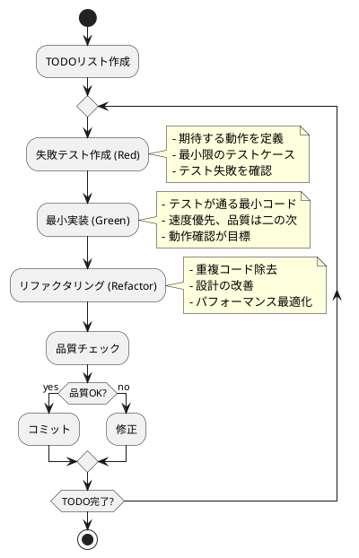

# ADR-004: TDD（テスト駆動開発）手法採用

## ステータス

採用

## 背景

ぷよぷよゲーム開発において、複雑なゲームロジック（連鎖、消去、重力計算）の品質保証と、継続的な機能追加・改善に対応するため、開発手法の選定が必要。CLAUDE.local.mdの開発ガイドに基づき、TDD（テスト駆動開発）サイクルを中心とした開発プロセスの採用を検討する。

## 検討事項

### 開発手法の選択肢

#### 1. ウォーターフォール型テスト
- **アプローチ:** 実装完了後にテスト作成
- **メリット:** 学習コストが低い、短期的な開発速度
- **デメリット:** バグ発見が遅い、設計変更コスト高、テスト網羅性不足

#### 2. TDD（テスト駆動開発）
- **アプローチ:** Red-Green-Refactorサイクル
- **メリット:** 高品質、早期バグ発見、設計改善、回帰テスト
- **デメリット:** 初期学習コスト、開発時間増加（短期的）

#### 3. BDD（ビヘイビア駆動開発）
- **アプローチ:** ユーザーストーリー中心のテスト
- **メリット:** ビジネス価値重視、ステークホルダー協調
- **デメリット:** 技術的詳細の不足、ツール習得コスト

### ぷよぷよゲーム開発におけるTDDの適用性

#### 適用メリット
1. **複雑ロジックの品質保証:**
   - 連鎖計算の正確性
   - エッジケースの網羅
   - 回帰バグの防止

2. **設計改善効果:**
   - テスタブルな設計の促進
   - 疎結合な実装
   - インターフェースの明確化

3. **継続的開発支援:**
   - 安全なリファクタリング
   - 機能追加時の影響確認
   - ドキュメントとしてのテスト

#### 適用課題
1. **初期コスト:** 学習時間・実装時間の増加
2. **UI層の扱い:** Reactコンポーネントのテスト複雑性
3. **非同期処理:** アニメーション・タイマーのテスト

## 決定

**TDD（テスト駆動開発）手法を採用する**

### Red-Green-Refactorサイクル



### テストピラミッド戦略

```
       ┌─────────────┐
       │  E2E Tests  │  ←少数・高価値・低速
       │   (10-15)   │
   ┌───┴─────────────┴───┐
   │ Integration Tests   │  ←中程度・中価値・中速
   │      (50-70)        │
┌──┴─────────────────────┴──┐
│      Unit Tests           │  ←多数・高速・詳細
│       (200-300)           │
└───────────────────────────┘
```

## 実装方針

### 1. ドメイン層中心のTDD

#### Example: Puyo消去ロジック
```typescript
// Red: 失敗テスト
describe('Field', () => {
  test('同色ぷよが4つ以上隣接している時消去対象として検出される', () => {
    // Given
    const field = createFieldWithPuyos([
      ['R', 'R', '.', '.', '.', '.'],
      ['R', 'R', '.', '.', '.', '.'],
      ['.', '.', '.', '.', '.', '.'],
    ]);
    
    // When
    const erasableGroups = field.detectErasableGroups();
    
    // Then
    expect(erasableGroups).toHaveLength(1);
    expect(erasableGroups[0].size()).toBe(4);
    expect(erasableGroups[0].color).toBe(PuyoColor.RED);
  });
});

// Green: 最小実装
class Field {
  detectErasableGroups(): PuyoGroup[] {
    // テストが通る最小の実装
    return [new PuyoGroup(/* 4つの赤ぷよ */)];
  }
}

// Refactor: 本格実装
class Field {
  detectErasableGroups(): PuyoGroup[] {
    const visited = new Set<string>();
    const erasableGroups: PuyoGroup[] = [];
    
    for (let y = 0; y < this.height; y++) {
      for (let x = 0; x < this.width; x++) {
        const puyo = this.getPuyo(x, y);
        if (puyo && !visited.has(`${x},${y}`)) {
          const group = this.findConnectedGroup(x, y, puyo.color, visited);
          if (group.size() >= 4) {
            erasableGroups.push(group);
          }
        }
      }
    }
    
    return erasableGroups;
  }
}
```

### 2. レイヤー別TDD適用

#### ドメイン層（最優先）
- **対象:** Game, Field, Puyo, Chain等のコアロジック
- **方針:** 100%のTDDサイクル適用
- **目標カバレッジ:** 95%以上

#### アプリケーション層
- **対象:** GameService, ScoreService等のユースケース
- **方針:** 主要フローのTDD、詳細はテスト後記述
- **目標カバレッジ:** 85%以上

#### プレゼンテーション層
- **対象:** Reactコンポーネント
- **方針:** 行動駆動テスト中心、TDDは部分適用
- **目標カバレッジ:** 70%以上

### 3. 3A（Arrange-Act-Assert）パターン

```typescript
describe('Game', () => {
  test('ゲーム開始時に初期状態が正しく設定される', () => {
    // Arrange（準備）
    const gameId = new GameId('test-game-1');
    
    // Act（実行）
    const game = Game.startNewGame(gameId);
    
    // Assert（検証）
    expect(game.getState()).toBe(GameState.READY);
    expect(game.getScore().current).toBe(0);
    expect(game.getField().isEmpty()).toBe(true);
  });
});
```

## テストツール・環境

### 技術スタック
- **テストランナー:** Jest
- **Reactテスト:** React Testing Library
- **E2Eテスト:** Playwright
- **カバレッジ:** c8 (NYC)

### CI/CDとの統合
```yaml
# GitHub Actions例
steps:
  - name: Run Unit Tests
    run: npm test -- --coverage --watchAll=false
    
  - name: Check Coverage Threshold
    run: |
      COVERAGE=$(npm test -- --coverage --silent | grep -o "[0-9]*\.[0-9]*%" | head -1 | sed 's/%//')
      if (( $(echo "$COVERAGE < 80" | bc -l) )); then
        echo "Coverage $COVERAGE% is below 80% threshold"
        exit 1
      fi
```

### 品質ゲート
1. **テスト通過:** すべてのテストが通過する
2. **カバレッジ:** 設定した閾値以上を維持
3. **コード品質:** ESLint・TypeScriptエラーなし

## 開発ワークフロー

### 日次開発フロー
1. **朝のセットアップ:**
   - 前日の作業確認
   - 本日のTODOリスト更新

2. **TDDサイクル実行:**
   - 1TODOあたり15-30分を目安
   - Red-Green-Refactorの厳密な実行
   - 各サイクル後のコミット

3. **統合確認:**
   - 他チームメンバーとの統合テスト
   - CI/CDパイプラインでの品質確認

### TODOリスト管理
```typescript
// TODOの例
const gameLogicTodos = [
  'ぷよがフィールドに配置される',
  '配置後に重力が適用される',
  '4つ以上の同色ぷよが消去される',
  '消去後に上のぷよが落下する', 
  '連鎖が発生する',
  '連鎖スコアが計算される',
  'ゲームオーバーが判定される'
];
```

## モック戦略

### 外部依存のモック
```typescript
// アニメーション・サウンドのモック
const mockAnimationService = {
  playPuyoDropAnimation: jest.fn(),
  playChainAnimation: jest.fn()
} as jest.Mocked<AnimationService>;

// LocalStorageのモック
const mockStorage = {
  save: jest.fn(),
  load: jest.fn().mockReturnValue(null)
} as jest.Mocked<StorageService>;
```

### テストデータビルダー
```typescript
class GameTestDataBuilder {
  private game: Game;
  
  constructor() {
    this.game = GameFactory.createDefault();
  }
  
  withField(pattern: string[][]): this {
    const field = FieldFactory.createFromPattern(pattern);
    this.game = this.game.withField(field);
    return this;
  }
  
  withScore(score: number): this {
    this.game = this.game.withScore(new Score(score, 0));
    return this;
  }
  
  build(): Game {
    return this.game;
  }
}

// 使用例
const gameWithChain = new GameTestDataBuilder()
  .withField([
    ['R', 'R', 'R', '.', '.', '.'],
    ['R', 'G', 'G', 'G', '.', '.']
  ])
  .withScore(1000)
  .build();
```

## 結果・メトリクス

### 品質指標
- **バグ密度:** 1バグ/1000行以下を目標
- **テスト実行時間:** 単体テスト5分以内
- **開発速度:** 初期30%減→3ヶ月後20%増を想定

### 継続的改善
1. **週次振り返り:** TDDプラクティスの改善
2. **月次メトリクス分析:** カバレッジ・バグトレンド
3. **四半期プロセス見直し:** 手法の最適化

## 注意点・リスク

### 潜在的リスク
1. **初期生産性低下:** 学習期間中の開発速度減少
2. **テスト保守コスト:** 仕様変更時のテスト更新
3. **過度なテスト:** 価値の低いテストケース作成

### 対策
1. **段階的導入:** コア機能から順次TDD適用
2. **継続的学習:** ペアプログラミング・コードレビュー
3. **実用的テスト:** ビジネス価値重視のテストケース

## 関連ADR

- ADR-001: アーキテクチャ選定
- ADR-002: フロントエンド技術スタック選定
- ADR-003: ドメイン駆動設計採用
- ADR-005: デプロイメント戦略

---

**日付:** 2025-08-12  
**作成者:** Claude Code  
**レビュー者:** 開発チーム  
**次回見直し:** 2025-11-12（3ヶ月後）