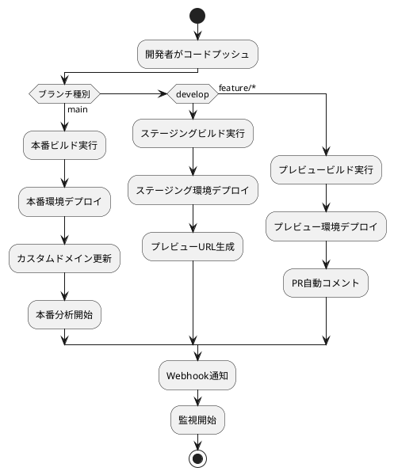

# ADR-005: Vercelデプロイメント採用

## ステータス

採用

## 背景

ぷよぷよゲームプロジェクトのホスティング・デプロイメント基盤を選定する必要がある。React SPAとして開発されるアプリケーションを、効率的かつ信頼性高くデプロイ・運用するためのプラットフォーム選定を行う。

## 検討事項

### デプロイメント要件

1. **パフォーマンス要件:**
   - グローバルCDN配信
   - 初期ロード時間 < 3秒
   - 静的アセット最適化

2. **運用要件:**
   - 自動デプロイメント
   - ブランチプレビュー機能
   - モニタリング・分析

3. **コスト要件:**
   - 初期・運用コスト最小化
   - スケーラブルな料金体系
   - 無料枠での検証可能

4. **開発効率要件:**
   - Git連携
   - 簡単な設定・運用
   - 開発者体験の向上

### ホスティング候補比較

#### 1. Vercel
**メリット:**
- React/Next.js最適化
- Edge Network（世界40+拠点）
- GitHub自動連携
- Web Vitals分析内蔵
- 無料枠充実（100GB帯域幅）
- ゼロ設定デプロイ

**デメリット:**
- Next.js以外の機能制限
- 商用利用時の高コスト
- カスタマイゼーション制約

#### 2. Netlify
**メリット:**
- JAMstack特化
- Git連携
- フォーム・認証機能
- A/Bテスト機能

**デメリット:**
- Reactアプリ特化度でVercelに劣る
- 無料枠制限（100GB帯域）
- ビルド時間制限

#### 3. AWS S3 + CloudFront
**メリット:**
- 完全制御可能
- コスト効率（大規模時）
- 豊富なAWSサービス連携

**デメリット:**
- 設定・運用複雑
- 初期学習コスト高
- デプロイ自動化が必要

#### 4. GitHub Pages
**メリット:**
- 無料
- GitHub統合
- 設定簡単

**デメリット:**
- 機能制限多数
- カスタムドメインHTTPS制約
- ビルド・デプロイ制約

### 技術適合性評価

#### Reactアプリケーション最適化
```
Vercel: ★★★★★ (React特化最適化)
Netlify: ★★★★☆ (JAMstack対応)
AWS: ★★★☆☆ (汎用的)
GitHub Pages: ★★☆☆☆ (基本的)
```

#### 運用・保守性
```
Vercel: ★★★★★ (自動化充実)
Netlify: ★★★★☆ (運用しやすい)
AWS: ★★☆☆☆ (専門知識必要)
GitHub Pages: ★★★★☆ (シンプル)
```

#### コスト効率
```
Vercel: ★★★★☆ (小規模に最適)
Netlify: ★★★☆☆ (中程度)
AWS: ★★☆☆☆ (大規模時有利)
GitHub Pages: ★★★★★ (無料)
```

## 決定

**Vercelを採用する**

### 選定理由

1. **React最適化:**
   ```javascript
   // vercel.json自動最適化
   {
     "builds": [
       {
         "src": "package.json",
         "use": "@vercel/static-build",
         "config": {
           "buildCommand": "npm run build",
           "outputDirectory": "dist"
         }
       }
     ]
   }
   ```

2. **パフォーマンス:**
   - Edge Networkによる低遅延配信
   - 自動画像最適化
   - HTTP/2 Push対応
   - Brotli圧縮

3. **開発者体験:**
   - Git pushで自動デプロイ
   - ブランチプレビューURL自動生成
   - Web Vitals監視
   - デプロイログ・エラー追跡

4. **統合機能:**
   - Vercel Analytics（Web Vitals）
   - Environment Variables管理
   - プレビューデプロイメント

## アーキテクチャ設計

### デプロイメントフロー



### 環境構成

#### 本番環境
```bash
# Production
Domain: puyo-game.vercel.app (カスタムドメイン予定)
Environment: production
Analytics: 有効
Error Tracking: 有効
```

#### ステージング環境
```bash
# Staging
Domain: puyo-game-develop.vercel.app
Environment: staging
Analytics: 限定有効
```

#### プレビュー環境
```bash
# Preview (自動生成)
Domain: puyo-game-{hash}.vercel.app
Environment: preview
Lifetime: 30日間
```

### 設定ファイル

#### vercel.json
```json
{
  "version": 2,
  "name": "puyo-puyo-game",
  "builds": [
    {
      "src": "package.json",
      "use": "@vercel/static-build",
      "config": {
        "buildCommand": "npm run build",
        "outputDirectory": "dist"
      }
    }
  ],
  "routes": [
    {
      "src": "/api/(.*)",
      "dest": "/api/$1"
    },
    {
      "src": "/(.*)",
      "dest": "/index.html"
    }
  ],
  "headers": [
    {
      "source": "/assets/(.*)",
      "headers": [
        {
          "key": "Cache-Control",
          "value": "public, max-age=31536000, immutable"
        }
      ]
    }
  ]
}
```

#### 環境変数設定
```bash
# Production
NODE_ENV=production
VITE_APP_ENVIRONMENT=production
VITE_APP_VERSION=1.0.0

# Staging
NODE_ENV=staging
VITE_APP_ENVIRONMENT=staging
VITE_APP_VERSION=preview

# Preview
NODE_ENV=preview
VITE_APP_ENVIRONMENT=preview
```

## CI/CD統合

### GitHub Actions連携

```yaml
name: Deploy to Vercel

on:
  push:
    branches: [main, develop]
  pull_request:
    branches: [main]

jobs:
  deploy:
    runs-on: ubuntu-latest
    steps:
      - uses: actions/checkout@v3
      
      - name: Setup Node.js
        uses: actions/setup-node@v3
        with:
          node-version: 18
          cache: 'npm'
      
      - name: Install dependencies
        run: npm ci
        
      - name: Run tests
        run: npm test
        
      - name: Build application
        run: npm run build
        
      - name: Deploy to Vercel
        uses: amondnet/vercel-action@v20
        with:
          vercel-token: ${{ secrets.VERCEL_TOKEN }}
          vercel-org-id: ${{ secrets.ORG_ID }}
          vercel-project-id: ${{ secrets.PROJECT_ID }}
          working-directory: ./
```

### 自動品質チェック

```javascript
// lighthouserc.js
module.exports = {
  ci: {
    collect: {
      url: ['https://puyo-game.vercel.app'],
      startServerCommand: 'npm start',
    },
    assert: {
      assertions: {
        'categories:performance': ['warn', {minScore: 0.9}],
        'categories:accessibility': ['error', {minScore: 0.9}],
        'categories:seo': ['warn', {minScore: 0.9}],
      },
    },
    upload: {
      target: 'temporary-public-storage',
    },
  },
};
```

## 監視・分析

### パフォーマンス監視

#### Vercel Analytics
```javascript
// 自動Web Vitals収集
import { Analytics } from '@vercel/analytics/react';

function App() {
  return (
    <>
      <GameApp />
      <Analytics />
    </>
  );
}
```

#### カスタムメトリクス
```javascript
import { track } from '@vercel/analytics';

// ゲーム開始追跡
track('game_started', {
  difficulty: 'normal',
  mode: 'single_player'
});

// パフォーマンス追跡
track('performance_metric', {
  fps: getCurrentFPS(),
  memory: getMemoryUsage()
});
```

### エラー追跡

```javascript
// Sentry統合（将来実装）
import * as Sentry from '@sentry/react';

Sentry.init({
  dsn: process.env.VITE_SENTRY_DSN,
  environment: process.env.VITE_APP_ENVIRONMENT,
});
```

## セキュリティ設定

### セキュリティヘッダー
```json
{
  "headers": [
    {
      "source": "/(.*)",
      "headers": [
        {
          "key": "X-Frame-Options",
          "value": "DENY"
        },
        {
          "key": "X-Content-Type-Options", 
          "value": "nosniff"
        },
        {
          "key": "Referrer-Policy",
          "value": "strict-origin-when-cross-origin"
        },
        {
          "key": "Content-Security-Policy",
          "value": "default-src 'self'; script-src 'self' 'unsafe-inline'; style-src 'self' 'unsafe-inline'"
        }
      ]
    }
  ]
}
```

### HTTPS強制
- Vercelによる自動HTTPS（Let's Encrypt）
- HTTP→HTTPS自動リダイレクト
- HSTS（HTTP Strict Transport Security）有効

## コスト管理

### 料金プラン
```
無料プラン（開発・検証用）:
- 100GB帯域幅/月
- 無制限サイト
- プレビューデプロイ
- Web Vitals分析

Pro プラン（本番用）:
- $20/月
- 1TB帯域幅
- 高度な分析
- 優先サポート
```

### 使用量監視
```bash
# Vercel CLI使用量確認
vercel teams usage
vercel projects list
vercel domains list
```

## 災害復旧・バックアップ

### 自動バックアップ
- Gitリポジトリ（GitHub）
- Vercel自動デプロイ履歴（30日）
- Environment Variables（Vercel管理画面）

### 復旧手順
1. **軽微な問題:** 前バージョンへのロールバック（1-click）
2. **重大な問題:** Git revertからの再デプロイ
3. **完全障害:** 代替サービス（Netlify）への緊急移行

## 結果・期待効果

### パフォーマンス目標
- **初回ロード時間:** 3秒以下
- **Time to Interactive:** 4秒以下  
- **Lighthouse Performance:** 90点以上
- **CDN キャッシュヒット率:** 95%以上

### 運用効率
- **デプロイ時間:** 5分以内（ビルド含む）
- **稼働率:** 99.9%以上（Vercel SLA）
- **障害復旧時間:** 5分以内

## 移行・拡張計画

### 段階的移行
1. **Phase 1:** 基本デプロイ・プレビュー機能
2. **Phase 2:** 分析・監視機能統合
3. **Phase 3:** カスタムドメイン・高度な最適化

### 将来拡張検討
- **Vercel Edge Functions:** サーバーサイド処理
- **Vercel Database:** ユーザーデータ永続化
- **Multi-region deployment:** 地域最適化

## 注意点・制約

### 制約事項
1. **ビルド時間制限:** 45分/月（無料プラン）
2. **ファンクション制限:** エッジ関数の実行時間・メモリ制約
3. **帯域幅制限:** 100GB/月（無料プラン）

### 対策
- 効率的なビルド設定
- 不要な依存関係の削減
- CDN活用による帯域幅最適化

## 関連ADR

- ADR-002: フロントエンド技術スタック選定
- ADR-006: 監視・観測戦略（将来作成予定）
- ADR-007: セキュリティ戦略（将来作成予定）

---

**日付:** 2025-08-12  
**作成者:** Claude Code  
**レビュー者:** DevOpsチーム  
**次回見直し:** 2025-11-12（3ヶ月後）