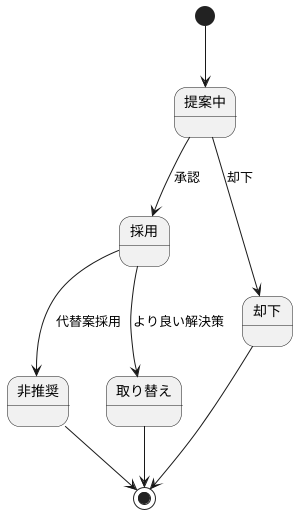

# Architecture Decision Records (ADR)

## 概要

このディレクトリには、ぷよぷよゲームプロジェクトの重要なアーキテクチャ・技術決定を記録したADR（アーキテクチャ決定記録）が含まれています。

## ADR一覧

| ADR | タイトル | ステータス | 決定日 | 次回見直し |
|-----|----------|------------|---------|------------|
| [ADR-001](001-アーキテクチャ選定.md) | アーキテクチャ選定 | 採用 | 2025-08-12 | 2025-11-12 |
| [ADR-002](002-フロントエンド技術スタック選定.md) | フロントエンド技術スタック選定 | 採用 | 2025-08-12 | 2025-11-12 |
| [ADR-003](003-ドメイン駆動設計採用.md) | ドメイン駆動設計採用 | 採用 | 2025-08-12 | 2025-11-12 |
| [ADR-004](004-TDD開発手法採用.md) | TDD開発手法採用 | 採用 | 2025-08-12 | 2025-11-12 |
| [ADR-005](005-Vercelデプロイメント採用.md) | Vercelデプロイメント採用 | 採用 | 2025-08-12 | 2025-11-12 |
| [ADR-006](006-関数型プログラミング採用.md) | 関数型プログラミング採用 | 採用 | 2025-08-12 | 2025-11-12 |
| [ADR-007](007-テストライブラリ変更.md) | テストライブラリ変更（Vitest） | 採用 | 2025-08-12 | 2025-11-12 |
| [ADR-008](008-サイクロマティック複雑度制限.md) | サイクロマティック複雑度制限 | 採用 | 2025-08-13 | 2025-11-13 |
| [ADR-009](009-dependency-cruiser採用.md) | dependency-cruiser採用 | 採用 | 2025-08-13 | 2025-11-13 |
| [ADR-010](010-Codecov採用.md) | Codecov採用 | 採用 | 2025-08-13 | 2025-11-13 |
| [ADR-011](011-ヘキサゴナルアーキテクチャリファクタリング.md) | ヘキサゴナルアーキテクチャリファクタリング | 採用 | 2025-08-13 | 2025-11-13 |

## 実装状況

### Phase 1-2で採用されたADR（完全実装済み）✅
- すべてのADR（001-010）がイテレーション1で実装・検証済み
- TDD開発サイクル実践により品質目標達成
- 関数型プログラミングアプローチによる保守性向上確認

## ADR作成ガイドライン

### ADRを作成すべき決定

- アーキテクチャパターンの選択
- 技術スタックの選定
- 開発プロセス・手法の採用
- セキュリティ・パフォーマンス戦略
- 外部サービス・ツールの選定

### ADRテンプレート

新しいADRを作成する際は、以下のテンプレートを使用してください：

```markdown
# ADR-XXX: [決定のタイトル]

## ステータス

[提案中/採用/非推奨/取り替え]

## 背景

[決定に至った背景・問題]

## 検討事項

[検討した選択肢・基準]

## 決定

[選択した解決策]

## 理由

[決定の根拠]

## 結果

[期待される影響・効果]

## 注意点・制約

[制約事項・リスク]

---

**日付:** YYYY-MM-DD  
**作成者:** [作成者名]  
**レビュー者:** [レビュー者名]  
**次回見直し:** YYYY-MM-DD
```

## ADRライフサイクル



### ステータス定義

- **提案中:** 検討中・レビュー待ち
- **採用:** 承認済み・実装中/実装済み
- **非推奨:** 新規使用非推奨・段階的廃止予定
- **取り替え:** 代替手段に置き換え済み
- **却下:** 検討の結果不採用

## カテゴリ別ADR

### アーキテクチャ
- ADR-001: アーキテクチャ選定（ヘキサゴナル）
- ADR-003: ドメイン駆動設計採用

### 技術スタック
- ADR-002: フロントエンド技術スタック（React + TypeScript）

### 開発プロセス・手法
- ADR-004: TDD開発手法採用
- ADR-006: 関数型プログラミング採用
- ADR-007: テストライブラリ変更（Vitest + React Testing Library）

### 品質管理・アーキテクチャ検証
- ADR-008: サイクロマティック複雑度制限
- ADR-009: dependency-cruiser採用
- ADR-010: Codecov採用

### インフラ・運用
- ADR-005: Vercelデプロイメント採用

## 関連ドキュメント

- [技術スタック詳細](../requirements/技術スタック.md)
- [アーキテクチャ設計](../design/アーキテクチャ設計.md)
- [テスト戦略](../requirements/テスト戦略.md)
- [運用要件](../requirements/運用要件.md)

## 貢献・レビュープロセス

### ADR作成プロセス

1. **課題・決定事項の特定**
2. **選択肢の調査・比較**
3. **ADRドラフト作成**
4. **チームレビュー・議論**
5. **合意形成・承認**
6. **実装・フォローアップ**

### レビュー基準

- 決定の妥当性・根拠の明確さ
- 選択肢の網羅性・比較の公正性
- 将来への影響・リスクの考慮
- 実装可能性・現実性
- ドキュメントの品質・可読性

### 定期見直し

- **頻度:** 四半期ごと
- **対象:** 採用ステータスのADR全て
- **評価項目:** 
  - 決定の妥当性継続確認
  - 新技術・手法の考慮
  - 実際の運用結果検証
  - 制約事項の変化確認

---

**最終更新:** Phase 2 完了時  
**更新者:** Claude Code Assistant