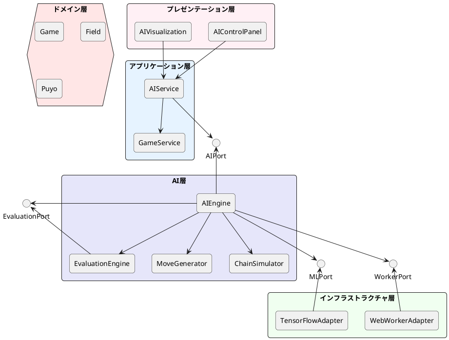
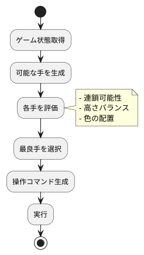
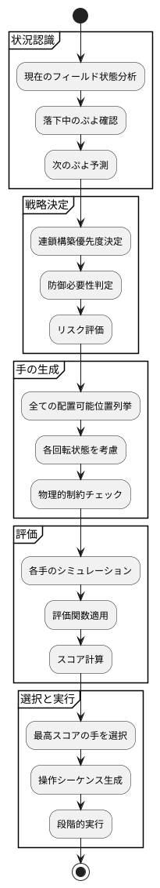
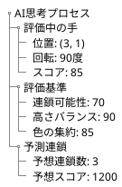
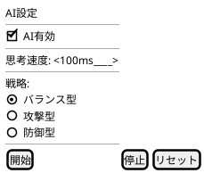
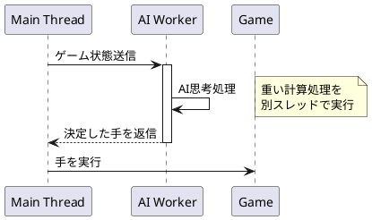
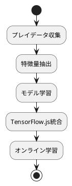
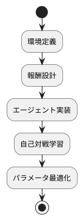

# AI設計

## 概要

ぷよぷよゲームにおけるAI自動プレイ機能の設計について説明します。ヘキサゴナルアーキテクチャに従い、AI機能を独立したポートとして実装します。

## AI機能要件

### US-005: AI自動プレイ機能

**受け入れ基準:**

- AIが自動でぷよを操作する
- AIの思考過程が可視化される
- 手動プレイとAIプレイの切り替えができる
- AIのプレイ速度を調整できる

## アーキテクチャ設計

### AI層の配置



## AI実装戦略

### フェーズ1: 基本AI（イテレーション3）

シンプルなルールベースAIから開始し、段階的に高度化します。



### 評価関数

```typescript
interface EvaluationCriteria {
  chainPotential: number;      // 連鎖可能性 (0-100)
  heightBalance: number;        // 高さバランス (0-100)
  colorClustering: number;      // 色の集約度 (0-100)
  immediateChain: number;       // 即座の連鎖 (0-100)
  dangerLevel: number;          // 危険度 (0-100)
}
```

### AI思考プロセス



## AIコンポーネント詳細

### AIEngine

**責務:**

- AI思考の統括
- 各評価エンジンの調整
- 最終的な意思決定

**インターフェース:**

```typescript
interface AIEngine {
  // 次の手を決定
  decideMMove(gameState: GameState): AIMove;
  
  // 思考プロセスを取得
  getThinkingProcess(): ThinkingProcess;
  
  // AI設定
  configure(settings: AISettings): void;
}
```

### EvaluationEngine

**責務:**

- 盤面評価
- スコア計算
- 戦略的価値判定

**インターフェース:**

```typescript
interface EvaluationEngine {
  // 盤面評価
  evaluate(field: Field): EvaluationScore;
  
  // 手の評価
  evaluateMove(field: Field, move: Move): MoveScore;
  
  // 評価基準設定
  setWeights(weights: EvaluationWeights): void;
}
```

### MoveGenerator

**責務:**

- 可能な手の生成
- 物理制約の考慮
- 優先順位付け

**インターフェース:**

```typescript
interface MoveGenerator {
  // 可能な手を生成
  generateMoves(field: Field, puyoPair: PuyoPair): Move[];
  
  // 手の実行可能性チェック
  isValidMove(field: Field, move: Move): boolean;
}
```

### ChainSimulator

**責務:**

- 連鎖シミュレーション
- 結果予測
- スコア計算

**インターフェース:**

```typescript
interface ChainSimulator {
  // 連鎖シミュレーション
  simulate(field: Field, move: Move): SimulationResult;
  
  // 連鎖数予測
  predictChainCount(field: Field): number;
}
```

## AI可視化設計

### 思考プロセスの可視化



### AIコントロールパネル



## パフォーマンス考慮事項

### Web Workers活用



### 最適化戦略

1. **段階的評価:**
   - 明らかに悪い手を早期に除外
   - プルーニングによる探索効率化

2. **キャッシュ活用:**
   - 評価結果のメモ化
   - 類似盤面の再利用

3. **非同期処理:**
   - Web Workersによる並列処理
   - UIブロッキングの回避

## テスト戦略

### AI単体テスト

```typescript
describe('AIEngine', () => {
  describe('決定的な状況での判断', () => {
    test('4つ揃えられる時は即座に消去する', () => {
      // Arrange: 3つ揃っている状態
      // Act: AI判断
      // Assert: 4つ目を配置する手を選択
    });
  });
  
  describe('評価関数の妥当性', () => {
    test('高い塔は低評価される', () => {
      // Arrange: 高い塔がある盤面
      // Act: 評価
      // Assert: 低いスコア
    });
  });
});
```

### パフォーマンステスト

```typescript
describe('AIパフォーマンス', () => {
  test('思考時間が設定値以内', () => {
    // 100ms以内に判断完了
  });
  
  test('メモリリークがない', () => {
    // 1000回の思考でメモリ増加なし
  });
});
```

## 将来の拡張性

### フェーズ2: 機械学習（イテレーション4）



### フェーズ3: 強化学習（イテレーション5）



## まとめ

このAI設計により、以下を実現します：

1. **段階的実装:** シンプルなルールベースから開始
2. **拡張性:** 機械学習への移行を考慮
3. **パフォーマンス:** Web Workersによる非同期処理
4. **可視化:** 思考プロセスの透明性
5. **テスタビリティ:** 明確な責務分離によるテスト容易性