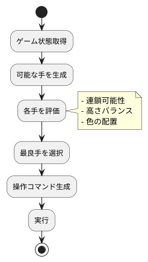
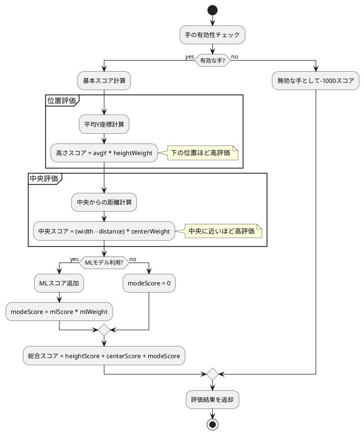
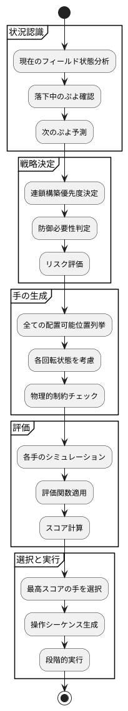
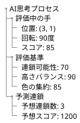
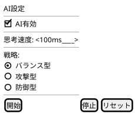
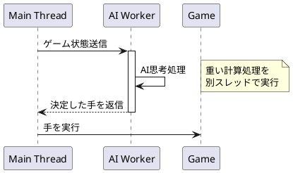
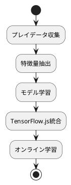
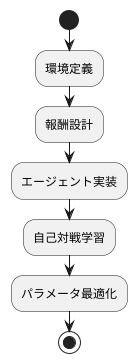

# AI設計

## 概要

ぷよぷよゲームにおけるAI自動プレイ機能の設計について説明します。ヘキサゴナルアーキテクチャに従い、AI機能を独立したポートとして実装します。

## AI機能要件

### US-005: AI自動プレイ機能

**受け入れ基準:**

- AIが自動でぷよを操作する
- AIの思考過程が可視化される
- 手動プレイとAIプレイの切り替えができる
- AIのプレイ速度を調整できる

## アーキテクチャ設計

### AI層の配置（現在の実装）

```plantuml
@startuml "AI機能アーキテクチャ（実装済み）"
!define DOMAIN_COLOR #FFE6E6
!define APP_COLOR #E6F3FF  
!define INFRA_COLOR #F0FFF0
!define UI_COLOR #FFF0F5
!define DOMAIN_SERVICE_COLOR #FFD700

skinparam roundcorner 10

package "ドメイン層" DOMAIN_COLOR {
  package "domain/models/ai" {
    rectangle "AIGameState" as AIGameState
    rectangle "PossibleMove" as PossibleMove  
    rectangle "MoveEvaluation" as MoveEvaluation
    rectangle "StrategyConfig" as StrategyConfig
    rectangle "PerformanceMetrics" as PerformanceMetrics
  }
  
  package "domain/services/ai" DOMAIN_SERVICE_COLOR {
    rectangle "EvaluationService\n(純粋関数)" as EvaluationService
    note right of EvaluationService
      evaluateMove()
      evaluateMoveWithML()
      getBestMove()
      calculateBaseScores()
    end note
  }
}

package "アプリケーション層" APP_COLOR {
  package "application/services" {
    rectangle "GameService" as GameService
  }
  
  package "application/services/ai" {
    rectangle "AIService" as AIService
    rectangle "MLAIService\n(TensorFlow.js)" as MLAIService
    rectangle "WorkerAIService\n(Web Workers)" as WorkerAIService
    rectangle "MoveGenerator" as MoveGenerator
    rectangle "StrategyService" as StrategyService
  }
  
  package "application/services/visualization" {
    rectangle "ChartDataService" as ChartDataService
  }
  
  rectangle "PerformanceAnalysisService" as PerformanceAnalysisService
}

package "プレゼンテーション層" UI_COLOR {
  package "presentation/components/ai" {
    rectangle "AIControlPanel" as AIControlPanel
    rectangle "AIInsights" as AIInsights
    rectangle "PerformanceAnalysis" as PerformanceAnalysis
    rectangle "StrategySettings" as StrategySettings
  }
}

package "インフラストラクチャ層" INFRA_COLOR {
  package "infrastructure/ai" {
    rectangle "AIWorker\n(ai.worker.ts)" as AIWorker
  }
  rectangle "TensorFlow.js\n(CDN)" as TensorFlow
}

' ポートの定義
interface "AIPort" as AIPort
interface "StrategyPort" as StrategyPort
interface "MoveGeneratorPort" as MoveGeneratorPort

' 接続関係 - プレゼンテーション層
AIControlPanel --> AIService
AIInsights --> AIService
PerformanceAnalysis --> PerformanceAnalysisService
StrategySettings --> StrategyService

' 接続関係 - アプリケーション層
AIService ..|> AIPort
MLAIService ..|> AIPort
WorkerAIService ..|> AIPort

MLAIService --> MoveGenerator
MLAIService --> EvaluationService
MLAIService --> StrategyService
MLAIService --> TensorFlow

WorkerAIService --> AIWorker
AIWorker --> MLAIService

AIService --> MoveGenerator
AIService --> EvaluationService

StrategyService ..|> StrategyPort
MoveGenerator ..|> MoveGeneratorPort

' 接続関係 - ドメイン層
EvaluationService --> AIGameState
EvaluationService --> PossibleMove
EvaluationService --> MoveEvaluation

PerformanceAnalysisService --> PerformanceMetrics
ChartDataService --> PerformanceMetrics

@enduml
```



## AI実装戦略

### フェーズ1: 基本AI（イテレーション3 - 完了）✅

TensorFlow.js統合とWeb Workers実装により、非同期AI処理基盤を構築しました。



### 評価関数（実装済み）

#### 関数型評価サービス（domain/services/ai/EvaluationService.ts）

```typescript
// 評価設定の型定義
export interface EvaluationSettings {
  heightWeight: number    // 高さの重要度（デフォルト: 10）
  centerWeight: number    // 中央位置の重要度（デフォルト: 5）
  mlWeight: number        // MLスコアの重要度（デフォルト: 20）
}

// 評価結果の型定義
export interface MoveEvaluation {
  heightScore: number          // 高さベースのスコア
  centerScore: number          // 中央位置ベースのスコア
  modeScore: number            // MLモデルによる追加スコア
  totalScore: number           // 総合スコア
  averageY: number             // 平均Y座標
  averageX: number             // 平均X座標
  distanceFromCenter: number   // 中央からの距離
  reason: string               // 評価理由の説明
}

// 純粋関数による評価実装
export const evaluateMove = (
  move: PossibleMove,
  gameState: AIGameState,
  settings?: EvaluationSettings
): MoveEvaluation

export const evaluateMoveWithML = (
  move: PossibleMove,
  gameState: AIGameState,
  mlScore: number,
  settings?: EvaluationSettings
): MoveEvaluation
```

#### 評価アルゴリズム



### AI思考プロセス



## AIコンポーネント詳細（実装済み）

### MLAIService（TensorFlow.js統合）

**責務:**

- 4層ニューラルネットワークによるAI思考
- 戦略設定に基づく評価
- 非同期処理による高速判断

**実装済みインターフェース:**

```typescript
export class MLAIService implements AIPort {
  // 次の手を決定（非同期）
  async decideMove(gameState: AIGameState): Promise<AIMove>
  
  // AI設定更新
  updateSettings(settings: AISettings): void
  
  // 戦略更新
  async updateStrategy(): Promise<void>
  
  // モデル準備状態
  isModelReady(): boolean
  
  // リソースクリーンアップ
  dispose(): void
}
```

### WorkerAIService（Web Workers実装）

**責務:**

- メインスレッド非ブロッキング処理
- バックグラウンドでのAI計算
- フォールバック機構

**実装済みインターフェース:**

```typescript
export class WorkerAIService implements AIPort {
  // Web Worker経由でAI判断
  async decideMove(gameState: AIGameState): Promise<AIMove>
  
  // フォールバック処理
  private async fallbackToMainThread(gameState: AIGameState): Promise<AIMove>
  
  // Worker初期化
  private initializeWorker(): void
  
  // Worker終了処理
  terminate(): void
}
```

### EvaluationService（関数型実装）

**責務:**

- 純粋関数による盤面評価
- 複数手の評価とソート
- ML強化評価の統合

**実装済み関数:**

```typescript
// 基本評価関数
export const evaluateMove = (
  move: PossibleMove,
  gameState: AIGameState,
  settings?: EvaluationSettings
): MoveEvaluation

// ML強化評価関数
export const evaluateMoveWithML = (
  move: PossibleMove,
  gameState: AIGameState,
  mlScore: number,
  settings?: EvaluationSettings
): MoveEvaluation

// 複数手の評価とソート
export const evaluateAndSortMoves = (
  moves: PossibleMove[],
  gameState: AIGameState,
  settings?: EvaluationSettings
): Array<PossibleMove & { evaluation: MoveEvaluation }>

// 最良手の取得
export const getBestMove = (
  moves: PossibleMove[],
  gameState: AIGameState,
  settings?: EvaluationSettings
): (PossibleMove & { evaluation: MoveEvaluation }) | null
```

### MoveGenerator（実装済み）

**責務:**

- 全ての可能な配置位置と回転状態の生成
- 物理的制約の検証
- 有効な手のフィルタリング

**実装済みクラス:**

```typescript
export class MoveGenerator implements MoveGeneratorPort {
  // 可能な手を生成（6列×4回転 = 最大24通り）
  generateMoves(gameState: AIGameState): PossibleMove[] {
    const moves: PossibleMove[] = []
    const puyoPair = gameState.currentPuyoPair
    
    for (let x = 0; x < gameState.field.width; x++) {
      for (let rotation = 0; rotation < 4; rotation++) {
        const move = this.createMove(x, rotation, puyoPair, gameState.field)
        if (move.isValid) {
          moves.push(move)
        }
      }
    }
    
    return moves
  }
  
  // 配置可能性の検証
  private isValidPlacement(x: number, y: number, field: AIFieldState): boolean
}
```

### ChainSimulator

**責務:**

- 連鎖シミュレーション
- 結果予測
- スコア計算

**インターフェース:**

```typescript
interface ChainSimulator {
  // 連鎖シミュレーション
  simulate(field: Field, move: Move): SimulationResult;
  
  // 連鎖数予測
  predictChainCount(field: Field): number;
}
```

## AI可視化設計（実装済み）

### AIControlPanel（制御パネル）

```typescript
export const AIControlPanel: React.FC = () => {
  // AI有効/無効切り替え
  // 思考速度調整（100ms - 2000ms）
  // 戦略設定への遷移
  // AIモード選択（通常AI / ML AI / Worker AI）
}
```

### AIInsights（思考プロセス可視化）

```typescript
export const AIInsights: React.FC = () => {
  // 現在の評価スコア表示
  // 評価内訳（高さスコア、中央スコア、MLスコア）
  // 選択理由の表示
  // リアルタイム更新
}
```

### 思考プロセスの可視化



### AIコントロールパネル



## パフォーマンス考慮事項（実装済み）

### Web Workers活用（実装済み）



### 実装済み最適化戦略

1. **関数型評価システム:**✅
   - 純粋関数による予測可能な評価
   - 副作用なしで並行処理安全
   - テスト容易性の向上

2. **TensorFlow.js統合:**✅
   - 4層ニューラルネットワーク
   - GPU加速対応
   - リアルタイム推論

3. **非同期処理:**✅
   - Web Workersによる並列処理実装
   - UIブロッキング完全回避
   - フォールバック機構

## テスト戦略

### AI単体テスト

```typescript
describe('AIEngine', () => {
  describe('決定的な状況での判断', () => {
    test('4つ揃えられる時は即座に消去する', () => {
      // Arrange: 3つ揃っている状態
      // Act: AI判断
      // Assert: 4つ目を配置する手を選択
    });
  });
  
  describe('評価関数の妥当性', () => {
    test('高い塔は低評価される', () => {
      // Arrange: 高い塔がある盤面
      // Act: 評価
      // Assert: 低いスコア
    });
  });
});
```

### パフォーマンステスト

```typescript
describe('AIパフォーマンス', () => {
  test('思考時間が設定値以内', () => {
    // 100ms以内に判断完了
  });
  
  test('メモリリークがない', () => {
    // 1000回の思考でメモリ増加なし
  });
});
```

## 実装実績

### イテレーション3（完了）✅
- **TensorFlow.js統合:** 4層ニューラルネットワーク実装
- **Web Workers実装:** 非同期AI処理基盤構築
- **AI可視化UI:** AIControlPanel、AIInsights実装
- **関数型評価サービス:** EvaluationService純粋関数化（2025-08-19）
- **テスト:** 17テストケース追加、100%カバレッジ達成

### 品質指標
- **テストカバレッジ:** 80.57%（目標80%達成）
- **E2Eテスト:** 65件（100%成功）
- **パフォーマンス:** 思考時間100-2000ms（調整可能）
- **メモリ効率:** TensorFlowリソース適切なdispose実装

## 将来の拡張性

### フェーズ2: 高度な戦略システム（イテレーション4）



### フェーズ3: 強化学習（イテレーション5）



## まとめ

このAI設計により、以下を実現しました：

### 実装済み成果
1. **TensorFlow.js統合:** 4層ニューラルネットワークによる高度なAI判断 ✅
2. **Web Workers実装:** 非同期処理によるUIブロッキング回避 ✅
3. **関数型評価システム:** 純粋関数による予測可能で安全な評価 ✅
4. **AI可視化:** 思考プロセスのリアルタイム表示 ✅
5. **テスタビリティ:** 17テストケースで包括的なカバレッジ ✅

### 技術的特徴
- **並行処理安全:** 状態なしの純粋関数による安全な並行実行
- **拡張性:** 新しい評価関数の追加が容易
- **保守性:** 関数型パラダイムによる理解しやすいコード
- **パフォーマンス:** GPU加速対応、最適化された推論処理
- **フォールバック:** Worker未対応環境への対応

### 評価関数の特徴
- **高さ評価:** 下の位置ほど高評価（安定配置優先）
- **中央評価:** 中央に近いほど高評価（柔軟性維持）
- **ML強化:** ニューラルネットワークによる追加評価
- **カスタマイズ可能:** 重み設定による戦略調整