# AI設計

## 概要

ぷよぷよゲームにおけるAI自動プレイ機能の設計について説明します。ヘキサゴナルアーキテクチャに従い、AI機能を独立したポートとして実装します。

## AI機能要件

### US-005: AI自動プレイ機能

**受け入れ基準:**

- AIが自動でぷよを操作する
- AIの思考過程が可視化される
- 手動プレイとAIプレイの切り替えができる
- AIのプレイ速度を調整できる

## アーキテクチャ設計

### AI層の配置（現在の実装）

```plantuml
@startuml "AI機能アーキテクチャ（実装済み）"
!define DOMAIN_COLOR #FFE6E6
!define APP_COLOR #E6F3FF  
!define INFRA_COLOR #F0FFF0
!define UI_COLOR #FFF0F5
!define DOMAIN_SERVICE_COLOR #FFD700

skinparam roundcorner 10

package "ドメイン層" DOMAIN_COLOR {
  package "domain/models/ai" {
    rectangle "AIGameState" as AIGameState
    rectangle "PossibleMove" as PossibleMove  
    rectangle "MoveEvaluation" as MoveEvaluation
    rectangle "StrategyConfig" as StrategyConfig
    rectangle "PerformanceMetrics" as PerformanceMetrics
  }
  
  package "domain/services/ai" DOMAIN_SERVICE_COLOR {
    rectangle "EvaluationService\n(純粋関数)" as EvaluationService
    note right of EvaluationService
      evaluateMove()
      evaluateMoveWithML()
      getBestMove()
      calculateBaseScores()
    end note
  }
}

package "アプリケーション層" APP_COLOR {
  package "application/services" {
    rectangle "GameService" as GameService
  }
  
  package "application/services/ai" {
    rectangle "AIService" as AIService
    rectangle "MLAIService\n(TensorFlow.js)" as MLAIService
    rectangle "WorkerAIService\n(Web Workers)" as WorkerAIService
    rectangle "MoveGenerator" as MoveGenerator
    rectangle "StrategyService" as StrategyService
  }
  
  package "application/services/visualization" {
    rectangle "ChartDataService" as ChartDataService
  }
  
  rectangle "PerformanceAnalysisService" as PerformanceAnalysisService
}

package "プレゼンテーション層" UI_COLOR {
  package "presentation/components/ai" {
    rectangle "AIControlPanel" as AIControlPanel
    rectangle "AIInsights" as AIInsights
    rectangle "PerformanceAnalysis" as PerformanceAnalysis
    rectangle "StrategySettings" as StrategySettings
  }
}

package "インフラストラクチャ層" INFRA_COLOR {
  package "infrastructure/ai" {
    rectangle "AIWorker\n(ai.worker.ts)" as AIWorker
  }
  rectangle "TensorFlow.js\n(CDN)" as TensorFlow
}

' ポートの定義
interface "AIPort" as AIPort
interface "StrategyPort" as StrategyPort
interface "MoveGeneratorPort" as MoveGeneratorPort

' 接続関係 - プレゼンテーション層
AIControlPanel --> AIService
AIInsights --> AIService
PerformanceAnalysis --> PerformanceAnalysisService
StrategySettings --> StrategyService

' 接続関係 - アプリケーション層
AIService ..|> AIPort
MLAIService ..|> AIPort
WorkerAIService ..|> AIPort

MLAIService --> MoveGenerator
MLAIService --> EvaluationService
MLAIService --> StrategyService
MLAIService --> TensorFlow

WorkerAIService --> AIWorker
AIWorker --> MLAIService

AIService --> MoveGenerator
AIService --> EvaluationService

StrategyService ..|> StrategyPort
MoveGenerator ..|> MoveGeneratorPort

' 接続関係 - ドメイン層
EvaluationService --> AIGameState
EvaluationService --> PossibleMove
EvaluationService --> MoveEvaluation

PerformanceAnalysisService --> PerformanceMetrics
ChartDataService --> PerformanceMetrics

@enduml
```



## AI実装戦略

### フェーズ1: 基本AI（イテレーション3 - 完了）✅

TensorFlow.js統合とWeb Workers実装により、非同期AI処理基盤を構築しました。

```plantuml
@startuml "基本AI処理フロー"
start
:ゲーム状態取得;
:可能な手を生成;
:各手を評価;
note right
  - 連鎖可能性
  - 高さバランス
  - 色の配置
end note
:最良手を選択;
:操作コマンド生成;
:実行;
stop
@enduml
```



### 評価関数（実装済み）

#### 関数型評価サービス（domain/services/ai/EvaluationService.ts）

```typescript
// 評価設定の型定義
export interface EvaluationSettings {
  heightWeight: number    // 高さの重要度（デフォルト: 10）
  centerWeight: number    // 中央位置の重要度（デフォルト: 5）
  mlWeight: number        // MLスコアの重要度（デフォルト: 20）
}

// 評価結果の型定義
export interface MoveEvaluation {
  heightScore: number          // 高さベースのスコア
  centerScore: number          // 中央位置ベースのスコア
  modeScore: number            // MLモデルによる追加スコア
  totalScore: number           // 総合スコア
  averageY: number             // 平均Y座標
  averageX: number             // 平均X座標
  distanceFromCenter: number   // 中央からの距離
  reason: string               // 評価理由の説明
}

// 純粋関数による評価実装
export const evaluateMove = (
  move: PossibleMove,
  gameState: AIGameState,
  settings?: EvaluationSettings
): MoveEvaluation

export const evaluateMoveWithML = (
  move: PossibleMove,
  gameState: AIGameState,
  mlScore: number,
  settings?: EvaluationSettings
): MoveEvaluation
```

#### 評価アルゴリズム

```plantuml
@startuml "評価アルゴリズム"
start
:手の有効性チェック;
if (有効な手?) then (yes)
  :基本スコア計算;
  partition "位置評価" {
    :平均Y座標計算;
    :高さスコア = avgY * heightWeight;
    note right: 下の位置ほど高評価
  }
  partition "中央評価" {
    :中央からの距離計算;
    :中央スコア = (width - distance) * centerWeight;
    note right: 中央に近いほど高評価
  }
  if (MLモデル利用?) then (yes)
    :MLスコア追加;
    :modeScore = mlScore * mlWeight;
  else (no)
    :modeScore = 0;
  endif
  :総合スコア = heightScore + centerScore + modeScore;
else (no)
  :無効な手として-1000スコア;
endif
:評価結果を返却;
stop
@enduml
```



### AI思考プロセス

```plantuml
@startuml "AI思考プロセス"
start
partition "状況認識" {
  :現在のフィールド状態分析;
  :落下中のぷよ確認;
  :次のぷよ予測;
}

partition "戦略決定" {
  :連鎖構築優先度決定;
  :防御必要性判定;
  :リスク評価;
}

partition "手の生成" {
  :全ての配置可能位置列挙;
  :各回転状態を考慮;
  :物理的制約チェック;
}

partition "評価" {
  :各手のシミュレーション;
  :評価関数適用;
  :スコア計算;
}

partition "選択と実行" {
  :最高スコアの手を選択;
  :操作シーケンス生成;
  :段階的実行;
}

stop
@enduml
```



## AIコンポーネント詳細（実装済み）

### MLAIService（TensorFlow.js統合）

**責務:**

- 4層ニューラルネットワークによるAI思考
- 戦略設定に基づく評価
- 非同期処理による高速判断

**実装済みインターフェース:**

```typescript
export class MLAIService implements AIPort {
  // 次の手を決定（非同期）
  async decideMove(gameState: AIGameState): Promise<AIMove>
  
  // AI設定更新
  updateSettings(settings: AISettings): void
  
  // 戦略更新
  async updateStrategy(): Promise<void>
  
  // モデル準備状態
  isModelReady(): boolean
  
  // リソースクリーンアップ
  dispose(): void
}
```

### WorkerAIService（Web Workers実装）

**責務:**

- メインスレッド非ブロッキング処理
- バックグラウンドでのAI計算
- フォールバック機構

**実装済みインターフェース:**

```typescript
export class WorkerAIService implements AIPort {
  // Web Worker経由でAI判断
  async decideMove(gameState: AIGameState): Promise<AIMove>
  
  // フォールバック処理
  private async fallbackToMainThread(gameState: AIGameState): Promise<AIMove>
  
  // Worker初期化
  private initializeWorker(): void
  
  // Worker終了処理
  terminate(): void
}
```

### EvaluationService（関数型実装）

**責務:**

- 純粋関数による盤面評価
- 複数手の評価とソート
- ML強化評価の統合

**実装済み関数:**

```typescript
// 基本評価関数
export const evaluateMove = (
  move: PossibleMove,
  gameState: AIGameState,
  settings?: EvaluationSettings
): MoveEvaluation

// ML強化評価関数
export const evaluateMoveWithML = (
  move: PossibleMove,
  gameState: AIGameState,
  mlScore: number,
  settings?: EvaluationSettings
): MoveEvaluation

// 複数手の評価とソート
export const evaluateAndSortMoves = (
  moves: PossibleMove[],
  gameState: AIGameState,
  settings?: EvaluationSettings
): Array<PossibleMove & { evaluation: MoveEvaluation }>

// 最良手の取得
export const getBestMove = (
  moves: PossibleMove[],
  gameState: AIGameState,
  settings?: EvaluationSettings
): (PossibleMove & { evaluation: MoveEvaluation }) | null
```

### MoveGenerator（実装済み）

**責務:**

- 全ての可能な配置位置と回転状態の生成
- 物理的制約の検証
- 有効な手のフィルタリング

**実装済みクラス:**

```typescript
export class MoveGenerator implements MoveGeneratorPort {
  // 可能な手を生成（6列×4回転 = 最大24通り）
  generateMoves(gameState: AIGameState): PossibleMove[] {
    const moves: PossibleMove[] = []
    const puyoPair = gameState.currentPuyoPair
    
    for (let x = 0; x < gameState.field.width; x++) {
      for (let rotation = 0; rotation < 4; rotation++) {
        const move = this.createMove(x, rotation, puyoPair, gameState.field)
        if (move.isValid) {
          moves.push(move)
        }
      }
    }
    
    return moves
  }
  
  // 配置可能性の検証
  private isValidPlacement(x: number, y: number, field: AIFieldState): boolean
}
```

### ChainSimulator

**責務:**

- 連鎖シミュレーション
- 結果予測
- スコア計算

**インターフェース:**

```typescript
interface ChainSimulator {
  // 連鎖シミュレーション
  simulate(field: Field, move: Move): SimulationResult;
  
  // 連鎖数予測
  predictChainCount(field: Field): number;
}
```

## AI可視化設計（実装済み）

### AIControlPanel（制御パネル）

```typescript
export const AIControlPanel: React.FC = () => {
  // AI有効/無効切り替え
  // 思考速度調整（100ms - 2000ms）
  // 戦略設定への遷移
  // AIモード選択（通常AI / ML AI / Worker AI）
}
```

### AIInsights（思考プロセス可視化）

```typescript
export const AIInsights: React.FC = () => {
  // 現在の評価スコア表示
  // 評価内訳（高さスコア、中央スコア、MLスコア）
  // 選択理由の表示
  // リアルタイム更新
}
```

### 思考プロセスの可視化

```plantuml
@startuml
salt
{
  {T
    + AI思考プロセス
    ++ 評価中の手
    +++ 位置: (3, 1)
    +++ 回転: 90度
    +++ スコア: 85
    ++ 評価基準
    +++ 連鎖可能性: 70
    +++ 高さバランス: 90
    +++ 色の集約: 85
    ++ 予測連鎖
    +++ 予想連鎖数: 3
    +++ 予想スコア: 1200
  }
}
@enduml
```



### AIコントロールパネル

```plantuml
@startuml
salt
{
  AI設定
  --
  [X] AI有効
  --
  思考速度: <100ms____>
  --
  戦略:
  (X) バランス型
  ( ) 攻撃型
  ( ) 防御型
  --
  [開始] | [停止] | [リセット]
}
@enduml
```



## パフォーマンス考慮事項（実装済み）

### Web Workers活用（実装済み）

```plantuml
@startuml "Web Worker処理分離"
participant "Main Thread" as Main
participant "AI Worker" as Worker
participant "Game" as Game

Main -> Worker: ゲーム状態送信
activate Worker
Worker -> Worker: AI思考処理
note right: 重い計算処理を\n別スレッドで実行
Worker --> Main: 決定した手を返信
deactivate Worker
Main -> Game: 手を実行
@enduml
```



### 実装済み最適化戦略

1. **関数型評価システム:**✅
   - 純粋関数による予測可能な評価
   - 副作用なしで並行処理安全
   - テスト容易性の向上

2. **TensorFlow.js統合:**✅
   - 4層ニューラルネットワーク
   - GPU加速対応
   - リアルタイム推論

3. **非同期処理:**✅
   - Web Workersによる並列処理実装
   - UIブロッキング完全回避
   - フォールバック機構

## テスト戦略

### AI単体テスト

```typescript
describe('AIEngine', () => {
  describe('決定的な状況での判断', () => {
    test('4つ揃えられる時は即座に消去する', () => {
      // Arrange: 3つ揃っている状態
      // Act: AI判断
      // Assert: 4つ目を配置する手を選択
    });
  });
  
  describe('評価関数の妥当性', () => {
    test('高い塔は低評価される', () => {
      // Arrange: 高い塔がある盤面
      // Act: 評価
      // Assert: 低いスコア
    });
  });
});
```

### パフォーマンステスト

```typescript
describe('AIパフォーマンス', () => {
  test('思考時間が設定値以内', () => {
    // 100ms以内に判断完了
  });
  
  test('メモリリークがない', () => {
    // 1000回の思考でメモリ増加なし
  });
});
```

## 実装実績

### イテレーション3（完了）✅
- **TensorFlow.js統合:** 4層ニューラルネットワーク実装
- **Web Workers実装:** 非同期AI処理基盤構築
- **AI可視化UI:** AIControlPanel、AIInsights実装
- **関数型評価サービス:** EvaluationService純粋関数化（2025-08-19）
- **テスト:** 17テストケース追加、100%カバレッジ達成

### 品質指標
- **テストカバレッジ:** 80.57%（目標80%達成）
- **E2Eテスト:** 65件（100%成功）
- **パフォーマンス:** 思考時間100-2000ms（調整可能）
- **メモリ効率:** TensorFlowリソース適切なdispose実装

## 将来の拡張性

### フェーズ2: 高度な戦略システム（イテレーション4）

```plantuml
@startuml "機械学習拡張"
start
:プレイデータ収集;
:特徴量抽出;
:モデル学習;
:TensorFlow.js統合;
:オンライン学習;
stop
@enduml
```



### フェーズ3: 強化学習（イテレーション5）

```plantuml
@startuml "強化学習"
start
:環境定義;
:報酬設計;
:エージェント実装;
:自己対戦学習;
:パラメータ最適化;
stop
@enduml
```



## フェーズ4: 高度な評価関数システム（次期実装予定）

### mayah AI実装を参考にした評価関数再設計

mayah AI（@mayah_puyo）の実装から得られた知見を基に、より高度で人間らしい評価関数システムを設計します。

#### 新評価システムの構成

mayah AIの4要素評価を参考に、以下の評価カテゴリを導入：

```plantuml
@startuml "mayah型評価システム"
!define OPERATION_COLOR #FFE6CC
!define SHAPE_COLOR #E6F3FF
!define CHAIN_COLOR #F0FFF0
!define STRATEGY_COLOR #FFF0F5

package "評価システム" {
  package "操作評価" OPERATION_COLOR {
    rectangle "フレーム数評価"
    rectangle "ちぎり評価"
    rectangle "配置効率性"
  }
  
  package "形評価" SHAPE_COLOR {
    rectangle "U字型評価"
    rectangle "連結数評価" 
    rectangle "山谷評価"
    rectangle "高さバランス"
  }
  
  package "連鎖評価" CHAIN_COLOR {
    rectangle "本線連鎖"
    rectangle "副砲連鎖"
    rectangle "パターンマッチ"
    rectangle "連鎖予測"
  }
  
  package "戦略評価" STRATEGY_COLOR {
    rectangle "発火判断"
    rectangle "凝視機能"
    rectangle "状況判断"
    rectangle "リスク管理"
  }
}

package "統合評価" {
  rectangle "重み付け統合" as Integration
  rectangle "状況別調整" as ContextAdjust
}

"操作評価" --> Integration
"形評価" --> Integration  
"連鎖評価" --> Integration
"戦略評価" --> Integration
Integration --> ContextAdjust
@enduml
```

#### 詳細設計仕様

##### 1. 操作評価（OperationEvaluation）

```typescript
export interface OperationEvaluation {
  frameCount: number      // 操作フレーム数（1フレーム = 0.1点減点）
  tearCount: number       // ちぎり回数（1回 = 100点減点）
  efficiency: number      // 配置効率性
}

export const evaluateOperation = (
  move: PossibleMove,
  gameState: AIGameState
): OperationEvaluation => {
  // フレーム数計算（6列目は若干遅い）
  const frameCount = calculateFrameCount(move.position, move.rotation)
  
  // ちぎり判定
  const tearCount = calculateTearCount(move, gameState.currentPuyoPair)
  
  // 効率性評価
  const efficiency = calculatePlacementEfficiency(move, gameState)
  
  return { frameCount, tearCount, efficiency }
}
```

##### 2. 形評価（ShapeEvaluation）

```typescript
export interface ShapeEvaluation {
  uShapeScore: number     // U字型スコア
  connectionScore: number // 連結スコア（2連結=10点、3連結=30点）
  valleyPenalty: number   // 谷ペナルティ（深さ4以上で2000点減点）
  mountainPenalty: number // 山ペナルティ（高さ4以上で2000点減点）
  heightBalance: number   // 高さバランス（二乗誤差）
}

export const evaluateShape = (
  field: AIFieldState,
  gamePhase: GamePhase
): ShapeEvaluation => {
  // U字型評価（理想高さからの二乗誤差）
  const idealHeights = calculateIdealUShape(field)
  const uShapeScore = calculateUShapeScore(field.heights, idealHeights, gamePhase)
  
  // 連結数評価
  const connectionScore = evaluateConnections(field)
  
  // 山谷評価
  const { valleyPenalty, mountainPenalty } = evaluateMountainsAndValleys(field)
  
  // 高さバランス
  const heightBalance = calculateHeightBalance(field.heights)
  
  return { 
    uShapeScore, 
    connectionScore, 
    valleyPenalty, 
    mountainPenalty, 
    heightBalance 
  }
}
```

##### 3. 連鎖評価（ChainEvaluation）

```typescript
export interface ChainEvaluation {
  mainChain: ChainInfo     // 本線連鎖（連鎖数 * 1000点）
  subChain: ChainInfo      // 副砲連鎖（2連鎖=1000点、3連鎖=500点）
  patternMatch: number     // パターンマッチスコア
  requiredPuyos: number    // 必要ぷよ数（二次関数的減点）
}

export interface ChainInfo {
  chainCount: number       // 連鎖数
  score: number           // 評価スコア
  shapeQuality: number    // 連鎖形状品質
  frameToFire: number     // 発火までのフレーム数
}

export const evaluateChain = (
  field: AIFieldState,
  patterns: ChainPattern[]
): ChainEvaluation => {
  // 連鎖パターンマッチング
  const possibleChains = enumerateChains(field, patterns)
  
  // 本線・副砲選択
  const mainChain = selectBestMainChain(possibleChains)
  const subChain = selectBestSubChain(possibleChains)
  
  // パターンマッチ評価
  const patternMatch = evaluatePatternMatching(field, patterns)
  
  // 必要ぷよ数計算（50%確率ベース）
  const requiredPuyos = calculateRequiredPuyos(mainChain, 0.5)
  
  return { mainChain, subChain, patternMatch, requiredPuyos }
}
```

##### 4. 戦略評価（StrategyEvaluation）

```typescript
export interface StrategyEvaluation {
  firingDecision: number   // 発火判断スコア
  riskAssessment: number   // リスク評価
  stareFunction: number    // 凝視機能
  defensiveNeed: number    // 防御必要性
}

export const evaluateStrategy = (
  gameState: AIGameState,
  rensaHandTree: RensaHandTree
): StrategyEvaluation => {
  // 発火判断（RensaHandTree使用）
  const firingDecision = evaluateFiringDecision(rensaHandTree)
  
  // リスク評価
  const riskAssessment = assessRisk(gameState)
  
  // 凝視機能（相手の攻撃への対応）
  const stareFunction = evaluateOpponentThreats(gameState)
  
  // 防御必要性
  const defensiveNeed = evaluateDefensiveNeed(gameState)
  
  return { firingDecision, riskAssessment, stareFunction, defensiveNeed }
}
```

#### RensaHandTree実装設計

```typescript
export interface RensaHandNode {
  chainCount: number       // 連鎖数
  startFrame: number       // 開始フレーム
  endFrame: number         // 終了フレーム
  score: number           // 連鎖スコア
  children: RensaHandNode[] // 後続連鎖
}

export class RensaHandTree {
  private myTree: RensaHandNode[]
  private opponentTree: RensaHandNode[]
  
  // 連鎖木構築
  buildTree(field: AIFieldState, depth: number = 3): RensaHandNode[] {
    const chains = enumerateAllChains(field)
    const sortedChains = chains.sort((a, b) => a.endFrame - b.endFrame)
    
    const tree: RensaHandNode[] = []
    let maxScore = 0
    
    for (const chain of sortedChains) {
      if (chain.score > maxScore) {
        tree.push(chain)
        maxScore = chain.score
        
        // 再帰的に次段構築
        if (depth > 0) {
          const afterField = simulateChain(field, chain)
          chain.children = this.buildTree(afterField, depth - 1)
        }
      }
    }
    
    return tree
  }
  
  // 打ち合い評価
  evaluateBattle(): BattleResult {
    return evaluateChainBattle(this.myTree, this.opponentTree)
  }
}
```

#### ゲームフェーズ別調整

```typescript
export enum GamePhase {
  EARLY = 'early',     // 序盤（ぷよ数 < 30）
  MIDDLE = 'middle',   // 中盤（30 <= ぷよ数 < 60）  
  LATE = 'late'        // 終盤（ぷよ数 >= 60）
}

export const getPhaseAdjustments = (phase: GamePhase): PhaseAdjustments => {
  switch (phase) {
    case GamePhase.EARLY:
      return {
        gapTolerance: 0.5,      // スキ許容度高
        chainPriority: 0.7,     // 連鎖優先度中
        shapePriority: 1.0      // 形重視
      }
    case GamePhase.MIDDLE:
      return {
        gapTolerance: 0.3,      // スキ許容度中
        chainPriority: 1.0,     // 連鎖優先度高
        shapePriority: 0.8      // 形重視維持
      }
    case GamePhase.LATE:
      return {
        gapTolerance: 0.1,      // スキ許容度低
        chainPriority: 1.2,     // 連鎖最優先
        shapePriority: 0.5      // 形より実用性
      }
  }
}
```

#### 統合評価関数

```typescript
export interface MayahStyleEvaluation extends MoveEvaluation {
  operationScore: number
  shapeScore: number  
  chainScore: number
  strategyScore: number
  phaseAdjustment: number
}

export const evaluateMoveWithMayahStyle = (
  move: PossibleMove,
  gameState: AIGameState,
  settings: MayahEvaluationSettings
): MayahStyleEvaluation => {
  // 各カテゴリ評価
  const operation = evaluateOperation(move, gameState)
  const shape = evaluateShape(gameState.field, getGamePhase(gameState))
  const chain = evaluateChain(gameState.field, settings.patterns)
  const strategy = evaluateStrategy(gameState, settings.rensaHandTree)
  
  // フェーズ別調整
  const phase = getGamePhase(gameState)
  const adjustments = getPhaseAdjustments(phase)
  
  // 重み付け統合
  const operationScore = calculateOperationScore(operation) * adjustments.operationWeight
  const shapeScore = calculateShapeScore(shape) * adjustments.shapeWeight  
  const chainScore = calculateChainScore(chain) * adjustments.chainWeight
  const strategyScore = calculateStrategyScore(strategy) * adjustments.strategyWeight
  
  const totalScore = operationScore + shapeScore + chainScore + strategyScore
  
  return {
    ...move,
    operationScore,
    shapeScore,
    chainScore, 
    strategyScore,
    phaseAdjustment: adjustments.phaseAdjustment,
    totalScore,
    reason: generateEvaluationReason({
      operation, shape, chain, strategy, phase
    })
  }
}
```

### 実装計画

#### Phase 4a: 基盤実装（イテレーション4前半）
- [ ] mayah型評価システムの型定義
- [ ] 操作評価・形評価の基本実装
- [ ] 既存評価関数との統合テスト

#### Phase 4b: 高度機能実装（イテレーション4後半）
- [ ] 連鎖パターンマッチング実装
- [ ] RensaHandTree実装
- [ ] 戦略評価システム統合

#### Phase 4c: 最適化・調整（イテレーション5）
- [ ] パフォーマンス最適化
- [ ] パラメータチューニング  
- [ ] 人間らしさの検証・調整

### 期待される効果

1. **人間らしい思考:** GTRなど定跡パターンの認識・活用
2. **戦略的判断:** 状況に応じた攻守のバランス調整
3. **高い競技性:** mayah AIレベルの強さを目指す
4. **学習基盤:** パターン学習・強化学習への発展

## まとめ

このAI設計により、以下を実現しました：

### 実装済み成果
1. **TensorFlow.js統合:** 4層ニューラルネットワークによる高度なAI判断 ✅
2. **Web Workers実装:** 非同期処理によるUIブロッキング回避 ✅
3. **関数型評価システム:** 純粋関数による予測可能で安全な評価 ✅
4. **AI可視化:** 思考プロセスのリアルタイム表示 ✅
5. **テスタビリティ:** 17テストケースで包括的なカバレッジ ✅

### 次期実装予定
6. **mayah型評価システム:** 4要素評価による人間らしい思考 🔄
7. **パターンマッチング:** 定跡認識による戦略的配置 🔄
8. **RensaHandTree:** 高度な打ち合い評価システム 🔄

### 技術的特徴
- **並行処理安全:** 状態なしの純粋関数による安全な並行実行
- **拡張性:** 新しい評価関数の追加が容易
- **保守性:** 関数型パラダイムによる理解しやすいコード
- **パフォーマンス:** GPU加速対応、最適化された推論処理
- **フォールバック:** Worker未対応環境への対応
- **競技レベル:** mayah AI参考による高度な戦略思考

### 評価関数の進化
- **現行版:** 高さ・中央・ML評価による基本AI ✅
- **次期版:** mayah型4要素評価による人間らしいAI 🔄
  - 操作評価（フレーム・ちぎり・効率性）
  - 形評価（U字型・連結・山谷・バランス）
  - 連鎖評価（本線・副砲・パターン・必要数）
  - 戦略評価（発火・凝視・リスク・防御）