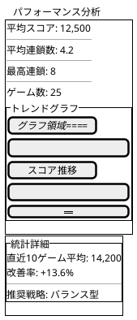
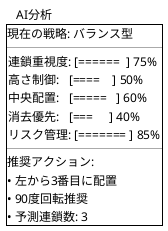

# UI設計リファクタリング

## Phase 4で実装されたUI改善

### AIコントロールパネルの簡素化

#### Before（重複機能あり）
```typescript
// AIモード選択とAI戦略設定が重複
<AIControlPanel>
  - AI ON/OFF トグル
  - AIモード選択（balanced/aggressive/defensive）
  - 思考速度調整
</AIControlPanel>

<StrategySettings>
  - 戦略選択（バランス型/攻撃型/防御型/カスタム）
  - パラメータ調整
</StrategySettings>
```

#### After（統合済み）
```typescript
// AI戦略設定に一本化
<AIControlPanel>
  - AI ON/OFF トグル
  - 思考速度調整のみ
</AIControlPanel>

<StrategySettings>
  - 統合された戦略管理
  - カスタム戦略作成
  - パラメータ微調整
</StrategySettings>
```

### パフォーマンス分析UIの追加



### データ可視化コンポーネント

#### LineChart（トレンド表示用）
```typescript
interface LineChartProps {
  data: ChartDataPoint[]
  width?: number
  height?: number
  color?: string
  showGrid?: boolean
  showTooltip?: boolean
}
```

#### BarChart（比較表示用）
```typescript
interface BarChartProps {
  data: ChartDataPoint[]
  width?: number
  height?: number
  colors?: string[]
  orientation?: 'vertical' | 'horizontal'
}
```

### AIインサイトパネル



## コンポーネント階層の改善

### Before（Phase 1）
```
App
├── GameBoard
├── GameInfo
├── NextPuyoPair
└── AIControlPanel
```

### After（Phase 4）
```
App
├── GameContainer
│   ├── GameBoard
│   ├── GameInfo
│   └── NextPuyoPair
├── ControlPanel
│   ├── AIControlPanel
│   ├── StrategySettings
│   └── GameControls
└── AnalyticsPanel
    ├── PerformanceAnalysis
    ├── AIInsights
    └── DataVisualization
        ├── LineChart
        └── BarChart
```

## レスポンシブデザインの強化

### ブレークポイント定義
```css
/* モバイル */
@media (max-width: 767px) {
  .game-container { 
    grid-template-columns: 1fr;
  }
}

/* タブレット */
@media (min-width: 768px) and (max-width: 1023px) {
  .game-container {
    grid-template-columns: 1fr 2fr;
  }
}

/* デスクトップ */
@media (min-width: 1024px) {
  .game-container {
    grid-template-columns: 1fr 2fr 1fr;
  }
}
```

## アクセシビリティ改善

### キーボードナビゲーション
- Tab順序の最適化
- フォーカスインジケータの明確化
- ショートカットキーの追加

### スクリーンリーダー対応
```typescript
// ARIA属性の追加
<div 
  role="application"
  aria-label="ぷよぷよゲーム"
  aria-describedby="game-instructions"
>
  <div role="status" aria-live="polite">
    スコア: {score}
  </div>
</div>
```

### カラーコントラスト
- WCAG AA基準準拠
- 色覚多様性対応のカラーパレット
- ハイコントラストモードのサポート

## パフォーマンス最適化

### React.memoによる再レンダリング防止
```typescript
export const GameBoard = React.memo(({ field, currentPuyo }) => {
  // レンダリングロジック
}, (prevProps, nextProps) => {
  return prevProps.field === nextProps.field &&
         prevProps.currentPuyo === nextProps.currentPuyo
})
```

### 仮想化によるリスト最適化
```typescript
// 大量データの仮想スクロール
import { FixedSizeList } from 'react-window'

const PerformanceHistory = ({ games }) => (
  <FixedSizeList
    height={400}
    itemCount={games.length}
    itemSize={50}
  >
    {({ index, style }) => (
      <div style={style}>
        {games[index].score}
      </div>
    )}
  </FixedSizeList>
)
```

## 状態管理の改善

### カスタムフックによる関心の分離
```typescript
// パフォーマンス分析用フック
export const usePerformanceAnalysis = () => {
  const [metrics, setMetrics] = useState<PerformanceMetrics>()
  const [loading, setLoading] = useState(false)
  
  // ロジック実装
  
  return { metrics, loading, updateMetrics }
}

// 戦略管理用フック
export const useStrategy = () => {
  const [strategies, setStrategies] = useState<StrategyConfig[]>([])
  const [activeStrategy, setActiveStrategy] = useState<StrategyConfig>()
  
  // ロジック実装
  
  return { strategies, activeStrategy, selectStrategy }
}
```

## テスト戦略

### コンポーネントテスト
```typescript
describe('StrategySettings', () => {
  it('戦略選択が正しく動作する', () => {
    const { getByRole } = render(<StrategySettings />)
    const select = getByRole('combobox')
    fireEvent.change(select, { target: { value: 'aggressive' } })
    expect(select.value).toBe('aggressive')
  })
})
```

### 統合テスト
```typescript
describe('AI機能統合', () => {
  it('戦略変更がAIサービスに反映される', async () => {
    const { container } = render(<App />)
    // 戦略変更
    // AI動作確認
  })
})
```

## 今後の改善提案

1. **ダークモード対応**
   - CSS変数による テーマ管理
   - システム設定との連携

2. **アニメーション強化**
   - Framer Motionによる滑らかな遷移
   - ゲーム演出の改善

3. **国際化（i18n）**
   - 多言語対応
   - 地域設定の考慮

4. **PWA化**
   - オフライン対応
   - インストール可能化