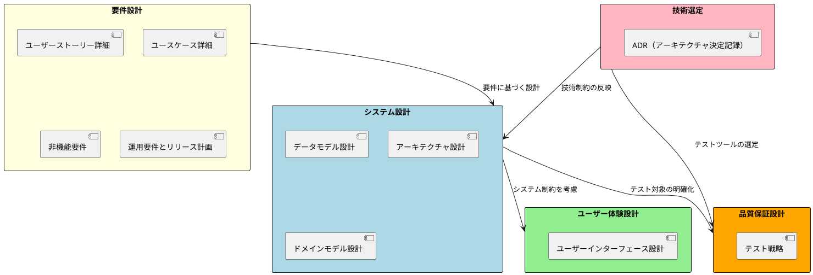

# 設計ドキュメント

## 概要

このディレクトリには、ぷよぷよゲーム（Case3）の設計に関するドキュメントを格納しています。システムの構造、データモデル、ユーザーインターフェース、テスト戦略など、開発に必要な設計情報を体系的に整理しています。

## 設計ドキュメント一覧

### システム設計

| ドキュメント | 概要 | 対象読者 |
|--------------|------|----------|
| [データモデル設計](データモデル設計.md) | エンティティ、値オブジェクト、データフローの設計 | 開発者、アーキテクト |
| [アーキテクチャ設計](アーキテクチャ設計.md) | レイヤードアーキテクチャとコンポーネント設計 | アーキテクト、リードエンジニア |
| [ドメインモデル設計](ドメインモデル設計.md) | DDD原則に基づくドメイン設計 | ドメインエキスパート、開発者 |

### ユーザー体験設計

| ドキュメント | 概要 | 対象読者 |
|--------------|------|----------|
| [ユーザーインターフェース設計](ユーザーインターフェース設計.md) | UI/UXデザイン、レスポンシブ対応 | UI/UXデザイナー、フロントエンド開発者 |

### 品質保証設計

| ドキュメント | 概要 | 対象読者 |
|--------------|------|----------|
| [テスト戦略](テスト戦略.md) | TDD、テストピラミッド、品質保証戦略 | QAエンジニア、開発者全員 |

## 設計原則

### 1. 関心の分離
- 各設計ドキュメントは明確な責任範囲を持つ
- レイヤー間の依存関係を最小化
- 変更影響範囲の局所化

### 2. 拡張性
- 新機能追加に対する柔軟性
- プラットフォーム対応の余地
- 国際化・アクセシビリティ対応

### 3. 保守性
- 理解しやすい設計
- テスタブルな構造
- ドキュメント化された決定プロセス

## 設計の関連性

## 設計プロセス

### Phase 1: 要件フェーズで実施済み

1. **要件分析**: ユーザーストーリー、ユースケースの詳細化
2. **技術選定**: ADRによる技術スタックの決定
3. **システム設計**: データモデル、アーキテクチャ、ドメインモデルの設計
4. **UI/UX設計**: ユーザーインターフェースの設計
5. **品質戦略**: テスト戦略の策定
6. **非機能要件**: パフォーマンス、セキュリティ、運用要件の定義

### 今後のフェーズ

- **Phase 2**: 構築・配置フェーズで設計の実装
- **Phase 3**: 開発フェーズで設計の検証・改善
- **Phase 4**: 運用フェーズで設計の評価・最適化

## 設計レビュー

### レビュー観点

- **整合性**: 各設計ドキュメント間の整合性
- **完全性**: 要件カバレッジとトレーサビリティ
- **実現可能性**: 技術制約と開発リソースの考慮
- **品質**: 非機能要件の満足度
- **保守性**: 将来の変更・拡張への対応力

### レビュープロセス

1. **自己レビュー**: 作成者による内容確認
2. **ピアレビュー**: 同じ専門分野のレビュー
3. **クロスファンクショナルレビュー**: 他分野との整合性確認
4. **ステークホルダーレビュー**: 要件との適合性確認

## 今後の改善計画

### 短期改善（Phase 2まで）
- 実装フィードバックによる設計の精緻化
- パフォーマンス要件の具体化
- CI/CDプロセスとの整合性確認

### 中期改善（Phase 3まで）
- 実装経験に基づく設計パターンの最適化
- テスト結果による品質戦略の改善
- ユーザーフィードバックによるUI/UX改善

### 長期改善（Phase 4以降）
- 運用データに基づくアーキテクチャ最適化
- 新技術動向を踏まえた技術選定の見直し
- スケーラビリティ要件への対応

このディレクトリの設計ドキュメントにより、ぷよぷよゲーム開発プロジェクトの技術的基盤を確立し、高品質なソフトウェアの開発を支援します。