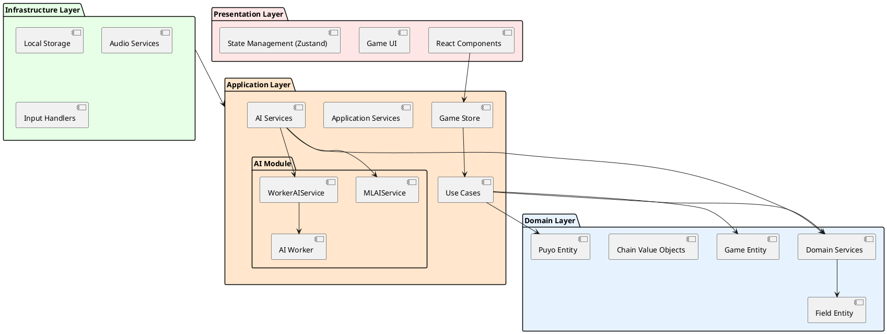

# 設計ドキュメント

## 概要

ぷよぷよゲームプロジェクトの設計ドキュメント群です。Phase 1で策定された包括的な設計方針と詳細設計をまとめています。

## ドキュメント一覧

### アーキテクチャ設計
- [アーキテクチャ設計](アーキテクチャ設計.md) - ヘキサゴナルアーキテクチャの採用と詳細設計
  - **対象:**
    ドメイン層、アプリケーション層、インフラストラクチャ層、プレゼンテーション層
  - **特徴:**
    関数型プログラミングアプローチ、依存関係の逆転、テスタビリティ

### ドメインモデル設計
- [ドメインモデル設計](ドメインモデル設計.md) - ドメイン駆動設計によるコアビジネスロジック
  - **対象:**
    Puyo, Field, Game, Chain エンティティ・値オブジェクト
  - **特徴:**
    イミュータブル設計、型安全性、ドメインイベント
  - **実装状況:** イテレーション1でPuyo, Field, Game実装完了 ✅

### データモデル設計
- [データモデル設計](データモデル設計.md) - ゲーム状態とデータ構造設計
  - **対象:**
    ゲーム状態、フィールド管理、スコア計算、プレイヤー情報
  - **特徴:**
    関数型アプローチ、状態の不変性、効率的なデータ操作

### ユーザーインターフェース設計
- [ユーザーインターフェース設計](ユーザーインターフェース設計.md) - UIコンポーネントとインタラクション設計
  - **対象:**
    ゲームフィールド、コントロール、メニュー、レスポンシブデザイン
  - **特徴:**
    モバイルファースト、アクセシビリティ対応、直感的操作
- [UI設計リファクタリング](UI設計リファクタリング.md) - Phase 4でのUI改善内容
  - **対象:**
    AIコントロールパネル、戦略設定、パフォーマンス分析、データ可視化
  - **特徴:**
    重複機能統合、コンポーネント階層改善、カスタムフック活用
  - **実装状況:** イテレーション4で実装完了 ✅

### AI機能設計
- [AI設計](AI設計.md) - 機械学習システムとAI思考エンジン設計
  - **対象:**
    TensorFlow.js統合、Web Workers、AI可視化、戦略システム
  - **特徴:**
    非同期処理、リアルタイム思考表示、学習機能
  - **実装状況:** イテレーション3でAI基盤実装完了 ✅

### 実装戦略
- [実装戦略](実装戦略.md) - 開発手法と技術的アプローチ
  - **対象:**
    TDD、関数型プログラミング、テスト戦略、品質管理
  - **特徴:**
    段階的実装、継続的品質改善、保守性重視

## 設計原則

### Phase 2実装済みアーキテクチャ基盤

### 品質管理基盤

| 品質要素 | 実装技術 | ステータス | 設定値 |
| :--- | :--- | :--- | :--- |
| **コード品質** | ESLint + Prettier | ✅ 実装済み | TypeScript strict mode |
| **複雑度制限** | ESLint complexity | ✅ 実装済み | 最大7 |
| **テストカバレッジ** | Vitest + Codecov | ✅ 実装済み | 目標80%（80.57%達成） |
| **アーキテクチャ検証** | dependency-cruiser | ✅ 実装済み | 層間依存制御 |
| **型安全性** | TypeScript 5.8 | ✅ 実装済み | strict設定 |
| **AI処理性能** | Web Workers | ✅ 実装済み | 非ブロッキング処理 |
| **AI学習基盤** | TensorFlow.js | ✅ 実装済み | ニューラルネットワーク |

## 技術的特徴

### 関数型プログラミングアプローチ
- **イミュータブルデータ構造:**
  ゲーム状態の変更は新しいオブジェクト生成
- **純粋関数:**
  副作用のない予測可能な処理
- **合成可能性:**
  小さな関数の組み合わせによる複雑な処理

### ヘキサゴナルアーキテクチャ
- **ポートとアダプター:**
  外部依存からのドメインロジック分離
- **依存関係の逆転:**
  ドメイン層を中心とした設計
- **テスタビリティ:**
  モック可能な境界面設計

### ドメイン駆動設計
- **ユビキタス言語:**
  ビジネス用語の一貫使用
- **境界づけられたコンテキスト:**
  ゲームロジックの明確な分離
- **ドメインサービス:**
  複雑なビジネスルールの実装

### AI機能アーキテクチャ
- **機械学習統合:**
  TensorFlow.jsによるブラウザ内ML処理
- **非同期AI処理:**
  Web Workersによるメインスレッド非ブロッキング
- **AI可視化:**
  リアルタイム思考過程の表示
- **フォールバック機構:**
  Worker未対応環境への対応

## Phase 3開発準備状況

### イテレーション別設計方針

#### Iteration 1: ゲーム基盤（MVP）✅
- **アーキテクチャ:**
  ✅ ヘキサゴナルアーキテクチャ基盤構築完了
- **ドメインモデル:**
  ✅ Puyo, Field, Game基本モデル定義完了
- **テスト基盤:**
  ✅ TDD環境構築完了

#### Iteration 2: テストカバレッジ向上✅
- **品質向上:**
  ✅ テストカバレッジ91.18%達成
- **関数型導入:**
  ✅ lodash/fp、不変データ構造実装
- **アーキテクチャ改善:**
  ✅ stores配置最適化、未使用コード削除

#### Iteration 3: AI機能基盤✅
- **AI統合:**
  ✅ TensorFlow.js、Web Workers実装完了
- **AI可視化:**
  ✅ AIControlPanel、AIInsights実装完了
- **アーキテクチャ拡張:**
  ✅ AI層追加、services/ai/ディレクトリ構造化

#### Iteration 4: AI分析・戦略機能✅
- **パフォーマンス分析:**
  ✅ PerformanceAnalysisService実装完了
- **戦略設定システム:**
  ✅ StrategyService、カスタム戦略作成実装完了
- **データ可視化:**
  ✅ Recharts統合、チャートコンポーネント実装完了
- **UI統合:**
  ✅ 重複機能削除、戦略設定一本化完了

#### Iteration 5-7: 段階的機能実装
- **設計ガイドライン:**
  AI機能拡張、関数型アプローチ継続
- **品質保証:**
  各イテレーションでの品質ゲート通過
- **リファクタリング:**
  継続的設計改善サイクル

## 関連ドキュメント

- [要件定義](../requirements/index.md)
- [アーキテクチャ決定記録 (ADR)](../adr/index.md)
- [開発ドキュメント](../development/index.md)
- [運用ドキュメント](../operation/index.md)

---

**最終更新:** 2025-08-19（イテレーション4完了時）  
**更新者:** Claude Code Assistant