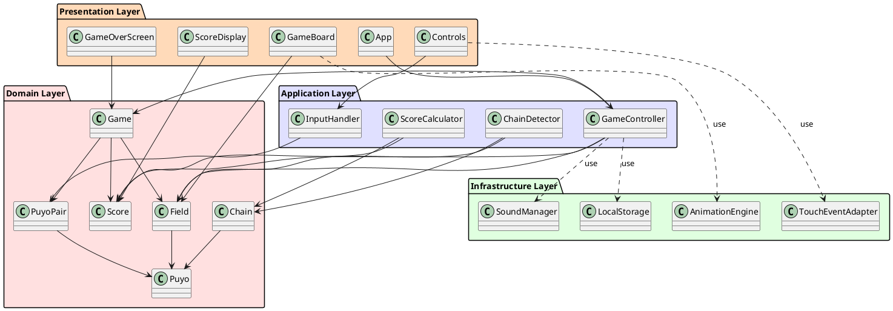
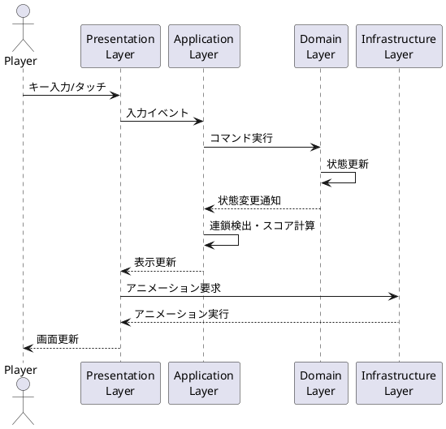

# アーキテクチャ設計

## 概要

ぷよぷよゲームは、レイヤードアーキテクチャを採用し、関心事の分離と依存関係の明確化を図ります。TypeScriptとReactを使用したWebアプリケーションとして実装します。

## アーキテクチャ全体図

## レイヤー構成

### 1. プレゼンテーション層（Presentation Layer）

**責任:**

- ユーザーインターフェースの表示
- ユーザー入力の受け付け
- ゲーム状態の視覚的表現

**主要コンポーネント:**

- `App`: アプリケーションのルートコンポーネント
- `GameBoard`: ゲームフィールドの表示
- `ScoreDisplay`: スコア・連鎖数の表示
- `Controls`: 操作ボタン（モバイル用）
- `GameOverScreen`: ゲームオーバー画面

### 2. アプリケーション層（Application Layer）

**責任:**
- ユースケースの実装
- ドメインロジックの調整
- 入力の変換と検証

**主要コンポーネント:**

- `GameController`: ゲーム全体の制御
- `InputHandler`: キーボード・タッチ入力の処理
- `ScoreCalculator`: スコア計算ロジック
- `ChainDetector`: 連鎖検出ロジック

### 3. ドメイン層（Domain Layer）

**責任:**
- ビジネスロジックの実装
- ゲームルールの表現
- ドメインモデルの管理

**主要コンポーネント:**

- `Game`: ゲーム全体の状態管理
- `Field`: フィールドの状態管理
- `Puyo`: 個々のぷよ
- `PuyoPair`: 落下中のぷよペア
- `Chain`: 連鎖情報
- `Score`: スコア情報

### 4. インフラストラクチャ層（Infrastructure Layer）

**責任:**
- 外部システムとの連携
- 技術的な実装詳細
- クロスカッティングな関心事

**主要コンポーネント:**

- `LocalStorage`: ハイスコアの保存
- `AnimationEngine`: アニメーション制御
- `SoundManager`: 効果音・BGMの管理
- `TouchEventAdapter`: タッチイベントの抽象化

## 設計原則

### 1. 依存関係逆転の原則（DIP）
- 上位レイヤーは下位レイヤーに依存しない
- 具象クラスではなくインターフェースに依存する
- ドメイン層は他のレイヤーに依存しない

### 2. 単一責任の原則（SRP）
- 各クラスは単一の責任を持つ
- 変更理由は1つに限定される

### 3. 開放閉鎖の原則（OCP）
- 拡張に対して開いている
- 修正に対して閉じている

### 4. インターフェース分離の原則（ISP）
- クライアントが使用しないメソッドに依存しない
- 特定の目的に特化したインターフェースを提供

### 5. リスコフの置換原則（LSP）
- 派生クラスは基底クラスと置換可能

## データフロー

## 技術選定

### フロントエンド
- **TypeScript**: 型安全性とIDEサポート
- **React**: コンポーネントベースUI
- **CSS Modules**: スタイルのスコープ管理
- **Canvas API**: ゲームグラフィックス描画

### 状態管理
- **React Context API**: グローバル状態管理
- **useReducer**: 複雑な状態更新ロジック

### ビルドツール
- **Vite**: 高速な開発サーバーとビルド
- **ESLint**: コード品質管理
- **Prettier**: コードフォーマット

### テスティング
- **Vitest**: 単体テスト
- **React Testing Library**: コンポーネントテスト
- **Playwright**: E2Eテスト

## 非技術的な設計決定

### パフォーマンス最適化
- Reactの仮想DOMを活用した効率的な再描画
- Canvas APIを使用したゲームフィールドの描画
- requestAnimationFrameを使用したスムーズなアニメーション

### 拡張性
- 新しいぷよの色や特殊ぷよの追加が容易
- ゲームモードの追加が可能
- AIプレイヤーの実装が可能な設計

### メンテナンス性
- レイヤー間の明確な境界
- 依存性注入によるテスタビリティの向上
- ドキュメントとコメントの充実