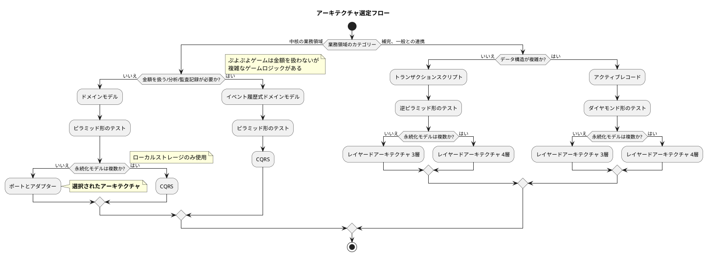
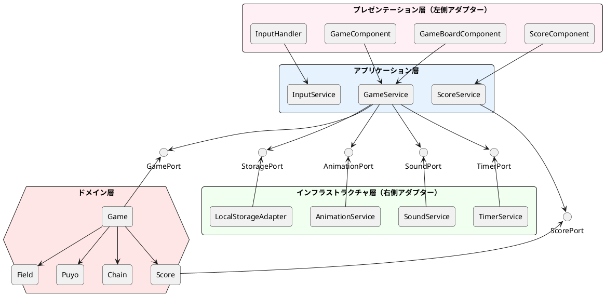
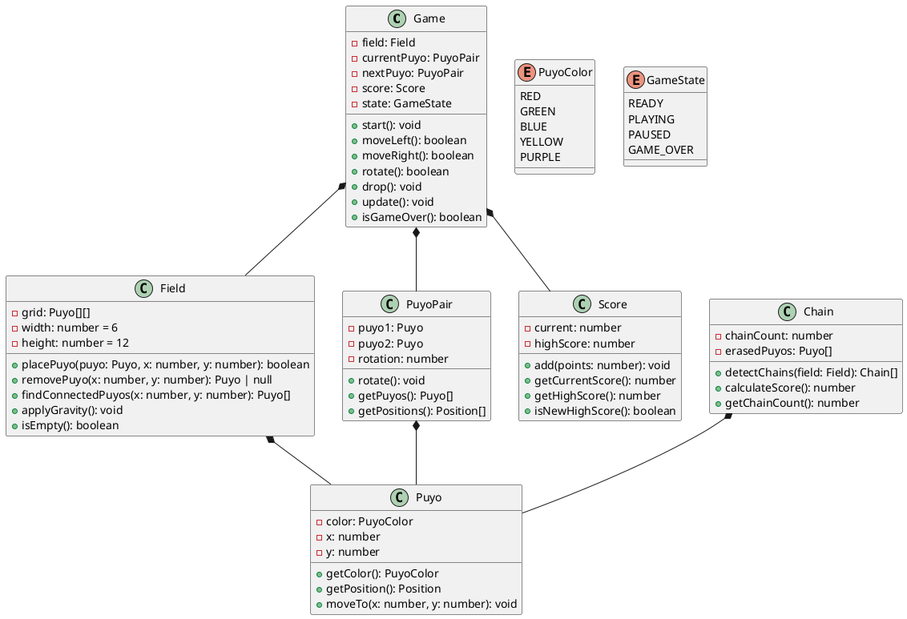
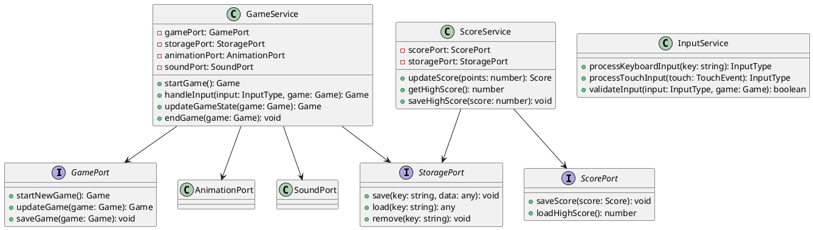
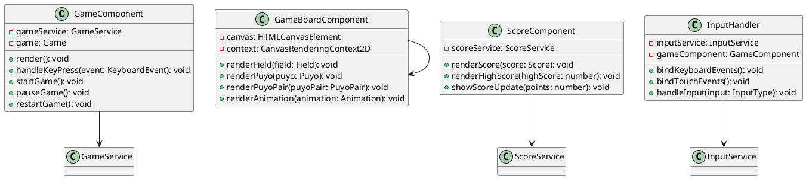
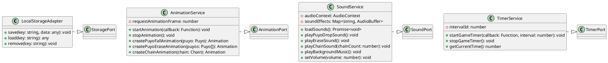
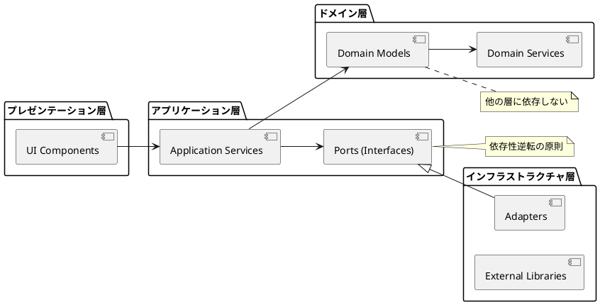
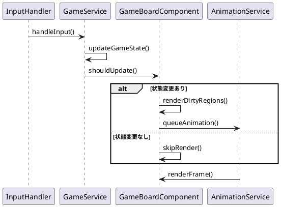
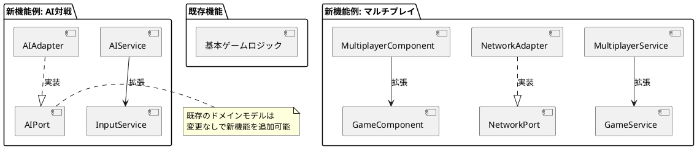

# アーキテクチャ設計

## 概要

ぷよぷよゲームシステムのアーキテクチャ設計について説明します。CLAUDE.local.mdの指針に基づき、ヘキサゴナルアーキテクチャ（ポートとアダプター）パターンを採用し、**中核の業務領域**として位置づけ、**ドメインモデル**を使用します。

## アーキテクチャ選定理由



**選定理由:**

- ぷよぷよゲームは複雑なゲームロジック（連鎖、消去判定）を持つため**中核の業務領域**
- 金額を扱わないため**ドメインモデル**パターンが適切
- ローカルストレージのみの永続化のため**ポートとアダプター（ヘキサゴナルアーキテクチャ）**を採用

## アーキテクチャ全体図



## レイヤー詳細

### ドメイン層 (Domain Layer)

**責務:**

- ゲームの核となるビジネスロジックを実装
- ドメイン固有のルールと制約を管理
- 外部の技術的詳細から独立

**主要コンポーネント:**



### アプリケーション層 (Application Layer)

**責務:**

- ユースケースの実行を調整
- ドメインオブジェクト間の連携を管理
- 外部システムとの統合を仲介

**主要サービス:**



### プレゼンテーション層 (Presentation Layer)

**責務:**

- ユーザーインターフェースの描画
- ユーザー入力の受付と変換
- ゲーム状態の表示

**主要コンポーネント:**



### インフラストラクチャ層 (Infrastructure Layer)

**責務:**

- 技術的な詳細の実装
- 外部システムとの具体的な通信
- フレームワーク・ライブラリとの統合

**主要アダプター:**



## 依存性の流れ



**依存性のルール:**

1. **内側の層は外側の層に依存しない**
2. **外側の層は内側の層に依存する**
3. **ポート（インターフェース）により依存性を逆転**
4. **ドメイン層は完全に独立**

## テスト戦略とアーキテクチャ

ピラミッド形のテスト戦略を採用します：

```plantuml
@startuml "テストピラミッド"
!define UNIT_COLOR #90EE90
!define INTEGRATION_COLOR #FFD700
!define E2E_COLOR #FF6347

triangle "E2E Tests" E2E_COLOR
triangle "Integration Tests" INTEGRATION_COLOR  
triangle "Unit Tests" UNIT_COLOR

note right of "Unit Tests" : ドメインモデルを中心とした高速なテスト\n- Game, Field, Puyo, Chain, Score クラス\n- ビジネスロジックの詳細な検証
note right of "Integration Tests" : 層間の統合テスト\n- Service層とAdapter間の統合\n- ポートとアダプターの契約テスト
note right of "E2E Tests" : ユーザーシナリオテスト\n- ブラウザテストによる操作フロー確認\n- 主要ユースケースの検証

@enduml
```

## パフォーマンス考慮事項

### レンダリング最適化



### メモリ管理

- **オブジェクトプール:**
  - ぷよオブジェクトの再利用
  - アニメーション効果の再利用

- **イベント処理の最適化:**
  - RAF (RequestAnimationFrame) の適切な利用
  - 不要なイベントリスナーのクリーンアップ

## 拡張可能性

### 新機能追加時の影響範囲



## 技術的制約と前提

### ブラウザ環境での制約

- **Canvas API:** ゲーム描画のメイン手段
- **Web Audio API:** 音響効果の実装
- **LocalStorage:** データ永続化
- **RequestAnimationFrame:** アニメーション制御

### パフォーマンス目標

- **60FPS:** スムーズなゲーム体験
- **初回ロード時間:** 5秒以内
- **メモリ使用量:** 100MB以下
- **入力遅延:** 16ms以内

## セキュリティ考慮事項

### データ保護

- **ハイスコア改ざん防止:** クライアントサイド検証
- **不正入力防止:** 入力値のサニタイジング
- **XSS対策:** HTMLエスケープ処理

### プライバシー保護

- **個人情報なし:** ローカルストレージのみ使用
- **トラッキングなし:** 外部送信データなし

## まとめ

このアーキテクチャ設計により以下を実現：

1. **保守性:** 各層の責務が明確で変更に強い
2. **テスタビリティ:** ドメインロジックが独立してテスト可能
3. **拡張性:** ポートとアダプターで新機能追加が容易
4. **パフォーマンス:** 必要に応じた最適化が可能