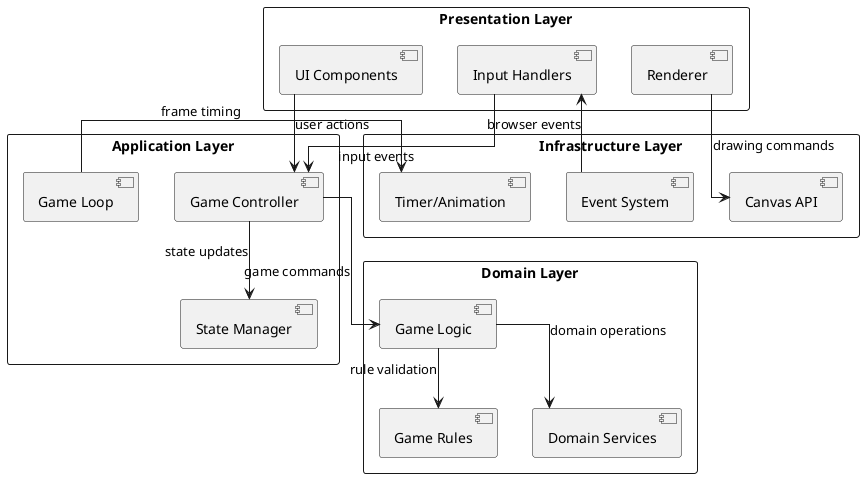
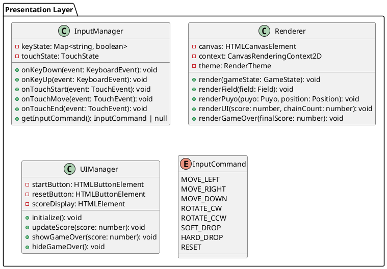
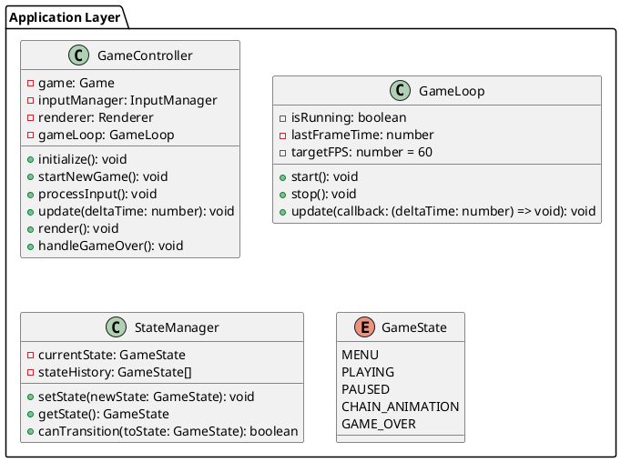
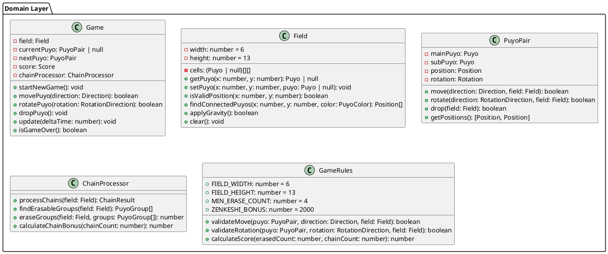
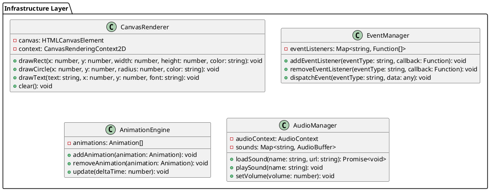
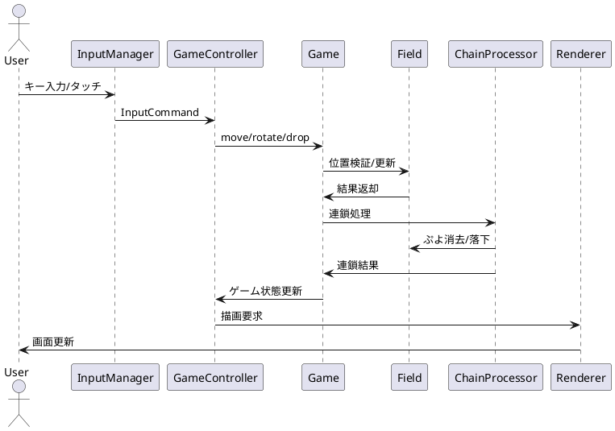
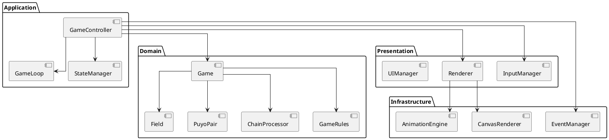

# アーキテクチャ設計

## 概要

ぷよぷよゲームアプリケーションは、レイヤードアーキテクチャを採用し、明確な責任分離と保守性の高い設計を実現します。テスト駆動開発（TDD）を採用し、各層が独立してテスト可能な構造とします。

## アーキテクチャ概要図

## レイヤー詳細

### 1. Presentation Layer（プレゼンテーション層）

ユーザーインターフェースと入力処理を担当

**責任**:
- ユーザー入力の収集と変換
- ゲーム状態の視覚的表現
- UI要素の管理

### 2. Application Layer（アプリケーション層）

ゲームフローとユースケースの制御を担当

**責任**:
- ゲームフローの制御
- 入力とドメインロジックの仲介
- 状態遷移の管理
- フレームレートの制御

### 3. Domain Layer（ドメイン層）

ゲームのビジネスロジックとルールを担当

**責任**:
- ゲームルールの実装
- ドメインオブジェクトの管理
- ビジネスロジックの実行
- 連鎖処理とスコア計算

### 4. Infrastructure Layer（インフラストラクチャ層）

外部システムとの連携と技術的詳細を担当

**責任**:
- Canvas APIの抽象化
- イベントシステムの管理
- アニメーション処理
- 音声管理（オプション）

## データフロー

## コンポーネント間の依存関係

## 設計原則

### 1. 関心の分離（Separation of Concerns）
- 各層は明確な責任を持つ
- プレゼンテーション、アプリケーション、ドメイン、インフラを分離
- テスト可能性を重視

### 2. 依存関係逆転の原則（Dependency Inversion Principle）
- 上位レイヤーは下位レイヤーに依存しない
- インターフェースを通じた疎結合
- 外部システムへの依存を最小化

### 3. 単一責任の原則（Single Responsibility Principle）
- 各クラスは一つの責任のみを持つ
- 変更理由は一つのみ
- 高い凝集度を保つ

### 4. テスト駆動設計
- テスタブルな設計
- モックとスタブの活用
- 包括的なテストカバレッジ

## パフォーマンス考慮事項

### レンダリング最適化
- 差分レンダリング（変更された部分のみ描画）
- レイヤー分離による効率的な描画
- フレームレート制御（60FPS）

### メモリ管理
- オブジェクトプールの活用
- 不要なオブジェクトの適切な解放
- ガベージコレクション負荷の軽減

### 計算最適化
- 連鎖処理の効率化
- 衝突判定の最適化
- キャッシュの活用

## セキュリティ考慮事項

### 入力検証
- ユーザー入力の適切な検証
- 不正な値の除外
- 型安全性の確保

### データ保護
- スコアデータの整合性
- 改ざん防止
- ローカルストレージの適切な使用

## 拡張性

### 新機能追加
- プラグイン機構の検討
- 設定システムの実装
- マルチプレイヤー対応の余地

### プラットフォーム対応
- レスポンシブデザイン
- モバイル最適化
- PWA対応の検討