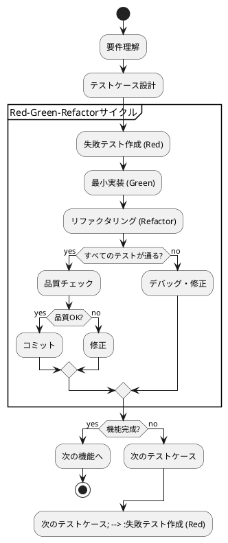

# テスト戦略

## 概要

ぷよぷよゲーム開発において、テスト駆動開発（TDD）アプローチを採用し、高品質で保守性の高いコードを実現します。この戦略では、単体テスト、統合テスト、E2Eテストの3層構造でテストカバレッジを確保し、継続的な品質保証を実現します。

## テスト戦略の全体像

```plantuml
@startuml "テスト戦略ピラミッド"

rectangle "E2Eテスト (End-to-End)" as e2e {
  note right
  ・ユーザーシナリオテスト
  ・ブラウザ自動化テスト
  ・パフォーマンステスト
  ・クロスブラウザテスト
  end note
}

rectangle "統合テスト (Integration)" as integration #LightYellow {
  note right
  ・コンポーネント間協調
  ・API統合テスト
  ・データフローテスト
  ・UI統合テスト
  end note
}

rectangle "単体テスト (Unit)" as unit #LightGreen {
  note right
  ・関数・メソッドレベル
  ・ドメインロジック
  ・ビジネスルール検証
  ・エッジケーステスト
  end note
}

e2e --|> integration : "少数・高価値"
integration --|> unit : "中程度・協調確認"
unit : "多数・高速・詳細"

@enduml
```

## TDD開発サイクル



## レイヤー別テスト戦略

### 1. ドメイン層のテスト

ゲームのビジネスロジックの正確性を保証

```typescript
// ドメインテストの例
describe('Game', () => {
  describe('movePuyo', () => {
    it('有効な移動の場合、ぷよが移動できること', () => {
      // Arrange
      const game = new Game();
      game.startNewGame();
      const initialPosition = game.getCurrentPuyo()?.getMainPosition();
      
      // Act
      const result = game.movePuyo(Direction.LEFT);
      
      // Assert
      expect(result.isSuccess()).toBe(true);
      const newPosition = game.getCurrentPuyo()?.getMainPosition();
      expect(newPosition?.x).toBe(initialPosition?.x - 1);
    });

    it('フィールドの境界を超える移動の場合、移動が失敗すること', () => {
      // Arrange
      const game = new Game();
      game.startNewGame();
      // 左端まで移動
      for (let i = 0; i < 3; i++) {
        game.movePuyo(Direction.LEFT);
      }
      
      // Act
      const result = game.movePuyo(Direction.LEFT);
      
      // Assert
      expect(result.isFailure()).toBe(true);
      expect(result.error).toBeInstanceOf(InvalidMoveError);
    });
  });

  describe('processChain', () => {
    it('4つ以上の同色ぷよが隣接している場合、連鎖が発生すること', () => {
      // Arrange
      const game = new Game();
      const field = setupFieldWithConnectedPuyos(PuyoColor.RED, 4);
      game.setField(field);
      
      // Act
      const chainResult = game.processChain();
      
      // Assert
      expect(chainResult.getChainCount()).toBe(1);
      expect(chainResult.getErasedCount()).toBe(4);
      expect(chainResult.getScoreGained()).toBeGreaterThan(0);
    });

    it('全消しの場合、ボーナススコアが加算されること', () => {
      // Arrange
      const game = new Game();
      const field = setupFieldForZenkeshi();
      game.setField(field);
      
      // Act
      const chainResult = game.processChain();
      
      // Assert
      expect(chainResult.isZenkeshi()).toBe(true);
      expect(chainResult.getScoreGained()).toBeGreaterThanOrEqual(2000);
    });
  });
});
```

### 2. アプリケーション層のテスト

ゲームフローとユースケースの制御を検証

```typescript
// アプリケーション層テストの例
describe('GameController', () => {
  let gameController: GameController;
  let mockInputManager: jest.Mocked<InputManager>;
  let mockRenderer: jest.Mocked<Renderer>;

  beforeEach(() => {
    mockInputManager = createMockInputManager();
    mockRenderer = createMockRenderer();
    gameController = new GameController(mockInputManager, mockRenderer);
  });

  describe('processInput', () => {
    it('左移動入力の場合、ゲームに左移動コマンドが送信されること', () => {
      // Arrange
      mockInputManager.getInputCommand.mockReturnValue(InputCommand.MOVE_LEFT);
      const gameMoveSpy = jest.spyOn(gameController.game, 'movePuyo');
      
      // Act
      gameController.processInput();
      
      // Assert
      expect(gameMoveSpy).toHaveBeenCalledWith(Direction.LEFT);
    });

    it('無効な入力の場合、ゲームに何も送信されないこと', () => {
      // Arrange
      mockInputManager.getInputCommand.mockReturnValue(null);
      const gameMoveSpy = jest.spyOn(gameController.game, 'movePuyo');
      
      // Act
      gameController.processInput();
      
      // Assert
      expect(gameMoveSpy).not.toHaveBeenCalled();
    });
  });

  describe('update', () => {
    it('ゲーム更新後、レンダラーが呼び出されること', () => {
      // Arrange
      const deltaTime = 16.67; // 60FPS
      
      // Act
      gameController.update(deltaTime);
      
      // Assert
      expect(mockRenderer.render).toHaveBeenCalledWith(gameController.game);
    });
  });
});
```

### 3. プレゼンテーション層のテスト

UI表示とユーザー入力の処理を検証

```typescript
// プレゼンテーション層テストの例
describe('InputManager', () => {
  let inputManager: InputManager;
  let mockCanvas: HTMLCanvasElement;

  beforeEach(() => {
    mockCanvas = document.createElement('canvas');
    inputManager = new InputManager(mockCanvas);
  });

  describe('keyboard input', () => {
    it('左矢印キー押下の場合、MOVE_LEFTコマンドが返されること', () => {
      // Arrange
      const keyEvent = new KeyboardEvent('keydown', { key: 'ArrowLeft' });
      
      // Act
      inputManager.onKeyDown(keyEvent);
      const command = inputManager.getInputCommand();
      
      // Assert
      expect(command).toBe(InputCommand.MOVE_LEFT);
    });

    it('無効なキー押下の場合、nullが返されること', () => {
      // Arrange
      const keyEvent = new KeyboardEvent('keydown', { key: 'InvalidKey' });
      
      // Act
      inputManager.onKeyDown(keyEvent);
      const command = inputManager.getInputCommand();
      
      // Assert
      expect(command).toBeNull();
    });
  });

  describe('touch input', () => {
    it('左スワイプの場合、MOVE_LEFTコマンドが返されること', () => {
      // Arrange
      const startTouch = createTouchEvent('touchstart', 100, 100);
      const endTouch = createTouchEvent('touchend', 50, 100);
      
      // Act
      inputManager.onTouchStart(startTouch);
      inputManager.onTouchEnd(endTouch);
      const command = inputManager.getInputCommand();
      
      // Assert
      expect(command).toBe(InputCommand.MOVE_LEFT);
    });
  });
});

describe('Renderer', () => {
  let renderer: Renderer;
  let mockCanvas: HTMLCanvasElement;
  let mockContext: CanvasRenderingContext2D;

  beforeEach(() => {
    mockCanvas = document.createElement('canvas');
    mockContext = mockCanvas.getContext('2d') as CanvasRenderingContext2D;
    jest.spyOn(mockContext, 'fillRect');
    jest.spyOn(mockContext, 'arc');
    renderer = new Renderer(mockCanvas);
  });

  describe('renderPuyo', () => {
    it('赤色のぷよの場合、正しい色で円が描画されること', () => {
      // Arrange
      const puyo = new Puyo(new PuyoId('1'), new Color(PuyoColor.RED), new Position(0, 0));
      
      // Act
      renderer.renderPuyo(puyo);
      
      // Assert
      expect(mockContext.fillStyle).toBe('#FF4444');
      expect(mockContext.arc).toHaveBeenCalledWith(16, 16, 14, 0, 2 * Math.PI);
    });
  });
});
```

## 統合テスト戦略

### コンポーネント間の協調テスト

```typescript
// 統合テストの例
describe('Game Integration', () => {
  let gameController: GameController;
  let realInputManager: InputManager;
  let realRenderer: Renderer;
  let canvas: HTMLCanvasElement;

  beforeEach(() => {
    canvas = document.createElement('canvas');
    canvas.width = 800;
    canvas.height = 600;
    document.body.appendChild(canvas);

    realInputManager = new InputManager(canvas);
    realRenderer = new Renderer(canvas);
    gameController = new GameController(realInputManager, realRenderer);
  });

  afterEach(() => {
    document.body.removeChild(canvas);
  });

  it('キー入力からレンダリングまでの一連の流れが正常に動作すること', async () => {
    // Arrange
    gameController.startNewGame();
    const initialScore = gameController.game.getCurrentScore();
    
    // Act - キー入力をシミュレート
    const leftKeyEvent = new KeyboardEvent('keydown', { key: 'ArrowLeft' });
    realInputManager.onKeyDown(leftKeyEvent);
    
    gameController.processInput();
    gameController.update(16.67);
    
    // Assert
    const currentPuyo = gameController.game.getCurrentPuyo();
    expect(currentPuyo).not.toBeNull();
    expect(currentPuyo?.getMainPosition().x).toBeLessThan(2); // 初期位置より左に移動
  });

  it('連鎖発生時のスコア更新とレンダリングが正常に動作すること', async () => {
    // Arrange
    gameController.startNewGame();
    setupChainableField(gameController.game);
    
    // Act - 連鎖を発生させる
    gameController.game.dropPuyo();
    const chainResult = gameController.game.processChain();
    gameController.update(16.67);
    
    // Assert
    expect(chainResult.getChainCount()).toBeGreaterThan(0);
    expect(gameController.game.getCurrentScore()).toBeGreaterThan(0);
  });
});
```

## E2Eテスト戦略

### ユーザーシナリオテスト

```typescript
// E2Eテスト（Playwright使用例）
import { test, expect } from '@playwright/test';

test.describe('ぷよぷよゲーム E2E', () => {
  test.beforeEach(async ({ page }) => {
    await page.goto('/');
  });

  test('ゲーム開始から基本操作まで', async ({ page }) => {
    // ゲーム開始
    await page.click('#new-game-btn');
    
    // ゲームフィールドが表示されることを確認
    await expect(page.locator('#game-field')).toBeVisible();
    
    // スコアが0で初期化されることを確認
    await expect(page.locator('#current-score')).toHaveText('0');
    
    // ぷよが表示されることを確認
    await expect(page.locator('.puyo')).toHaveCount(2); // ぷよペア
    
    // 左移動操作
    await page.keyboard.press('ArrowLeft');
    
    // ぷよが移動したことを確認（視覚的テスト）
    await page.screenshot({ path: 'after-left-move.png' });
  });

  test('連鎖発生によるスコア更新', async ({ page }) => {
    // テスト用の連鎖可能な状態を設定
    await page.evaluate(() => {
      // 連鎖可能な状態をセットアップするためのテストデータ注入
      window.testSetupChainableField();
    });
    
    await page.click('#new-game-btn');
    
    // 連鎖を発生させる操作
    await page.keyboard.press('ArrowDown'); // 高速落下
    
    // 連鎖アニメーション待機
    await page.waitForTimeout(2000);
    
    // スコアが更新されることを確認
    const score = await page.locator('#current-score').textContent();
    expect(parseInt(score || '0')).toBeGreaterThan(0);
    
    // 連鎖数が表示されることを確認
    const chainCount = await page.locator('#chain-count').textContent();
    expect(parseInt(chainCount || '0')).toBeGreaterThan(0);
  });

  test('ゲームオーバー処理', async ({ page }) => {
    // テスト用のゲームオーバー状態を設定
    await page.evaluate(() => {
      window.testSetupGameOverField();
    });
    
    await page.click('#new-game-btn');
    
    // ゲームオーバーを発生させる
    await page.keyboard.press('ArrowDown');
    
    // ゲームオーバー画面が表示されることを確認
    await expect(page.locator('#game-over-overlay')).toBeVisible();
    await expect(page.locator('#final-score')).toBeVisible();
    await expect(page.locator('#restart-btn')).toBeVisible();
    
    // リスタートボタンの動作確認
    await page.click('#restart-btn');
    
    // ゲームが初期状態に戻ることを確認
    await expect(page.locator('#game-over-overlay')).not.toBeVisible();
    await expect(page.locator('#current-score')).toHaveText('0');
  });

  test('レスポンシブ表示', async ({ page }) => {
    // モバイルサイズでのテスト
    await page.setViewportSize({ width: 375, height: 667 });
    
    await page.click('#new-game-btn');
    
    // モバイルレイアウトが適用されることを確認
    await expect(page.locator('.game-container')).toHaveCSS('flex-direction', 'column');
    
    // タッチ操作エリアが表示されることを確認
    await expect(page.locator('.touch-controls')).toBeVisible();
  });
});
```

## パフォーマンステスト

### レンダリングパフォーマンス

```typescript
describe('Performance Tests', () => {
  let gameController: GameController;
  let performanceMonitor: PerformanceMonitor;

  beforeEach(() => {
    performanceMonitor = new PerformanceMonitor();
    gameController = new GameController(/* ... */);
  });

  test('60FPSを維持できること', async () => {
    // Arrange
    const targetFPS = 60;
    const testDuration = 5000; // 5秒間
    
    // Act
    const fpsData = await performanceMonitor.measureFPS(
      () => gameController.update(16.67),
      testDuration
    );
    
    // Assert
    expect(fpsData.averageFPS).toBeGreaterThanOrEqual(targetFPS * 0.9); // 10%の余裕
    expect(fpsData.minFPS).toBeGreaterThanOrEqual(targetFPS * 0.8); // 最低でも80%
  });

  test('連鎖処理のパフォーマンス', () => {
    // Arrange
    const complexField = setupComplexChainField(); // 10連鎖可能なフィールド
    gameController.game.setField(complexField);
    
    // Act
    const startTime = performance.now();
    const chainResult = gameController.game.processChain();
    const endTime = performance.now();
    
    // Assert
    const processingTime = endTime - startTime;
    expect(processingTime).toBeLessThan(100); // 100ms以内で完了
    expect(chainResult.getChainCount()).toBe(10);
  });
});
```

## テストデータ管理

### テストヘルパー関数

```typescript
// テストユーティリティ
export class TestHelpers {
  static createGameWithField(fieldData: number[][]): Game {
    const game = new Game();
    const field = new Field();
    
    for (let y = 0; y < fieldData.length; y++) {
      for (let x = 0; x < fieldData[y].length; x++) {
        if (fieldData[y][x] !== 0) {
          const color = Object.values(PuyoColor)[fieldData[y][x] - 1];
          const puyo = new Puyo(
            new PuyoId(`${x}-${y}`),
            new Color(color),
            new Position(x, y)
          );
          field.setPuyo(new Position(x, y), puyo);
        }
      }
    }
    
    game.setField(field);
    return game;
  }

  static createMockInputManager(): jest.Mocked<InputManager> {
    return {
      onKeyDown: jest.fn(),
      onKeyUp: jest.fn(),
      onTouchStart: jest.fn(),
      onTouchMove: jest.fn(),
      onTouchEnd: jest.fn(),
      getInputCommand: jest.fn(),
      update: jest.fn()
    };
  }

  static createTouchEvent(type: string, x: number, y: number): TouchEvent {
    const touch = new Touch({
      identifier: 1,
      target: document.createElement('canvas'),
      clientX: x,
      clientY: y,
      radiusX: 1,
      radiusY: 1,
      rotationAngle: 0,
      force: 1
    });

    return new TouchEvent(type, {
      touches: [touch],
      targetTouches: [touch],
      changedTouches: [touch]
    });
  }
}
```

## CI/CDでのテスト実行

### GitHub Actionsでの設定例

```yaml
name: Test Suite

on: [push, pull_request]

jobs:
  test:
    runs-on: ubuntu-latest
    
    steps:
    - uses: actions/checkout@v3
    
    - name: Setup Node.js
      uses: actions/setup-node@v3
      with:
        node-version: '18'
        cache: 'npm'
    
    - name: Install dependencies
      run: npm ci
    
    - name: Run unit tests
      run: npm run test:unit
    
    - name: Run integration tests
      run: npm run test:integration
    
    - name: Run E2E tests
      run: npm run test:e2e
      
    - name: Generate coverage report
      run: npm run test:coverage
      
    - name: Upload coverage to Codecov
      uses: codecov/codecov-action@v3
```

## テスト品質指標

### カバレッジ目標

- 単体テスト: 90%以上
- 統合テスト: 主要フロー100%
- E2Eテスト: 重要ユーザーシナリオ100%

### 品質チェックリスト

- [ ] すべてのドメインルールがテストされている
- [ ] エッジケースとエラーケースがカバーされている
- [ ] パフォーマンス要件が満たされている
- [ ] レスポンシブ対応が検証されている
- [ ] アクセシビリティ要件が確認されている

この包括的なテスト戦略により、ぷよぷよゲームの品質と信頼性を確保し、継続的な改善とメンテナンスを可能にします。