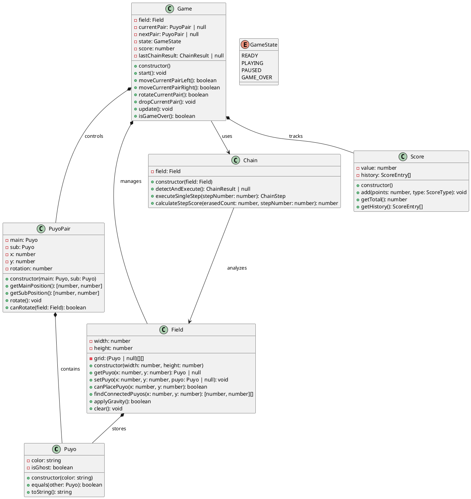
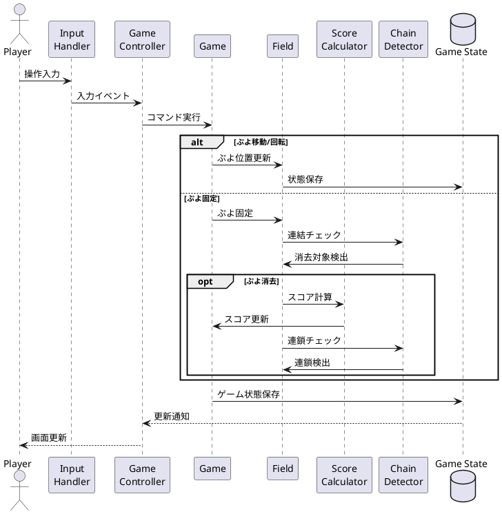

# データモデル設計

## 概要

ぷよぷよゲームアプリケーションのデータモデル設計について説明します。Clean Architectureにおけるドメイン層の中核となるデータ構造と、各層間でのデータフローを定義します。

## ドメインモデル

### 基本データ構造



## エンティティ詳細

### Game
ゲーム全体の状態を管理するルートエンティティ

| 属性 | 型 | 説明 |
|------|-----|------|
| id | string | ゲームの一意識別子 |
| status | GameStatus | ゲームの状態（waiting, playing, paused, gameover） |
| score | number | 現在のスコア |
| level | number | 現在のレベル |
| chainCount | number | 最大連鎖数 |
| isZenkeshi | boolean | 全消しフラグ |
| createdAt | Date | ゲーム開始時刻 |
| updatedAt | Date | 最終更新時刻 |

### Field
ゲームフィールドの状態を表現

| 属性 | 型 | 説明 |
|------|-----|------|
| id | string | フィールドの一意識別子 |
| width | number | フィールドの幅（デフォルト: 6） |
| height | number | フィールドの高さ（デフォルト: 13） |
| grid | Puyo[][] | ぷよの配置状態を表す2次元配列 |
| gameId | string | 関連するゲームのID |

### Puyo
個々のぷよを表現

| 属性 | 型 | 説明 |
|------|-----|------|
| id | string | ぷよの一意識別子 |
| color | PuyoColor | ぷよの色（red, green, blue, yellow, purple） |
| x | number | X座標（0-5） |
| y | number | Y座標（0-12） |
| fieldId | string | 所属するフィールドのID |
| isGhost | boolean | ゴースト（落下予測位置）表示用フラグ |

### PuyoPair
落下中のぷよペアを表現

| 属性 | 型 | 説明 |
|------|-----|------|
| id | string | ぷよペアの一意識別子 |
| centerPuyo | Puyo | 中心となるぷよ |
| rotatePuyo | Puyo | 回転するぷよ |
| rotation | Rotation | 回転状態（0, 90, 180, 270） |
| x | number | ペアの中心X座標 |
| y | number | ペアの中心Y座標 |
| gameId | string | 関連するゲームのID |

### Chain
連鎖情報を記録

| 属性 | 型 | 説明 |
|------|-----|------|
| id | string | 連鎖の一意識別子 |
| chainNumber | number | 連鎖数 |
| erasedPuyos | Puyo[] | 消去されたぷよのリスト |
| bonus | number | 連鎖ボーナス |
| gameId | string | 関連するゲームのID |
| timestamp | Date | 連鎖発生時刻 |

### Score
スコア情報を管理

| 属性 | 型 | 説明 |
|------|-----|------|
| id | string | スコアの一意識別子 |
| value | number | 現在のスコア値 |
| chainBonus | number | 連鎖によるボーナス |
| zenkeshiBonus | number | 全消しボーナス |
| gameId | string | 関連するゲームのID |

### NextQueue
次に落下するぷよの予告キュー

| 属性 | 型 | 説明 |
|------|-----|------|
| id | string | キューの一意識別子 |
| queue | PuyoPair[] | 次に落下するぷよペアのキュー |
| gameId | string | 関連するゲームのID |

## 列挙型定義

### GameStatus
```typescript
enum GameStatus {
  WAITING = 'waiting',
  PLAYING = 'playing',
  PAUSED = 'paused',
  GAMEOVER = 'gameover'
}
```

### PuyoColor
```typescript
enum PuyoColor {
  RED = 'red',
  GREEN = 'green',
  BLUE = 'blue',
  YELLOW = 'yellow',
  PURPLE = 'purple'
}
```

### Rotation
```typescript
enum Rotation {
  DEG_0 = 0,
  DEG_90 = 90,
  DEG_180 = 180,
  DEG_270 = 270
}
```

## データフロー図



## 制約と規則

### フィールド制約
- フィールドサイズは6×13マス固定
- 最上段（y=0）は見えない領域
- ぷよが最上段に固定されるとゲームオーバー

### ぷよ制約
- 同時に表示される色は3〜5色
- 必ず2個1組で落下
- 重力により下方向に落下

### 連鎖制約
- 同色4個以上の連結で消去
- 縦横の連結のみ（斜めは連結しない）
- 消去後の落下で新たな連結が発生すると連鎖

### スコア計算規則
- 基本点 = 消去ぷよ数 × 10
- 連鎖ボーナス = 基本点 × 連鎖倍率
- 全消しボーナス = 固定値（例: 2000点）

## パフォーマンス考慮事項

### インデックス設計
- Game.id: プライマリキー
- Field.gameId: 外部キーインデックス
- Puyo.(x, y, fieldId): 複合インデックス
- Chain.gameId: 外部キーインデックス

### データ最適化
- フィールドの状態は2次元配列で効率的に管理
- 消去済みぷよは即座に削除してメモリ効率を向上
- 連鎖情報は統計用に別途保存

### キャッシュ戦略
- 現在のゲーム状態はメモリに保持
- 過去のゲーム履歴は必要に応じて読み込み
- NEXTキューは先読みして生成