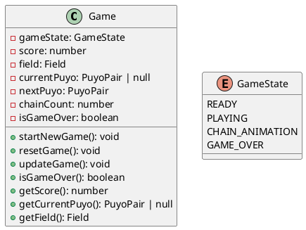
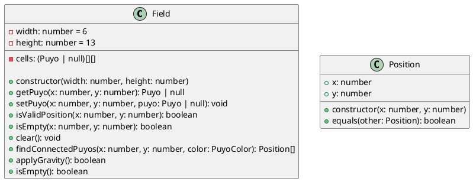
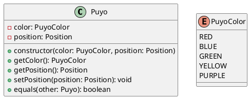
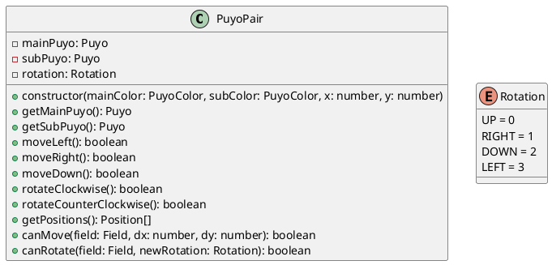
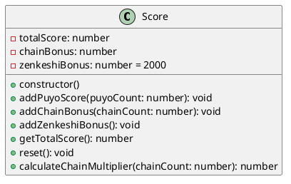
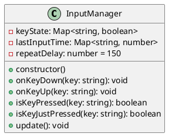
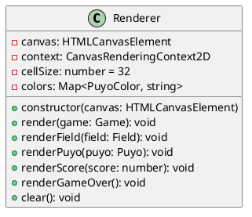
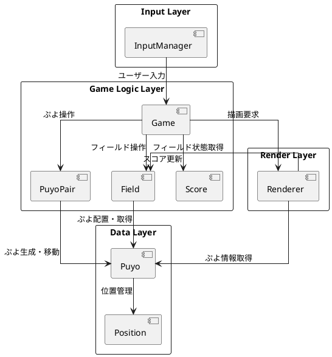
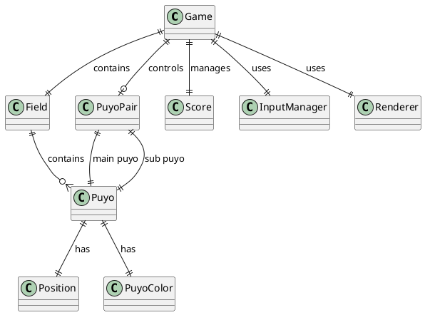

# データモデル設計

## 概要

ぷよぷよゲームのデータモデル設計では、ゲームの状態、ぷよの情報、フィールドの状態、スコア情報などを適切に管理する必要があります。

## エンティティ一覧

### 1. ゲーム (Game)

ゲーム全体の状態を管理するルートエンティティ

**属性**:
- `gameState`: ゲームの現在の状態
- `score`: 現在のスコア
- `field`: ゲームフィールド
- `currentPuyo`: 現在操作中のぷよペア
- `nextPuyo`: 次に生成されるぷよペア
- `chainCount`: 現在の連鎖数
- `isGameOver`: ゲームオーバーフラグ

### 2. フィールド (Field)

ぷよが配置されるゲームフィールドを管理

**属性**:
- `width`: フィールドの幅（列数）
- `height`: フィールドの高さ（行数）
- `cells`: ぷよを格納する2次元配列

### 3. ぷよ (Puyo)

個々のぷよを表現するエンティティ

**属性**:
- `color`: ぷよの色
- `position`: ぷよの位置

### 4. ぷよペア (PuyoPair)

操作単位となる2個1組のぷよ

**属性**:
- `mainPuyo`: メインのぷよ（回転の中心）
- `subPuyo`: サブのぷよ（回転する側）
- `rotation`: 現在の回転状態

### 5. スコア (Score)

スコア計算とボーナス管理

**属性**:
- `totalScore`: 総スコア
- `chainBonus`: 連鎖ボーナス
- `zenkeshiBonus`: 全消しボーナス

### 6. 入力管理 (InputManager)

プレイヤーの入力を管理

### 7. レンダラー (Renderer)

画面描画を管理

## データフロー図

## エンティティ関係図

## 制約と規則

### フィールド制約
- フィールドサイズ: 6列 × 13行 (標準ぷよぷよサイズ)
- インデックス範囲: x=[0,5], y=[0,12]
- 初期位置: x=2, y=1 (列2, 行1)

### ぷよ制約
- 色数: 5色 (赤、青、緑、黄、紫)
- 消去条件: 同色4個以上の隣接
- ペア構成: メイン1個 + サブ1個

### スコア計算規則
- 基本点: 消去ぷよ数 × 10点
- 連鎖ボーナス: 2^(連鎖数-1) 倍
- 全消しボーナス: 2000点

### 操作制約
- 移動: 左右のみ（フィールド境界制限あり）
- 回転: 時計回り・反時計回り（壁キック対応）
- 落下: 自動落下 + 高速落下

## データ永続化

このゲームでは以下のデータを永続化します：

- **セッション中**: メモリ上でゲーム状態を管理
- **ゲーム終了時**: 最高スコアをローカルストレージに保存（オプション）

## パフォーマンス考慮事項

- **フィールド探索**: 深度優先探索（DFS）による接続ぷよ検索
- **描画最適化**: 変更された部分のみ再描画
- **メモリ管理**: 不要なオブジェクトの適切な解放
- **計算最適化**: 連鎖処理時の効率的なアルゴリズム使用