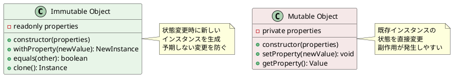
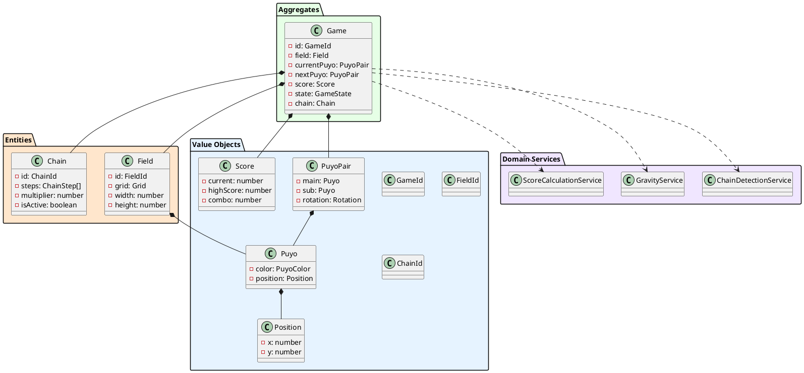

# データモデル設計

## 概要

ぷよぷよゲームのデータモデル設計を定義します。DDDの戦術的パターンを適用し、イミュータブルなデータ構造を採用して、型安全性と保守性を確保します。

## 設計原則

### 1. イミュータビリティ (Immutability)



### 2. Value Objectパターン

```typescript
// 値オブジェクトの基底クラス
export abstract class ValueObject<T> {
  protected constructor(protected readonly props: T) {
    Object.freeze(props);
    Object.freeze(this);
  }
  
  public equals(other: ValueObject<T>): boolean {
    if (other === null || other === undefined) {
      return false;
    }
    
    if (other.constructor.name !== this.constructor.name) {
      return false;
    }
    
    return this.deepEquals(this.props, other.props);
  }
  
  private deepEquals(a: any, b: any): boolean {
    if (a === b) return true;
    
    if (a && b && typeof a === 'object' && typeof b === 'object') {
      const keys = Object.keys(a);
      if (keys.length !== Object.keys(b).length) return false;
      
      return keys.every(key => this.deepEquals(a[key], b[key]));
    }
    
    return false;
  }
}
```

## ドメインモデル階層



## 値オブジェクト詳細設計

### 1. Position（座標）

```typescript
interface PositionProps {
  readonly x: number;
  readonly y: number;
}

export class Position extends ValueObject<PositionProps> {
  private constructor(props: PositionProps) {
    super(props);
    this.validateCoordinates(props.x, props.y);
  }
  
  public static create(x: number, y: number): Position {
    return new Position({ x, y });
  }
  
  public static origin(): Position {
    return new Position({ x: 0, y: 0 });
  }
  
  // Getters
  public get x(): number { return this.props.x; }
  public get y(): number { return this.props.y; }
  
  // Operations
  public moveLeft(): Position {
    return new Position({ x: this.props.x - 1, y: this.props.y });
  }
  
  public moveRight(): Position {
    return new Position({ x: this.props.x + 1, y: this.props.y });
  }
  
  public moveDown(): Position {
    return new Position({ x: this.props.x, y: this.props.y + 1 });
  }
  
  public moveUp(): Position {
    return new Position({ x: this.props.x, y: this.props.y - 1 });
  }
  
  public offset(dx: number, dy: number): Position {
    return new Position({ 
      x: this.props.x + dx, 
      y: this.props.y + dy 
    });
  }
  
  public getNeighbors(): Position[] {
    return [
      this.moveUp(),    // 上
      this.moveDown(),  // 下
      this.moveLeft(),  // 左
      this.moveRight()  // 右
    ];
  }
  
  public isAdjacentTo(other: Position): boolean {
    const dx = Math.abs(this.x - other.x);
    const dy = Math.abs(this.y - other.y);
    return (dx === 1 && dy === 0) || (dx === 0 && dy === 1);
  }
  
  public isValid(width: number = 6, height: number = 12): boolean {
    return this.x >= 0 && this.x < width && 
           this.y >= 0 && this.y < height;
  }
  
  public toString(): string {
    return `(${this.x}, ${this.y})`;
  }
  
  private validateCoordinates(x: number, y: number): void {
    if (!Number.isInteger(x) || !Number.isInteger(y)) {
      throw new Error('Coordinates must be integers');
    }
    
    if (x < 0 || y < 0) {
      throw new Error('Coordinates must be non-negative');
    }
  }
}
```

### 2. PuyoColor（ぷよの色）

```typescript
export enum PuyoColor {
  RED = 'red',
  GREEN = 'green', 
  BLUE = 'blue',
  YELLOW = 'yellow',
  PURPLE = 'purple'
}

export class PuyoColorUtils {
  private static readonly VALID_COLORS = Object.values(PuyoColor);
  
  public static isValid(color: string): color is PuyoColor {
    return this.VALID_COLORS.includes(color as PuyoColor);
  }
  
  public static random(): PuyoColor {
    const colors = this.VALID_COLORS;
    const randomIndex = Math.floor(Math.random() * colors.length);
    return colors[randomIndex];
  }
  
  public static getDisplayName(color: PuyoColor): string {
    const displayNames = {
      [PuyoColor.RED]: '赤',
      [PuyoColor.GREEN]: '緑',
      [PuyoColor.BLUE]: '青', 
      [PuyoColor.YELLOW]: '黄',
      [PuyoColor.PURPLE]: '紫'
    };
    
    return displayNames[color];
  }
  
  public static getCSSClass(color: PuyoColor): string {
    return `puyo-${color}`;
  }
}
```

### 3. Puyo（ぷよ）

```typescript
interface PuyoProps {
  readonly color: PuyoColor;
  readonly position: Position;
}

export class Puyo extends ValueObject<PuyoProps> {
  private constructor(props: PuyoProps) {
    super(props);
    this.validateColor(props.color);
  }
  
  public static create(color: PuyoColor, position: Position): Puyo {
    return new Puyo({ color, position });
  }
  
  public static createRandom(position: Position): Puyo {
    const color = PuyoColorUtils.random();
    return new Puyo({ color, position });
  }
  
  // Getters
  public get color(): PuyoColor { return this.props.color; }
  public get position(): Position { return this.props.position; }
  
  // Operations
  public moveTo(newPosition: Position): Puyo {
    return new Puyo({ color: this.color, position: newPosition });
  }
  
  public moveLeft(): Puyo {
    return this.moveTo(this.position.moveLeft());
  }
  
  public moveRight(): Puyo {
    return this.moveTo(this.position.moveRight());
  }
  
  public moveDown(): Puyo {
    return this.moveTo(this.position.moveDown());
  }
  
  public moveUp(): Puyo {
    return this.moveTo(this.position.moveUp());
  }
  
  public withColor(newColor: PuyoColor): Puyo {
    return new Puyo({ color: newColor, position: this.position });
  }
  
  public isAt(position: Position): boolean {
    return this.position.equals(position);
  }
  
  public isSameColor(other: Puyo): boolean {
    return this.color === other.color;
  }
  
  public isAdjacentTo(other: Puyo): boolean {
    return this.position.isAdjacentTo(other.position);
  }
  
  public toString(): string {
    return `${this.color.toUpperCase()} at ${this.position.toString()}`;
  }
  
  public toJSON(): object {
    return {
      color: this.color,
      position: {
        x: this.position.x,
        y: this.position.y
      }
    };
  }
  
  private validateColor(color: PuyoColor): void {
    if (!PuyoColorUtils.isValid(color)) {
      throw new Error(`Invalid puyo color: ${color}`);
    }
  }
}
```

### 4. Rotation（回転状態）

```typescript
export enum Rotation {
  UP = 0,      // 0度 (初期状態)
  RIGHT = 90,  // 90度
  DOWN = 180,  // 180度
  LEFT = 270   // 270度
}

interface RotationProps {
  readonly angle: Rotation;
}

export class PuyoRotation extends ValueObject<RotationProps> {
  private constructor(props: RotationProps) {
    super(props);
  }
  
  public static create(angle: Rotation = Rotation.UP): PuyoRotation {
    return new PuyoRotation({ angle });
  }
  
  public static fromAngle(angle: number): PuyoRotation {
    const normalizedAngle = ((angle % 360) + 360) % 360;
    
    if (normalizedAngle === 0) return this.create(Rotation.UP);
    if (normalizedAngle === 90) return this.create(Rotation.RIGHT);
    if (normalizedAngle === 180) return this.create(Rotation.DOWN);
    if (normalizedAngle === 270) return this.create(Rotation.LEFT);
    
    throw new Error(`Invalid rotation angle: ${angle}`);
  }
  
  public get angle(): Rotation { return this.props.angle; }
  
  public rotateClockwise(): PuyoRotation {
    const nextAngle = (this.angle + 90) % 360;
    return PuyoRotation.fromAngle(nextAngle);
  }
  
  public rotateCounterClockwise(): PuyoRotation {
    const nextAngle = (this.angle - 90 + 360) % 360;
    return PuyoRotation.fromAngle(nextAngle);
  }
  
  public getOffsetForSubPuyo(): Position {
    switch (this.angle) {
      case Rotation.UP:
        return Position.create(0, -1);  // 上
      case Rotation.RIGHT:
        return Position.create(1, 0);   // 右
      case Rotation.DOWN:
        return Position.create(0, 1);   // 下
      case Rotation.LEFT:
        return Position.create(-1, 0);  // 左
      default:
        throw new Error(`Invalid rotation: ${this.angle}`);
    }
  }
  
  public toString(): string {
    return `${this.angle}°`;
  }
}
```

### 5. PuyoPair（組ぷよ）

```typescript
interface PuyoPairProps {
  readonly main: Puyo;
  readonly sub: Puyo;
  readonly rotation: PuyoRotation;
}

export class PuyoPair extends ValueObject<PuyoPairProps> {
  private constructor(props: PuyoPairProps) {
    super(props);
    this.validatePuyoPair(props.main, props.sub);
  }
  
  public static create(
    main: Puyo, 
    sub: Puyo, 
    rotation: PuyoRotation = PuyoRotation.create()
  ): PuyoPair {
    return new PuyoPair({ main, sub, rotation });
  }
  
  public static createRandom(position: Position): PuyoPair {
    const main = Puyo.createRandom(position);
    const subPosition = position.moveUp();
    const sub = Puyo.createRandom(subPosition);
    
    return new PuyoPair({ 
      main, 
      sub, 
      rotation: PuyoRotation.create() 
    });
  }
  
  // Getters
  public get main(): Puyo { return this.props.main; }
  public get sub(): Puyo { return this.props.sub; }
  public get rotation(): PuyoRotation { return this.props.rotation; }
  
  public getSubPosition(): Position {
    const offset = this.rotation.getOffsetForSubPuyo();
    return this.main.position.offset(offset.x, offset.y);
  }
  
  public getSubPuyoAtCorrectPosition(): Puyo {
    return this.sub.moveTo(this.getSubPosition());
  }
  
  public getPuyos(): [Puyo, Puyo] {
    return [this.main, this.getSubPuyoAtCorrectPosition()];
  }
  
  public getPositions(): [Position, Position] {
    return [this.main.position, this.getSubPosition()];
  }
  
  // Operations
  public moveLeft(): PuyoPair {
    const newMain = this.main.moveLeft();
    return new PuyoPair({ 
      main: newMain,
      sub: this.sub,
      rotation: this.rotation 
    });
  }
  
  public moveRight(): PuyoPair {
    const newMain = this.main.moveRight();
    return new PuyoPair({ 
      main: newMain,
      sub: this.sub,
      rotation: this.rotation 
    });
  }
  
  public moveDown(): PuyoPair {
    const newMain = this.main.moveDown();
    return new PuyoPair({ 
      main: newMain,
      sub: this.sub,
      rotation: this.rotation 
    });
  }
  
  public rotateClockwise(): PuyoPair {
    const newRotation = this.rotation.rotateClockwise();
    return new PuyoPair({ 
      main: this.main,
      sub: this.sub,
      rotation: newRotation 
    });
  }
  
  public rotateCounterClockwise(): PuyoPair {
    const newRotation = this.rotation.rotateCounterClockwise();
    return new PuyoPair({ 
      main: this.main,
      sub: this.sub,
      rotation: newRotation 
    });
  }
  
  public canFitInField(field: Field): boolean {
    const [mainPos, subPos] = this.getPositions();
    return field.canPlacePuyoAt(mainPos) && field.canPlacePuyoAt(subPos);
  }
  
  public toString(): string {
    return `PuyoPair[${this.main.color}@${this.main.position}, ${this.sub.color}@${this.getSubPosition()}] rot:${this.rotation}`;
  }
  
  private validatePuyoPair(main: Puyo, sub: Puyo): void {
    if (main.equals(sub)) {
      throw new Error('Main and sub puyo cannot be the same');
    }
  }
}
```

## エンティティ設計

### 1. GameId（ゲーム識別子）

```typescript
interface GameIdProps {
  readonly value: string;
}

export class GameId extends ValueObject<GameIdProps> {
  private constructor(props: GameIdProps) {
    super(props);
    this.validateId(props.value);
  }
  
  public static create(value: string): GameId {
    return new GameId({ value });
  }
  
  public static generate(): GameId {
    const timestamp = Date.now().toString(36);
    const random = Math.random().toString(36).substr(2, 9);
    return new GameId({ value: `game_${timestamp}_${random}` });
  }
  
  public get value(): string { return this.props.value; }
  
  public toString(): string { return this.value; }
  
  public toJSON(): string { return this.value; }
  
  private validateId(value: string): void {
    if (!value || value.trim().length === 0) {
      throw new Error('GameId cannot be empty');
    }
    
    if (value.length > 100) {
      throw new Error('GameId cannot exceed 100 characters');
    }
    
    if (!/^[a-zA-Z0-9_-]+$/.test(value)) {
      throw new Error('GameId can only contain alphanumeric characters, underscores, and hyphens');
    }
  }
}
```

### 2. Field（フィールド）

```typescript
interface FieldProps {
  readonly id: FieldId;
  readonly grid: ReadonlyArray<ReadonlyArray<Puyo | null>>;
  readonly width: number;
  readonly height: number;
}

export class Field {
  public static readonly DEFAULT_WIDTH = 6;
  public static readonly DEFAULT_HEIGHT = 12;
  
  private constructor(private readonly props: FieldProps) {
    this.validateDimensions();
    this.validateGrid();
    Object.freeze(this);
  }
  
  public static createEmpty(
    id: FieldId = FieldId.generate(),
    width: number = Field.DEFAULT_WIDTH,
    height: number = Field.DEFAULT_HEIGHT
  ): Field {
    const grid = Array(height).fill(null)
      .map(() => Array(width).fill(null));
    
    return new Field({ id, grid, width, height });
  }
  
  public static fromGrid(
    grid: (Puyo | null)[][],
    id: FieldId = FieldId.generate()
  ): Field {
    const height = grid.length;
    const width = grid[0]?.length ?? 0;
    
    return new Field({ 
      id, 
      grid: grid.map(row => [...row]), 
      width, 
      height 
    });
  }
  
  // Getters
  public get id(): FieldId { return this.props.id; }
  public get width(): number { return this.props.width; }
  public get height(): number { return this.props.height; }
  
  // Queries
  public isEmpty(): boolean {
    return this.props.grid.every(row => 
      row.every(cell => cell === null)
    );
  }
  
  public isFull(): boolean {
    return this.props.grid.every(row => 
      row.every(cell => cell !== null)
    );
  }
  
  public isValidPosition(position: Position): boolean {
    return position.isValid(this.width, this.height);
  }
  
  public canPlacePuyoAt(position: Position): boolean {
    return this.isValidPosition(position) && 
           this.getPuyoAt(position) === null;
  }
  
  public getPuyoAt(position: Position): Puyo | null {
    if (!this.isValidPosition(position)) {
      return null;
    }
    
    return this.props.grid[position.y][position.x];
  }
  
  public getPuyosOfColor(color: PuyoColor): Puyo[] {
    const puyos: Puyo[] = [];
    
    for (let y = 0; y < this.height; y++) {
      for (let x = 0; x < this.width; x++) {
        const puyo = this.props.grid[y][x];
        if (puyo && puyo.color === color) {
          puyos.push(puyo);
        }
      }
    }
    
    return puyos;
  }
  
  public getAllPuyos(): Puyo[] {
    const puyos: Puyo[] = [];
    
    for (let y = 0; y < this.height; y++) {
      for (let x = 0; x < this.width; x++) {
        const puyo = this.props.grid[y][x];
        if (puyo) {
          puyos.push(puyo);
        }
      }
    }
    
    return puyos;
  }
  
  // Commands
  public placePuyo(puyo: Puyo): Field {
    if (!this.canPlacePuyoAt(puyo.position)) {
      throw new Error(`Cannot place puyo at position ${puyo.position}`);
    }
    
    const newGrid = this.copyGrid();
    newGrid[puyo.position.y][puyo.position.x] = puyo;
    
    return new Field({
      id: this.id,
      grid: newGrid,
      width: this.width,
      height: this.height
    });
  }
  
  public removePuyo(position: Position): Field {
    if (!this.isValidPosition(position)) {
      throw new Error(`Invalid position: ${position}`);
    }
    
    const newGrid = this.copyGrid();
    newGrid[position.y][position.x] = null;
    
    return new Field({
      id: this.id,
      grid: newGrid,
      width: this.width,
      height: this.height
    });
  }
  
  public removePuyos(positions: Position[]): Field {
    let newField = this;
    
    for (const position of positions) {
      newField = newField.removePuyo(position);
    }
    
    return newField;
  }
  
  public applyGravity(): Field {
    const newGrid = this.copyGrid();
    
    // 各列について重力を適用
    for (let x = 0; x < this.width; x++) {
      const column: (Puyo | null)[] = [];
      
      // 下から上に向かってnull以外の要素を収集
      for (let y = this.height - 1; y >= 0; y--) {
        const puyo = newGrid[y][x];
        if (puyo !== null) {
          // 位置を更新
          column.push(puyo.moveTo(Position.create(x, column.length)));
        }
      }
      
      // 列を再構築
      for (let y = 0; y < this.height; y++) {
        if (y < column.length) {
          newGrid[this.height - 1 - y][x] = column[y];
        } else {
          newGrid[this.height - 1 - y][x] = null;
        }
      }
    }
    
    return new Field({
      id: this.id,
      grid: newGrid,
      width: this.width,
      height: this.height
    });
  }
  
  public getGrid(): ReadonlyArray<ReadonlyArray<Puyo | null>> {
    return this.props.grid;
  }
  
  public toPattern(): string[][] {
    return this.props.grid.map(row =>
      row.map(puyo => 
        puyo ? puyo.color.charAt(0).toUpperCase() : '.'
      )
    );
  }
  
  public toString(): string {
    return this.toPattern()
      .map(row => row.join(' '))
      .join('\n');
  }
  
  private copyGrid(): (Puyo | null)[][] {
    return this.props.grid.map(row => [...row]);
  }
  
  private validateDimensions(): void {
    if (this.props.width <= 0 || this.props.height <= 0) {
      throw new Error('Field dimensions must be positive');
    }
    
    if (this.props.width > 20 || this.props.height > 20) {
      throw new Error('Field dimensions are too large');
    }
  }
  
  private validateGrid(): void {
    if (this.props.grid.length !== this.props.height) {
      throw new Error('Grid height does not match field height');
    }
    
    for (const row of this.props.grid) {
      if (row.length !== this.props.width) {
        throw new Error('Grid width does not match field width');
      }
    }
  }
}
```

## JSONシリアル化サポート

### 1. シリアル化インターフェース

```typescript
export interface Serializable<T> {
  toJSON(): T;
  toString(): string;
}

export interface Deserializable<T, TJson> {
  fromJSON(json: TJson): T;
}

// ゲーム状態のシリアル化
export interface GameStateJson {
  id: string;
  field: PuyoJson[][];
  currentPuyo: PuyoPairJson;
  nextPuyo: PuyoPairJson;
  score: ScoreJson;
  state: string;
  createdAt: string;
  lastUpdate: string;
}

export interface PuyoJson {
  color: string;
  position: { x: number; y: number };
}

export interface PuyoPairJson {
  main: PuyoJson;
  sub: PuyoJson;
  rotation: number;
}

export interface ScoreJson {
  current: number;
  highScore: number;
  combo: number;
}
```

### 2. シリアル化の実装

```typescript
export class GameStateSerializer {
  public static serialize(game: Game): GameStateJson {
    return {
      id: game.getId().value,
      field: game.getField().getGrid().map(row =>
        row.map(puyo => puyo ? puyo.toJSON() as PuyoJson : null)
      ),
      currentPuyo: game.getCurrentPuyo().toJSON() as PuyoPairJson,
      nextPuyo: game.getNextPuyo().toJSON() as PuyoPairJson,
      score: game.getScore().toJSON() as ScoreJson,
      state: game.getState().toString(),
      createdAt: game.getCreatedAt().toISOString(),
      lastUpdate: game.getLastUpdate().toISOString()
    };
  }
  
  public static deserialize(json: GameStateJson): Game {
    const gameId = GameId.create(json.id);
    const field = this.deserializeField(json.field);
    const currentPuyo = this.deserializePuyoPair(json.currentPuyo);
    const nextPuyo = this.deserializePuyoPair(json.nextPuyo);
    const score = this.deserializeScore(json.score);
    const state = GameState.fromString(json.state);
    
    return Game.restore(
      gameId,
      field,
      currentPuyo,
      nextPuyo,
      score,
      state,
      new Date(json.createdAt),
      new Date(json.lastUpdate)
    );
  }
  
  private static deserializeField(gridJson: (PuyoJson | null)[][]): Field {
    const grid = gridJson.map(row =>
      row.map(puyoJson => 
        puyoJson ? this.deserializePuyo(puyoJson) : null
      )
    );
    
    return Field.fromGrid(grid);
  }
  
  private static deserializePuyo(json: PuyoJson): Puyo {
    const position = Position.create(json.position.x, json.position.y);
    return Puyo.create(json.color as PuyoColor, position);
  }
  
  private static deserializePuyoPair(json: PuyoPairJson): PuyoPair {
    const main = this.deserializePuyo(json.main);
    const sub = this.deserializePuyo(json.sub);
    const rotation = PuyoRotation.fromAngle(json.rotation);
    
    return PuyoPair.create(main, sub, rotation);
  }
  
  private static deserializeScore(json: ScoreJson): Score {
    return Score.create(json.current, json.highScore, json.combo);
  }
}
```

## タイプガード・バリデーション

### 1. 型安全性の確保

```typescript
export class TypeGuards {
  public static isPuyo(obj: any): obj is Puyo {
    return obj instanceof Puyo;
  }
  
  public static isPuyoColor(value: any): value is PuyoColor {
    return Object.values(PuyoColor).includes(value);
  }
  
  public static isPosition(obj: any): obj is Position {
    return obj instanceof Position;
  }
  
  public static isPuyoPair(obj: any): obj is PuyoPair {
    return obj instanceof PuyoPair;
  }
  
  public static isValidGridCell(cell: any): cell is (Puyo | null) {
    return cell === null || this.isPuyo(cell);
  }
  
  public static isValidGrid(grid: any): grid is (Puyo | null)[][] {
    return Array.isArray(grid) && 
           grid.every(row => 
             Array.isArray(row) && 
             row.every(cell => this.isValidGridCell(cell))
           );
  }
}

export class Validators {
  public static validateGameConfiguration(config: any): void {
    if (typeof config.fieldWidth !== 'number' || config.fieldWidth < 4 || config.fieldWidth > 10) {
      throw new Error('Field width must be between 4 and 10');
    }
    
    if (typeof config.fieldHeight !== 'number' || config.fieldHeight < 8 || config.fieldHeight > 20) {
      throw new Error('Field height must be between 8 and 20');
    }
    
    if (!Array.isArray(config.availableColors) || config.availableColors.length < 3) {
      throw new Error('At least 3 colors must be available');
    }
    
    for (const color of config.availableColors) {
      if (!TypeGuards.isPuyoColor(color)) {
        throw new Error(`Invalid color: ${color}`);
      }
    }
  }
}
```

## まとめ

この データモデル設計により以下を実現：

1. **型安全性**: TypeScriptによる厳密な型定義
2. **イミュータビリティ**: 予期しない状態変更の防止
3. **ドメイン表現**: ビジネスルールをコードで明確に表現
4. **テスタビリティ**: 値オブジェクトによる簡単なテスト
5. **シリアル化サポート**: ゲーム状態の保存・復元
6. **バリデーション**: 不正なデータからの保護

次のPhase 3（開発）では、このデータモデルを基盤として具体的な実装を行います。