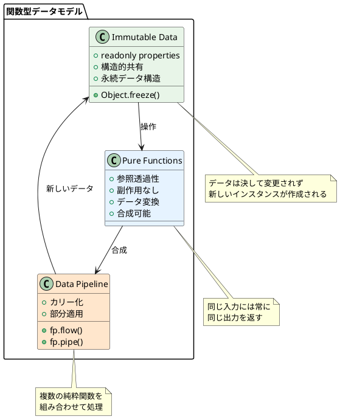

# データモデル設計（関数型アプローチ）

## 概要

ぷよぷよゲームのデータモデル設計を関数型プログラミングの原則に基づいて定義します。純粋関数、イミュータブルなデータ構造、Lodash/fpを活用した宣言的な操作により、型安全性と保守性を確保します。

## 設計原則

### 1. 関数型データモデリング



### 2. 関数型Value Objectパターン

```typescript
import * as fp from 'lodash/fp';

// 関数型アプローチでのValue Object
export type ValueObject<T> = Readonly<T>;

// イミュータブルなデータ作成ヘルパー
export const createImmutable = <T extends object>(data: T): ValueObject<T> => 
  Object.freeze(fp.cloneDeep(data));

// 等価性チェック（純粋関数）
export const isEqual = <T>(a: ValueObject<T>, b: ValueObject<T>): boolean =>
  fp.isEqual(a, b);

// データ更新（新しいインスタンスを返す）
export const updateValue = <T extends object>(
  obj: ValueObject<T>,
  path: string | string[],
  value: any
): ValueObject<T> => createImmutable(fp.set(path, value, obj));

// 複数の更新を適用
export const applyUpdates = <T extends object>(
  obj: ValueObject<T>,
  updates: Array<[string | string[], any]>
): ValueObject<T> => 
  createImmutable(
    updates.reduce((acc, [path, value]) => fp.set(path, value, acc), obj)
  );
```

## ドメインモデル階層


## 値オブジェクト詳細設計（関数型）

### 1. Position（座標）- 関数型実装

```typescript
import * as fp from 'lodash/fp';

// 型定義
export interface Position {
  readonly x: number;
  readonly y: number;
}

// ファクトリ関数（純粋関数）
export const createPosition = (x: number, y: number): Position => {
  validateCoordinates(x, y);
  return Object.freeze({ x, y });
};

export const origin = (): Position => createPosition(0, 0);

// バリデーション（純粋関数）
const validateCoordinates = (x: number, y: number): void => {
  if (!Number.isInteger(x) || !Number.isInteger(y)) {
    throw new Error('Coordinates must be integers');
  }
  if (x < 0 || y < 0) {
    throw new Error('Coordinates must be non-negative');
  }
};

// 移動操作（純粋関数）
export const movePosition = fp.curry(
  (dx: number, dy: number, pos: Position): Position =>
    createPosition(pos.x + dx, pos.y + dy)
);

export const moveLeft = movePosition(-1, 0);
export const moveRight = movePosition(1, 0);
export const moveUp = movePosition(0, -1);
export const moveDown = movePosition(0, 1);

// 隣接位置取得（純粋関数）
export const getNeighbors = (pos: Position): Position[] => [
  moveUp(pos),
  moveDown(pos),
  moveLeft(pos),
  moveRight(pos)
].filter(p => isValidPosition(p));

// 位置チェック（純粋関数）
export const isAdjacentTo = fp.curry(
  (pos1: Position, pos2: Position): boolean => {
    const dx = Math.abs(pos1.x - pos2.x);
    const dy = Math.abs(pos1.y - pos2.y);
    return (dx === 1 && dy === 0) || (dx === 0 && dy === 1);
  }
);

export const isValidPosition = fp.curry(
  (width: number, height: number, pos: Position): boolean =>
    pos.x >= 0 && pos.x < width && pos.y >= 0 && pos.y < height
);

export const isWithinField = isValidPosition(6, 12);

// 文字列変換（純粋関数）
export const positionToString = (pos: Position): string => `(${pos.x}, ${pos.y})`;

// 等価性チェック（純粋関数）
export const isPositionEqual = fp.curry(
  (pos1: Position, pos2: Position): boolean =>
    pos1.x === pos2.x && pos1.y === pos2.y
);
```

### 2. PuyoColor（ぷよの色）

```typescript
export enum PuyoColor {
  RED = 'red',
  GREEN = 'green', 
  BLUE = 'blue',
  YELLOW = 'yellow',
  PURPLE = 'purple'
}

export class PuyoColorUtils {
  private static readonly VALID_COLORS = Object.values(PuyoColor);
  
  public static isValid(color: string): color is PuyoColor {
    return this.VALID_COLORS.includes(color as PuyoColor);
  }
  
  public static random(): PuyoColor {
    const colors = this.VALID_COLORS;
    const randomIndex = Math.floor(Math.random() * colors.length);
    return colors[randomIndex];
  }
  
  public static getDisplayName(color: PuyoColor): string {
    const displayNames = {
      [PuyoColor.RED]: '赤',
      [PuyoColor.GREEN]: '緑',
      [PuyoColor.BLUE]: '青', 
      [PuyoColor.YELLOW]: '黄',
      [PuyoColor.PURPLE]: '紫'
    };
    
    return displayNames[color];
  }
  
  public static getCSSClass(color: PuyoColor): string {
    return `puyo-${color}`;
  }
}
```

### 3. Puyo（ぷよ）- 関数型実装

```typescript
import * as fp from 'lodash/fp';

// 型定義
export interface Puyo {
  readonly color: PuyoColor;
  readonly position: Position;
}

// ファクトリ関数（純粋関数）
export const createPuyo = (color: PuyoColor, position: Position): Puyo => {
  validatePuyoColor(color);
  return Object.freeze({ color, position });
};

export const createRandomPuyo = (position: Position): Puyo =>
  createPuyo(getRandomColor(), position);

// バリデーション（純粋関数）
const validatePuyoColor = (color: PuyoColor): void => {
  if (!isValidPuyoColor(color)) {
    throw new Error(`Invalid puyo color: ${color}`);
  }
};

// 移動操作（純粋関数）
export const movePuyoTo = fp.curry(
  (newPosition: Position, puyo: Puyo): Puyo =>
    createPuyo(puyo.color, newPosition)
);

export const movePuyoBy = fp.curry(
  (dx: number, dy: number, puyo: Puyo): Puyo =>
    createPuyo(puyo.color, movePosition(dx, dy, puyo.position))
);

export const movePuyoLeft = movePuyoBy(-1, 0);
export const movePuyoRight = movePuyoBy(1, 0);
export const movePuyoUp = movePuyoBy(0, -1);
export const movePuyoDown = movePuyoBy(0, 1);

// 色変更（純粋関数）
export const changePuyoColor = fp.curry(
  (newColor: PuyoColor, puyo: Puyo): Puyo =>
    createPuyo(newColor, puyo.position)
);

// チェック関数（純粋関数）
export const isPuyoAt = fp.curry(
  (position: Position, puyo: Puyo): boolean =>
    isPositionEqual(puyo.position, position)
);

export const isSamePuyoColor = fp.curry(
  (puyo1: Puyo, puyo2: Puyo): boolean =>
    puyo1.color === puyo2.color
);

export const arePuyosAdjacent = fp.curry(
  (puyo1: Puyo, puyo2: Puyo): boolean =>
    isAdjacentTo(puyo1.position, puyo2.position)
);

// 文字列変換（純粋関数）
export const puyoToString = (puyo: Puyo): string =>
  `${puyo.color.toUpperCase()} at ${positionToString(puyo.position)}`;

// JSON変換（純粋関数）
export const puyoToJSON = (puyo: Puyo): object => ({
  color: puyo.color,
  position: {
    x: puyo.position.x,
    y: puyo.position.y
  }
});

// 等価性チェック（純粋関数）
export const isPuyoEqual = fp.curry(
  (puyo1: Puyo, puyo2: Puyo): boolean =>
    puyo1.color === puyo2.color && 
    isPositionEqual(puyo1.position, puyo2.position)
);

// 配列操作ユーティリティ（純粋関数）
export const filterPuyosByColor = fp.curry(
  (color: PuyoColor, puyos: Puyo[]): Puyo[] =>
    puyos.filter(puyo => puyo.color === color)
);

export const groupPuyosByColor = (puyos: Puyo[]): Map<PuyoColor, Puyo[]> =>
  fp.groupBy('color', puyos);
```

### 4. Rotation（回転状態）- 関数型実装

```typescript
import * as fp from 'lodash/fp';

// 型定義
export enum Rotation {
  UP = 0,      // 0度 (初期状態)
  RIGHT = 90,  // 90度
  DOWN = 180,  // 180度
  LEFT = 270   // 270度
}

// ファクトリ関数（純粋関数）
export const createRotation = (angle: Rotation = Rotation.UP): Rotation => {
  validateRotation(angle);
  return angle;
};

// バリデーション（純粋関数）
const validateRotation = (angle: Rotation): void => {
  if (![0, 90, 180, 270].includes(angle)) {
    throw new Error(`Invalid rotation angle: ${angle}`);
  }
};

// 角度から回転状態を作成（純粋関数）
export const rotationFromAngle = (angle: number): Rotation => {
  const normalizedAngle = ((angle % 360) + 360) % 360;
  
  switch (normalizedAngle) {
    case 0: return Rotation.UP;
    case 90: return Rotation.RIGHT;
    case 180: return Rotation.DOWN;
    case 270: return Rotation.LEFT;
    default:
      throw new Error(`Invalid rotation angle: ${angle}`);
  }
};

// 回転操作（純粋関数）
export const rotateClockwise = (rotation: Rotation): Rotation => {
  const nextAngle = (rotation + 90) % 360;
  return rotationFromAngle(nextAngle);
};

export const rotateCounterClockwise = (rotation: Rotation): Rotation => {
  const nextAngle = (rotation - 90 + 360) % 360;
  return rotationFromAngle(nextAngle);
};

// 指定回数回転（純粋関数）
export const rotateBy = fp.curry(
  (times: number, rotation: Rotation): Rotation => {
    const angle = rotation + (times * 90);
    return rotationFromAngle(angle);
  }
);

// サブぷよのオフセット取得（純粋関数）
export const getOffsetForSubPuyo = (rotation: Rotation): Position => {
  switch (rotation) {
    case Rotation.UP:
      return createPosition(0, -1);  // 上
    case Rotation.RIGHT:
      return createPosition(1, 0);   // 右
    case Rotation.DOWN:
      return createPosition(0, 1);   // 下
    case Rotation.LEFT:
      return createPosition(-1, 0);  // 左
    default:
      throw new Error(`Invalid rotation: ${rotation}`);
  }
};

// 文字列変換（純粋関数）
export const rotationToString = (rotation: Rotation): string => `${rotation}°`;

// 回転の合成（純粋関数）
export const composeRotations = (...rotations: Rotation[]): Rotation => {
  const totalAngle = rotations.reduce((sum, rot) => sum + rot, 0);
  return rotationFromAngle(totalAngle);
};
```

### 5. PuyoPair（組ぷよ）- 関数型実装

```typescript
import * as fp from 'lodash/fp';

// 型定義
export interface PuyoPair {
  readonly main: Puyo;
  readonly sub: Puyo;
  readonly rotation: Rotation;
}

// ファクトリ関数（純粋関数）
export const createPuyoPair = (
  main: Puyo,
  sub: Puyo,
  rotation: Rotation = Rotation.UP
): PuyoPair => {
  validatePuyoPair(main, sub);
  return Object.freeze({ main, sub, rotation });
};

export const createRandomPuyoPair = (position: Position): PuyoPair => {
  const main = createRandomPuyo(position);
  const subPosition = moveUp(position);
  const sub = createRandomPuyo(subPosition);
  
  return createPuyoPair(main, sub, Rotation.UP);
};

// バリデーション（純粋関数）
const validatePuyoPair = (main: Puyo, sub: Puyo): void => {
  if (isPuyoEqual(main, sub)) {
    throw new Error('Main and sub puyo cannot be the same');
  }
};

// 位置計算（純粋関数）
export const getSubPosition = (pair: PuyoPair): Position => {
  const offset = getOffsetForSubPuyo(pair.rotation);
  return movePosition(offset.x, offset.y, pair.main.position);
};

export const getSubPuyoAtCorrectPosition = (pair: PuyoPair): Puyo =>
  movePuyoTo(getSubPosition(pair), pair.sub);

export const getPuyos = (pair: PuyoPair): [Puyo, Puyo] =>
  [pair.main, getSubPuyoAtCorrectPosition(pair)];

export const getPositions = (pair: PuyoPair): [Position, Position] =>
  [pair.main.position, getSubPosition(pair)];

// 移動操作（純粋関数）
export const movePuyoPairLeft = (pair: PuyoPair): PuyoPair =>
  createPuyoPair(movePuyoLeft(pair.main), pair.sub, pair.rotation);

export const movePuyoPairRight = (pair: PuyoPair): PuyoPair =>
  createPuyoPair(movePuyoRight(pair.main), pair.sub, pair.rotation);

export const movePuyoPairDown = (pair: PuyoPair): PuyoPair =>
  createPuyoPair(movePuyoDown(pair.main), pair.sub, pair.rotation);

export const movePuyoPairBy = fp.curry(
  (dx: number, dy: number, pair: PuyoPair): PuyoPair =>
    createPuyoPair(movePuyoBy(dx, dy, pair.main), pair.sub, pair.rotation)
);

// 回転操作（純粋関数）
export const rotatePuyoPairClockwise = (pair: PuyoPair): PuyoPair =>
  createPuyoPair(pair.main, pair.sub, rotateClockwise(pair.rotation));

export const rotatePuyoPairCounterClockwise = (pair: PuyoPair): PuyoPair =>
  createPuyoPair(pair.main, pair.sub, rotateCounterClockwise(pair.rotation));

// フィールド適合性チェック（純粋関数）
export const canFitInField = fp.curry(
  (fieldWidth: number, fieldHeight: number, pair: PuyoPair): boolean => {
    const [mainPos, subPos] = getPositions(pair);
    const isValidPos = isValidPosition(fieldWidth, fieldHeight);
    return isValidPos(mainPos) && isValidPos(subPos);
  }
);

// 壁蹴り回転（純粋関数）
export const rotateWithWallKick = fp.curry(
  (fieldWidth: number, fieldHeight: number, pair: PuyoPair, clockwise: boolean): PuyoPair => {
    const rotated = clockwise ? 
      rotatePuyoPairClockwise(pair) : 
      rotatePuyoPairCounterClockwise(pair);
    
    const canFit = canFitInField(fieldWidth, fieldHeight);
    
    // 通常の回転が可能な場合
    if (canFit(rotated)) {
      return rotated;
    }
    
    // 左に移動してから回転
    const leftShifted = movePuyoPairLeft(rotated);
    if (canFit(leftShifted)) {
      return leftShifted;
    }
    
    // 右に移動してから回転
    const rightShifted = movePuyoPairRight(rotated);
    if (canFit(rightShifted)) {
      return rightShifted;
    }
    
    // 回転できない場合は元の状態を返す
    return pair;
  }
);

// 文字列変換（純粋関数）
export const puyoPairToString = (pair: PuyoPair): string => {
  const subPos = getSubPosition(pair);
  return `PuyoPair[${pair.main.color}@${positionToString(pair.main.position)}, ` +
         `${pair.sub.color}@${positionToString(subPos)}] rot:${rotationToString(pair.rotation)}`;
};

// JSON変換（純粋関数）
export const puyoPairToJSON = (pair: PuyoPair): object => ({
  main: puyoToJSON(pair.main),
  sub: puyoToJSON(pair.sub),
  rotation: pair.rotation
});
```

## エンティティ設計

### 1. GameId（ゲーム識別子）- 関数型実装

```typescript
import * as fp from 'lodash/fp';

// 型定義
export type GameId = string;

// バリデーション（純粋関数）
const validateGameId = (value: string): void => {
  if (!value || value.trim().length === 0) {
    throw new Error('GameId cannot be empty');
  }
  
  if (value.length > 100) {
    throw new Error('GameId cannot exceed 100 characters');
  }
  
  if (!/^[a-zA-Z0-9_-]+$/.test(value)) {
    throw new Error('GameId can only contain alphanumeric characters, underscores, and hyphens');
  }
};

// ファクトリ関数（純粋関数）
export const createGameId = (value: string): GameId => {
  validateGameId(value);
  return value;
};

// ID生成（純粋関数化のため、タイムスタンプとランダム値を引数として受け取る）
export const generateGameId = (
  timestamp: number = Date.now(),
  random: number = Math.random()
): GameId => {
  const timestampStr = timestamp.toString(36);
  const randomStr = random.toString(36).substr(2, 9);
  return createGameId(`game_${timestampStr}_${randomStr}`);
};

// より純粋なID生成（シード付き）
export const generateGameIdWithSeed = fp.curry(
  (seed: string, counter: number): GameId => {
    const hash = fp.flow(
      (s: string) => s.split(''),
      fp.map((c: string) => c.charCodeAt(0)),
      fp.sum
    )(seed);
    
    return createGameId(`game_${hash}_${counter}`);
  }
);

// ID操作ユーティリティ（純粋関数）
export const isValidGameId = (value: string): boolean => {
  try {
    validateGameId(value);
    return true;
  } catch {
    return false;
  }
};

export const gameIdToString = (id: GameId): string => id;

export const gameIdEquals = fp.curry(
  (id1: GameId, id2: GameId): boolean => id1 === id2
);
```

### 2. Field（フィールド）- 関数型実装

```typescript
import * as fp from 'lodash/fp';

// 型定義
export interface Field {
  readonly id: FieldId;
  readonly grid: ReadonlyArray<ReadonlyArray<Puyo | null>>;
  readonly width: number;
  readonly height: number;
}

export type FieldId = string;

// 定数
export const DEFAULT_WIDTH = 6;
export const DEFAULT_HEIGHT = 12;

// ファクトリ関数（純粋関数）
export const createEmptyField = (
  id: FieldId = generateFieldId(),
  width: number = DEFAULT_WIDTH,
  height: number = DEFAULT_HEIGHT
): Field => {
  validateFieldDimensions(width, height);
  
  const grid = fp.times(
    () => fp.times(() => null, width),
    height
  );
  
  return Object.freeze({ id, grid, width, height });
};

export const createFieldFromGrid = (
  grid: ReadonlyArray<ReadonlyArray<Puyo | null>>,
  id: FieldId = generateFieldId()
): Field => {
  const height = grid.length;
  const width = grid[0]?.length ?? 0;
  
  validateFieldDimensions(width, height);
  validateGrid(grid, width, height);
  
  return Object.freeze({
    id,
    grid: fp.map(row => Object.freeze([...row]), grid),
    width,
    height
  });
};

// FieldId生成（純粋関数）
export const generateFieldId = (
  timestamp: number = Date.now(),
  random: number = Math.random()
): FieldId => {
  const timestampStr = timestamp.toString(36);
  const randomStr = random.toString(36).substr(2, 9);
  return `field_${timestampStr}_${randomStr}`;
};

// バリデーション（純粋関数）
const validateFieldDimensions = (width: number, height: number): void => {
  if (width <= 0 || height <= 0) {
    throw new Error('Field dimensions must be positive');
  }
  
  if (width > 20 || height > 20) {
    throw new Error('Field dimensions are too large');
  }
};

const validateGrid = (
  grid: ReadonlyArray<ReadonlyArray<Puyo | null>>,
  width: number,
  height: number
): void => {
  if (grid.length !== height) {
    throw new Error('Grid height does not match field height');
  }
  
  for (const row of grid) {
    if (row.length !== width) {
      throw new Error('Grid width does not match field width');
    }
  }
};

// クエリ関数（純粋関数）
export const isEmpty = (field: Field): boolean =>
  field.grid.every(row => row.every(cell => cell === null));

export const isFull = (field: Field): boolean =>
  field.grid.every(row => row.every(cell => cell !== null));

export const isValidFieldPosition = fp.curry(
  (field: Field, position: Position): boolean =>
    isValidPosition(field.width, field.height, position)
);

export const canPlacePuyoAt = fp.curry(
  (field: Field, position: Position): boolean =>
    isValidFieldPosition(field, position) && 
    getPuyoAt(field, position) === null
);

export const getPuyoAt = fp.curry(
  (field: Field, position: Position): Puyo | null => {
    if (!isValidFieldPosition(field, position)) {
      return null;
    }
    
    return field.grid[position.y][position.x];
  }
);

// Lodash/fpを活用したフィールド検索（純粋関数）
export const getPuyosOfColor = fp.curry(
  (color: PuyoColor, field: Field): Puyo[] =>
    fp.flow(
      fp.flatMap((row: ReadonlyArray<Puyo | null>) => row),
      fp.filter((puyo: Puyo | null) => puyo !== null && puyo.color === color)
    )(field.grid) as Puyo[]
);

export const getAllPuyos = (field: Field): Puyo[] =>
  fp.flow(
    fp.flatMap((row: ReadonlyArray<Puyo | null>) => row),
    fp.filter((puyo: Puyo | null) => puyo !== null)
  )(field.grid) as Puyo[];

export const getAllPositions = (field: Field): Position[] => {
  const positions: Position[] = [];
  for (let y = 0; y < field.height; y++) {
    for (let x = 0; x < field.width; x++) {
      positions.push(createPosition(x, y));
    }
  }
  return positions;
};

// フィールド変更操作（純粋関数）
export const placePuyo = fp.curry(
  (puyo: Puyo, field: Field): Field => {
    if (!canPlacePuyoAt(field, puyo.position)) {
      throw new Error(`Cannot place puyo at position ${positionToString(puyo.position)}`);
    }
    
    const newGrid = fp.cloneDeep(field.grid);
    newGrid[puyo.position.y][puyo.position.x] = puyo;
    
    return createFieldFromGrid(newGrid, field.id);
  }
);

export const removePuyoAt = fp.curry(
  (position: Position, field: Field): Field => {
    if (!isValidFieldPosition(field, position)) {
      throw new Error(`Invalid position: ${positionToString(position)}`);
    }
    
    const newGrid = fp.cloneDeep(field.grid);
    newGrid[position.y][position.x] = null;
    
    return createFieldFromGrid(newGrid, field.id);
  }
);

export const removePuyosAt = fp.curry(
  (positions: Position[], field: Field): Field =>
    positions.reduce((currentField, position) => 
      removePuyoAt(position, currentField), field)
);

// 重力適用（純粋関数）
export const applyGravity = (field: Field): Field => {
  const newGrid = fp.times(() => fp.times(() => null, field.width), field.height);
  
  // 各列について重力を適用
  for (let x = 0; x < field.width; x++) {
    const column = fp.flow(
      fp.range(0),
      fp.map((y: number) => field.grid[y][x]),
      fp.filter((puyo: Puyo | null) => puyo !== null),
      fp.reverse
    )(field.height) as Puyo[];
    
    // 列を再構築（下から埋める）
    column.forEach((puyo, index) => {
      const newY = field.height - 1 - index;
      const newPuyo = movePuyoTo(createPosition(x, newY), puyo);
      newGrid[newY][x] = newPuyo;
    });
  }
  
  return createFieldFromGrid(newGrid, field.id);
};

// 変換・表示（純粋関数）
export const fieldToPattern = (field: Field): string[][] =>
  fp.map(
    fp.map((puyo: Puyo | null) => 
      puyo ? puyo.color.charAt(0).toUpperCase() : '.'
    )
  )(field.grid);

export const fieldToString = (field: Field): string =>
  fp.flow(
    fieldToPattern,
    fp.map((row: string[]) => row.join(' ')),
    fp.join('\n')
  )(field);

export const fieldToJSON = (field: Field): object => ({
  id: field.id,
  grid: fp.map(
    fp.map((puyo: Puyo | null) => puyo ? puyoToJSON(puyo) : null)
  )(field.grid),
  width: field.width,
  height: field.height
});

// フィールド比較（純粋関数）
export const fieldsEqual = fp.curry(
  (field1: Field, field2: Field): boolean =>
    field1.width === field2.width &&
    field1.height === field2.height &&
    fp.isEqual(field1.grid, field2.grid)
);
```

## JSONシリアル化サポート

### 1. シリアル化インターフェース

```typescript
export interface Serializable<T> {
  toJSON(): T;
  toString(): string;
}

export interface Deserializable<T, TJson> {
  fromJSON(json: TJson): T;
}

// ゲーム状態のシリアル化
export interface GameStateJson {
  id: string;
  field: PuyoJson[][];
  currentPuyo: PuyoPairJson;
  nextPuyo: PuyoPairJson;
  score: ScoreJson;
  state: string;
  createdAt: string;
  lastUpdate: string;
}

export interface PuyoJson {
  color: string;
  position: { x: number; y: number };
}

export interface PuyoPairJson {
  main: PuyoJson;
  sub: PuyoJson;
  rotation: number;
}

export interface ScoreJson {
  current: number;
  highScore: number;
  combo: number;
}
```

### 2. シリアル化の実装 - 関数型アプローチ

```typescript
import * as fp from 'lodash/fp';

// 関数型シリアル化実装（純粋関数）
export const serializeGameState = (game: Game): GameStateJson => ({
  id: gameIdToString(game.id),
  field: fp.map(
    fp.map((puyo: Puyo | null) => puyo ? puyoToJSON(puyo) : null)
  )(game.field.grid),
  currentPuyo: puyoPairToJSON(game.currentPuyo),
  nextPuyo: puyoPairToJSON(game.nextPuyo),
  score: scoreToJSON(game.score),
  state: gameStateToString(game.state),
  createdAt: game.createdAt.toISOString(),
  lastUpdate: game.lastUpdate.toISOString()
});

// デシリアル化関数群（純粋関数）
export const deserializeGameState = (json: GameStateJson): Game => {
  const gameId = createGameId(json.id);
  const field = deserializeField(json.field);
  const currentPuyo = deserializePuyoPair(json.currentPuyo);
  const nextPuyo = deserializePuyoPair(json.nextPuyo);
  const score = deserializeScore(json.score);
  const state = gameStateFromString(json.state);
  
  return createGame({
    id: gameId,
    field,
    currentPuyo,
    nextPuyo,
    score,
    state,
    createdAt: new Date(json.createdAt),
    lastUpdate: new Date(json.lastUpdate)
  });
};

export const deserializeField = (gridJson: (PuyoJson | null)[][]): Field => {
  const grid = fp.map(
    fp.map((puyoJson: PuyoJson | null) => 
      puyoJson ? deserializePuyo(puyoJson) : null
    )
  )(gridJson);
  
  return createFieldFromGrid(grid);
};

export const deserializePuyo = (json: PuyoJson): Puyo => {
  const position = createPosition(json.position.x, json.position.y);
  return createPuyo(json.color as PuyoColor, position);
};

export const deserializePuyoPair = (json: PuyoPairJson): PuyoPair => {
  const main = deserializePuyo(json.main);
  const sub = deserializePuyo(json.sub);
  const rotation = rotationFromAngle(json.rotation);
  
  return createPuyoPair(main, sub, rotation);
};

export const deserializeScore = (json: ScoreJson): Score =>
  createScore(json.current, json.highScore, json.combo);

// バリデーション付きデシリアル化（純粋関数）
export const deserializeGameStateWithValidation = (json: any): Game => {
  validateGameStateJson(json);
  return deserializeGameState(json as GameStateJson);
};

const validateGameStateJson = (json: any): void => {
  if (!json || typeof json !== 'object') {
    throw new Error('Invalid game state JSON: must be an object');
  }
  
  if (!json.id || typeof json.id !== 'string') {
    throw new Error('Invalid game state JSON: missing or invalid id');
  }
  
  if (!Array.isArray(json.field)) {
    throw new Error('Invalid game state JSON: field must be an array');
  }
  
  // 他の必要なバリデーションを追加...
};

// JSON形式の型ガード（純粋関数）
export const isGameStateJson = (obj: any): obj is GameStateJson =>
  obj &&
  typeof obj === 'object' &&
  typeof obj.id === 'string' &&
  Array.isArray(obj.field) &&
  obj.currentPuyo &&
  obj.nextPuyo &&
  obj.score &&
  typeof obj.state === 'string' &&
  typeof obj.createdAt === 'string' &&
  typeof obj.lastUpdate === 'string';

// 安全な変換ユーティリティ（純粋関数）
export const safeDeserialize = <T>(
  deserializeFn: (json: any) => T,
  fallback: T
) => (json: any): T => {
  try {
    return deserializeFn(json);
  } catch (error) {
    console.warn('Deserialization failed:', error);
    return fallback;
  }
};

// 使用例: 
// const safeDeserializeGame = safeDeserialize(deserializeGameState, createDefaultGame());
```

## タイプガード・バリデーション

### 1. 型安全性の確保

```typescript
export class TypeGuards {
  public static isPuyo(obj: any): obj is Puyo {
    return obj instanceof Puyo;
  }
  
  public static isPuyoColor(value: any): value is PuyoColor {
    return Object.values(PuyoColor).includes(value);
  }
  
  public static isPosition(obj: any): obj is Position {
    return obj instanceof Position;
  }
  
  public static isPuyoPair(obj: any): obj is PuyoPair {
    return obj instanceof PuyoPair;
  }
  
  public static isValidGridCell(cell: any): cell is (Puyo | null) {
    return cell === null || this.isPuyo(cell);
  }
  
  public static isValidGrid(grid: any): grid is (Puyo | null)[][] {
    return Array.isArray(grid) && 
           grid.every(row => 
             Array.isArray(row) && 
             row.every(cell => this.isValidGridCell(cell))
           );
  }
}

export class Validators {
  public static validateGameConfiguration(config: any): void {
    if (typeof config.fieldWidth !== 'number' || config.fieldWidth < 4 || config.fieldWidth > 10) {
      throw new Error('Field width must be between 4 and 10');
    }
    
    if (typeof config.fieldHeight !== 'number' || config.fieldHeight < 8 || config.fieldHeight > 20) {
      throw new Error('Field height must be between 8 and 20');
    }
    
    if (!Array.isArray(config.availableColors) || config.availableColors.length < 3) {
      throw new Error('At least 3 colors must be available');
    }
    
    for (const color of config.availableColors) {
      if (!TypeGuards.isPuyoColor(color)) {
        throw new Error(`Invalid color: ${color}`);
      }
    }
  }
}
```

## まとめ

この関数型データモデル設計により以下を実現：

1. **関数型プログラミングの原則**:
   - 純粋関数による予測可能な動作
   - イミュータブルなデータ構造
   - 副作用の排除

2. **Lodash/fpの活用**:
   - カリー化された関数によるコンポーザビリティ
   - 宣言的なデータ変換パイプライン
   - 関数合成による複雑な処理の構築

3. **型安全性とバリデーション**:
   - TypeScriptによる厳密な型定義
   - 実行時バリデーションによる堅牢性
   - タイプガードによる型の保証

4. **テスタビリティ**:
   - 純粋関数による単体テストの容易さ
   - 副作用がないためのモックの不要性
   - プロパティベーステストへの適合性

5. **保守性と拡張性**:
   - 単一責任原則に従った関数分割
   - 高次関数による共通処理の抽象化
   - 依存性の明確化

6. **ドメインモデルの表現**:
   - ビジネスルールを純粋関数として実装
   - ドメイン用語の関数名による明確化
   - 複雑なゲームロジックの関数合成

次のPhase 3（開発）では、この関数型データモデルを基盤として、TDD（Red-Green-Refactor）サイクルで具体的な実装を行います。実装戦略で定義したLodash/fpベースの関数型アプローチを実践し、テスト容易性と保守性の高いコードを構築していきます。