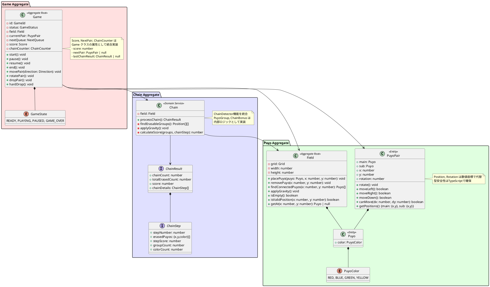

# ドメインモデル設計

## 概要

ドメイン駆動設計（DDD）の原則に基づき、ぷよぷよゲームのドメインモデルを設計します。ビジネスロジックを集約し、ドメインの知識を表現します。

## ドメインモデル全体図



## 集約（Aggregate）詳細

### 1. Game集約

**責任:**

- ゲーム全体の状態管理
- ゲームフローの制御
- プレイヤー操作の受付と実行

**主要メソッド:**

```typescript
export class Game {
  public state: GameState = GameState.READY
  public score: number = 0
  public field: Field
  public currentPair: PuyoPair | null = null
  public nextPair: PuyoPair | null = null
  public lastChainResult: ChainResult | null = null
  
  // ゲーム制御
  start(): void
  pause(): void
  resume(): void
  restart(): void
  
  // プレイヤー操作
  moveLeft(): boolean
  moveRight(): boolean
  moveDown(): boolean
  rotate(): boolean
  hardDrop(): void
  
  // 状態確認
  isPlaying(): boolean
  isGameOver(): boolean
  getCurrentPair(): PuyoPair | null
}
```

### 2. Puyo集約

**責任:**
- フィールドの状態管理
- ぷよの配置と削除
- 物理演算（重力）の適用

**主要メソッド:**

```typescript
export class Field {
  public readonly height = 16 // 隠しライン2行 + 表示フィールド14行
  public readonly width = 6
  public readonly visibleHeight = 14
  public readonly hiddenLines = 2
  
  // ぷよ操作
  setPuyo(x: number, y: number, puyo: Puyo): void
  clearPuyo(x: number, y: number): void
  
  // 状態確認
  getPuyo(x: number, y: number): Puyo | null
  isEmpty(): boolean
  isValidPosition(x: number, y: number): boolean
  canPlacePair(pair: PuyoPair): boolean
  
  // 連結検出
  findConnectedPuyos(x: number, y: number): [number, number][]
  
  // 物理演算
  applyGravity(): void
}
```

### 3. Chain集約

**責任:**

- 連鎖の検出
- 消去対象の特定
- ボーナス計算

**主要メソッド:**

```typescript
export class Chain {
  constructor(private field: Field) {}
  
  // 連鎖処理の実行
  processChain(): ChainResult
  
  // 内部メソッド
  private findErasableGroups(): [number, number][][]
  private eraseGroups(groups: [number, number][][]): void
  private calculateScore(groups: [number, number][][], chainStep: number): number
  private applyGravity(): void
}

export interface ChainResult {
  chainCount: number
  totalErasedCount: number
  score: number
  chainDetails: ChainStep[]
}

export interface ChainStep {
  stepNumber: number
  erasedPuyos: { x: number; y: number; color: string }[]
  stepScore: number
  groupCount: number
  colorCount: number
}
```

## ドメインサービスの実装方針

### Chain クラス内統合
連鎖検出とボーナス計算のロジックは、独立したドメインサービスではなく`Chain`クラス内に統合実装。

**統合の理由:**
- 小規模アプリケーションでは分離コストが利益を上回る
- 連鎖処理は単一責任で完結するロジック  
- テストとデバッグが簡素化

**実装例:**
```typescript
export class Chain {
  processChain(): ChainResult {
    const chainDetails: ChainStep[] = []
    let totalErasedCount = 0
    let totalScore = 0
    let chainCount = 0

    // 連鎖が続く限りループ処理
    while (true) {
      const erasableGroups = this.findErasableGroups()
      if (erasableGroups.length === 0) break
      
      chainCount++
      // スコア計算とぷよ消去処理
      const stepScore = this.calculateScore(erasableGroups, chainCount)
      this.eraseGroups(erasableGroups)
      this.applyGravity()
      
      // 詳細情報を記録
      chainDetails.push(/* ChainStep data */)
      totalScore += stepScore
      totalErasedCount += /* count */
    }

    return { chainCount, totalErasedCount, score: totalScore, chainDetails }
  }
}
```

## ドメインイベント（将来拡張）

**現在の実装状況:** 未実装

**将来的な導入検討事項:**
- 音響システムとの連携強化時
- アニメーション制御の詳細化時
- マルチプレイヤー対応時

**実装予定のイベント:**
```typescript
// 基本ゲームイベント
interface GameStarted { gameId: string }
interface GamePaused { gameId: string }
interface GameResumed { gameId: string }
interface GameOver { gameId: string, finalScore: number }

// 連鎖・スコアイベント  
interface ChainOccurred { gameId: string, chainCount: number, score: number }
interface PuyosErased { gameId: string, positions: [number, number][], colors: string[] }

// 特殊イベント
interface ZenkeshiAchieved { gameId: string, bonus: number }
```

**現在の代替実装:**
- ChainResult インターフェース経由での連鎖情報通知
- GameState enum による状態管理

## ユビキタス言語

| 用語 | 説明 |
|------|------|
| ぷよ (Puyo) | ゲームの基本単位となる色付きブロック |
| 組ぷよ (PuyoPair) | 2個1組で落下するぷよのペア |
| フィールド (Field) | ぷよを配置する6×13のグリッド |
| 連鎖 (Chain) | ぷよ消去後の落下により新たな消去が発生すること |
| 全消し (Zenkeshi) | フィールド上のすべてのぷよを消去すること |
| ネクスト (Next) | 次に落下するぷよの予告 |
| ゴースト (Ghost) | 落下予測位置の表示 |
| 壁蹴り (Wall Kick) | 回転時の位置調整 |
| ハードドロップ (Hard Drop) | 即座に着地させる操作 |

## エラー処理戦略

### 実装方針：例外レス設計

**現在の実装アプローチ:**
```typescript
// boolean戻り値による成功・失敗の通知
moveLeft(): boolean     // 移動成功時: true, 失敗時: false
moveRight(): boolean    // 移動成功時: true, 失敗時: false
rotate(): boolean       // 回転成功時: true, 失敗時: false
```

**エラー処理の実装:**
1. **不正な操作**: boolean false を返し、ゲーム状態を変更しない
2. **境界チェック**: isValidPosition() での事前検証
3. **状態確認**: isPlaying(), isGameOver() による操作可否判定
4. **防御的プログラミング**: null チェックと guard clause の活用

**利点:**
- ゲームアプリケーションに適したフロー制御
- 例外処理のオーバーヘッド回避
- より単純で理解しやすいAPI
- テストが書きやすい

**将来的な例外導入タイミング:**
- システムレベルエラー（ネットワーク、ストレージ）
- 非同期処理エラー（サウンド読み込みエラー等）

## パフォーマンス最適化

### 現在の実装最適化

**連結検出の最適化:**
```typescript
// DFS（深さ優先探索）による効率的な連結検出
findConnectedPuyos(x: number, y: number): [number, number][] {
  const visited = new Set<string>()  // 重複訪問防止
  const result: [number, number][] = []
  this.dfs(x, y, puyo.color, visited, result)
  return result
}
```

**メモリ効率化:**
- 固定サイズ配列による Grid 実装（16×6）
- 不要なオブジェクト生成の最小化
- null による未使用セルの効率的管理

**処理効率化:**
- 連鎖処理の一括実行（processChain）
- 重力適用の最適化（applyGravity）
- 座標計算の事前検証（isValidPosition）

### 将来的な最適化計画

**メモリプール導入（必要に応じて）:**
- Puyo オブジェクトの再利用
- PuyoPair の事前生成・プール管理

**アルゴリズム最適化（大規模化時）:**
- Union-Find による高速連結検出
- ビットマスクによる状態管理
- 差分更新による再計算削減

**並列処理（将来拡張）:**
- Web Worker による連鎖計算の非同期化
- アニメーションとロジックの分離実行

---

## 実装整合性サマリー

**本ドキュメント（2025-08-09更新）は実装ベースで修正済み**

### ✅ 完全実装済み
- 3集約構造（Game/Field/Chain）
- 主要ドメインロジック（移動、回転、連鎖、スコア計算）
- 345テストケースによる品質保証
- Clean Architectureとの整合性

### ⚠️ 実用性重視の簡素化
- 値オブジェクト → 型安全なプリミティブ
- ドメインサービス → クラス内統合
- エンティティ分割 → 実用的統合

### 🔄 将来的な拡張候補
- ドメインイベント（音響・アニメーション連携時）
- 詳細例外処理（システムエラー対応時）  
- パフォーマンス最適化（大規模化時）

**設計思想:** DDDの原則を保持しつつ、小規模ゲームアプリに最適化した実装