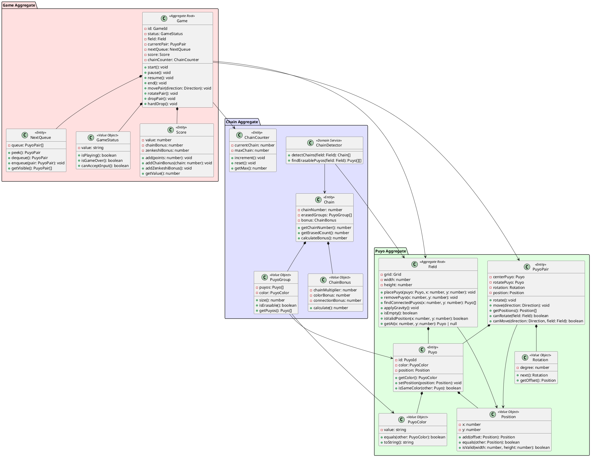
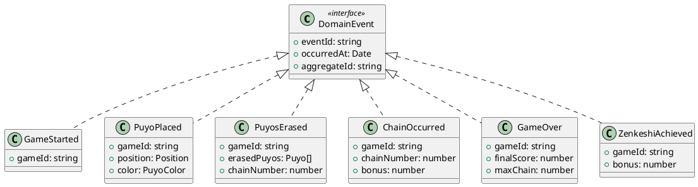

# ドメインモデル設計

## 概要

ドメイン駆動設計（DDD）の原則に基づき、ぷよぷよゲームのドメインモデルを設計します。ビジネスロジックを集約し、ドメインの知識を表現します。

## ドメインモデル全体図



## 集約（Aggregate）詳細

### 1. Game集約

**責任:**

- ゲーム全体の状態管理
- ゲームフローの制御
- プレイヤー操作の受付と実行

**主要メソッド:**

```typescript
interface Game {
  // ゲーム制御
  start(): void;
  pause(): void;
  resume(): void;
  end(): void;
  
  // プレイヤー操作
  movePair(direction: Direction): void;
  rotatePair(): void;
  dropPair(): void;
  hardDrop(): void;
  
  // 状態確認
  getStatus(): GameStatus;
  getScore(): number;
  canAcceptInput(): boolean;
}
```

### 2. Puyo集約

**責任:**
- フィールドの状態管理
- ぷよの配置と削除
- 物理演算（重力）の適用

**主要メソッド:**

```typescript
interface Field {
  // ぷよ操作
  placePuyo(puyo: Puyo, x: number, y: number): void;
  removePuyo(x: number, y: number): void;
  
  // 状態確認
  getAt(x: number, y: number): Puyo | null;
  isEmpty(): boolean;
  isValidPosition(x: number, y: number): boolean;
  
  // 連結検出
  findConnectedPuyos(x: number, y: number): Puyo[];
  
  // 物理演算
  applyGravity(): void;
}
```

### 3. Chain集約

**責任:**

- 連鎖の検出
- 消去対象の特定
- ボーナス計算

**主要メソッド:**

```typescript
interface ChainDetector {
  detectChains(field: Field): Chain[];
  findErasablePuyos(field: Field): Puyo[][];
}

interface Chain {
  getChainNumber(): number;
  getErasedCount(): number;
  calculateBonus(): number;
}
```

## ドメインサービス

### ChainDetector
フィールドの状態から連鎖を検出する責任を持つドメインサービス。複数の集約にまたがるロジックを実装。

```typescript
class ChainDetector {
  detectChains(field: Field): Chain[] {
    const chains: Chain[] = [];
    let chainNumber = 0;
    
    while (true) {
      const erasableGroups = this.findErasablePuyos(field);
      if (erasableGroups.length === 0) break;
      
      chainNumber++;
      const chain = new Chain(chainNumber, erasableGroups);
      chains.push(chain);
      
      // ぷよを消去
      erasableGroups.forEach(group => {
        group.forEach(puyo => field.removePuyo(puyo.x, puyo.y));
      });
      
      // 重力を適用
      field.applyGravity();
    }
    
    return chains;
  }
}
```

## ドメインイベント



## ユビキタス言語

| 用語 | 説明 |
|------|------|
| ぷよ (Puyo) | ゲームの基本単位となる色付きブロック |
| 組ぷよ (PuyoPair) | 2個1組で落下するぷよのペア |
| フィールド (Field) | ぷよを配置する6×13のグリッド |
| 連鎖 (Chain) | ぷよ消去後の落下により新たな消去が発生すること |
| 全消し (Zenkeshi) | フィールド上のすべてのぷよを消去すること |
| ネクスト (Next) | 次に落下するぷよの予告 |
| ゴースト (Ghost) | 落下予測位置の表示 |
| 壁蹴り (Wall Kick) | 回転時の位置調整 |
| ハードドロップ (Hard Drop) | 即座に着地させる操作 |

## エラー処理戦略

### ドメイン例外

```typescript
class DomainException extends Error {
  constructor(message: string) {
    super(message);
    this.name = this.constructor.name;
  }
}

class InvalidMoveException extends DomainException {}
class InvalidRotationException extends DomainException {}
class GameOverException extends DomainException {}
class InvalidPositionException extends DomainException {}
```

### エラー処理方針

1. **不正な操作**: 例外をスローせず、操作を無視
2. **ゲームオーバー**: GameOverExceptionをスロー
3. **システムエラー**: 上位層でキャッチして適切に処理
4. **状態不整合**: ログ記録して安全な状態にロールバック

## パフォーマンス最適化

### 連結検出の最適化
- Union-Findアルゴリズムを使用した効率的な連結検出
- メモ化による重複計算の削減

### イベント処理の最適化
- イベントのバッチ処理
- 非同期イベント処理によるUI応答性の向上

### メモリ使用の最適化
- 不要になったぷよオブジェクトの即座の削除
- オブジェクトプールパターンによる頻繁な生成・破棄の回避