# ドメインモデル設計

## 概要

ぷよぷよゲームのドメインモデル設計について説明します。ドメイン駆動設計（DDD）の戦術的設計パターンを適用し、ビジネスロジックを適切にモデル化します。

## ドメイン分析

### ユビキタス言語

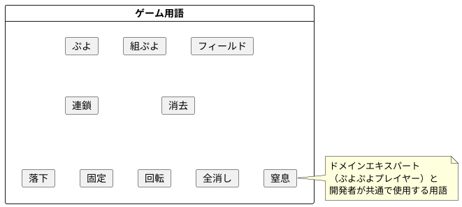

**主要用語定義:**

- **ぷよ:** 色付きのゲーム要素
- **組ぷよ:** 2つのぷよがセットになった操作対象
- **フィールド:** ぷよが配置される6×12のグリッド空間
- **連鎖:** ぷよ消去により新たな消去条件が成立すること
- **消去:** 同色のぷよが4つ以上隣接した際の除去処理
- **全消し:** フィールドのすべてのぷよが消去されること
- **落下:** 重力によるぷよの下方移動
- **固定:** 落下中のぷよがフィールドに配置されること
- **回転:** 組ぷよの相対位置変更
- **窒息:** 新しいぷよが配置できない状態
- **壁蹴り:** 回転時の位置調整

## 境界づけられたコンテキスト

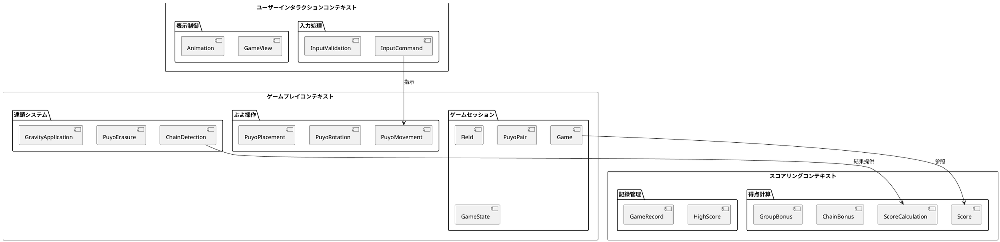

## 集約設計

### Game集約

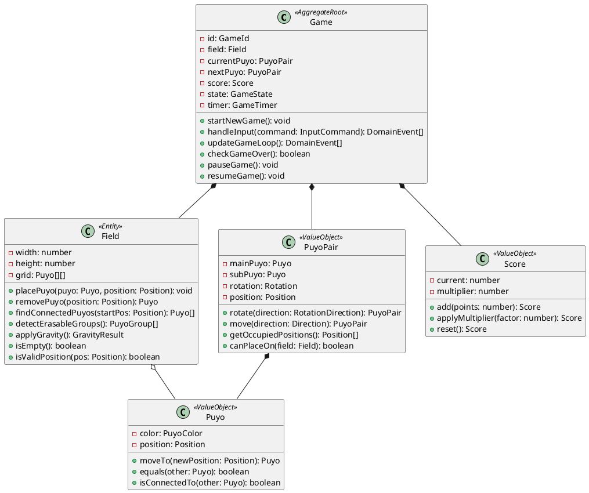

### Chain集約

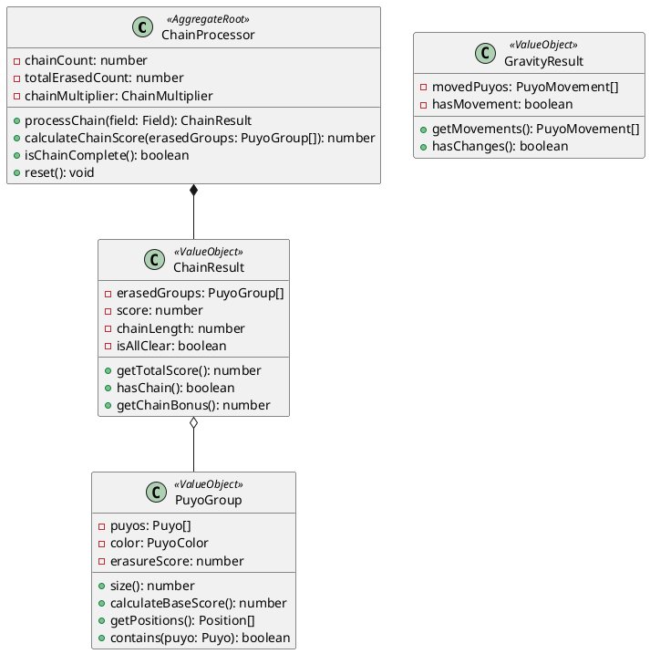

## ドメインサービス

### ChainDetectionService

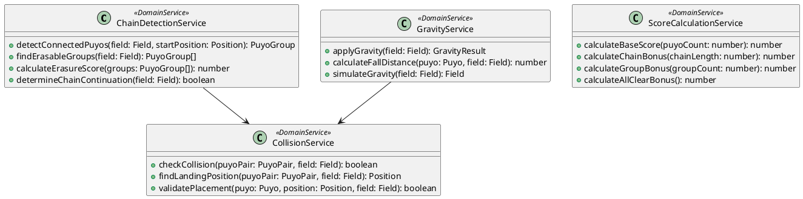

## ドメインイベント

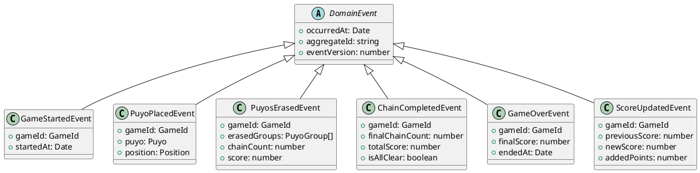

## 仕様パターン

### ゲームルール仕様

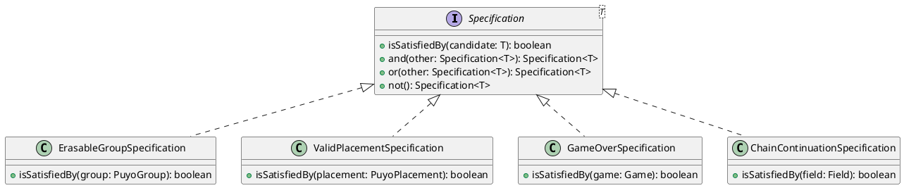

**具体的な仕様実装:**

```typescript
class ErasableGroupSpecification implements Specification<PuyoGroup> {
  isSatisfiedBy(group: PuyoGroup): boolean {
    return group.size() >= 4 && 
           group.puyos.every(p => p.color === group.color);
  }
}

class ValidPlacementSpecification implements Specification<PuyoPlacement> {
  constructor(private field: Field) {}
  
  isSatisfiedBy(placement: PuyoPlacement): boolean {
    return this.field.isValidPosition(placement.position) &&
           !this.field.isOccupied(placement.position) &&
           this.hasSupport(placement);
  }
  
  private hasSupport(placement: PuyoPlacement): boolean {
    // 重力サポートの確認ロジック
  }
}
```

## ファクトリーパターン

### ゲーム要素の生成

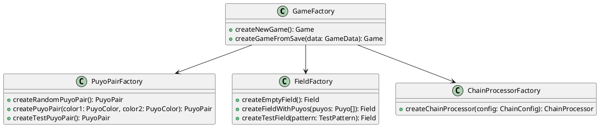

## リポジトリパターン

### ドメインオブジェクトの永続化

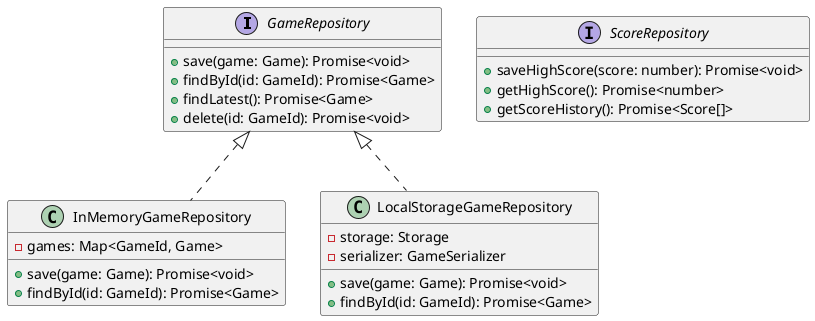

## ドメインルールの実装

### 不変条件 (Invariants)

```typescript
class Game {
  private constructor(
    private readonly id: GameId,
    private field: Field,
    private currentPuyo: PuyoPair,
    private nextPuyo: PuyoPair,
    private score: Score,
    private state: GameState
  ) {
    this.ensureInvariants();
  }
  
  private ensureInvariants(): void {
    if (!this.field) {
      throw new DomainError('Game must have a field');
    }
    
    if (this.state === GameState.PLAYING && !this.currentPuyo) {
      throw new DomainError('Playing game must have current puyo');
    }
    
    if (this.score.current < 0) {
      throw new DomainError('Score cannot be negative');
    }
  }
  
  handleInput(command: InputCommand): DomainEvent[] {
    this.ensureGameIsPlaying();
    
    const events: DomainEvent[] = [];
    
    switch (command.type) {
      case InputType.MOVE_LEFT:
        if (this.canMoveLeft()) {
          this.currentPuyo = this.currentPuyo.move(Direction.LEFT);
          events.push(new PuyoMovedEvent(this.id, this.currentPuyo));
        }
        break;
        
      case InputType.ROTATE:
        if (this.canRotate()) {
          this.currentPuyo = this.currentPuyo.rotate(RotationDirection.CLOCKWISE);
          events.push(new PuyoRotatedEvent(this.id, this.currentPuyo));
        }
        break;
        
      case InputType.DROP:
        events.push(...this.dropCurrentPuyo());
        break;
    }
    
    this.ensureInvariants();
    return events;
  }
}
```

### ビジネスロジックの実装

```typescript
class ChainProcessor {
  processChain(field: Field): ChainResult {
    const erasedGroups: PuyoGroup[] = [];
    let chainCount = 0;
    let totalScore = 0;
    
    while (true) {
      // 消去対象のグループを検索
      const currentErasableGroups = this.chainDetectionService
        .findErasableGroups(field);
        
      if (currentErasableGroups.length === 0) {
        break; // 連鎖終了
      }
      
      chainCount++;
      
      // ぷよを消去
      for (const group of currentErasableGroups) {
        this.eraseGroup(field, group);
        erasedGroups.push(group);
      }
      
      // スコア計算
      const chainScore = this.scoreCalculationService
        .calculateChainScore(currentErasableGroups, chainCount);
      totalScore += chainScore;
      
      // 重力適用
      const gravityResult = this.gravityService.applyGravity(field);
      if (!gravityResult.hasMovement) {
        break; // これ以上の落下なし
      }
    }
    
    const isAllClear = field.isEmpty();
    if (isAllClear) {
      totalScore += this.scoreCalculationService.calculateAllClearBonus();
    }
    
    return new ChainResult(erasedGroups, totalScore, chainCount, isAllClear);
  }
}
```

## エラーハンドリング

### ドメイン例外

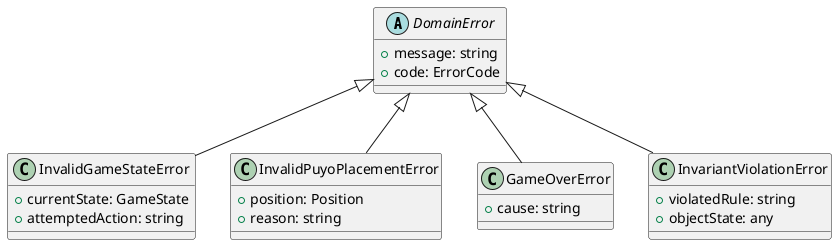

## テスト戦略

### ドメインモデルのテスト

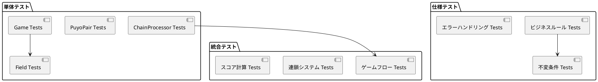

### テストデータビルダー

```typescript
class GameTestDataBuilder {
  private game: Game;
  
  constructor() {
    this.game = GameFactory.createNewGame();
  }
  
  withField(field: Field): GameTestDataBuilder {
    this.game = new Game(
      this.game.id,
      field,
      this.game.currentPuyo,
      this.game.nextPuyo,
      this.game.score,
      this.game.state
    );
    return this;
  }
  
  withScore(score: number): GameTestDataBuilder {
    this.game = new Game(
      this.game.id,
      this.game.field,
      this.game.currentPuyo,
      this.game.nextPuyo,
      new Score(score, this.game.score.high),
      this.game.state
    );
    return this;
  }
  
  build(): Game {
    return this.game;
  }
}
```

## まとめ

このドメインモデル設計により以下を実現：

1. **表現力:** ビジネスロジックが自然な言語で表現
2. **整合性:** 不変条件によるデータ整合性保証
3. **拡張性:** 新しいゲームルールの追加が容易
4. **テスタビリティ:** ドメインロジックの独立したテスト
5. **保守性:** 複雑なビジネスルールの明確な構造化
6. **再利用性:** ドメインサービスによる共通ロジックの抽出