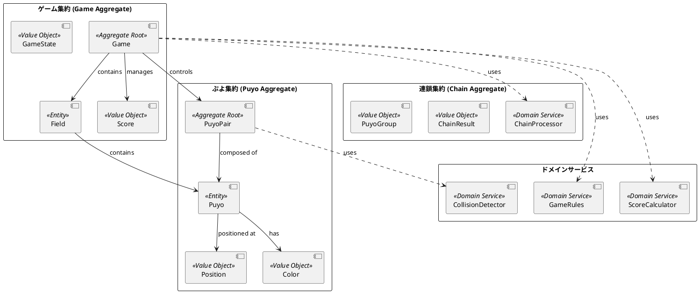
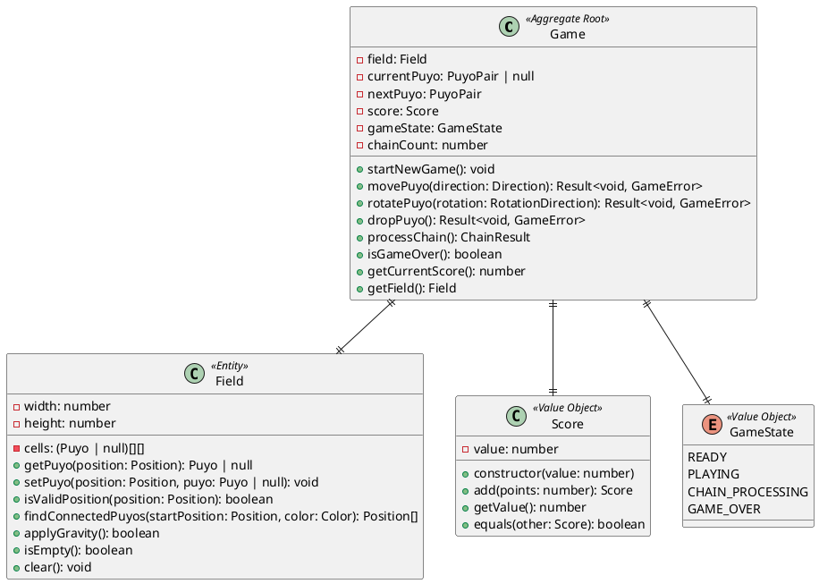
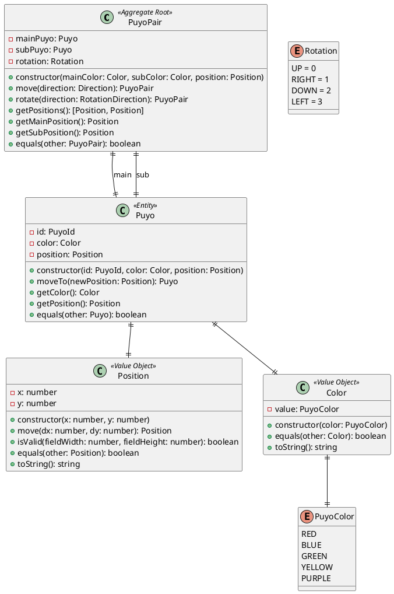
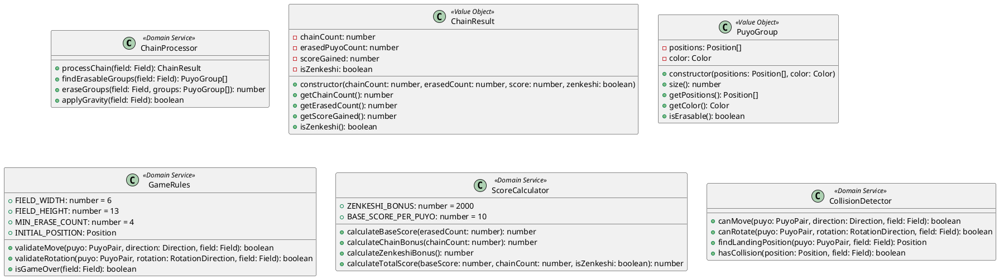
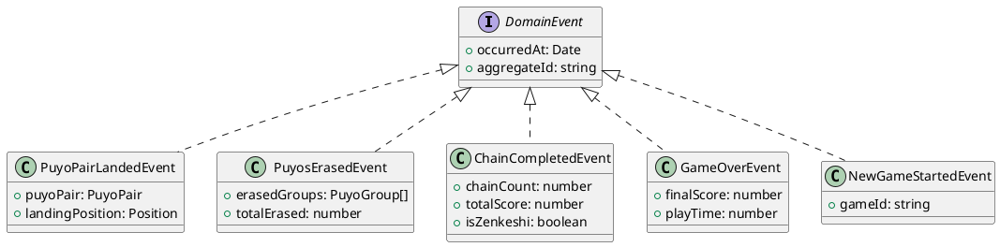

# ドメインモデル設計

## 概要

ぷよぷよゲームのドメインモデルは、ゲームの核となるビジネスルールと概念を表現します。ドメイン駆動設計（DDD）のアプローチを採用し、ドメインエキスパートとの会話で使われる言葉（ユビキタス言語）をコードに反映させます。

## ドメイン概念図



## 集約設計

### Game集約

ゲーム全体の状態と整合性を管理する集約ルート



### Puyo集約

ぷよの操作と状態を管理する集約



### Chain集約とドメインサービス

連鎖処理と関連するドメインサービス



## ドメインイベント

ゲーム内で発生する重要なイベントを表現



## ドメインサービスの詳細

### 1. GameRules - ゲームルール管理

```typescript
class GameRules {
  static readonly FIELD_WIDTH = 6;
  static readonly FIELD_HEIGHT = 13;
  static readonly MIN_ERASE_COUNT = 4;
  static readonly INITIAL_POSITION = new Position(2, 1);

  validateMove(puyo: PuyoPair, direction: Direction, field: Field): boolean {
    const newPuyo = puyo.move(direction);
    return this.isValidPlacement(newPuyo, field);
  }

  validateRotation(puyo: PuyoPair, rotation: RotationDirection, field: Field): boolean {
    const rotatedPuyo = puyo.rotate(rotation);
    return this.isValidPlacement(rotatedPuyo, field) || this.canWallKick(rotatedPuyo, field);
  }

  isGameOver(field: Field): boolean {
    const initialPosition = GameRules.INITIAL_POSITION;
    return !field.isEmpty(initialPosition);
  }

  private isValidPlacement(puyo: PuyoPair, field: Field): boolean {
    const [mainPos, subPos] = puyo.getPositions();
    return field.isValidPosition(mainPos) && 
           field.isValidPosition(subPos) &&
           field.isEmpty(mainPos) && 
           field.isEmpty(subPos);
  }

  private canWallKick(puyo: PuyoPair, field: Field): boolean {
    // 壁キック処理の実装
    const kickOffsets = [new Position(-1, 0), new Position(1, 0)];
    return kickOffsets.some(offset => {
      const kickedPuyo = puyo.move(Direction.fromPosition(offset));
      return this.isValidPlacement(kickedPuyo, field);
    });
  }
}
```

### 2. ChainProcessor - 連鎖処理

```typescript
class ChainProcessor {
  processChain(field: Field): ChainResult {
    let chainCount = 0;
    let totalErased = 0;
    let totalScore = 0;
    
    while (true) {
      const erasableGroups = this.findErasableGroups(field);
      if (erasableGroups.length === 0) break;
      
      chainCount++;
      const erasedCount = this.eraseGroups(field, erasableGroups);
      totalErased += erasedCount;
      
      this.applyGravity(field);
    }
    
    if (chainCount > 0) {
      const baseScore = ScoreCalculator.calculateBaseScore(totalErased);
      const chainBonus = ScoreCalculator.calculateChainBonus(chainCount);
      totalScore = baseScore * chainBonus;
      
      if (field.isEmpty()) {
        totalScore += ScoreCalculator.calculateZenkeshiBonus();
      }
    }
    
    return new ChainResult(chainCount, totalErased, totalScore, field.isEmpty());
  }

  findErasableGroups(field: Field): PuyoGroup[] {
    const visited = new Set<string>();
    const groups: PuyoGroup[] = [];
    
    for (let x = 0; x < GameRules.FIELD_WIDTH; x++) {
      for (let y = 0; y < GameRules.FIELD_HEIGHT; y++) {
        const position = new Position(x, y);
        const posKey = position.toString();
        
        if (visited.has(posKey)) continue;
        
        const puyo = field.getPuyo(position);
        if (!puyo) continue;
        
        const connectedPositions = field.findConnectedPuyos(position, puyo.getColor());
        
        if (connectedPositions.length >= GameRules.MIN_ERASE_COUNT) {
          groups.push(new PuyoGroup(connectedPositions, puyo.getColor()));
        }
        
        connectedPositions.forEach(pos => visited.add(pos.toString()));
      }
    }
    
    return groups;
  }
}
```

## ビジネスルールの実装

### 1. 不変条件（Invariants）

```typescript
// Game集約の不変条件
class Game {
  private ensureInvariants(): void {
    if (this.score.getValue() < 0) {
      throw new Error("スコアは負の値にできません");
    }
    
    if (this.chainCount < 0) {
      throw new Error("連鎖数は負の値にできません");
    }
    
    if (this.currentPuyo && !this.isValidPuyoPosition(this.currentPuyo)) {
      throw new Error("ぷよペアは有効な位置に配置される必要があります");
    }
  }
}
```

### 2. ドメイン制約

```typescript
// Position値オブジェクトの制約
class Position {
  constructor(private readonly x: number, private readonly y: number) {
    if (x < 0 || y < 0) {
      throw new Error("座標は0以上である必要があります");
    }
    
    if (!Number.isInteger(x) || !Number.isInteger(y)) {
      throw new Error("座標は整数である必要があります");
    }
  }
}

// Color値オブジェクトの制約
class Color {
  constructor(private readonly value: PuyoColor) {
    if (!Object.values(PuyoColor).includes(value)) {
      throw new Error("有効なぷよの色である必要があります");
    }
  }
}
```

## ユビキタス言語

ドメインエキスパート（ぷよぷよプレイヤー）との会話で使われる用語をコードに反映：

- **ぷよ**: 基本的なゲーム要素
- **ぷよペア**: 2個1組で落下するぷよの単位
- **フィールド**: ぷよが配置される6×13のゲーム盤
- **連鎖**: ぷよが消えることで新たな消去が発生する現象
- **全消し（ぜんけし）**: フィールド上のすべてのぷよが消えること
- **壁キック**: 壁際での回転を可能にする特殊処理
- **着地**: ぷよペアが下に移動できなくなること

## エラー処理

ドメイン固有のエラーを定義

```typescript
abstract class GameError extends Error {
  abstract readonly code: string;
}

class InvalidMoveError extends GameError {
  readonly code = 'INVALID_MOVE';
  constructor(message: string) {
    super(`不正な移動: ${message}`);
  }
}

class InvalidRotationError extends GameError {
  readonly code = 'INVALID_ROTATION';
  constructor(message: string) {
    super(`不正な回転: ${message}`);
  }
}

class GameOverError extends GameError {
  readonly code = 'GAME_OVER';
  constructor() {
    super('ゲームオーバーです');
  }
}
```

## ドメインモデルのテスト戦略

### 1. 単体テスト
- 各値オブジェクトの不変条件
- エンティティのビジネスロジック
- ドメインサービスの計算ロジック

### 2. 統合テスト
- 集約間の協調動作
- ドメインサービスの相互作用
- ビジネスシナリオのテスト

### 3. 仕様テスト
- ユビキタス言語による仕様記述
- Given-When-Then形式のシナリオテスト
- ドメインエキスパートとの合意確認

このドメインモデル設計により、ぷよぷよゲームの複雑なビジネスルールを明確に表現し、保守性と拡張性の高いコードベースを実現します。