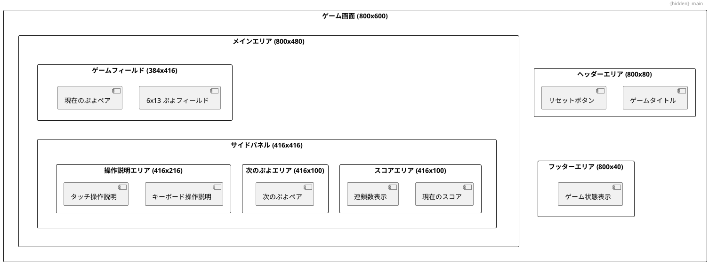
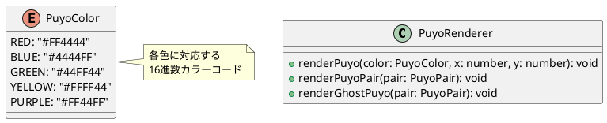
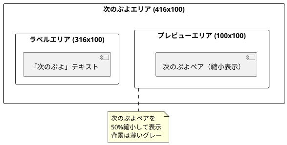
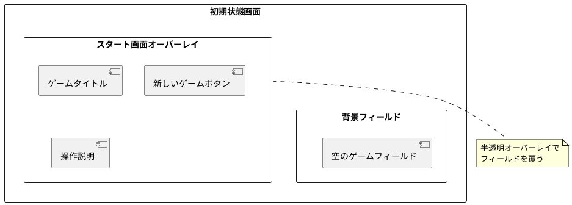
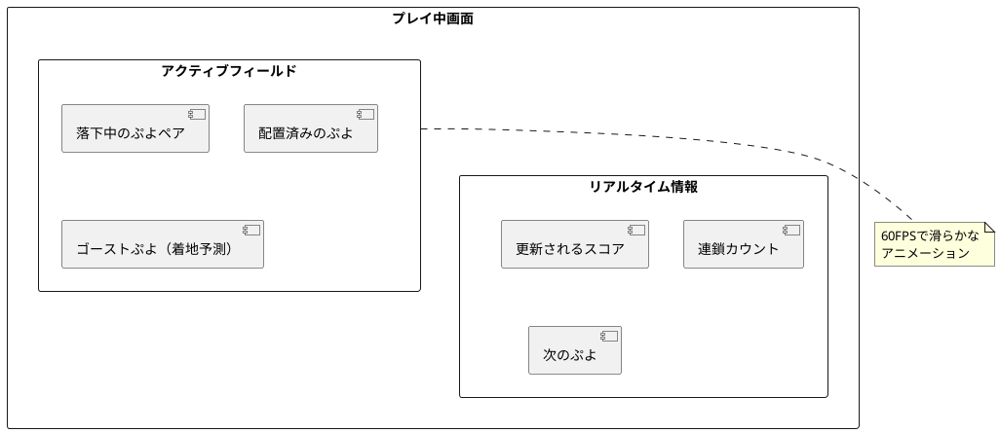
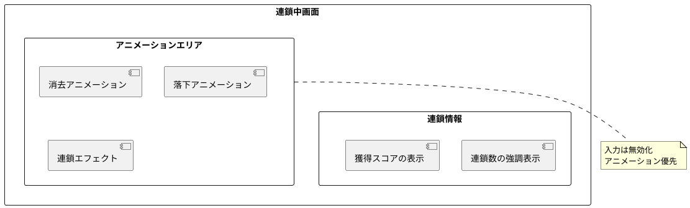
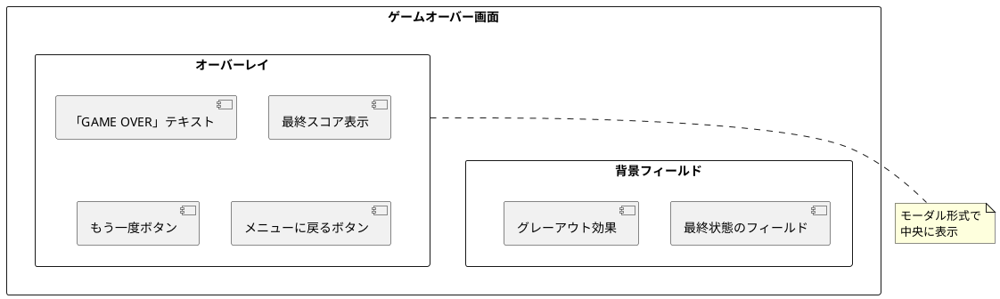

# ユーザーインターフェース設計

## 概要

ぷよぷよゲームのユーザーインターフェースは、プレイヤーが直感的に操作でき、ゲームの状態を明確に把握できる設計とします。レスポンシブデザインを採用し、デスクトップとモバイルの両方で快適にプレイできるUIを提供します。

## UI全体レイアウト



## 詳細UI設計

### 1. ゲームフィールド

ぷよが配置される6×13のメインゲームエリア

```plantuml
@startuml "ゲームフィールドUI"

rectangle "ゲームフィールド (384x416)" {
  rectangle "表示エリア (6x12)" as visible {
    note top : 実際に表示される部分
  }
  
  rectangle "非表示エリア (6x1)" as hidden {
    note top : ゲームオーバー判定用
  }
  
  rectangle "フィールドボーダー" as border {
    note right : 境界線とグリッド
  }
}

note bottom of visible
各セル: 32x32ピクセル
総サイズ: 192x384ピクセル
中央配置で余白92ピクセル
end note

@enduml
```

**設計仕様**:
- セルサイズ: 32×32ピクセル
- フィールドサイズ: 192×384ピクセル（6×12表示）
- 境界線: 2ピクセル幅、ダークグレー
- 背景色: 薄いグレー（#F5F5F5）
- グリッド線: 1ピクセル幅、薄いグレー（#E0E0E0）

### 2. ぷよ表示

個々のぷよの視覚的表現



**ぷよの描画仕様**:
- 形状: 円形（半径14ピクセル）
- 外枠: 2ピクセル幅、濃い色
- グラデーション: 上部に光沢効果
- 影効果: 下部に薄い影

### 3. スコア表示エリア

```html
<!-- スコア表示エリアのHTML構造例 -->
<div class="score-area">
  <div class="score-display">
    <h3>スコア</h3>
    <div class="score-value" id="current-score">0</div>
  </div>
  
  <div class="chain-display">
    <h3>連鎖</h3>
    <div class="chain-value" id="chain-count">0</div>
  </div>
  
  <div class="best-score-display">
    <h3>ベストスコア</h3>
    <div class="best-score-value" id="best-score">0</div>
  </div>
</div>
```

**スタイル仕様**:
- フォント: システムフォント、モノスペース
- スコア文字サイズ: 24px
- 連鎖数文字サイズ: 20px
- 色: ダークブルー（#333366）

### 4. 次のぷよ表示



### 5. コントロールボタン

```html
<!-- コントロールボタンのHTML構造例 -->
<div class="control-buttons">
  <button id="new-game-btn" class="primary-button">
    新しいゲーム
  </button>
  
  <button id="reset-btn" class="secondary-button">
    リセット
  </button>
  
  <button id="pause-btn" class="secondary-button">
    一時停止
  </button>
</div>
```

**ボタンスタイル**:
- プライマリボタン: 青背景、白文字
- セカンダリボタン: グレー背景、黒文字
- ホバー効果: 10%暗く
- サイズ: 120×40ピクセル

### 6. 操作説明パネル

```html
<!-- 操作説明パネルのHTML構造例 -->
<div class="control-guide">
  <h4>キーボード操作</h4>
  <div class="control-item">
    <span class="key">←→</span>
    <span class="action">左右移動</span>
  </div>
  <div class="control-item">
    <span class="key">↓</span>
    <span class="action">高速落下</span>
  </div>
  <div class="control-item">
    <span class="key">↑</span>
    <span class="action">回転</span>
  </div>
  <div class="control-item">
    <span class="key">R</span>
    <span class="action">リセット</span>
  </div>
  
  <h4>タッチ操作</h4>
  <div class="control-item">
    <span class="gesture">スワイプ</span>
    <span class="action">移動</span>
  </div>
  <div class="control-item">
    <span class="gesture">タップ</span>
    <span class="action">回転</span>
  </div>
</div>
```

## ゲーム状態別UI

### 1. 初期状態（ゲーム開始前）



### 2. プレイ中状態



### 3. 連鎖中状態



### 4. ゲームオーバー状態



## レスポンシブデザイン

### デスクトップ表示（幅 >= 768px）

```css
/* デスクトップレイアウト */
.game-container {
  display: grid;
  grid-template-columns: 1fr 384px 1fr;
  grid-template-rows: 80px 1fr 40px;
  max-width: 1200px;
  margin: 0 auto;
}

.game-field {
  grid-column: 2;
  grid-row: 2;
}

.side-panel {
  grid-column: 3;
  grid-row: 2;
  padding-left: 20px;
}
```

### モバイル表示（幅 < 768px）

```css
/* モバイルレイアウト */
@media (max-width: 767px) {
  .game-container {
    display: flex;
    flex-direction: column;
    padding: 10px;
  }
  
  .game-field {
    order: 1;
    margin: 0 auto;
  }
  
  .side-panel {
    order: 2;
    margin-top: 20px;
  }
  
  .control-guide {
    display: none; /* モバイルでは非表示 */
  }
}
```

## タッチ操作UI

### タッチエリア設計

```plantuml
@startuml "タッチエリア設計"

rectangle "モバイル画面" {
  rectangle "ゲームフィールド" as field {
    note right : タップで回転
  }
  
  rectangle "左スワイプエリア" as left {
    note left : 左移動
  }
  
  rectangle "右スワイプエリア" as right {
    note right : 右移動
  }
  
  rectangle "下スワイプエリア" as down {
    note bottom : 高速落下
  }
}

@enduml
```

### ジェスチャー認識

```typescript
// タッチジェスチャーの設定例
interface TouchGesture {
  type: 'tap' | 'swipe';
  direction?: 'left' | 'right' | 'up' | 'down';
  minDistance?: number;
  maxTime?: number;
}

const touchConfig = {
  tap: { maxTime: 200, maxDistance: 10 },
  swipe: { minDistance: 30, maxTime: 500 }
};
```

## アクセシビリティ対応

### キーボードナビゲーション

- Tab順序の設定
- フォーカス表示の強化
- スクリーンリーダー対応

### 色覚サポート

```typescript
// 色覚バリアフリー対応の色設定
const ColorBlindFriendlyPalette = {
  RED: '#E74C3C',      // 明確な赤
  BLUE: '#3498DB',     // 明確な青  
  GREEN: '#2ECC71',    // 明確な緑
  YELLOW: '#F1C40F',   // 明確な黄
  PURPLE: '#9B59B6'    // 明確な紫
};
```

### フォントサイズ調整

```css
/* フォントサイズの設定 */
.large-text {
  font-size: 1.2em;
}

.score-value {
  font-size: clamp(18px, 3vw, 24px);
}
```

## パフォーマンス最適化

### 描画最適化

- Canvas要素の部分更新
- レイヤー分離による効率化
- アニメーションのフレームレート制御

### メモリ使用量削減

- 画像の事前読み込み
- オブジェクトプールの活用
- 不要なDOM要素の削除

このUI設計により、プレイヤーが快適にぷよぷよゲームを楽しめる、直感的で応答性の高いインターフェースを提供します。