# ユーザーインターフェース設計

## 概要

ぷよぷよゲームのユーザーインターフェース設計について説明します。レスポンシブデザイン、アクセシビリティ、ユーザビリティを考慮した設計を行います。

## 全体レイアウト設計

### デスクトップ版レイアウト

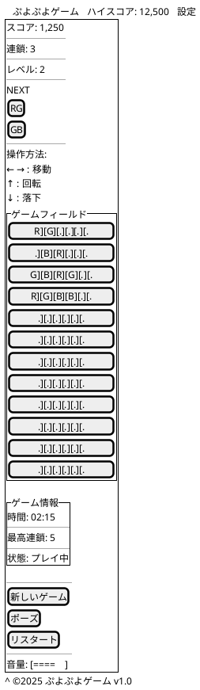

### モバイル版レイアウト（縦持ち）

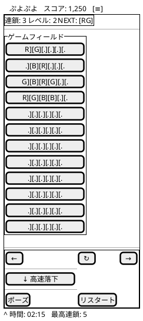

### モバイル版レイアウト（横持ち）

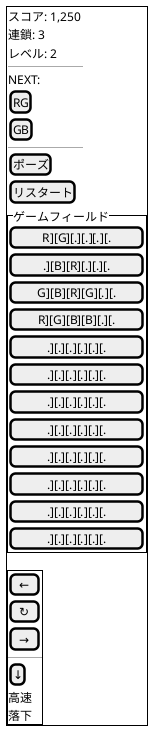

## 画面状態別UI設計

### ゲーム開始画面

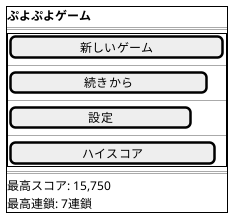

### ゲームプレイ画面（詳細）

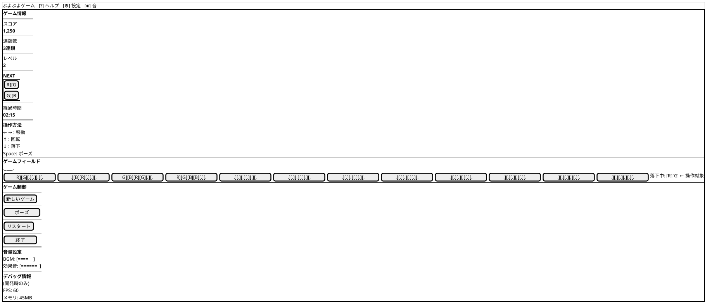

### ポーズ画面

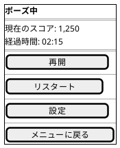

### ゲームオーバー画面

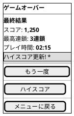

### 設定画面

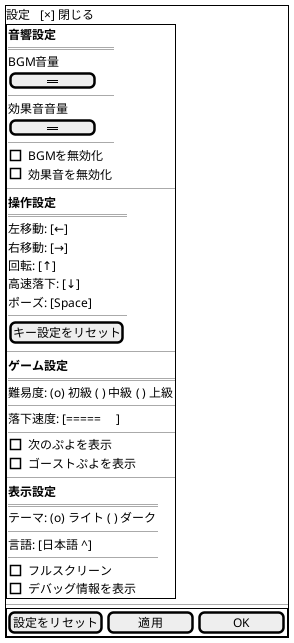

## レスポンシブデザイン仕様

### ブレークポイント設計

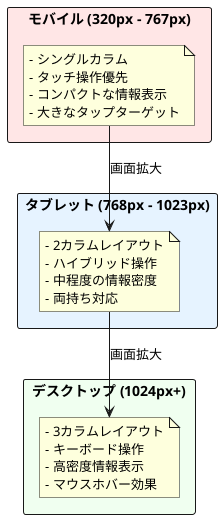

### レスポンシブ変更点

| 要素 | モバイル | タブレット | デスクトップ |
|------|----------|------------|--------------|
| フィールドサイズ | 280×560px | 320×640px | 360×720px |
| ぷよサイズ | 40×40px | 45×45px | 50×50px |
| サイドパネル | 下部配置 | 右側配置 | 右側配置 |
| タッチボタン | 大きめ(60px) | 中程度(50px) | 非表示 |
| フォントサイズ | 14px | 16px | 18px |

## アクセシビリティ設計

### WCAG 2.1 対応

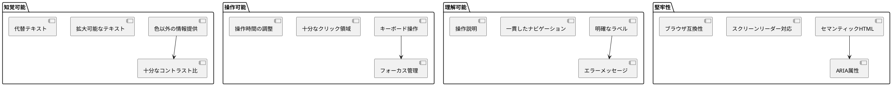

### カラーユニバーサルデザイン

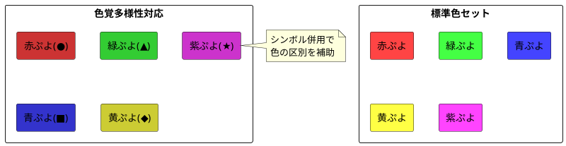

### キーボードナビゲーション

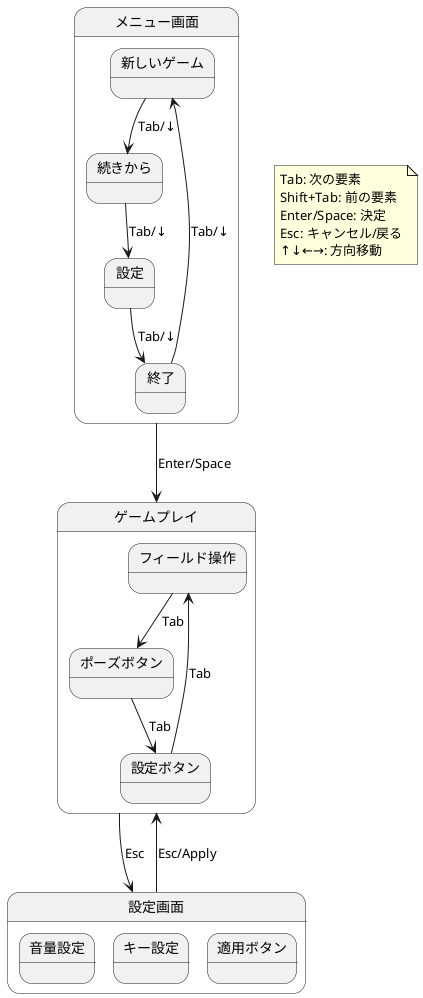

## ユーザーエクスペリエンス設計

### ゲームフロー

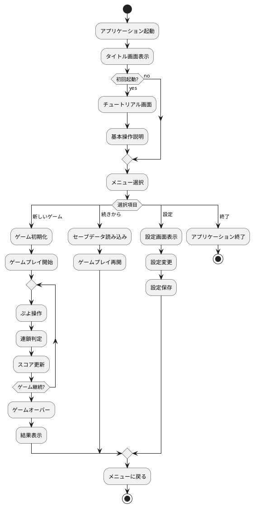

### フィードバック設計

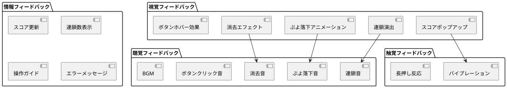

## アニメーション設計

### 基本アニメーション

```plantuml
@startuml "アニメーションタイムライン"
concurrency
  (start) --> [ぷよ生成] (generate)
  (generate) --> [落下開始] (fall_start)
  (fall_start) --> [落下中] (falling)
  (falling) --> [着地] (land)
  (land) --> [固定] (fixed)
and
  (fixed) --> [消去判定] (check_erase)
  (check_erase) --> [消去アニメーション] (erase_anim)
  (erase_anim) --> [重力適用] (gravity)
  (gravity) --> [連鎖チェック] (chain_check)
end
@enduml
```

### パフォーマンス考慮

| アニメーション | 継続時間 | FPS目標 | 最適化手法 |
|---------------|----------|---------|------------|
| ぷよ落下 | 500ms | 60fps | RequestAnimationFrame |
| 消去エフェクト | 300ms | 30fps | CSS Transform |
| 連鎖演出 | 800ms | 60fps | Canvas最適化 |
| UI遷移 | 200ms | 60fps | GPU加速 |

## エラー状態とメッセージ

### エラーハンドリング画面

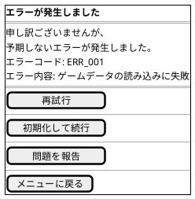

### 接続エラー画面

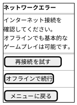

## 国際化対応

### 多言語対応設計

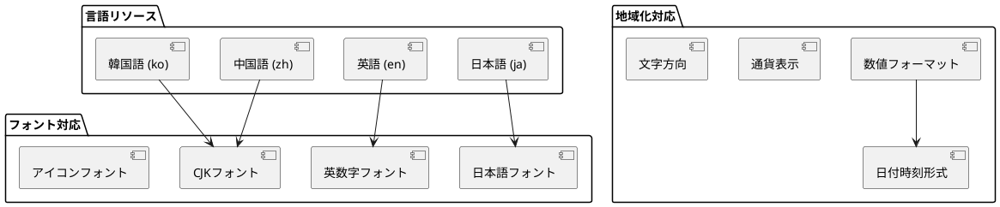

## まとめ

このユーザーインターフェース設計により以下を実現：

1. **使いやすさ:** 直感的で一貫性のあるUI
2. **アクセシビリティ:** WCAG 2.1準拠のバリアフリー対応
3. **レスポンシブ:** すべてのデバイスサイズに対応
4. **パフォーマンス:** 60FPS以上のスムーズな体験
5. **国際化:** 多言語・多地域対応
6. **拡張性:** 新機能追加時のUI拡張が容易