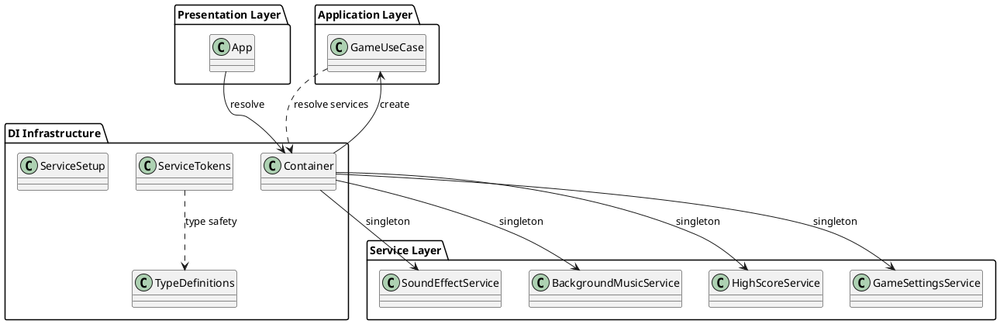

# 依存性注入（DI）設計

## 概要

ぷよぷよゲームでは、Clean Architectureの原則に従い、依存関係逆転の原則（DIP）を実現するため、カスタム依存性注入（DI）システムを実装しています。

## アーキテクチャ



## 主要コンポーネント

### 1. Container クラス

**ファイル**: `src/infrastructure/di/Container.ts`

DIコンテナの核となるクラスで、サービスの登録と解決を管理します。

**機能:**
- サービス登録（通常・シングルトン・ファクトリ）
- 型安全なサービス解決
- サービス存在確認
- コンテナクリア

**実装詳細:**
```typescript
export class Container {
  private services: Map<string | symbol, unknown> = new Map()
  private factories: Map<string | symbol, () => unknown> = new Map()
  private singletons: Map<string | symbol, unknown> = new Map()

  // シングルトン → ファクトリ → 通常サービスの優先順位で解決
  resolve<T>(token: symbol): T
  
  registerSingleton<T>(token: string | symbol, instance: T): void
  registerFactory<T>(token: string | symbol, factory: () => T): void  
  register<T>(token: string | symbol, instance: T): void
}
```

### 2. サービストークン

**ファイル**: `src/infrastructure/di/tokens.ts`

型安全な依存解決のためのSymbolベーストークンを定義します。

```typescript
// Symbol.forを使用してグローバル一意性を確保
export const GAME_USE_CASE = Symbol.for('GameUseCase')
export const SOUND_EFFECT_SERVICE = Symbol.for('SoundEffectService')
export const BACKGROUND_MUSIC_SERVICE = Symbol.for('BackgroundMusicService')
export const HIGH_SCORE_SERVICE = Symbol.for('HighScoreService')
export const GAME_SETTINGS_SERVICE = Symbol.for('GameSettingsService')
```

### 3. 型定義

**ファイル**: `src/infrastructure/di/types.ts`

DIで管理するサービスのインターフェース定義を提供します。

```typescript
export interface SoundEffectService {
  play(soundType: string): void
}

export interface BackgroundMusicService {
  play(musicType: string): void
  fadeOut(duration: number): Promise<void>
  stop(): void
}

export interface HighScoreService {
  getHighScores(): Array<{ score: number; date: string; rank: number }>
  isHighScore(score: number): boolean
  addScore(score: number): Array<{ score: number; date: string; rank: number }>
}

export interface GameSettingsService {
  getSetting(key: 'autoDropSpeed'): number
  getSetting(key: 'showShadow'): boolean
  getSetting(key: string): unknown
}
```

### 4. サービスセットアップ

**ファイル**: `src/infrastructure/di/setup.ts`

DIコンテナへのサービス登録を管理します。

```typescript
export function setupContainer(): void {
  // アプリケーション層のサービス（ファクトリパターン）
  container.registerFactory(GAME_USE_CASE, () => new GameUseCase())

  // サービス層のサービス（シングルトンパターン）
  container.registerSingleton(SOUND_EFFECT_SERVICE, soundEffect)
  container.registerSingleton(BACKGROUND_MUSIC_SERVICE, backgroundMusic)
  container.registerSingleton(HIGH_SCORE_SERVICE, highScoreService)
  container.registerSingleton(GAME_SETTINGS_SERVICE, gameSettingsService)
}
```

## 使用方法

### 1. アプリケーション初期化

```typescript
import { initializeApplication } from './infrastructure/di'

function App() {
  // DIコンテナの初期化（アプリケーション起動時に1回実行）
  useState(() => {
    initializeApplication()
    return null
  })
  
  // サービス解決
  const [gameUseCase] = useState(() => 
    container.resolve<GameUseCase>(GAME_USE_CASE)
  )
}
```

### 2. サービス解決

```typescript
// 型安全なサービス解決
const soundEffectService = container.resolve<SoundEffectService>(SOUND_EFFECT_SERVICE)
const backgroundMusicService = container.resolve<BackgroundMusicService>(BACKGROUND_MUSIC_SERVICE)
const highScoreService = container.resolve<HighScoreService>(HIGH_SCORE_SERVICE)
const gameSettingsService = container.resolve<GameSettingsService>(GAME_SETTINGS_SERVICE)
```

## 設計パターン

### 1. サービスロケーターパターン

DIコンテナはサービスロケーターとして機能し、必要なサービスをクライアントに提供します。

### 2. シングルトンパターン

音響サービス、設定サービスなど、アプリケーション全体で単一のインスタンスを共有するサービスに適用。

### 3. ファクトリパターン  

GameUseCaseなど、使用時に新しいインスタンスが必要なサービスに適用。

## 型安全性

### 1. Symbolベーストークン

文字列ベースのトークンではなくSymbolを使用することで、タイプミスや名前衝突を防止。

### 2. TypeScript Generics

サービス解決時にGenericsを使用し、コンパイル時の型チェックを実現。

### 3. インターフェース契約

各サービスを具象クラスではなくインターフェースで定義し、実装の詳細を隠蔽。

## テスト支援

### 1. モックサービス注入

テスト時は本物のサービスの代わりにモックサービスを注入可能：

```typescript
// テスト用のモックサービス登録
container.registerSingleton(SOUND_EFFECT_SERVICE, mockSoundEffectService)
```

### 2. 分離テスト

DIによりサービス間の依存関係が切り離されるため、各サービスを独立してテスト可能。

## 利点

1. **疎結合**: コンポーネント間の直接的な依存関係を排除
2. **テスタビリティ**: モックサービスの注入により単体テストが容易
3. **拡張性**: 新しいサービスの追加が既存コードに影響しない
4. **保守性**: インターフェースベースの設計により実装変更の影響を局所化
5. **型安全性**: TypeScriptの型システムと組み合わせたコンパイル時チェック

## 制約事項

1. **学習コスト**: DI概念の理解が必要
2. **初期設定**: コンテナとサービス登録の初期設定が必要
3. **実行時解決**: サービス解決は実行時に行われるため、設定ミスは実行時エラーとなる

## 今後の拡張可能性

1. **自動サービス発見**: アノテーションベースの自動サービス登録
2. **ライフサイクル管理**: サービスのスコープとライフサイクル管理の強化
3. **設定ベース注入**: 外部設定ファイルによるサービス構成
4. **非同期サービス**: Promiseベースの非同期サービス解決