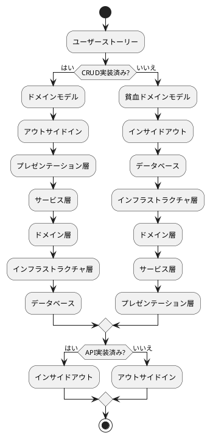
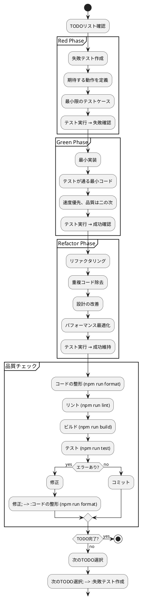
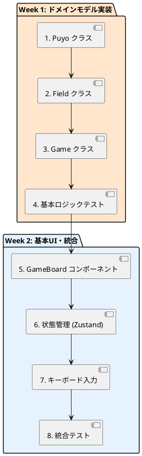
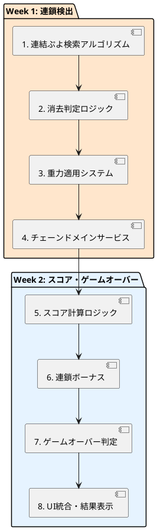
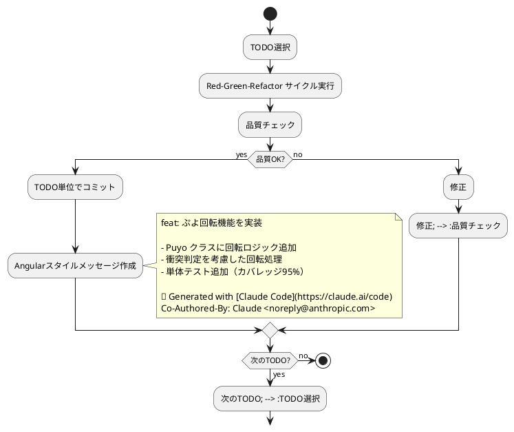

# 実装戦略

## 概要

このドキュメントでは、ぷよぷよゲーム開発における具体的な実装戦略を定義します。CLAUDE.local.mdで指定されたTDD開発フローと、設計ドキュメントに基づいた段階的実装アプローチを採用します。

## 実装アプローチ

### 1. インサイドアウト vs アウトサイドイン



### 2. 選択基準

**インサイドアウトアプローチ（推奨）:**
- **対象:** ドメインモデル（Puyo, Field, Game, Chain）
- **理由:** 
  - 新規プロジェクトでCRUD未実装
  - 複雑なゲームロジックをドメイン中心で構築
  - テストファーストな開発が可能

**アウトサイドインアプローチ（部分採用）:**
- **対象:** UI インタラクション（キーボード、タッチ操作）
- **理由:**
  - ユーザー体験を早期に確認
  - フィードバックループを短縮

## TDD実装サイクル

### Red-Green-Refactorサイクル



## 実装順序

### Phase 3: 開発フェーズ

#### Iteration 1: ゲーム基盤（MVP）



#### Iteration 2: 消去・連鎖システム



## ドメイン層実装戦略

### 1. 値オブジェクト（Value Objects）

#### Puyo実装例

```typescript
// Red: 失敗テスト
describe('Puyo', () => {
  test('同じ色と位置のPuyoは等価である', () => {
    // Given
    const puyo1 = new Puyo(PuyoColor.RED, new Position(1, 2));
    const puyo2 = new Puyo(PuyoColor.RED, new Position(1, 2));
    
    // When & Then
    expect(puyo1.equals(puyo2)).toBe(true);
  });
  
  test('異なる色のPuyoは等価でない', () => {
    // Given
    const puyo1 = new Puyo(PuyoColor.RED, new Position(1, 2));
    const puyo2 = new Puyo(PuyoColor.BLUE, new Position(1, 2));
    
    // When & Then
    expect(puyo1.equals(puyo2)).toBe(false);
  });
});

// Green: 最小実装
export class Puyo {
  constructor(
    private readonly color: PuyoColor,
    private readonly position: Position
  ) {}
  
  equals(other: Puyo): boolean {
    return this.color === other.color && 
           this.position.equals(other.position);
  }
  
  getColor(): PuyoColor { return this.color; }
  getPosition(): Position { return this.position; }
}

// Refactor: 設計改善
export class Puyo {
  private constructor(
    private readonly color: PuyoColor,
    private readonly position: Position
  ) {
    this.validateColor(color);
    this.validatePosition(position);
  }
  
  static create(color: PuyoColor, position: Position): Puyo {
    return new Puyo(color, position);
  }
  
  equals(other: Puyo): boolean {
    return this.color === other.color && 
           this.position.equals(other.position);
  }
  
  moveTo(newPosition: Position): Puyo {
    return new Puyo(this.color, newPosition);
  }
  
  private validateColor(color: PuyoColor): void {
    if (!Object.values(PuyoColor).includes(color)) {
      throw new Error(`Invalid puyo color: ${color}`);
    }
  }
  
  private validatePosition(position: Position): void {
    if (!position.isValid()) {
      throw new Error(`Invalid position: ${position}`);
    }
  }
}
```

### 2. エンティティ（Entities）

#### Field実装例

```typescript
// Red: 失敗テスト
describe('Field', () => {
  test('空のフィールドを作成できる', () => {
    // Given & When
    const field = Field.createEmpty();
    
    // Then
    expect(field.isEmpty()).toBe(true);
    expect(field.getWidth()).toBe(6);
    expect(field.getHeight()).toBe(12);
  });
  
  test('指定位置にPuyoを配置できる', () => {
    // Given
    const field = Field.createEmpty();
    const puyo = Puyo.create(PuyoColor.RED, new Position(0, 0));
    
    // When
    const newField = field.placePuyo(puyo);
    
    // Then
    expect(newField.getPuyoAt(new Position(0, 0))).toEqual(puyo);
  });
});

// Green: 最小実装
export class Field {
  private constructor(
    private readonly grid: (Puyo | null)[][],
    private readonly width: number = 6,
    private readonly height: number = 12
  ) {}
  
  static createEmpty(): Field {
    const grid = Array(12).fill(null)
      .map(() => Array(6).fill(null));
    return new Field(grid);
  }
  
  isEmpty(): boolean {
    return this.grid.every(row => 
      row.every(cell => cell === null)
    );
  }
  
  placePuyo(puyo: Puyo): Field {
    const newGrid = this.copyGrid();
    const pos = puyo.getPosition();
    newGrid[pos.getY()][pos.getX()] = puyo;
    return new Field(newGrid);
  }
  
  getPuyoAt(position: Position): Puyo | null {
    return this.grid[position.getY()][position.getX()];
  }
}
```

### 3. ドメインサービス（Domain Services）

#### ChainDetectionService実装例

```typescript
// Red: 失敗テスト
describe('ChainDetectionService', () => {
  test('4つ以上の同色ぷよが隣接している場合、消去対象として検出される', () => {
    // Given
    const field = createFieldWithPattern([
      ['R', 'R', '.', '.', '.', '.'],
      ['R', 'R', '.', '.', '.', '.'],
      ['.', '.', '.', '.', '.', '.'],
    ]);
    const service = new ChainDetectionService();
    
    // When
    const result = service.detectErasableGroups(field);
    
    // Then
    expect(result).toHaveLength(1);
    expect(result[0].size).toBe(4);
    expect(result[0].color).toBe(PuyoColor.RED);
  });
});

// Green: 最小実装
export class ChainDetectionService {
  detectErasableGroups(field: Field): PuyoGroup[] {
    const visited = new Set<string>();
    const erasableGroups: PuyoGroup[] = [];
    
    for (let y = 0; y < field.getHeight(); y++) {
      for (let x = 0; x < field.getWidth(); x++) {
        const position = new Position(x, y);
        const puyo = field.getPuyoAt(position);
        
        if (puyo && !visited.has(position.toString())) {
          const group = this.findConnectedGroup(
            field, position, puyo.getColor(), visited
          );
          
          if (group.size >= 4) {
            erasableGroups.push(group);
          }
        }
      }
    }
    
    return erasableGroups;
  }
  
  private findConnectedGroup(
    field: Field, 
    startPos: Position, 
    color: PuyoColor, 
    visited: Set<string>
  ): PuyoGroup {
    // 深度優先探索による連結ぷよ検索
    const group = new PuyoGroup(color);
    const stack = [startPos];
    
    while (stack.length > 0) {
      const currentPos = stack.pop()!;
      
      if (visited.has(currentPos.toString())) continue;
      
      const puyo = field.getPuyoAt(currentPos);
      if (!puyo || puyo.getColor() !== color) continue;
      
      visited.add(currentPos.toString());
      group.addPuyo(puyo);
      
      // 隣接位置をスタックに追加
      const neighbors = currentPos.getNeighbors();
      stack.push(...neighbors.filter(pos => 
        field.isValidPosition(pos) && 
        !visited.has(pos.toString())
      ));
    }
    
    return group;
  }
}
```

## アプリケーション層実装戦略

### 1. ゲームサービス（Game Service）

```typescript
// Red: 失敗テスト
describe('GameService', () => {
  test('ゲーム開始時に初期状態が正しく設定される', () => {
    // Given
    const gameRepository = createMockGameRepository();
    const service = new GameService(gameRepository);
    
    // When
    const gameId = service.startNewGame();
    
    // Then
    const game = service.getGame(gameId);
    expect(game.getState()).toBe(GameState.READY);
    expect(game.getScore().getCurrent()).toBe(0);
    expect(game.getField().isEmpty()).toBe(true);
  });
  
  test('プレイヤー入力を処理してゲーム状態を更新できる', () => {
    // Given
    const service = new GameService(createMockGameRepository());
    const gameId = service.startNewGame();
    const command = new MovePuyoCommand(Direction.LEFT);
    
    // When
    const result = service.handlePlayerInput(gameId, command);
    
    // Then
    expect(result.isSuccess()).toBe(true);
    expect(result.getEvents()).toContainEqual(
      expect.objectContaining({ type: 'PuyoMovedEvent' })
    );
  });
});

// Green: 最小実装
export class GameService {
  constructor(
    private gameRepository: GameRepository,
    private chainDetectionService: ChainDetectionService = new ChainDetectionService()
  ) {}
  
  startNewGame(): GameId {
    const gameId = GameId.generate();
    const game = Game.startNew(gameId);
    
    this.gameRepository.save(game);
    return gameId;
  }
  
  handlePlayerInput(gameId: GameId, command: InputCommand): GameResult {
    const game = this.gameRepository.findById(gameId);
    if (!game) {
      return GameResult.failure('Game not found');
    }
    
    const events = game.handleInput(command);
    this.gameRepository.save(game);
    
    return GameResult.success(events);
  }
  
  getGame(gameId: GameId): Game {
    return this.gameRepository.findById(gameId);
  }
}
```

## プレゼンテーション層実装戦略

### 1. Reactコンポーネント設計

```typescript
// React Testing Library を使用したコンポーネントテスト
describe('GameBoardComponent', () => {
  test('フィールドの状態を正しく表示する', () => {
    // Given
    const field = createFieldWithPattern([
      ['R', 'G', '.', '.', '.', '.'],
      ['B', 'Y', '.', '.', '.', '.'],
    ]);
    
    // When
    render(<GameBoard field={field} />);
    
    // Then
    expect(screen.getByTestId('puyo-0-0')).toHaveClass('puyo-red');
    expect(screen.getByTestId('puyo-1-0')).toHaveClass('puyo-green');
    expect(screen.getByTestId('puyo-0-1')).toHaveClass('puyo-blue');
    expect(screen.getByTestId('puyo-1-1')).toHaveClass('puyo-yellow');
  });
  
  test('キーボード入力を適切に処理する', () => {
    // Given
    const mockHandleInput = jest.fn();
    render(<GameBoard onInput={mockHandleInput} />);
    
    // When
    fireEvent.keyDown(document, { key: 'ArrowLeft' });
    
    // Then
    expect(mockHandleInput).toHaveBeenCalledWith(
      expect.objectContaining({ type: 'MOVE_LEFT' })
    );
  });
});

// コンポーネント実装
interface GameBoardProps {
  field: Field;
  currentPuyo?: PuyoPair;
  onInput?: (command: InputCommand) => void;
}

export const GameBoard: React.FC<GameBoardProps> = ({ 
  field, 
  currentPuyo, 
  onInput 
}) => {
  // キーボード入力ハンドリング
  useEffect(() => {
    const handleKeyDown = (event: KeyboardEvent) => {
      const command = mapKeyToCommand(event.key);
      if (command && onInput) {
        onInput(command);
      }
    };
    
    document.addEventListener('keydown', handleKeyDown);
    return () => document.removeEventListener('keydown', handleKeyDown);
  }, [onInput]);
  
  return (
    <div className="game-board" data-testid="game-board">
      {Array.from({ length: field.getHeight() }, (_, y) => 
        Array.from({ length: field.getWidth() }, (_, x) => {
          const position = new Position(x, y);
          const puyo = field.getPuyoAt(position);
          
          return (
            <div 
              key={`${x}-${y}`}
              data-testid={`puyo-${x}-${y}`}
              className={`cell ${puyo ? `puyo-${puyo.getColor().toLowerCase()}` : 'empty'}`}
            />
          );
        })
      )}
    </div>
  );
};
```

### 2. 状態管理（Zustand）

```typescript
// ゲーム状態管理ストア
interface GameState {
  // 状態
  currentGame: Game | null;
  gameStatus: GameStatus;
  
  // アクション
  startNewGame: () => void;
  handleInput: (command: InputCommand) => void;
  resetGame: () => void;
}

export const useGameStore = create<GameState>((set, get) => ({
  currentGame: null,
  gameStatus: GameStatus.NOT_STARTED,
  
  startNewGame: () => {
    const gameService = new GameService(new InMemoryGameRepository());
    const gameId = gameService.startNewGame();
    const game = gameService.getGame(gameId);
    
    set({
      currentGame: game,
      gameStatus: GameStatus.PLAYING,
    });
  },
  
  handleInput: (command: InputCommand) => {
    const { currentGame } = get();
    if (!currentGame) return;
    
    const events = currentGame.handleInput(command);
    
    set({ 
      currentGame: currentGame // イミュータブルオブジェクトなので新しい参照
    });
  },
  
  resetGame: () => {
    set({
      currentGame: null,
      gameStatus: GameStatus.NOT_STARTED,
    });
  },
}));

// コンポーネントでの使用
export const GameContainer: React.FC = () => {
  const { currentGame, gameStatus, startNewGame, handleInput } = useGameStore();
  
  if (gameStatus === GameStatus.NOT_STARTED) {
    return (
      <div>
        <button onClick={startNewGame}>ゲーム開始</button>
      </div>
    );
  }
  
  return (
    <div>
      <GameBoard 
        field={currentGame.getField()}
        currentPuyo={currentGame.getCurrentPuyo()}
        onInput={handleInput}
      />
      <ScoreDisplay score={currentGame.getScore()} />
    </div>
  );
};
```

## テスト戦略実装

### 1. テストデータビルダー

```typescript
export class GameTestDataBuilder {
  private game: Game;
  
  constructor() {
    this.game = Game.startNew(GameId.generate());
  }
  
  withField(pattern: string[][]): GameTestDataBuilder {
    const field = FieldFactory.createFromPattern(pattern);
    this.game = this.game.withField(field);
    return this;
  }
  
  withScore(score: number): GameTestDataBuilder {
    this.game = this.game.withScore(new Score(score, 0));
    return this;
  }
  
  withState(state: GameState): GameTestDataBuilder {
    this.game = this.game.withState(state);
    return this;
  }
  
  build(): Game {
    return this.game;
  }
}

// ファクトリヘルパー
export class FieldFactory {
  static createFromPattern(pattern: string[][]): Field {
    const field = Field.createEmpty();
    
    return pattern.reduce((acc, row, y) => {
      return row.reduce((fieldAcc, cell, x) => {
        if (cell !== '.') {
          const color = this.mapCharToColor(cell);
          const puyo = Puyo.create(color, new Position(x, y));
          return fieldAcc.placePuyo(puyo);
        }
        return fieldAcc;
      }, acc);
    }, field);
  }
  
  private static mapCharToColor(char: string): PuyoColor {
    const colorMap = {
      'R': PuyoColor.RED,
      'G': PuyoColor.GREEN,
      'B': PuyoColor.BLUE,
      'Y': PuyoColor.YELLOW,
      'P': PuyoColor.PURPLE
    };
    
    return colorMap[char] || PuyoColor.RED;
  }
}
```

### 2. 統合テスト

```typescript
describe('ゲーム統合テスト', () => {
  test('完全なゲームフローが正しく動作する', async () => {
    // Given: ゲーム開始
    const gameService = new GameService(new InMemoryGameRepository());
    const gameId = gameService.startNewGame();
    
    // When: 一連のプレイヤー操作を実行
    await gameService.handlePlayerInput(gameId, new MovePuyoCommand(Direction.LEFT));
    await gameService.handlePlayerInput(gameId, new RotatePuyoCommand());
    await gameService.handlePlayerInput(gameId, new QuickDropCommand());
    
    // Then: ゲーム状態が期待通りに更新される
    const game = gameService.getGame(gameId);
    expect(game.getState()).toBe(GameState.PLACING_NEXT_PUYO);
    expect(game.getField().isEmpty()).toBe(false);
  });
  
  test('連鎖が正しく発生してスコアが加算される', async () => {
    // Given: 連鎖が発生しやすい初期フィールド
    const field = FieldFactory.createFromPattern([
      ['.', '.', '.', '.', '.', '.'],
      ['.', '.', '.', '.', '.', '.'],
      ['R', 'R', 'R', '.', '.', '.'],
      ['G', 'G', 'B', '.', '.', '.'],
      ['G', 'B', 'B', '.', '.', '.']
    ]);
    
    const game = new GameTestDataBuilder()
      .withField(field)
      .withScore(0)
      .build();
    
    const gameService = new GameService(new InMemoryGameRepository());
    gameService.saveGame(game);
    
    // When: 連鎖を発生させる操作
    const redPuyo = Puyo.create(PuyoColor.RED, new Position(3, 2));
    const placePuyoCommand = new PlacePuyoCommand(redPuyo);
    const result = await gameService.handlePlayerInput(game.getId(), placePuyoCommand);
    
    // Then: 連鎖が発生してスコアが加算される
    const updatedGame = gameService.getGame(game.getId());
    expect(updatedGame.getScore().getCurrent()).toBeGreaterThan(0);
    expect(result.getEvents()).toContainEqual(
      expect.objectContaining({ type: 'ChainOccurredEvent' })
    );
  });
});
```

## コミット戦略

### TODOベースのコミット



### コミットメッセージ規約

```markdown
<type>(<scope>): <subject>

<body>

<footer>
```

**Type:**
- `feat`: 新機能追加
- `fix`: バグ修正  
- `refactor`: リファクタリング
- `test`: テスト追加・修正
- `docs`: ドキュメント更新
- `style`: コード整形
- `chore`: ビルド・設定変更

**Scope:**
- `domain`: ドメイン層
- `app`: アプリケーション層
- `ui`: プレゼンテーション層
- `infra`: インフラストラクチャ層

## エラーハンドリング戦略

### 1. ドメインエラー

```typescript
// ドメインエラーの定義
export abstract class DomainError extends Error {
  abstract readonly code: string;
  abstract readonly severity: 'warning' | 'error' | 'critical';
}

export class InvalidPuyoPlacementError extends DomainError {
  readonly code = 'INVALID_PUYO_PLACEMENT';
  readonly severity = 'warning';
  
  constructor(position: Position, reason: string) {
    super(`Cannot place puyo at ${position}: ${reason}`);
  }
}

export class GameOverError extends DomainError {
  readonly code = 'GAME_OVER';
  readonly severity = 'error';
  
  constructor(finalScore: number) {
    super(`Game over with final score: ${finalScore}`);
  }
}

// ドメイン層での使用
export class Game {
  handleInput(command: InputCommand): DomainEvent[] {
    try {
      switch (command.type) {
        case 'MOVE_PUYO':
          return this.handleMovePuyo(command as MovePuyoCommand);
        case 'PLACE_PUYO':
          return this.handlePlacePuyo(command as PlacePuyoCommand);
        default:
          throw new InvalidCommandError(command.type);
      }
    } catch (error) {
      if (error instanceof DomainError) {
        return [new GameErrorEvent(this.id, error)];
      }
      throw error; // 予期しないエラーは再スロー
    }
  }
  
  private handlePlacePuyo(command: PlacePuyoCommand): DomainEvent[] {
    const position = command.puyo.getPosition();
    
    if (!this.field.canPlacePuyoAt(position)) {
      throw new InvalidPuyoPlacementError(
        position, 
        'Position is already occupied'
      );
    }
    
    // 正常処理...
    return [new PuyoPlacedEvent(this.id, command.puyo)];
  }
}
```

### 2. アプリケーション層エラー処理

```typescript
export class GameService {
  async handlePlayerInput(
    gameId: GameId, 
    command: InputCommand
  ): Promise<GameResult> {
    try {
      const game = await this.gameRepository.findById(gameId);
      if (!game) {
        return GameResult.failure('Game not found', 'GAME_NOT_FOUND');
      }
      
      const events = game.handleInput(command);
      await this.gameRepository.save(game);
      
      // ドメインイベントをアプリケーションイベントに変換
      await this.eventBus.publishAll(events);
      
      return GameResult.success(events);
      
    } catch (error) {
      if (error instanceof DomainError) {
        return GameResult.failure(error.message, error.code);
      }
      
      // 予期しないエラーはログに記録して汎用エラーを返す
      this.logger.error('Unexpected error in GameService', error);
      return GameResult.failure('Internal server error', 'INTERNAL_ERROR');
    }
  }
}

export class GameResult {
  private constructor(
    private readonly success: boolean,
    private readonly events: DomainEvent[] = [],
    private readonly errorMessage?: string,
    private readonly errorCode?: string
  ) {}
  
  static success(events: DomainEvent[]): GameResult {
    return new GameResult(true, events);
  }
  
  static failure(message: string, code: string): GameResult {
    return new GameResult(false, [], message, code);
  }
  
  isSuccess(): boolean { return this.success; }
  getEvents(): DomainEvent[] { return [...this.events]; }
  getErrorMessage(): string | undefined { return this.errorMessage; }
  getErrorCode(): string | undefined { return this.errorCode; }
}
```

## パフォーマンス最適化戦略

### 1. メモ化とReactの最適化

```typescript
// コンポーネントの最適化
export const GameBoard = React.memo<GameBoardProps>(({ 
  field, 
  currentPuyo, 
  onInput 
}) => {
  // 重い計算のメモ化
  const fieldCells = useMemo(() => {
    return field.getCells().map((row, y) => 
      row.map((puyo, x) => ({
        key: `${x}-${y}`,
        puyo,
        position: new Position(x, y)
      }))
    );
  }, [field]);
  
  // イベントハンドラのメモ化
  const handleKeyDown = useCallback((event: KeyboardEvent) => {
    const command = mapKeyToCommand(event.key);
    if (command && onInput) {
      onInput(command);
    }
  }, [onInput]);
  
  useEffect(() => {
    document.addEventListener('keydown', handleKeyDown);
    return () => document.removeEventListener('keydown', handleKeyDown);
  }, [handleKeyDown]);
  
  return (
    <div className="game-board">
      {fieldCells.map(row => 
        row.map(({ key, puyo, position }) => (
          <PuyoCell key={key} puyo={puyo} position={position} />
        ))
      )}
    </div>
  );
});

// 比較関数をカスタマイズ
GameBoard.displayName = 'GameBoard';
```

### 2. バンドル最適化

```typescript
// 動的インポートによる遅延ロード
const GameSettingsModal = lazy(() => import('./GameSettingsModal'));
const GameHistoryModal = lazy(() => import('./GameHistoryModal'));

export const GameContainer: React.FC = () => {
  const [showSettings, setShowSettings] = useState(false);
  
  return (
    <div>
      <GameBoard />
      
      <Suspense fallback={<div>Loading...</div>}>
        {showSettings && (
          <GameSettingsModal onClose={() => setShowSettings(false)} />
        )}
      </Suspense>
    </div>
  );
};
```

## まとめ

この実装戦略により以下を実現：

1. **段階的開発**: インサイドアウトアプローチによるドメイン中心開発
2. **品質保証**: TDDサイクルと包括的テスト戦略
3. **保守性**: 明確な責任分離と疎結合設計
4. **パフォーマンス**: React最適化とバンドル分割
5. **エラー処理**: 堅牢なエラーハンドリング機構
6. **開発効率**: TODOベースの開発とコミット戦略

次のPhase 3（開発）では、この戦略に基づいて具体的な実装を進めていきます。