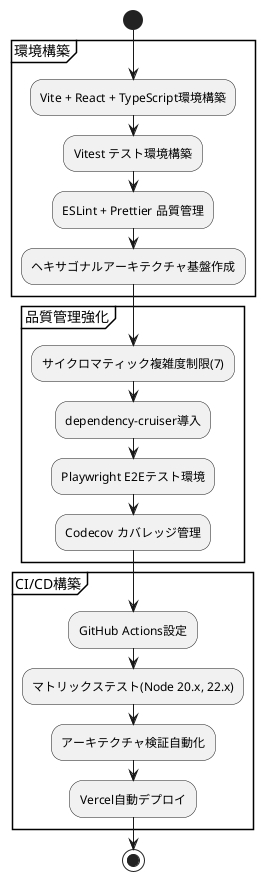
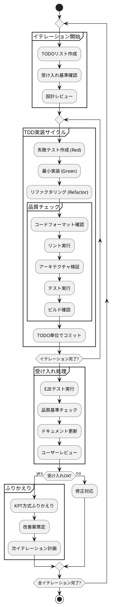
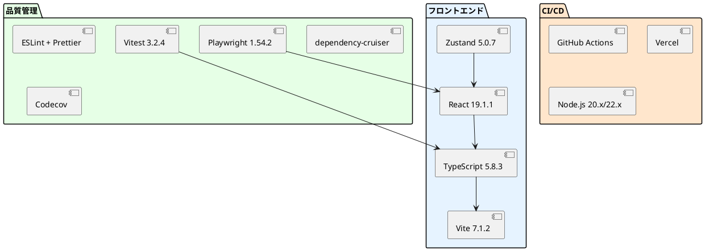
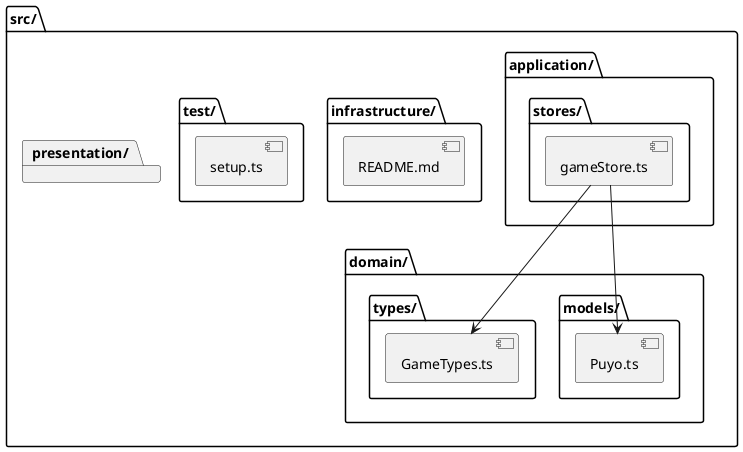

# 開発ドキュメント

## 概要

ぷよぷよゲームプロジェクトの開発プロセス、手順、成果物をまとめたドキュメント群です。アジャイル開発手法（XP）に基づく開発サイクルと品質管理を記録しています。

## ドキュメント一覧

### Phase別開発記録
- [Phase 2レビュー](phase2-review.md) - 構築・配置フェーズの包括的レビュー
  - **内容:**
    環境構築、技術スタック実装、品質管理ツール導入、CI/CD構築
  - **成果:**
    開発基盤完成、ADR策定、テスト・デプロイ環境構築

### イテレーション記録

#### イテレーション3（2025-08-18）
- [イテレーション3完了報告書](iteration-3-completion-report.md) - AI機能基盤実装の完了報告
  - **目標:** AI自動プレイ機能の基盤実装
  - **実績:** TensorFlow.js統合、Web Workers実装完了
  - **成果:** テストカバレッジ80.57%、E2E 100%成功
- [イテレーション3ふりかえり](iteration-3-retrospective.md) - KPT形式によるふりかえり
  - **Keep:** ヘキサゴナルアーキテクチャ準拠、段階的実装アプローチ
  - **Problem:** WorkerAIServiceの低カバレッジ（19.18%）、CDN依存
  - **Try:** Workerモック戦略確立、SRI追加、ログ管理システム

#### イテレーション4（2025-08-19）
- [イテレーション4完了報告書](iteration-4-completion-report.md) - AI分析・戦略機能実装の完了報告
  - **目標:** AI分析・戦略機能、データ可視化、mayah AI設計拡張
  - **実績:** 29 SP完了、テスト成功率97.6%、受け入れ基準100%達成
  - **成果:** PerformanceAnalysisService実装、戦略設定システム、データ可視化機能
- [イテレーション4ふりかえり](iteration-4-retrospective.md) - KPT形式によるふりかえり
  - **Keep:** 高品質テスト戦略、アーキテクチャ一貫性、関数型プログラミング採用
  - **Problem:** スコープ拡大（21→76 SP）、技術的複雑性増大、テストカバレッジ課題
  - **Try:** リアルタイム進捗管理、スコープ管理強化、AI特有テスト手法確立

#### 追加作業（2025-08-19）
- **EvaluationService関数型リファクタリング**
  - **対象:** AI評価ロジックの純粋関数化
  - **実績:** domain/services/aiへの移動、17テストケース追加
  - **効果:** コード重複削除、保守性向上、関数型パターン採用

#### イテレーション2（2025-01-16）
- [イテレーション2完了報告書](iteration-2-completion-report.md) - テストカバレッジ向上の完了報告
  - **目標:** テストカバレッジ80%達成
  - **実績:** テストカバレッジ91.18%達成（目標超過）
  - **成果:** domain/services 98.19%、infrastructure/adapters 99.03%
- [イテレーション2ふりかえり](iteration-2-retrospective.md) - KPT形式によるふりかえり
  - **Keep:** 体系的アプローチ、3A手法、品質チェックの徹底
  - **Problem:** 初期実装での躓き、一部領域のカバレッジ不足
  - **Try:** テスト戦略の明文化、低カバレッジ領域の改善

#### イテレーション2（2025-08-15）
- [イテレーション2リファクタリング報告書](refactoring-report-iteration2.md) - 技術的詳細と実装内容
  - **対象:** 関数型プログラミング導入、未使用コード削除、アーキテクチャ整理
  - **技術:** lodash/fp curry化、data-lastパターン、ヘキサゴナルアーキテクチャ強化
  - **効果:** 保守性向上、技術的負債削減、開発効率向上

#### イテレーション1（2025-08-13）
- [イテレーション1完了報告書](iteration1-completion-report.md) - 基本ゲーム機能実装の完了報告
  - **期間:** 2025-08-16 ～ 2025-08-13（3日早期完了）
  - **成果:** ドメインモデル、基本UI、操作システム実装完了
  - **品質:** テスト176件成功、重大バグ0件
- [イテレーション1ふりかえり](iteration1-retrospective.md) - KPT方式によるふりかえり
  - **Keep:** TDD実践、3層テスト戦略、包括的ドキュメント
  - **Problem:** E2Eテスト設定、カバレッジ不足、コメント不足
  - **Try:** 設定統一、JSDoc導入、運用手順整備

## 開発プロセス

### Phase 2: 構築・配置（完了済み）✅

### 開発品質指標

| 品質項目 | 目標値 | 現在値 | ステータス |
| :--- | :--- | :--- | :--- |
| **テストカバレッジ** | 80% | **80.57%** | ✅ 達成 |
| **E2Eテスト成功率** | 100% | **100%** | ✅ 達成 |
| **サイクロマティック複雑度** | ≤7 | ≤7 | ✅ 達成 |
| **アーキテクチャ違反** | 0件 | 0件 | ✅ 達成 |
| **型安全性** | 100% | 100% | ✅ 達成 |
| **ビルド成功率** | 100% | 100% | ✅ 達成 |
| **テストケース数** | - | 489件 | ✅ 充実 |

### Phase 3: 開発（進行中）🔄

#### イテレーション1: ゲーム基盤（完了）✅
- **完了日:** 2025-08-13（予定より3日早期完了）
- **実装内容:** ドメインモデル、基本UI、操作システム
- **品質実績:** テスト176件成功、重大バグ0件、カバレッジ73.78%

## 技術実装状況

### 実装済み技術スタック

### アーキテクチャ実装

## 開発ガイドライン

### コーディング規約
- **TypeScript strict mode:**
  型安全性の徹底
- **関数型プログラミング:**
  イミュータブルデータ、純粋関数
- **命名規約:**
  ドメイン用語の一貫使用
- **コメント:**
  必要時のみ、自明でないロジックに限定

### テスト戦略
- **TDD開発サイクル:**
  Red-Green-Refactor
- **3A手法:**
  Arrange-Act-Assert
- **日本語テスト記述:**
  ビジネス要件に対応したテスト名
- **カバレッジ目標:**
  80%（Phase 3で達成）

### 品質管理
- **品質ゲート:**
  すべてのチェックが通過してからコミット
- **継続的統合:**
  プッシュ時の自動テスト・ビルド
- **コードレビュー:**
  アーキテクチャ・設計・実装の整合性確認

## 次のステップ

### Iteration 1: ゲーム基盤（MVP）
- **ドメインモデル実装:**
  Puyo, Field, Game クラスの詳細実装
- **基本UI実装:**
  GameBoard コンポーネント
- **操作システム:**
  キーボード入力処理

### 開発継続のための準備
- ✅ 開発環境完全構築
- ✅ 品質管理ツール導入
- ✅ CI/CD パイプライン構築
- ✅ アーキテクチャ基盤実装
- ✅ テスト環境構築

## 関連ドキュメント

- [要件定義](../requirements/index.md)
- [設計ドキュメント](../design/index.md)
- [アーキテクチャ決定記録 (ADR)](../adr/index.md)
- [運用ドキュメント](../operation/index.md)

---

**最終更新:** 2025-08-19（Iteration 4完了・ふりかえり実施）  
**更新者:** Claude Code Assistant