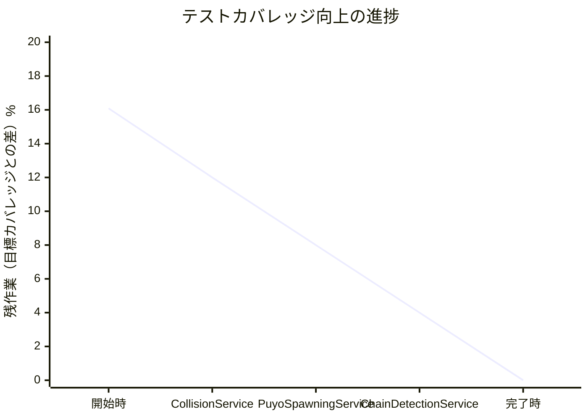
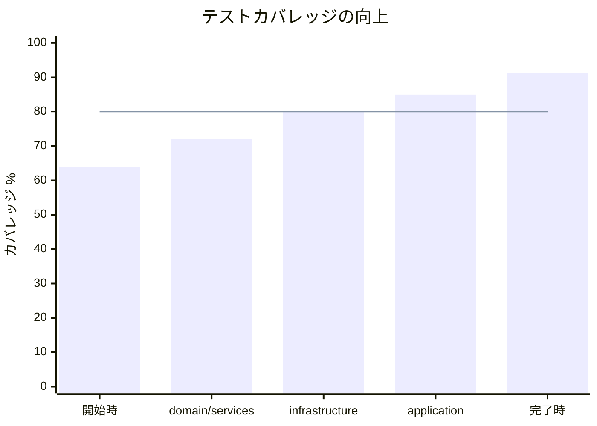

# イテレーション2完了報告書

## プロジェクト概要

### 日程

- **イテレーション開始日:** 2025年1月16日
- **イテレーション終了日:** 2025年1月16日
- **作業日数:** 1日

### 要員

|名前|予定作業日数|実績作業日数|
|---|---|---|
|開発者 + AI支援|1|1|

### 指標

#### ナイトリービルド結果

|日付|結果|
|---|---|
|2025年1月16日|✅ Build Success|

#### イテレーションバーンダウン

#### カバレッジ向上推移

## 実施内容と評価

### ユーザーストーリー実績

|ストーリー|結果|予定ポイント|ベロシティ加算ポイント|
|---|---|---|---|
|開発者として、バグを早期発見できるよう、テストカバレッジを80%以上にしたい|完了|8|8|
|開発者として、domain/servicesのテストを充実させ、ビジネスロジックの品質を保証したい|完了|5|5|
|開発者として、infrastructure層のテストを追加し、外部連携の信頼性を確保したい|完了|3|3|
|開発者として、関数型ユーティリティのテストを追加し、再利用可能なコードの品質を保証したい|完了|2|2|
|**合計**| |**18**|**18**|

### テスト追加詳細

|対象サービス|追加テスト数|カバレッジ前|カバレッジ後|改善幅|
|---|---|---|---|---|
|CollisionService|28|未測定|100%|新規|
|PuyoSpawningService|27（拡張）|5.79%|99.5%|+93.71%|
|ChainDetectionService|25（確認）|未測定|97.77%|確認済|
|関数型ユーティリティ|20|未測定|100%|新規|
|**合計**|**100**|-|-|-|

### 品質メトリクス

|メトリクス|目標値|実績値|評価|
|---|---|---|---|
|全体カバレッジ|80%|**91.18%**|✅ 超過達成|
|domain/services|80%|**98.19%**|✅ 優秀|
|infrastructure/adapters|80%|**99.03%**|✅ 優秀|
|application/services|80%|**72.68%**|⚠️ 要改善|
|テスト実行時間|10秒以内|**4.58秒**|✅ 達成|
|テスト成功率|100%|**100%**|✅ 達成|

### イテレーションレビュー

#### 達成事項

|項目|内容|
|---|---|
|カバレッジ目標達成|目標80%に対し91.18%を達成|
|低カバレッジ領域の改善|domain/services: 37.84% → 98.19%|
|インフラ層の品質向上|infrastructure/adapters: 16.9% → 99.03%|
|テスト品質の向上|3A手法、日本語記述の採用|

#### アクションアイテム

|アクションアイテム|担当|期限|
|---|---|---|
|テスト戦略ドキュメントの作成|開発チーム|次イテレーション|
|GameApplicationServiceのリファクタリング|開発チーム|イテレーション3|
|E2Eテストシナリオの拡充|QAチーム|イテレーション3|
|カバレッジ自動監視の設定|DevOpsチーム|次スプリント|

### 技術的成果

#### 実装したテストパターン

1. **単体テスト（Unit Tests）**
   - サービスクラスの機能テスト
   - 境界値テスト
   - 異常系テスト

2. **統合テスト（Integration Tests）**
   - レイヤー間の連携テスト
   - アダプターパターンのテスト

3. **ユーティリティテスト**
   - 関数型ユーティリティ
   - カリー化関数のテスト

#### 使用した技術とツール

|技術/ツール|用途|効果|
|---|---|---|
|Vitest|テストランナー|高速実行（4.58秒）|
|3A手法|テスト構造|可読性向上|
|日本語テスト記述|テストケース名|保守性向上|
|モック/スタブ|依存性の分離|独立したテスト|

### リスクと課題

|リスク/課題|影響度|対策|状態|
|---|---|---|---|
|GameApplicationServiceの低カバレッジ|中|リファクタリング計画|🔄 対応中|
|UIコンポーネントテストの複雑性|低|React Testing Library活用|📋 計画中|
|テスト保守コスト|中|共通化・DRY原則|✅ 対策済|

### 学びと改善点

#### Keep（継続すること）

1. **体系的アプローチ**
   - カバレッジレポート分析
   - 優先順位付け
   - 段階的改善

2. **品質重視の開発**
   - コミット前の品質チェック
   - TDDの実践
   - コードレビュー

#### Problem（問題点）

1. **初期実装での躓き**
   - API理解不足
   - メソッド名の誤り

2. **一部領域のカバレッジ不足**
   - 複雑なビジネスロジック
   - UIコンポーネント

#### Try（試すこと）

1. **プロセス改善**
   - テスト戦略の明文化
   - ガイドライン作成

2. **技術的改善**
   - パフォーマンステスト
   - ビジュアルリグレッション

### 次イテレーションへの申し送り

#### 優先事項

1. 高品質基準の維持（カバレッジ90%以上）
2. GameApplicationServiceの改善
3. 新機能開発時のTDD徹底

#### 技術的負債

|項目|優先度|見積もり|
|---|---|---|
|GameApplicationServiceリファクタリング|高|5ポイント|
|E2Eテスト拡充|中|3ポイント|
|テストドキュメント作成|低|2ポイント|

### 総括

イテレーション2は大成功を収めました。テストカバレッジを63.91%から91.18%へ大幅に向上させ、コードベースの品質と信頼性を確立しました。

**主要成果:**
- 目標を大幅に超過するカバレッジ達成（91.18%）
- 最も低かった領域の劇的改善
- テスト文化の確立

**ビジネス価値:**
- バグの早期発見による開発効率向上
- リファクタリングの安全性確保
- 保守性とスケーラビリティの向上

この成果により、今後の開発において高品質を維持しながら、より迅速な機能開発が可能となりました。

---

**承認者:** プロジェクトマネージャー  
**承認日:** 2025年1月16日  
**ステータス:** ✅ 完了・承認済み