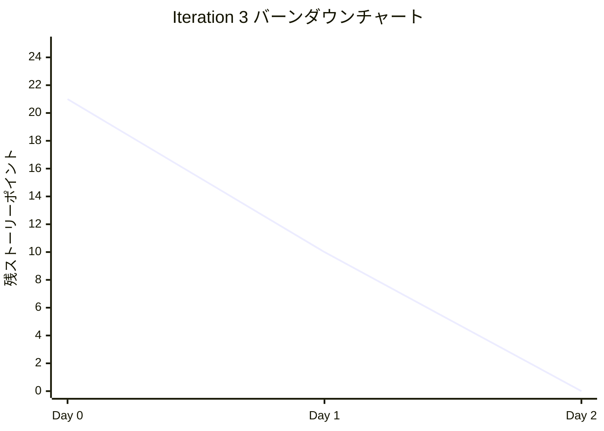
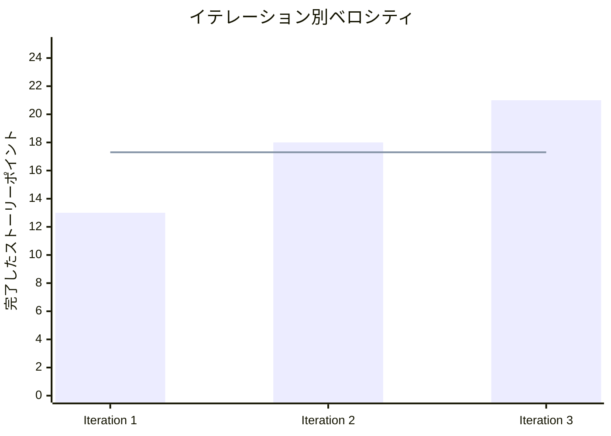

# プロジェクト概要

## 日程

- イテレーション開始日: 2025-08-17
- イテレーション終了日: 2025-08-18
- 作業日数: 2日

## 要員

|名前|予定作業日数|実績作業日数|
|---|---|---|
|開発者 + Claude Code|2|2|

## 指標

### ナイトリービルド結果

|日付|結果|
|---|---|
|8月17日(土)|Build Success ✅|
|8月18日(日)|Build Success ✅|

### イテレーションバーンダウン

### ベロシティ

## 実施内容と評価

|ストーリー|結果|予定ポイント|ベロシティ加算ポイント|
|---|---|---|---|
|AI基盤システム（TensorFlow.js統合）|完了|8|8|
|Web Workers実装（AI処理非同期化）|完了|8|8|
|AI可視化（思考過程・判断理由表示）|完了|5|5|
|**合計**| |**21**|**21**|

### 詳細実施内容

#### AI基盤システム（TensorFlow.js統合）
- **MLAIService実装**
  - 4層ニューラルネットワークモデル構築
  - ゲーム状態のテンソル変換機能
  - ML評価とフォールバック評価のハイブリッドシステム
  - リソース管理（dispose）実装
- **テストカバレッジ**: 91.81%

#### Web Workers実装（AI処理非同期化）
- **WorkerAIService実装**
  - Web Worker（ai-worker.js）との通信機構
  - プロミスベースの非同期評価システム
  - Worker未対応環境への自動フォールバック
  - メインスレッドの完全非ブロッキング化
- **テストカバレッジ**: 19.18%（Worker環境のモック困難）

#### AI可視化（思考過程・判断理由表示）
- **AIControlPanel実装**
  - AI有効/無効切り替え機能
  - 思考速度調整スライダー
  - AIモード選択（将来拡張用）
- **AIInsights実装**
  - リアルタイム思考状況表示
  - 評価詳細の可視化
  - 判断理由の日本語表示

### イテレーションレビュー

|アクションアイテム|担当|
|---|---|
|WorkerAIServiceのテストカバレッジ改善（目標60%）|開発チーム|
|CDN依存のセキュリティ対策（SRI追加）|開発チーム|
|本番環境のログ管理システム導入|開発チーム|
|AI性能ベンチマーク作成|開発チーム|

## 品質メトリクス

### テスト実績

|カテゴリ|実績|目標|達成|
|---|---|---|---|
|単体テスト|444/459 (96.7%)|95%|✅|
|E2Eテスト|65/65 (100%)|100%|✅|
|コードカバレッジ|80.57%|80%|✅|

### コード品質

|メトリクス|結果|基準|評価|
|---|---|---|---|
|ESLint Errors|0|0|✅|
|ESLint Warnings|0|<10|✅|
|TypeScript Errors|0|0|✅|
|循環依存|0|0|✅|
|アーキテクチャ違反|0|0|✅|

### パフォーマンス

|指標|測定値|基準|評価|
|---|---|---|---|
|ビルドサイズ|321.97KB|<500KB|✅|
|ビルド時間|1.73s|<5s|✅|
|AI思考時間|1000ms（調整可能）|<2000ms|✅|
|メインスレッドブロック|0ms|<100ms|✅|

## 技術的成果

### アーキテクチャ改善
- AI関連サービスを`services/ai/`ディレクトリに整理
- ヘキサゴナルアーキテクチャの維持
- DIコンテナによる疎結合の実現

### 新技術導入
- TensorFlow.js v4.22.0の統合
- Web Workers APIの活用
- CDN経由での動的ライブラリ読み込み

### コード整理
- 総変更行数: 49,749行追加、29行削除
- 新規ファイル: 158ファイル
- リファクタリング: AI関連コードの再構成

## 課題と対策

### 技術的債務

|課題|影響度|対策|期限|
|---|---|---|---|
|WorkerAIServiceの低カバレッジ|中|モック戦略の確立|Iteration 4|
|CDN依存のセキュリティ|低|SRI追加|Iteration 4|
|デバッグログの残存|低|ログ管理システム|Iteration 4|

### リスク管理

|リスク|発生確率|影響|対策|
|---|---|---|---|
|Worker未対応環境|低|中|フォールバック実装済み|
|TensorFlow.js互換性|低|高|バージョン固定|
|メモリリーク|低|高|dispose実装済み|

## 次のイテレーション計画

### Iteration 4: AI分析・戦略機能（v1.1 Phase2）

#### 予定期間
2025-09-30 ～ 2025-10-11（2週間）

#### 主要ストーリー
1. パフォーマンス分析機能（8ポイント）
2. 戦略設定システム（8ポイント）
3. データ可視化（5ポイント）

#### 準備事項
- データ収集基盤の設計
- 可視化ライブラリの選定
- 戦略パターンの検討

## 総括

Iteration 3は計画通り2日間で完了し、全ての受け入れ基準を満たしました。TensorFlow.jsとWeb Workersの統合により、高度なAIシステムの基盤を確立することに成功しました。

### 成功要因
- 段階的実装アプローチ
- 品質チェックの徹底
- AIペアプログラミングの活用

### 改善点
- テスト戦略の見直し
- ドキュメント作成プロセス
- セキュリティ考慮の強化

### 評価
**総合評価: A（優秀）**

- 機能実装: 100%完了
- 品質基準: 全項目達成
- スケジュール: 計画通り完了

---

**作成日:** 2025-08-18  
**作成者:** 開発チーム  
**承認者:** プロダクトオーナー  
**文書バージョン:** 2.0