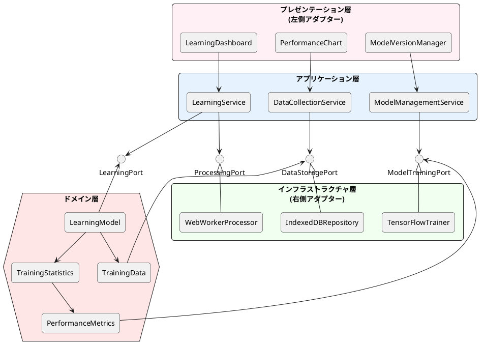
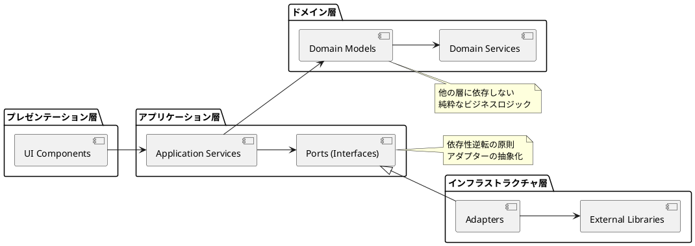
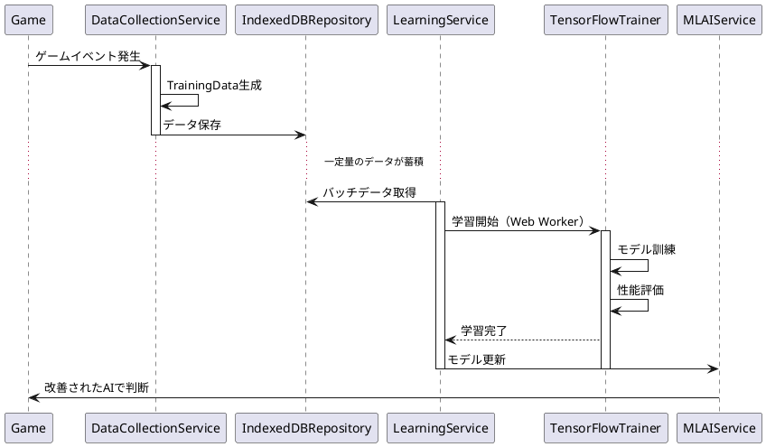
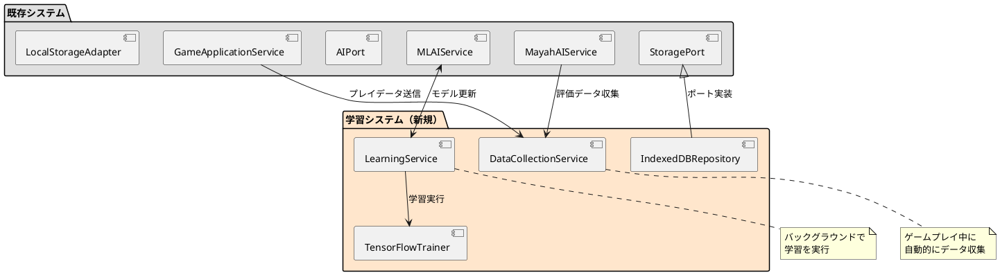

# イテレーション6 計画書

## 概要

**イテレーション番号**: 6  
**イテレーション名**: AI学習システム実装（v1.2）  
**期間**: 2025年10月中旬 ～ 2025年10月下旬（2週間）  
**目標**: 機械学習による継続的なAI性能向上システムの構築

## 背景と動機

イテレーション5までで、mayah AI評価システムの実装が完了し、高度な戦略評価・連鎖評価・操作評価が可能になりました。次のステップとして、AIが実際のプレイデータから学習し、継続的に性能向上していく仕組みを実装します。

## 目標と成果物

### 主要目標
1. **学習データ収集システム**: プレイデータの自動収集と保存
2. **機械学習モデル訓練**: TensorFlow.jsによるモデル学習機能
3. **性能改善測定**: 学習効果の可視化と評価

### 期待される成果物
- 学習データ収集サービス
- モデル訓練パイプライン
- 学習進捗ダッシュボード
- 性能比較レポート機能

## ユーザーストーリー

### US-006: AI学習システム（21 SP）

**ユーザーストーリー**:
```
AIプレイヤーとして、
実際のゲームプレイから学習したいので、
プレイデータを収集し、モデルを改善する機能が欲しい
```

**受け入れ基準**:

- [ ] プレイデータ（盤面状態、行動、結果）が自動収集される
- [ ] 収集データからモデルが学習できる
- [ ] 学習前後の性能を比較できる
- [ ] 学習進捗が可視化される
- [ ] モデルのバージョン管理ができる

## 技術的アプローチ

### アーキテクチャ

ヘキサゴナルアーキテクチャ（ポートとアダプター）パターンに基づいた学習システムの設計：



### 依存性の流れ



### 技術スタック
- **データ収集**: IndexedDB（大量データ保存）
- **機械学習**: TensorFlow.js（ブラウザ内学習）
- **並列処理**: Web Workers（学習処理の非同期化）
- **可視化**: Chart.js（学習進捗グラフ）

## 実装計画

### データ収集・学習プロセスフロー



### Week 1: データ収集基盤

#### Day 1-2: データ収集システム
- [x] TrainingDataモデル設計（完了）
- [ ] DataCollectionService実装
- [ ] IndexedDBRepository実装
- [ ] 単体テスト作成

#### Day 3-4: データ前処理
- [ ] 特徴量エンジニアリング
- [ ] データ正規化処理
- [ ] バッチ処理システム
- [ ] 統合テスト作成

#### Day 5: データ管理UI
- [ ] データ収集設定画面
- [ ] 収集状況モニター
- [ ] データエクスポート機能
- [ ] UIテスト作成

### Week 2: 学習システムと可視化

#### Day 6-7: 学習パイプライン
- [ ] LearningService実装
- [ ] TensorFlowTrainer実装
- [ ] モデル保存・読み込み
- [ ] 学習テスト作成

#### Day 8-9: 性能評価システム
- [ ] PerformanceMetrics実装
- [ ] A/Bテスト機能
- [ ] 比較分析ツール
- [ ] 評価テスト作成

#### Day 10: 可視化ダッシュボード
- [ ] LearningDashboard実装
- [ ] PerformanceChart実装
- [ ] ModelVersionManager実装
- [ ] 統合テスト・E2Eテスト

## タスクブレークダウン（TODO）

### 1. データ収集基盤（8 SP）
```typescript
// TODO-1: TrainingDataモデル設計
interface TrainingData {
  id: string;
  timestamp: Date;
  gameState: GameState;
  action: AIAction;
  reward: number;
  metadata: TrainingMetadata;
}

// TODO-2: DataCollectionService実装
class DataCollectionService {
  collect(gameState, action, outcome)
  batch(data[])
  export(format)
}

// TODO-3: IndexedDBRepository実装
class TrainingDataRepository {
  save(data)
  findByDateRange(start, end)
  aggregate(criteria)
}
```

### 2. 学習システム（8 SP）
```typescript
// TODO-4: LearningService実装
class LearningService {
  train(dataset, config)
  evaluate(testData)
  compareModels(modelA, modelB)
}

// TODO-5: TensorFlowTrainer実装
class TensorFlowTrainer {
  buildModel(architecture)
  fit(data, epochs, callbacks)
  predict(input)
  saveModel(path)
  loadModel(path)
}

// TODO-6: Web Worker統合
class LearningWorker {
  startTraining(config)
  getProgress()
  cancelTraining()
}
```

### 3. 可視化・UI（5 SP）
```typescript
// TODO-7: LearningDashboard実装
const LearningDashboard = () => {
  // 学習状況の全体表示
  // 各種メトリクスの表示
  // コントロールパネル
}

// TODO-8: PerformanceChart実装
const PerformanceChart = () => {
  // 学習曲線の表示
  // 性能指標の推移
  // 比較グラフ
}

// TODO-9: ModelVersionManager実装
const ModelVersionManager = () => {
  // モデル一覧
  // バージョン切り替え
  // 性能比較
}
```

## 成功指標

### 定量的指標
- **データ収集**: 1000ゲーム分以上のデータ収集
- **学習速度**: 100エポック/分以上
- **性能向上**: ベースラインから20%以上の改善
- **応答時間**: 学習中もゲームプレイに影響なし（60FPS維持）

### 定性的指標
- 学習プロセスが直感的に理解できる
- モデルの改善が可視化される
- ユーザーが学習パラメータを調整できる
- 学習結果が即座に反映される

## リスクと対策

### 技術的リスク
| リスク | 影響 | 対策 |
|--------|------|------|
| ブラウザメモリ制限 | 高 | データのバッチ処理、古いデータの自動削除 |
| 学習時間が長い | 中 | Web Worker活用、インクリメンタル学習 |
| モデル精度低下 | 中 | ベースラインモデル保持、ロールバック機能 |

### 実装リスク
| リスク | 影響 | 対策 |
|--------|------|------|
| IndexedDB容量制限 | 中 | データ圧縮、定期的なクリーンアップ |
| 学習の収束しない | 中 | 早期停止、学習率の自動調整 |
| UIの複雑化 | 低 | プログレッシブ開示、デフォルト設定 |

## 既存アーキテクチャとの統合



### 統合ポイント
1. **GameApplicationService**: ゲームイベントから学習データを収集
2. **MLAIService**: 学習済みモデルの適用と更新
3. **MayahAIService**: 高度な評価データの収集
4. **StoragePort**: 既存の永続化インターフェースを拡張

## 依存関係

### 前提条件
- イテレーション5（mayah AI評価システム）完了
- TensorFlow.js v4.22.0統合済み
- Web Workers実装済み
- ヘキサゴナルアーキテクチャ実装済み

### 必要なリソース
- IndexedDBストレージ（最小100MB）
- WebGLサポート（GPU加速用）
- 最新ブラウザ（Chrome 90+, Firefox 88+）

## テスト計画

### 単体テスト
- データ収集ロジック
- 学習アルゴリズム
- 性能評価メトリクス

### 統合テスト
- データ収集→学習パイプライン
- モデル保存・読み込み
- UI連携

### パフォーマンステスト
- 大量データ処理（10,000件以上）
- 長時間学習（1時間以上）
- メモリリーク検証

### E2Eテスト
- 完全な学習サイクル
- UIからの操作フロー
- 学習結果の反映確認

## チェックリスト

### 開始前
- [ ] イテレーション5の成果物確認
- [ ] 技術調査完了（IndexedDB, TensorFlow.js学習API）
- [ ] 開発環境準備

### 実装中
- [ ] TDD実践（テストファースト）
- [ ] 日次進捗確認
- [ ] コードレビュー実施

### 完了時
- [ ] 全受け入れ基準達成
- [ ] テストカバレッジ80%以上
- [ ] パフォーマンス基準達成
- [ ] ドキュメント更新

## 次のステップ

イテレーション6完了後、以下の展開が可能：

1. **イテレーション7**: ユーザー体験向上（v1.3）
   - 視覚効果・音響効果
   - アニメーション強化
   
2. **イテレーション8**: 最適化・モバイル対応（v1.4）
   - パフォーマンス最適化
   - PWA化

3. **追加改善**:
   - 分散学習（複数ユーザーのデータ統合）
   - 転移学習（事前学習モデル活用）
   - 強化学習（自己対戦による改善）