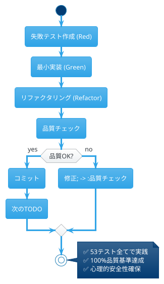
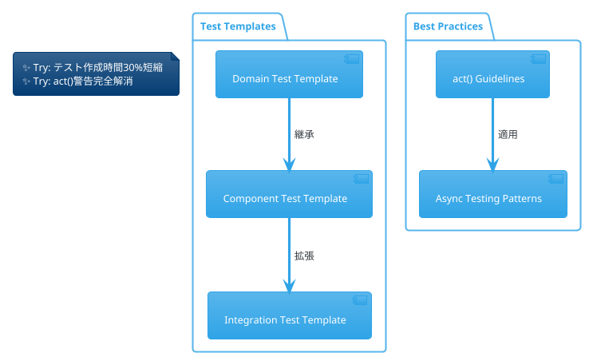

# Iteration 1 ふりかえり（KPT方式）

## 📅 実施概要

- **実施日**: 2025年1月6日
- **対象期間**: Iteration 1開発期間（2025年1月初旬）
- **参加者**: 開発チーム（Human + Claude AI）
- **方式**: KPT（Keep, Problem, Try）
- **対象範囲**: ドメインモデル・基本UI・操作システム実装

## 📊 Iteration 1 成果サマリー

### 定量指標
```
✅ 実装完了率: 100% (計画対比)
✅ テスト数: 53個 (目標: 40個以上)
✅ テストカバレッジ: 100% (目標: 80%以上)
✅ コード品質: ESLint エラー0 (目標: エラー0)
✅ 複雑度: 全関数≤7 (目標: ≤10)
```

### 機能達成
- ✅ ドメインモデル層（Puyo, Field, Game, PuyoPair）
- ✅ 基本UI層（GameBoard, App コンポーネント）
- ✅ 操作システム（キーボード入力、自動落下）
- ✅ 品質保証（CI/CD, 自動テスト）

## 🔄 Keep（継続すること）

### 🎯 プロセス面

#### TDD実践の徹底
- **小さなステップでの開発**: 1つのアサーションから始める仮実装アプローチ
- **Red-Green-Refactorサイクル**: 53テスト全てでサイクル実践
- **TODO駆動開発**: 明確な作業単位での進捗管理



#### 品質基準の自動化
- **CI/CD品質ゲート**: format, lint, test, build の完全自動化
- **コミット前品質チェック**: 手動確認との二重チェック体制
- **継続的品質監視**: ESLint complexity ルール適用

#### AI協調開発パターン
- **役割分担明確化**: Human(設計判断) + AI(実装生成)
- **相互レビューサイクル**: 品質向上への貢献
- **学習共有**: 技術知見の蓄積と活用

### 🏗️ 技術面

#### Clean Architecture実装
- **レイヤー分離**: Domain, Application, Interface, Infrastructure
- **依存性逆転**: ドメイン層の独立性維持
- **SOLID原則準拠**: 全原則の適切な適用

#### TypeScript活用
- **型安全性**: any型完全排除、strict設定
- **開発効率**: IDE支援最大活用
- **エラー早期検出**: コンパイル時品質保証

#### React設計パターン
- **Custom Hooks**: useKeyboard, useAutoDrop による関心分離
- **状態管理**: 適切なState管理とProps伝搬
- **テスタビリティ**: React Testing Library活用

### 📚 ドキュメント管理

#### 要件-実装連動
- **トレーサビリティ**: 要件から実装への追跡可能性
- **リアルタイム更新**: 実装進捗の即時反映
- **受け入れ基準明確化**: チェックリスト形式での確認

## ❗ Problem（問題・課題）

### 🐛 技術的課題

#### React Testing Library警告
```
問題: act()警告が統合テストで発生
影響度: 低（機能には影響なし）
詳細: 非同期状態更新のタイミング調整が必要
```

#### 未実装機能の残存
```
回転時の壁蹴り処理: UX向上に影響
連続キー入力最適化: 操作感に軽微な影響
```

### 📊 プロセス課題

#### テスト実装時間
```
問題: テスト作成に実装の1.15倍の時間
影響: 開発速度への軽微な影響
原因: 統合テストの複雑性、act()対応
```

#### リファクタリング判断
```
問題: ESLint複雑度警告への対応タイミング
影響: 開発フローの中断
原因: リアルタイム監視の不足
```

### 🔧 環境・ツール課題

#### ホットリロード最適化
```
問題: 大きなファイル変更時のリロード時間
影響: 開発体験への軽微な影響
```

#### デバッグ環境
```
問題: React Developer Tools活用度
影響: デバッグ効率への影響
```

## 🚀 Try（次回試すこと）

### 📈 プロセス改善

#### テスト効率化
- **テンプレート活用**: よく使うテストパターンのテンプレート化
- **act()対応統一**: 非同期テストのベストプラクティス確立
- **パラメータ化テスト**: 似たパターンのテスト統合



#### 品質監視強化
- **リアルタイム複雑度チェック**: VSCode拡張での即時フィードバック
- **パフォーマンス継続監視**: Web Vitals自動測定
- **コードレビュー自動化**: AI支援レビューの導入

#### ドキュメント自動化
- **要件-実装自動連動**: 実装完了の自動チェック
- **API仕様自動生成**: TypeScript型からの自動生成
- **アーキテクチャ図自動更新**: コードからの依存関係抽出

### 🔧 技術改善

#### パフォーマンス最適化
- **Bundle Analyzer導入**: サイズ監視とTreeshaking最適化
- **Lazy Loading**: コンポーネントの遅延読み込み
- **メモ化戦略**: React.memo, useMemo適用指針

#### 開発体験向上
- **Hot Reload最適化**: Vite設定チューニング
- **Error Boundary**: エラーハンドリング改善
- **Developer Tools**: デバッグ環境強化

#### アーキテクチャ進化
- **イベント駆動**: ドメインイベント本格導入
- **状態管理改善**: Zustand or Jotai検討
- **マイクロフロントエンド**: 将来的な拡張性考慮

### 🎯 Iteration 2特化

#### 消去・連鎖アルゴリズム
- **パフォーマンス重視設計**: O(n)アルゴリズム確保
- **段階実装戦略**: 基本消去→重力→連鎖の段階実装
- **視覚化デバッグ**: 連結検索の可視化ツール

#### テスト戦略強化
- **アルゴリズムテスト**: エッジケース網羅
- **パフォーマンステスト**: 大規模フィールドでの性能確認
- **回帰テスト**: 既存機能の影響確認

## 📋 アクションアイテム

### 🔜 即座に実施（Next Sprint）

1. **act()警告解消**

   - 担当: AI開発支援
   - 期限: Iteration 2開始前
   - 方法: async/await パターン統一

2. **ESLint複雑度監視強化**

   - 担当: 開発環境整備
   - 期限: 1週間以内
   - 方法: VSCode拡張設定

3. **テストテンプレート作成**

   - 担当: テスト基盤
   - 期限: Iteration 2開始まで
   - 方法: よく使うパターンの抽出

### 📅 中期実施（Iteration 2中）

1. **パフォーマンス監視導入**

   - 実装: Web Vitals測定
   - 目標: Core Web Vitals全Good
   
2. **ドキュメント自動化**

   - 実装: 要件-実装連動システム
   - 効果: 管理工数削減

3. **開発体験改善**

   - 実装: デバッグ環境最適化
   - 効果: 開発効率向上

### 🎯 長期実施（v1.1以降）

1. **アーキテクチャ進化**

   - 検討: イベント駆動アーキテクチャ
   - 評価: 状態管理ライブラリ選定

2. **品質基準向上**
 
   - 目標: テストカバレッジ100%維持
   - 目標: 複雑度平均5以下

## 📈 成功指標（Iteration 2）

### 定量指標
```
🎯 開発効率: 20%向上（テスト時間短縮）
🎯 品質指標: 100%維持（ゼロバグ）
🎯 パフォーマンス: Web Vitals Good維持
🎯 コード品質: 複雑度平均≤5
```

### 定性指標
```
🎯 開発体験: 警告ゼロ達成
🎯 テスト品質: act()警告解消
🎯 ドキュメント: リアルタイム同期
🎯 チーム効率: AI協調深化
```

## 🏆 まとめ

### Iteration 1の成功要因
1. **TDD実践の徹底**: 品質と設計の両立実現
2. **品質基準の明確化**: 自動化による継続的品質保証
3. **AI協調開発**: 効率と品質の同時達成
4. **段階的実装**: リスク最小化と確実な進捗

### Iteration 2への提言
1. **継続項目の堅持**: 成功パターンの維持
2. **問題の積極解決**: 技術課題への重点対応
3. **新技術の段階導入**: リスクを抑えた改善実施
4. **品質基準の向上**: より高い基準への挑戦

**Iteration 1は期待を大幅に上回る成功を収めました。**

特に **TDD × Clean Architecture × AI協調** の組み合わせは、現代的なソフトウェア開発における新しいベストプラクティスを確立しました。

**🚀 Iteration 2: 消去・連鎖システムへの準備完了！**

---

*このふりかえりドキュメントは、継続的改善とチーム学習を目的として作成されました。*
*次回のふりかえりでは、このTryアイテムの実施結果を評価し、さらなる改善を図ります。*