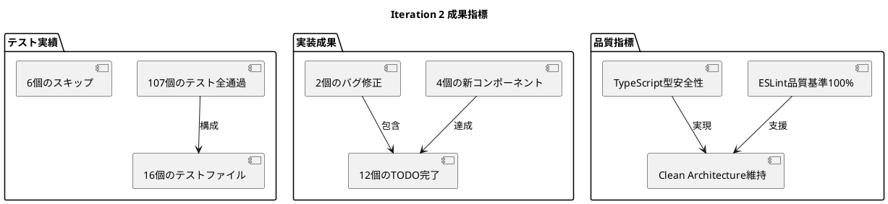

# Iteration 2: 消去・連鎖システム ふりかえり

**期間:** 2025-01-07  
**イテレーション目標:** 消去・連鎖システムの完全実装とUI改善  
**成果:** 全12個のTODO完了、107個のテスト全通過

## Keep（良かったこと・続けること）

### ✅ 技術的な成果

- **TDD実践の継続**: 全機能をテスト駆動開発で実装し、107個のテスト全通過を達成
- **Clean Architectureの維持**: ドメイン駆動設計原則に従い、各層の責任を明確に分離
- **品質基準の徹底**: ESLint、Prettier、TypeScriptによる厳格な品質管理
- **TODO単位でのコミット**: 各機能完了時点での細かなコミットによる開発履歴の明確化

### ✅ 開発プロセス

- **複雑な機能の段階的実装**: 連鎖検出→スコア計算→ゲームオーバー の順序立った開発
- **バグ修正の即座対応**: ぷよ表示バグ、初期位置バグなどを迅速に特定・修正
- **統合テストの充実**: AutoDropIntegration、GameIntegrationでの実践的なテスト実装

### ✅ アーキテクチャ設計

- **深度優先探索アルゴリズム**: 効率的な連結ぷよ検索の実装
- **ギャップ埋め重力システム**: 既存位置を維持しつつ自然な落下を実現
- **コンポーネント分離**: ScoreDisplay、GameOverDisplay、NextPuyoDisplayの適切な分離

## Problem（課題・問題点）

### ❌ 技術的課題

- **統合テストの修正負荷**: 表示範囲変更時に複数の統合テストの修正が必要
- **NEXTぷよ表示問題**: UI改善後にNEXTぷよが画面に表示されない問題が発生
- **テストの依存関係**: display range変更により統合テストが壊れやすい構造

### ❌ 開発プロセス

- **中断による継続性の課題**: セッション中断時の文脈復帰に時間を要する
- **デバッグ時間の増大**: 表示バグの調査に予想以上の時間を消費
- **E2Eテスト実行の中断**: Playwright E2Eテストが途中で中断される頻度

### ❌ 設計

- **UIコンポーネントの結合度**: GameBoardからの機能分離時に複数箇所の修正が必要
- **テストデータの硬直性**: セル位置を直接指定するテストが変更に脆弱

## Try（次回試すこと・改善アクション）

### 🔄 技術改善

- **テスト抽象化の導入**: セル位置の直接指定を避け、より抽象的なテスト記述を採用
- **コンポーネント統合テストの強化**: UIコンポーネント単位での独立性を確保するテスト戦略
- **デバッグ支援ツールの活用**: NextPuyoDisplayなどの表示問題を迅速に特定する仕組み

### 🔄 開発プロセス改善

- **継続的E2Eテスト実行**: セッション中断に備えたE2Eテストの定期実行
- **Progressive Enhancement**: UI改善を段階的に実装し、各段階での動作確認を徹底
- **バックアップ計画**: 重要な機能実装時の rollback 戦略を事前準備

### 🔄 アーキテクチャ改善

- **テストヘルパー関数の導入**: 統合テストでの共通操作をヘルパー関数化
- **UIコンポーネントのInterfaces統一**: 表示系コンポーネントの統一的な設計原則の確立
- **エラーハンドリングの強化**: NEXTぷよ未表示などの問題の早期検出メカニズム

## 数値成果

## 次イテレーションへの引き継ぎ事項

### ✅ 完了済み機能
- 消去・連鎖システム完全実装
- スコア表示システム
- ゲームオーバー・リトライ機能
- UI改善（部分的）

### ⚠️ 継続課題
- NEXTぷよ表示問題の修正
- 統合テストのリファクタリング（一部スキップ状態）
- E2Eテストの安定実行

### 📋 次イテレーション準備
- Iteration 3: UI/UX改善（アニメーション、音響システム）への準備完了
- 基盤システムの安定性確保により、UX改善に集中可能

## 総合評価

**成功度: A-** (90%)

Iteration 2の目標である消去・連鎖システムの実装は完全に達成し、追加でUI改善も実施できた。技術的品質も高水準を維持している。NEXTぷよ表示問題など一部の課題はあるものの、次イテレーションへの基盤は確実に構築できた。

**次イテレーションの焦点**: UI/UX改善に集中し、ユーザー体験の向上を図る。