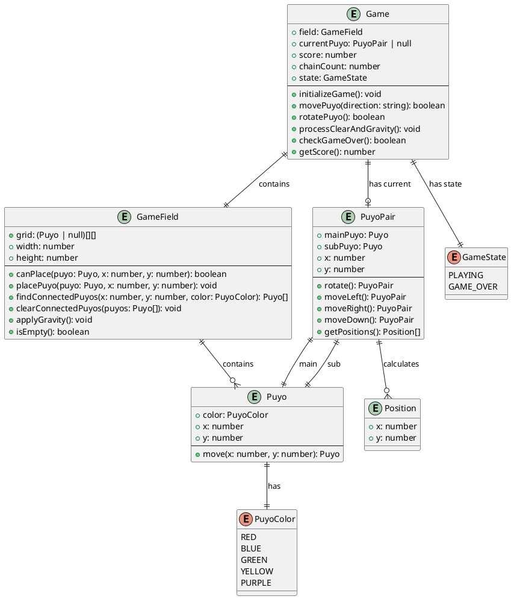
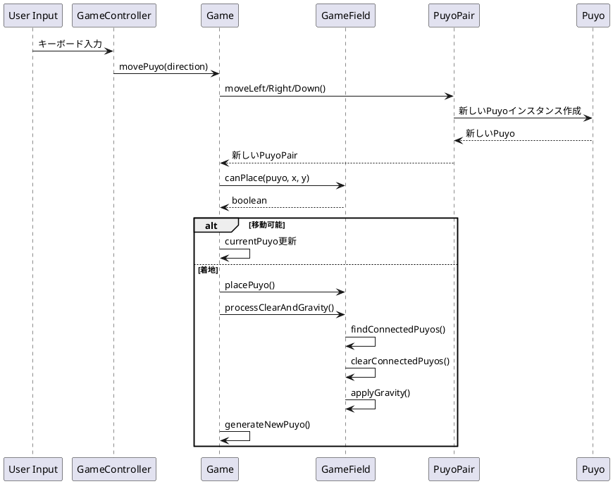

# データモデル設計

## 概要

ぷよぷよゲームシステムのデータモデルを定義します。各エンティティの属性と関係性、データ構造を明確にします。

## エンティティ関係図

## データ構造仕様

### Game（ゲーム状態）
ゲーム全体の状態を管理するメインエンティティ

| 属性 | 型 | 説明 |
|------|------|------|
| field | GameField | ゲームフィールド |
| currentPuyo | PuyoPair \| null | 現在操作中のぷよペア |
| score | number | 現在のスコア |
| chainCount | number | 連鎖カウント |
| state | GameState | ゲーム状態 |

### GameField（ゲームフィールド）
ぷよが配置されるフィールドの状態を管理

| 属性 | 型 | 説明 |
|------|------|------|
| grid | (Puyo \| null)[][] | フィールドのグリッド（6列×13行） |
| width | number | フィールドの幅（6） |
| height | number | フィールドの高さ（13） |

**制約:**
- width: 6（固定）
- height: 13（固定）
- grid[y][x]: Y座標が行、X座標が列

### PuyoPair（ぷよペア）
プレイヤーが操作する2つのぷよの組み合わせ

| 属性 | 型 | 説明 |
|------|------|------|
| mainPuyo | Puyo | メインぷよ（軸ぷよ） |
| subPuyo | Puyo | サブぷよ（回転するぷよ） |
| x | number | ペアの基準X座標 |
| y | number | ペアの基準Y座標 |

**制約:**
- mainPuyoの位置がペアの基準位置
- subPuyoはmainPuyoを中心に回転
- 初期位置: x=2, y=0

### Puyo（ぷよ）
個別のぷよオブジェクト

| 属性 | 型 | 説明 |
|------|------|------|
| color | PuyoColor | ぷよの色 |
| x | number | X座標 |
| y | number | Y座標 |

**制約:**
- 不変オブジェクト（移動時は新しいインスタンスを作成）
- 座標は0以上の整数

### PuyoColor（ぷよの色）
ぷよの色を表す列挙型

| 値 | 説明 |
|------|------|
| RED | 赤色 |
| BLUE | 青色 |
| GREEN | 緑色 |
| YELLOW | 黄色 |
| PURPLE | 紫色 |

### GameState（ゲーム状態）
ゲームの状態を表す列挙型

| 値 | 説明 |
|------|------|
| PLAYING | ゲームプレイ中 |
| GAME_OVER | ゲームオーバー |

### Position（座標）
X、Y座標を表すヘルパー型

| 属性 | 型 | 説明 |
|------|------|------|
| x | number | X座標 |
| y | number | Y座標 |

## データフロー

## 永続化戦略

### 現在の実装
- インメモリデータのみ
- ページリロードで状態リセット

### 将来の拡張可能性
- ローカルストレージによるハイスコア保存
- セッションストレージによるゲーム状態保存
- サーバーサイドによるランキング機能

## データ制約

### フィールド制約
- フィールドサイズ: 6列×13行（固定）
- 座標系: 左上が(0,0)、右下が(5,12)
- 初期ぷよ生成位置: (2,0)

### ぷよ制約
- 同時に存在するぷよ色: 最大5色
- 消去条件: 同色4つ以上の接続
- 連鎖計算: 2^(n-1)倍のボーナス

### スコア制約
- 基本スコア: 消去ぷよ数 × 10点
- 連鎖ボーナス: 基本スコア × 2^(連鎖数-1)
- 全消しボーナス: 2000点（固定）

### ゲーム状態制約
- ゲームオーバー条件: 初期位置(2,0)にぷよ配置不可
- リスタート: 全データを初期状態にリセット