# ドメインモデル設計

## 概要

ぷよぷよゲームのドメインモデルを定義します。ドメイン駆動設計（DDD）の原則に従い、ビジネスロジックを適切にモデル化します。

## ドメインの境界

### ゲームコア（Game Core）
ぷよぷよゲームの中核となるドメイン

**責務:**
- ゲーム状態の管理
- ぷよの操作と移動
- 消去・連鎖ロジック
- スコア計算

## エンティティ設計

### Game（ゲームエンティティ）
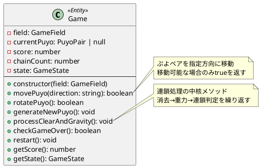

**ビジネスルール:**
- ゲームは一つのGameFieldを持つ
- 同時に操作できるPuyoPairは最大1つ
- 連鎖は自動的に処理される
- ゲームオーバー時は新しいぷよ生成を停止

### GameField（フィールドエンティティ）
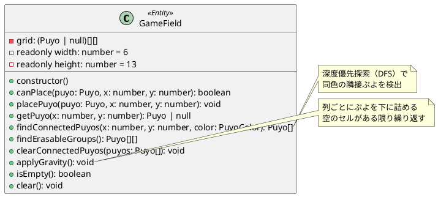

**ビジネスルール:**
- フィールドサイズは6列×13行（固定）
- 座標系は左上が(0,0)、右下が(5,12)
- 同色4つ以上の接続で消去対象
- 重力は列単位で適用

## 値オブジェクト設計

### PuyoPair（ぷよペア値オブジェクト）
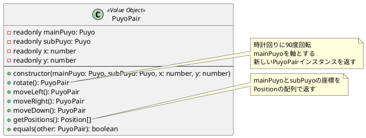

**不変性の保証:**
- 全てのプロパティはreadonly
- 操作メソッドは新しいインスタンスを返す
- 等価性はすべてのプロパティで判定

### Puyo（ぷよ値オブジェクト）
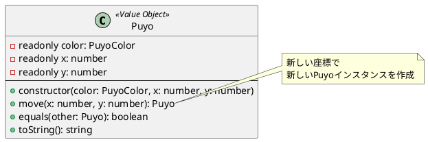

**ビジネスルール:**
- 色は5種類（RED, BLUE, GREEN, YELLOW, PURPLE）
- 座標は0以上の整数
- 同一色・同一座標のぷよは等価

## 列挙型設計

### PuyoColor（ぷよの色）
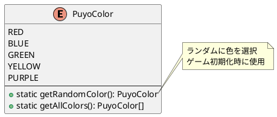

### GameState（ゲーム状態）
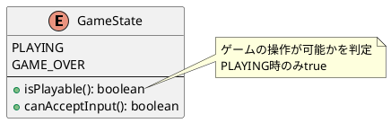

## ドメインサービス設計

### PuyoGeneratorService（ぷよ生成サービス）
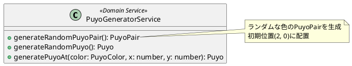

### ScoreCalculationService（スコア計算サービス）
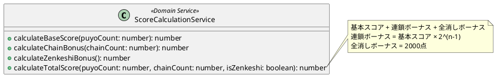

## ドメインイベント設計

### PuyoErasedEvent（ぷよ消去イベント）
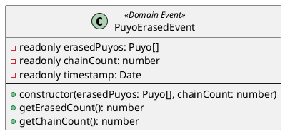

### ChainCompletedEvent（連鎖完了イベント）
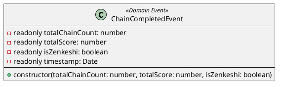

## 集約設計

### Game集約
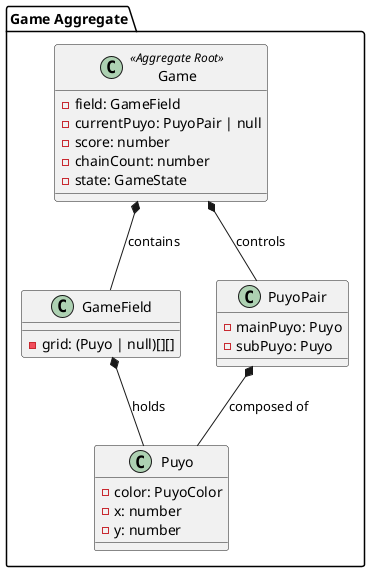

**集約の境界:**
- Gameが集約ルート
- 外部からはGameを通じてのみアクセス
- GameField、PuyoPair、Puyoは内部要素

## ドメインルール

### 1. ぷよ移動ルール
- ぷよペアは左右・下方向に移動可能
- フィールド境界を超えた移動は無効
- 他のぷよとの衝突時は移動不可
- 着地時は次のぷよペアを自動生成

### 2. ぷよ回転ルール
- 時計回り90度回転のみ
- mainPuyoを軸として回転
- 壁際では1マスまでキック処理
- 回転不可能時は現状維持

### 3. ぷよ消去ルール
- 同色4つ以上の隣接で消去
- 4方向の隣接のみ有効（斜めは無効）
- 消去は深度優先探索で判定
- 消去後は重力が自動適用

### 4. 連鎖ルール
- 重力適用後に新たな消去パターンがあれば連鎖
- 連鎖数は累積でカウント
- 連鎖ボーナス = 2^(連鎖数-1)
- 連鎖が終了するまで新しいぷよは生成されない

### 5. スコアルール
- 基本スコア = 消去ぷよ数 × 10点
- 連鎖ボーナス = 基本スコア × 連鎖倍率
- 全消しボーナス = 2000点（固定）
- 総スコア = 基本スコア + 連鎖ボーナス + 全消しボーナス

### 6. ゲームオーバールール
- 新しいぷよペアが初期位置(2,0)に配置不可能
- ゲームオーバー時は操作入力を無効化
- リスタート時は全状態を初期化

## 不変条件

### Game集約の不変条件
1. フィールドサイズは常に6×13
2. スコアは0以上の整数
3. 連鎖カウントは0以上の整数
4. 操作中のぷよペアは最大1つ
5. ゲームオーバー時は新しいぷよ生成禁止

### GameFieldの不変条件
1. グリッドの範囲外アクセス禁止
2. 同一座標に複数のぷよ配置禁止
3. 空のセルはnull、ぷよがある場合はPuyoインスタンス
4. 重力適用後は下詰め状態を維持

### PuyoPair/Puyoの不変条件
1. 座標は0以上の整数
2. 色は定義された5色のいずれか
3. インスタンス生成後の状態変更禁止（不変性）
4. 等価性は全プロパティで判定