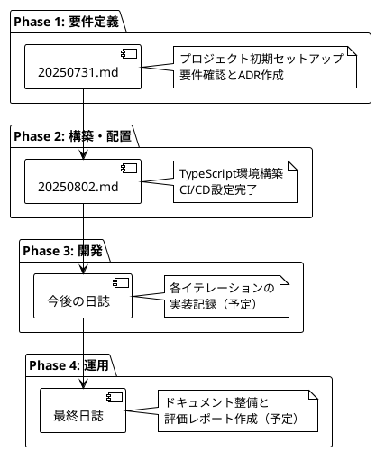

# 開発日誌

## 概要

このセクションでは、ぷよぷよゲーム開発プロジェクトの日々の開発記録を保管しています。各日の作業内容、発見した問題、解決策、学習内容などを記録しています。

## 日誌一覧

- [2025-08-02](./20250802.md) - Phase 2: 構築・配置フェーズの実装
- [2025-07-31](./20250731.md) - プロジェクト初期セットアップ

## 記録の目的

### 学習の記録
- 新しい技術や手法の習得過程
- 問題解決のアプローチと結果
- 設計決定の理由と結果

### 進捗の追跡
- 各フェーズ・イテレーションの進捗状況
- 計画との乖離と調整内容
- 完了したタスクと残作業

### 知識の蓄積
- 遭遇した問題と解決方法
- 有効だった手法やツール
- 今後に活かせる教訓

## 日誌の形式

各日誌は以下の構成で記録されます：

### 基本情報
- 日付
- 作業時間
- 主要な成果物

### 作業内容
- 実装した機能
- 解決した問題
- 学習した内容

### 発見と学習
- 新しい知見
- 技術的な発見
- 改善点の識別

### 次回への引き継ぎ
- 残作業
- 注意点
- 検討事項

## 開発フェーズと日誌

## 振り返りと改善

### 定期的な振り返り
- 各イテレーション終了時のふりかえり
- フェーズ完了時の総括
- プロジェクト全体の振り返り

### 改善サイクル
- Keep: 継続すべき良い実践
- Problem: 発生した問題や課題
- Try: 次回試したい改善策

### 知識の共有
- 学習内容の文書化
- 問題解決パターンの蓄積
- ベストプラクティスの抽出

## メトリクスと測定

### 開発効率
- 各タスクの実行時間
- 問題解決にかかった時間
- リファクタリング頻度

### 品質指標
- テストカバレッジの推移
- バグ発見・修正の記録
- コードレビューの結果

### 学習効果
- 新技術の習得速度
- 問題解決能力の向上
- 設計スキルの成長

## 関連リンク

- [開発ドキュメント](../development/) - 開発計画とプロセス
- [要件定義](../requirements/) - プロジェクト要件
- [運用ドキュメント](../operation/) - 環境構築とCI/CD
- [アーキテクチャ決定ログ](../adr/) - 技術選択の記録