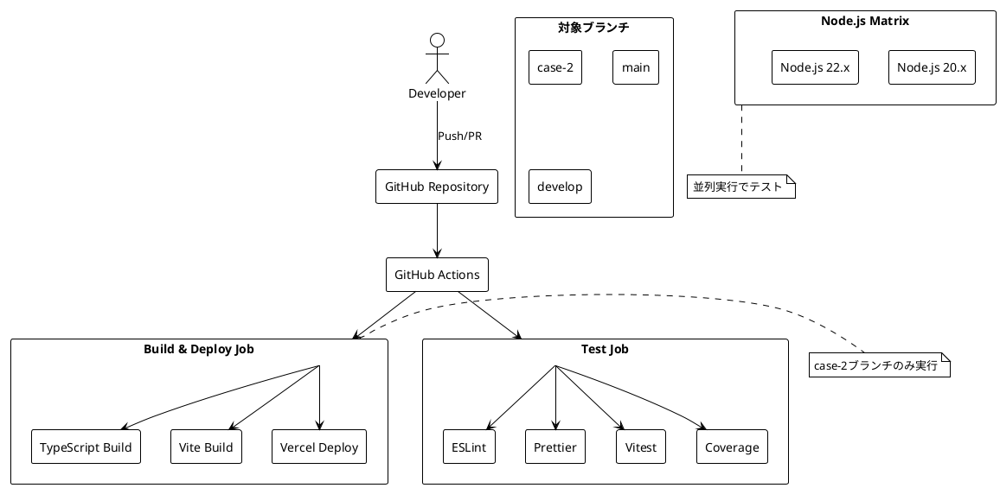

# CI/CD設定手順

## 概要

このドキュメントでは、ぷよぷよゲームアプリケーションのCI/CDパイプラインの設定手順について説明します。GitHub ActionsとVercelを使用して、自動テスト・ビルド・デプロイを実現します。

## アーキテクチャ



## 設定ファイル

### GitHub Actions設定（.github/workflows/ci.yml）

```yaml
name: CI

on:
  push:
    branches: [ case-2, main, develop ]
  pull_request:
    branches: [ case-2, main, develop ]

jobs:
  test:
    runs-on: ubuntu-latest
    
    strategy:
      matrix:
        node-version: [20.x, 22.x]
    
    steps:
    - uses: actions/checkout@v4
    
    - name: Use Node.js ${{ matrix.node-version }}
      uses: actions/setup-node@v4
      with:
        node-version: ${{ matrix.node-version }}
        cache: 'npm'
        cache-dependency-path: app/package-lock.json
    
    - name: Install dependencies
      working-directory: ./app
      run: npm ci
    
    - name: Run linter
      working-directory: ./app
      run: npm run lint
    
    - name: Run formatter check
      working-directory: ./app
      run: npm run format:check
    
    - name: Run tests
      working-directory: ./app
      run: npm run test
    
    - name: Run test coverage
      working-directory: ./app
      run: npm run test:coverage
    
    - name: Build
      working-directory: ./app
      run: npm run build
    
    - name: Upload coverage reports to Codecov
      uses: codecov/codecov-action@v4
      with:
        file: ./app/coverage/lcov.info
        fail_ci_if_error: false

  build-and-deploy:
    needs: test
    runs-on: ubuntu-latest
    if: github.ref == 'refs/heads/case-2'
    
    steps:
      - uses: actions/checkout@v4
      
      - name: Use Node.js 22.x
        uses: actions/setup-node@v4
        with:
          node-version: 22.x
          cache: 'npm'
          cache-dependency-path: app/package-lock.json
      
      - name: Install dependencies
        working-directory: ./app
        run: npm ci
      
      - name: Setup Environment Variables
        run: |
          echo VITE_APP_API_URL=${{ vars.DEV_APP_API_URL }} > .env
        working-directory: app

      - name: Install Vercel CLI
        run: npm install --global vercel@latest

      - name: Pull Vercel Environment Information
        run: vercel pull --yes --environment=preview --token=${{ secrets.VERCEL_TOKEN }}
        working-directory: app

      - name: Build Project Artifacts
        run: vercel build --token=${{ secrets.VERCEL_TOKEN }}
        working-directory: app

      - name: Deploy Project Artifacts to Vercel
        run: vercel deploy --prebuilt --token=${{ secrets.VERCEL_TOKEN }}
        working-directory: app
```

## セットアップ手順

### 1. GitHub Repository設定

#### 1.1 ブランチ保護設定

```bash
# リポジトリの Settings > Branches で以下を設定
- Branch name pattern: main, develop, case-*
- Require status checks to pass before merging: ✓
- Require branches to be up to date before merging: ✓
- Status checks: CI/test
```

#### 1.2 必要なシークレット設定

| シークレット名 | 説明 | 取得方法 |
|---------------|------|----------|
| `VERCEL_TOKEN` | Vercelデプロイ用トークン | Vercel Dashboard > Settings > Tokens |

#### 1.3 環境変数設定

| 変数名 | 説明 | 例 |
|--------|------|-----|
| `DEV_APP_API_URL` | 開発環境API URL | `https://api.dev.example.com` |

### 2. Vercel設定

#### 2.1 プロジェクト作成

```bash
# Vercel CLIでプロジェクト作成
npm install -g vercel
cd app
vercel
```

#### 2.2 プロジェクト設定

```json
{
  "name": "puyo-puyo-game",
  "buildCommand": "npm run build",
  "outputDirectory": "dist",
  "installCommand": "npm ci",
  "devCommand": "npm run dev",
  "framework": "vite"
}
```

#### 2.3 環境変数設定

```bash
# Vercel Dashboard > Project > Settings > Environment Variables
VITE_APP_API_URL=https://api.example.com
```

### 3. Codecov設定（オプション）

#### 3.1 Codecovアカウント連携

1. [Codecov](https://codecov.io/)でGitHubアカウント連携
2. リポジトリを追加
3. Upload Tokenを取得（通常は不要）

#### 3.2 カバレッジ設定

```json
// .c8rc.json
{
  "reporter": ["text", "html", "json", "lcov"],
  "reportsDirectory": "coverage",
  "exclude": [
    "dist/**",
    "node_modules/**",
    "**/*.test.ts",
    "**/*.config.js",
    "**/*.config.ts"
  ],
  "all": true,
  "checkCoverage": true,
  "branches": 80,
  "functions": 80,
  "lines": 80,
  "statements": 80
}
```

## ワークフロー説明

### テストジョブ（test）

1. **マトリックス実行**: Node.js 20.x, 22.x で並列実行
2. **品質チェック**: 
   - ESLint（静的解析）
   - Prettier（フォーマットチェック）
   - Vitest（単体テスト）
   - c8（コードカバレッジ）
3. **ビルド確認**: TypeScript + Viteビルド

### デプロイジョブ（build-and-deploy）

1. **実行条件**: case-2ブランチへのプッシュ時のみ
2. **依存関係**: testジョブの成功が前提
3. **デプロイフロー**:
   - 依存関係インストール
   - 環境変数設定
   - Vercelビルド
   - Vercelデプロイ

## トラブルシューティング

### よくあるエラー

#### 1. Node.js バージョン不一致

```bash
# エラー例
Error: Node.js version 18.x is not supported

# 解決策
# .github/workflows/ci.yml の node-version を確認
# app/package.json の engines を確認
```

#### 2. Vercelデプロイ失敗

```bash
# エラー例
Error: Vercel deployment failed

# 解決策
# 1. VERCEL_TOKEN の確認
# 2. プロジェクト設定の確認
# 3. 環境変数の確認
```

#### 3. テスト失敗

```bash
# ローカルでテスト実行
cd app
npm run test

# カバレッジ確認
npm run test:coverage

# 品質チェック
npm run check
```

### デバッグ手順

#### 1. ローカル環境での確認

```bash
# 依存関係の再インストール
cd app
rm -rf node_modules package-lock.json
npm install

# 品質チェック実行
npm run check

# ビルド確認
npm run build
```

#### 2. GitHub Actions ログ確認

1. GitHub Repository > Actions タブ
2. 失敗したワークフローを選択
3. 各ステップのログを確認
4. エラーメッセージを分析

#### 3. Vercel デプロイログ確認

1. Vercel Dashboard > Project
2. Deployments タブ
3. 失敗したデプロイを選択
4. ビルドログを確認

## セキュリティ考慮事項

### シークレット管理

- 機密情報は必ずGitHub Secretsに保存
- 環境変数名には機密情報を含めない
- 定期的なトークンの更新

### アクセス制御

- ブランチ保護ルールの設定
- 必要最小限の権限付与
- レビュープロセスの徹底

## 参考資料

- [GitHub Actions Documentation](https://docs.github.com/en/actions)
- [Vercel Documentation](https://vercel.com/docs)
- [Codecov Documentation](https://docs.codecov.com/)
- [Vite CI/CD Guide](https://vitejs.dev/guide/static-deploy.html)