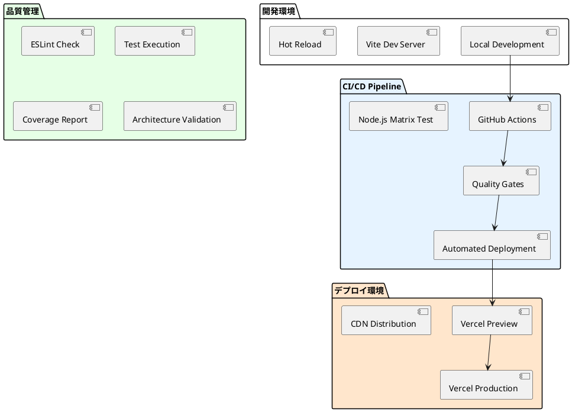
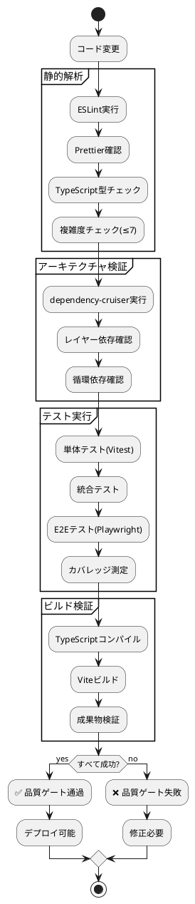

# 運用ドキュメント

## 概要

ぷよぷよゲームプロジェクトの運用・保守・監視に関するドキュメント群です。開発環境から本番環境まで、包括的な運用手順と設定情報を提供します。

## ドキュメント一覧

### 環境構築・設定
- [セットアップ](./セットアップ.md) - 開発環境のセットアップ手順
- [環境構築](./環境構築.md) - 各種環境の構築手順
- [MkDocs GitHub Actions設定](./MkDocs_GitHub_Actions設定.md) - GitHub ActionsでMkDocsを自動化する手順

## 運用環境

### Phase 2実装済み運用基盤



### 技術スタック

| カテゴリ | 技術 | バージョン | 用途 |
| :--- | :--- | :--- | :--- |
| **ドキュメンテーション** | MkDocs + Material | latest | プロジェクトドキュメント |
| **アプリケーション** | React + TypeScript | 19.1.1 / 5.8.3 | ゲームアプリケーション |
| **ビルド** | Vite | 7.1.2 | 開発・ビルドツール |
| **テスト** | Vitest + Playwright | 3.2.4 / 1.54.2 | 単体・E2Eテスト |
| **品質管理** | ESLint + Prettier | latest | コード品質 |
| **CI/CD** | GitHub Actions | - | 継続的統合・デプロイ |
| **ホスティング** | Vercel | - | アプリケーション配信 |
| **監視** | Codecov | - | テストカバレッジ監視 |

## 開発・運用フロー

### 開発フロー

```plantuml
@startuml "開発運用フロー"
start

partition "ローカル開発" {
  :コード変更;
  :ローカルテスト実行;
  :品質チェック;
  
  if (品質OK?) then (yes)
    :コミット作成;
  else (no)
    :修正対応;
    :修正対応; --> :ローカルテスト実行;
  endif
}

partition "CI/CD Pipeline" {
  :GitHub Actions起動;
  
  parallel
    :Node.js 20.x テスト;
  parallel  
    :Node.js 22.x テスト;
  end parallel
  
  :品質ゲート確認;
  
  if (すべて成功?) then (yes)
    if (develop branch?) then (yes)
      :Vercel自動デプロイ;
    else (no)
      :ビルド完了;
    endif
  else (no)
    :失敗通知;
  endif
}

stop
@enduml
```

### 品質ゲート



## 環境別設定

### Local Development
- **起動コマンド:**
  `npm run dev`
- **ポート:**
  3000
- **Hot Reload:**
  有効
- **テスト:**
  `npm run test`

### CI Environment (GitHub Actions)
- **Node.js バージョン:**
  20.x, 22.x (マトリックステスト)
- **実行OS:**
  Ubuntu Latest
- **キャッシュ:**
  npm cache有効
- **並列実行:**
  複数Node.jsバージョン同時実行

### Production (Vercel)
- **デプロイトリガー:**
  develop branchへのpush
- **ビルドコマンド:**
  `npm run build`
- **出力ディレクトリ:**
  `dist`
- **CDN:**
  グローバル配信

## 監視・ログ

### テストカバレッジ監視
- **サービス:**
  Codecov
- **レポート:**
  プルリクエスト時自動コメント
- **しきい値:**
  80%目標（現在40%）

### 品質メトリクス
- **サイクロマティック複雑度:**
  最大7
- **型安全性:**
  TypeScript strict mode
- **アーキテクチャ違反:**
  dependency-cruiser自動検出

## 運用手順

### 緊急対応
1. **問題検知:**
   GitHub Actions失敗通知、Vercelデプロイエラー
2. **影響範囲確認:**
   テスト結果、ビルドログ確認
3. **修正対応:**
   ローカル環境で再現・修正
4. **検証:**
   品質ゲート通過確認
5. **デプロイ:**
   修正版のリリース

### 定期メンテナンス
- **依存関係更新:**
  セキュリティパッチ適用
- **ドキュメント更新:**
  設定変更の記録
- **パフォーマンス監視:**
  ビルド時間・テスト実行時間

## Phase 3運用準備

### イテレーション運用
- **ブランチ戦略:**
  feature -> develop -> main
- **レビュープロセス:**
  プルリクエストレビュー
- **デプロイ戦略:**
  段階的リリース

### 監視強化予定
- **パフォーマンス監視:**
  ゲーム実行時パフォーマンス
- **ユーザー体験監視:**
  操作性・レスポンス性
- **エラー監視:**
  実行時エラー追跡

## 関連ドキュメント

- [要件定義](../requirements/index.md)
- [設計ドキュメント](../design/index.md)
- [開発ドキュメント](../development/index.md)
- [アーキテクチャ決定記録 (ADR)](../adr/index.md)

---

**最終更新:** Phase 2 完了時  
**更新者:** Claude Code Assistant