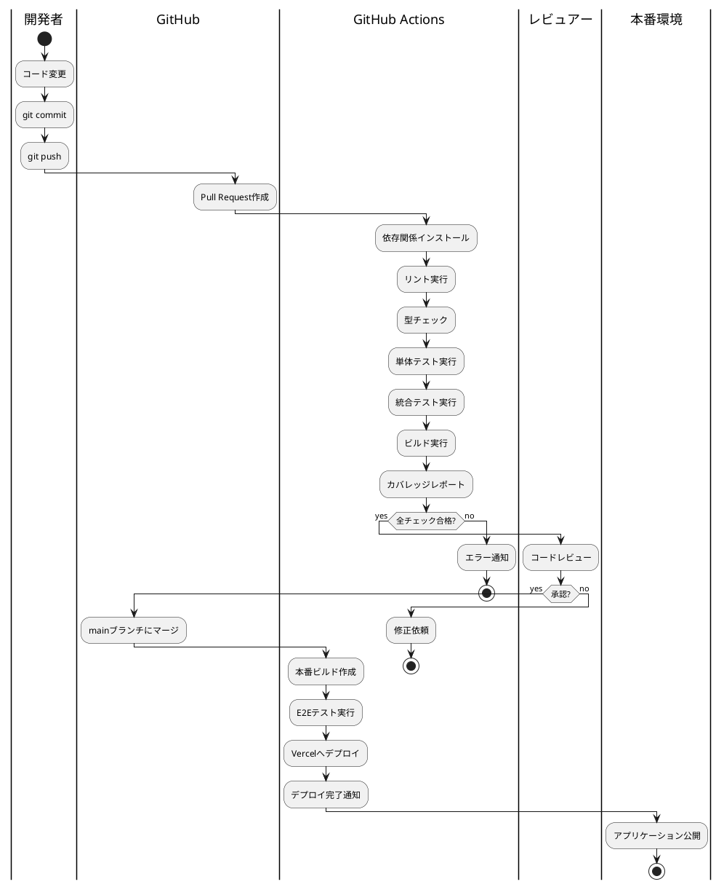
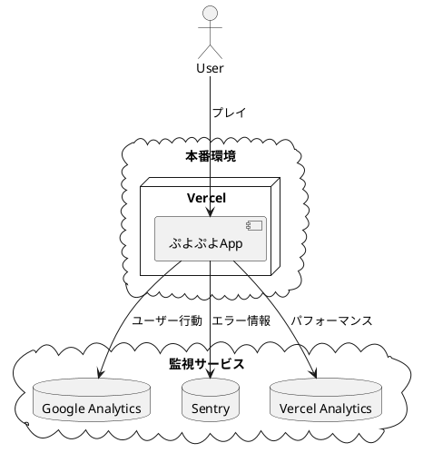
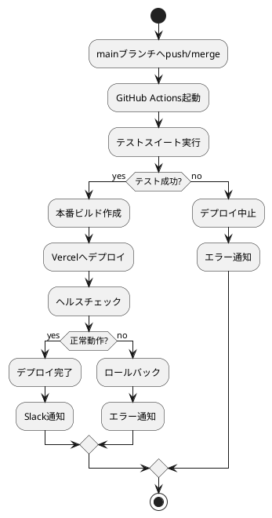
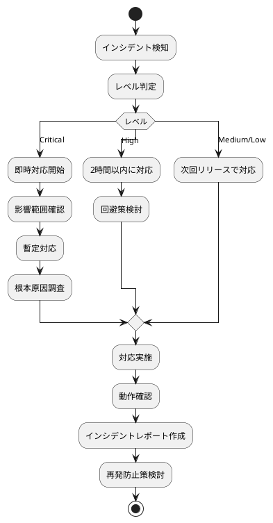
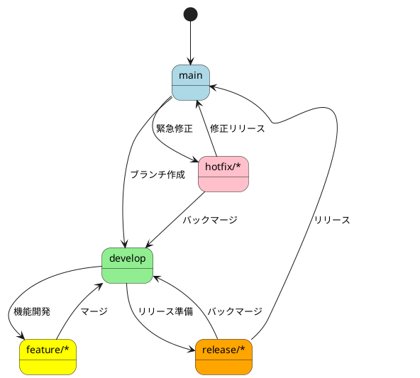

# 運用要件定義

## 概要

ぷよぷよゲームの開発から本番運用まで、継続的な品質向上とスムーズな運用を実現するための要件を定義します。

## CI/CDパイプライン設計



### GitHub Actions設定

```yaml
# .github/workflows/ci.yml
name: CI/CD Pipeline

on:
  push:
    branches: [main, develop]
  pull_request:
    branches: [main]

jobs:
  test:
    runs-on: ubuntu-latest
    steps:
      - uses: actions/checkout@v3
      - uses: actions/setup-node@v3
        with:
          node-version: '18'
          cache: 'npm'
      
      - name: Install dependencies
        run: npm ci
      
      - name: Run linter
        run: npm run lint
      
      - name: Run type check
        run: npm run type-check
      
      - name: Run tests
        run: npm run test:ci
      
      - name: Build application
        run: npm run build
      
      - name: Upload coverage
        uses: codecov/codecov-action@v3

  deploy:
    needs: test
    if: github.ref == 'refs/heads/main'
    runs-on: ubuntu-latest
    steps:
      - uses: actions/checkout@v3
      - uses: amondnet/vercel-action@v20
        with:
          vercel-token: ${{ secrets.VERCEL_TOKEN }}
          vercel-org-id: ${{ secrets.ORG_ID }}
          vercel-project-id: ${{ secrets.PROJECT_ID }}
```

## 環境構成

### 環境一覧

| 環境 | 用途 | URL | 自動デプロイ |
|------|------|-----|-------------|
| Local | 開発 | http://localhost:5173 | - |
| Preview | PR確認 | https://pr-*.vercel.app | PR作成時 |
| Staging | 統合テスト | https://staging.puyo.app | developマージ時 |
| Production | 本番 | https://puyo.app | mainマージ時 |

### 環境変数管理

```typescript
// 環境変数定義
interface EnvConfig {
  NODE_ENV: 'development' | 'staging' | 'production';
  VITE_API_URL: string;
  VITE_GA_ID?: string;
  VITE_SENTRY_DSN?: string;
}

// .env.example
NODE_ENV=development
VITE_API_URL=http://localhost:3000
VITE_GA_ID=
VITE_SENTRY_DSN=
```

## 監視・観測戦略

### アプリケーション監視



### 監視項目

| カテゴリ | 項目 | ツール | アラート条件 |
|---------|------|--------|-------------|
| パフォーマンス | FPS | Web Vitals | < 30 FPS |
| パフォーマンス | 応答時間 | Vercel Analytics | > 3秒 |
| エラー | JSエラー | Sentry | エラー率 > 1% |
| 利用状況 | DAU/MAU | Google Analytics | - |
| 可用性 | アップタイム | Vercel | < 99.9% |

### ログ収集

```typescript
// ログ設定
class Logger {
  error(message: string, context?: any) {
    console.error(message, context);
    Sentry.captureException(new Error(message), { extra: context });
  }
  
  warn(message: string, context?: any) {
    console.warn(message, context);
    if (process.env.NODE_ENV === 'production') {
      Sentry.captureMessage(message, 'warning');
    }
  }
  
  info(message: string, context?: any) {
    console.info(message, context);
  }
}
```

## デプロイメント手順

### 自動デプロイフロー



### 手動デプロイ手順

```bash
# 1. 最新のmainブランチを取得
git checkout main
git pull origin main

# 2. ビルドとテスト
npm install
npm run test
npm run build

# 3. Vercelデプロイ
vercel --prod

# 4. 動作確認
# https://puyo.app にアクセスして確認
```

## 運用手順書

### 日次運用

| 時刻 | 作業内容 | 担当 |
|------|---------|------|
| 09:00 | 監視ダッシュボード確認 | 運用担当 |
| 09:30 | エラーログ確認・対応 | 開発担当 |
| 17:00 | 日次レポート作成 | 運用担当 |

### 週次運用

- パフォーマンスレポート分析
- セキュリティアップデート確認
- 依存関係の更新

### 月次運用

- 利用統計レポート作成
- インフラコスト分析
- キャパシティプランニング

## インシデント対応

### インシデントレベル

| レベル | 定義 | 対応時間 | 例 |
|--------|------|----------|-----|
| Critical | サービス停止 | 30分以内 | アプリが起動しない |
| High | 主要機能障害 | 2時間以内 | ゲームプレイ不可 |
| Medium | 一部機能障害 | 24時間以内 | スコア表示異常 |
| Low | 軽微な不具合 | 1週間以内 | UIの軽微なずれ |

### 対応フロー



## バックアップ・復旧計画

### バックアップ対象

| 対象 | 頻度 | 保持期間 | 保存先 |
|------|------|----------|--------|
| ソースコード | 即時 | 永続 | GitHub |
| 環境設定 | 変更時 | 30日 | GitHub Secrets |
| ユーザーデータ | - | - | ローカルストレージ |

### 災害復旧手順

1. **サービス停止時**
   ```bash
   # Vercelの別リージョンへ再デプロイ
   vercel --prod --regions sfo1
   ```

2. **データ喪失時**
   - ユーザーデータ: ローカルストレージのため復旧不要
   - アプリケーション: GitHubから再デプロイ

3. **セキュリティインシデント**
   - 即座にアクセス制限
   - 影響範囲の調査
   - パッチ適用とredeployment

## 開発フロー（Git Flow）



### ブランチ戦略

| ブランチ | 用途 | マージ先 | 命名規則 |
|---------|------|----------|----------|
| main | 本番環境 | - | main |
| develop | 開発統合 | main | develop |
| feature/* | 機能開発 | develop | feature/機能名 |
| release/* | リリース準備 | main, develop | release/バージョン |
| hotfix/* | 緊急修正 | main, develop | hotfix/修正内容 |

### コミットメッセージ規約

```
<type>(<scope>): <subject>

<body>

<footer>
```

**Type:**

- feat: 新機能
- fix: バグ修正
- docs: ドキュメント
- style: フォーマット
- refactor: リファクタリング
- test: テスト
- chore: ビルド・補助ツール

**例:**
```
feat(game): 連鎖ボーナス計算の実装

4連鎖以上で特別ボーナスが付与される機能を追加
- 連鎖数に応じた倍率計算
- アニメーション演出の追加

Closes #123
```