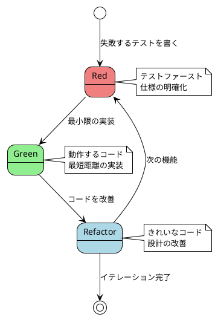
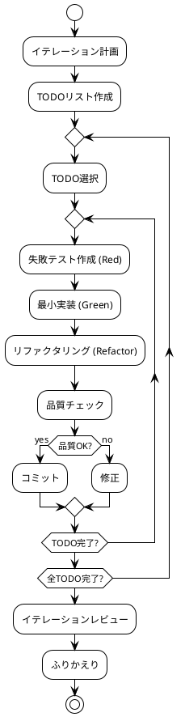
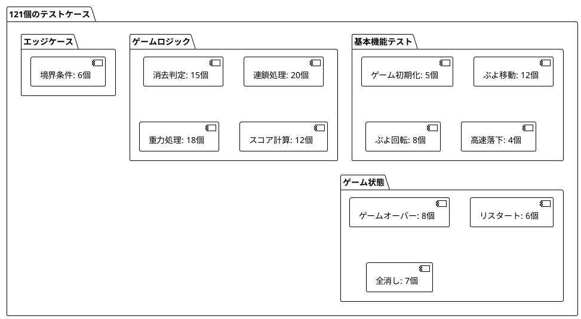

# 実装

## 概要

このドキュメントは、ぷよぷよゲームの実装詳細について説明します。テスト駆動開発（TDD）のRed-Green-Refactorサイクルに従い、8つのイテレーションを通じて段階的に機能を実装しました。

## 実装アプローチ

### テスト駆動開発（TDD）サイクル



### イテレーション開発プロセス



## イテレーション別実装詳細

### イテレーション1: ゲーム開始の実装

#### 実装戦略
- **インサイドアウトアプローチ**: データモデルから実装開始
- **仮実装**: 最小限のコードでテストを通す
- **三角測量**: 複数のテストケースで一般化

#### 核心実装

**Game.ts（初期版）**
```typescript
export class Game {
  private field: number[][]
  private currentPuyo: Puyo | null = null
  
  constructor() {
    // 6列x12行のフィールドを初期化
    this.field = Array(12).fill(null).map(() => Array(6).fill(0))
    this.generateNewPuyo()
  }
  
  private generateNewPuyo(): void {
    // 仮実装: 固定位置に固定色のぷよを生成
    this.currentPuyo = new Puyo(2, 1, 1)
  }
}
```

**テスト例**
```typescript
describe('Game', () => {
  it('ゲームフィールドが6列12行で初期化されること', () => {
    const game = new Game()
    const field = game.getField()
    
    expect(field).toHaveLength(12)
    expect(field[0]).toHaveLength(6)
  })
  
  it('新しいぷよが生成されること', () => {
    const game = new Game()
    
    expect(game.getCurrentPuyo()).not.toBeNull()
    expect(game.getCurrentPuyo()?.x).toBe(2)
    expect(game.getCurrentPuyo()?.y).toBe(1)
  })
})
```

#### リファクタリング成果
- **メソッドの抽出**: 前処理の共通化（beforeEach）
- **変数名の変更**: より意味のある名前への変更
- **型安全性の向上**: TypeScriptの型定義活用

### イテレーション2: ぷよの移動の実装

#### 実装戦略
- **明白な実装**: 移動ロジックの直接実装
- **時間管理**: deltaTimeによるフレームレート独立

#### 核心実装

**時間ベースの落下処理**
```typescript
export class Game {
  private dropTimer = 0
  private dropInterval = 1000 // 1秒ごとに落下
  
  update(deltaTime: number): void {
    if (!this.currentPuyo) return
    
    this.dropTimer += deltaTime
    if (this.dropTimer >= this.dropInterval) {
      if (this.canMoveTo(this.currentPuyo.x, this.currentPuyo.y + 1)) {
        this.currentPuyo.moveTo(this.currentPuyo.x, this.currentPuyo.y + 1)
      } else {
        this.fixPuyo()
        this.generateNewPuyo()
      }
      this.dropTimer = 0
    }
  }
}
```

**衝突判定の実装**
```typescript
private canMoveTo(x: number, y: number): boolean {
  // 境界チェック
  if (x < 0 || x >= this.width || y < 0 || y >= this.height) {
    return false
  }
  
  // 既存ぷよとの衝突チェック
  return this.field[y][x] === 0
}
```

#### テスト例
```typescript
describe('ぷよの移動', () => {
  it('左矢印キーでぷよが左に移動すること', () => {
    const game = new Game()
    const initialX = game.getCurrentPuyo()!.x
    
    game.handleInput('ArrowLeft')
    
    expect(game.getCurrentPuyo()!.x).toBe(initialX - 1)
  })
  
  it('フィールドの左端で左に移動できないこと', () => {
    const game = new Game()
    // ぷよを左端に移動
    game.getCurrentPuyo()!.moveTo(0, 1)
    
    game.handleInput('ArrowLeft')
    
    expect(game.getCurrentPuyo()!.x).toBe(0) // 移動しない
  })
})
```

### イテレーション3: ぷよの高速落下の実装

#### 実装戦略
- **状態管理**: キーの押下状態をSetで管理
- **タイマー分離**: 通常落下と高速落下の独立管理

#### 核心実装

**キー状態管理**
```typescript
export class Game {
  private keysPressed: Set<string> = new Set()
  private fastDropTimer = 0
  private fastDropInterval = 50 // 高速落下は50msごと
  
  handleKeyDown(key: string): void {
    this.keysPressed.add(key)
  }
  
  handleKeyUp(key: string): void {
    this.keysPressed.delete(key)
    
    // 高速落下キーが離された場合はタイマーをリセット
    if (key === 'ArrowDown') {
      this.fastDropTimer = 0
    }
  }
}
```

**高速落下処理**
```typescript
private updateWithTime(deltaTime: number): void {
  if (!this.currentPuyo) return
  
  // 高速落下処理
  if (this.keysPressed.has('ArrowDown')) {
    this.fastDropTimer += deltaTime
    if (this.fastDropTimer >= this.fastDropInterval) {
      if (this.canMoveTo(this.currentPuyo.x, this.currentPuyo.y + 1)) {
        this.currentPuyo.moveTo(this.currentPuyo.x, this.currentPuyo.y + 1)
      } else {
        this.puyoLanded = true
      }
      this.fastDropTimer = 0
    }
    return
  }
  
  // 通常の落下処理
  this.dropTimer += deltaTime
  if (this.dropTimer >= this.dropInterval) {
    // ... 通常落下ロジック
  }
}
```

### イテレーション4: ぷよの回転の実装

#### 実装戦略
- **ペアオブジェクト**: 軸-衛星構造の導入
- **状態パターン**: 回転状態による位置計算
- **壁キック**: 実際のぷよぷよゲームに近い操作感

#### 核心実装

**PuyoPairクラス**
```typescript
export class PuyoPair {
  public axis: Puyo      // 軸ぷよ
  public satellite: Puyo // 衛星ぷよ
  public rotation = 0    // 回転状態（0-3）
  
  constructor(x: number, y: number) {
    this.axis = new Puyo(x, y, this.generateRandomColor())
    this.satellite = new Puyo(x, y - 1, this.generateRandomColor())
  }
  
  rotate(): void {
    this.rotation = (this.rotation + 1) % 4
    this.updateSatellitePosition()
  }
  
  updateSatellitePosition(): void {
    const offsets = [
      { x: 0, y: -1 }, // 上
      { x: 1, y: 0 },  // 右  
      { x: 0, y: 1 },  // 下
      { x: -1, y: 0 }  // 左
    ]
    const offset = offsets[this.rotation]
    this.satellite.moveTo(
      this.axis.x + offset.x,
      this.axis.y + offset.y
    )
  }
}
```

**壁キック処理**
```typescript
private tryWallKickPuyoPair(): boolean {
  const wallKickOffsets = [
    { x: -1, y: 0 }, // 左に1マス
    { x: 1, y: 0 },  // 右に1マス
    { x: 0, y: -1 }, // 上に1マス
  ]
  
  for (const offset of wallKickOffsets) {
    const testX = this.currentPuyoPair.axis.x + offset.x
    const testY = this.currentPuyoPair.axis.y + offset.y
    
    if (this.canRotateAt(testX, testY)) {
      this.currentPuyoPair.moveTo(testX, testY)
      return true
    }
  }
  
  return false
}
```

### イテレーション5: ぷよの消去の実装

#### 実装戦略
- **DFS探索**: 隣接する同色ぷよの効率的な検出
- **責務分離**: 探索・判定・消去・重力の分離
- **循環的複雑度制限**: メソッド分割による可読性向上

#### 核心実装

**DFS探索アルゴリズム**
```typescript
export class GameField {
  findConnectedPuyos(startX: number, startY: number, targetColor: number): Position[] {
    const visited: boolean[][] = this.createVisitedArray()
    const connected: Position[] = []
    
    this.dfsSearch(startX, startY, targetColor, visited, connected)
    return connected
  }
  
  private dfsSearch(
    x: number, y: number, targetColor: number,
    visited: boolean[][], connected: Position[]
  ): void {
    // 境界チェックと訪問済みチェック
    if (!this.isValidPosition(x, y) || visited[y][x]) return
    if (this.field[y][x] !== targetColor) return
    
    // 現在位置をマーク
    visited[y][x] = true
    connected.push({ x, y })
    
    // 4方向に再帰探索
    this.dfsSearch(x + 1, y, targetColor, visited, connected)
    this.dfsSearch(x - 1, y, targetColor, visited, connected)
    this.dfsSearch(x, y + 1, targetColor, visited, connected)
    this.dfsSearch(x, y - 1, targetColor, visited, connected)
  }
}
```

**消去処理の実装**
```typescript
erasePuyos(): number {
  const erasableGroups = this.findErasableGroups()
  let totalErased = 0
  
  for (const group of erasableGroups) {
    for (const pos of group) {
      this.field[pos.y][pos.x] = 0
      totalErased++
    }
  }
  
  return totalErased
}

private findErasableGroups(): Position[][] {
  const erasableGroups: Position[][] = []
  const processed: boolean[][] = this.createVisitedArray()
  
  for (let y = 0; y < this.height; y++) {
    for (let x = 0; x < this.width; x++) {
      if (this.shouldCheckPosition(x, y, processed)) {
        const connected = this.findConnectedPuyos(x, y, this.field[y][x])
        if (connected.length >= 4) {
          erasableGroups.push(connected)
          this.markAsProcessed(connected, processed)
        }
      }
    }
  }
  
  return erasableGroups
}
```

### イテレーション6: 連鎖反応の実装

#### 実装戦略
- **連鎖ループ**: 消去が続く限り繰り返し処理
- **スコア計算**: 連鎖ボーナスの段階的適用
- **UI統合**: リアルタイムスコア更新

#### 核心実装

**連鎖処理エンジン**
```typescript
export class GameLogic {
  processChain(): { totalScore: number; chainCount: number } {
    let chainCount = 0
    let totalScore = 0
    
    // 連鎖処理：消去できるぷよがある限り繰り返す
    while (true) {
      const erasedCount = this.gameField.erasePuyos()
      
      if (erasedCount === 0) break // 消去されるぷよがない場合は連鎖終了
      
      chainCount++
      const erasureScore = ScoreCalculator.calculateErasureScore(erasedCount, chainCount)
      totalScore += erasureScore
      
      this.gameField.applyGravity() // 重力処理を実行
    }
    
    // 全消しボーナスをチェック
    totalScore += this.checkZenkeshiBonus()
    
    return { totalScore, chainCount }
  }
}
```

**スコア計算システム**
```typescript
export class ScoreCalculator {
  private static readonly CHAIN_BONUS_TABLE = [1, 2, 4, 8, 16, 32, 64, 128]
  
  static calculateErasureScore(erasedCount: number, chainCount: number): number {
    const baseScore = erasedCount * 10
    const chainBonus = this.getChainBonus(chainCount)
    return baseScore * chainBonus
  }
  
  static getChainBonus(chainCount: number): number {
    const index = chainCount - 1
    return index < this.CHAIN_BONUS_TABLE.length 
      ? this.CHAIN_BONUS_TABLE[index]
      : 256 // 8連鎖以降は固定
  }
}
```

### イテレーション7: 全消しボーナスの実装

#### 実装戦略
- **状態判定**: フィールドの空状態検出
- **コールバック機能**: 演出とロジックの疎結合
- **UI演出**: グラデーションとアニメーション

#### 核心実装

**全消し判定**
```typescript
export class GameField {
  isAllClear(): boolean {
    for (let y = 0; y < this.height; y++) {
      for (let x = 0; x < this.width; x++) {
        if (this.field[y][x] !== 0) {
          return false
        }
      }
    }
    return true
  }
}
```

**演出システム**
```typescript
export class GameController {
  private showZenkeshiAnimation(): void {
    this.zenkeshiOverlay.classList.remove('hidden')
    this.zenkeshiOverlay.classList.add('show')
    
    // 3秒後に演出を非表示
    window.setTimeout(() => {
      this.hideZenkeshiAnimation()
    }, 3000)
  }
}
```

**CSS演出**
```css
.zenkeshi-overlay {
  position: fixed;
  top: 0;
  left: 0;
  width: 100%;
  height: 100%;
  background: linear-gradient(45deg, #ff6b6b, #4ecdc4, #45b7d1, #96ceb4);
  background-size: 400% 400%;
  animation: gradientShift 2s ease infinite;
  display: flex;
  justify-content: center;
  align-items: center;
  z-index: 1000;
}

.zenkeshi-message {
  background: rgba(255, 255, 255, 0.9);
  padding: 2rem;
  border-radius: 20px;
  text-align: center;
  animation: slideIn 0.5s ease-out;
}
```

### イテレーション8: ゲームオーバーの実装

#### 実装戦略
- **生成判定**: 新ぷよの配置可能性チェック
- **状態管理**: ゲーム状態の適切な遷移
- **リスタート機能**: 完全な状態リセット

#### 核心実装

**ゲームオーバー判定**
```typescript
private generateNewPuyoPair(): void {
  // 初期位置に配置可能かチェック
  if (!this.canPuyoPairSpawn(2, 1)) {
    this.gameState = GameState.GAME_OVER
    this.currentPuyoPair = null
    
    // ゲームオーバー演出をトリガー
    if (this.gameOverCallback) {
      this.gameOverCallback()
    }
    return
  }
  
  this.currentPuyoPair = new PuyoPair(2, 1)
}

private canPuyoPairSpawn(axisX: number, axisY: number): boolean {
  const tempPair = new PuyoPair(axisX, axisY)
  const positions = tempPair.getPositions()
  
  // 軸と衛星の両方が配置可能かチェック
  return positions.every(pos => this.canMoveTo(pos.x, pos.y))
}
```

**完全リスタート機能**
```typescript
public restart(): void {
  // フィールドをクリア
  this.gameField.clear()
  
  // ゲーム状態をリセット
  this.gameState = GameState.PLAYING
  this.score = 0
  this.chainCount = 0
  this.puyoLanded = false
  
  // タイマーをリセット
  this.dropTimer = 0
  this.fastDropTimer = 0
  
  // キー状態をリセット
  this.keysPressed.clear()
  
  // 新しいぷよペアを生成
  this.generateNewPuyoPair()
}
```

## リファクタリング実装詳細

### Phase 4: クリーンアーキテクチャへの大規模リファクタリング

#### リファクタリング戦略
- **段階的移行**: 既存機能を壊さない安全な変更
- **レイヤー分離**: 責務の明確化と依存関係の整理
- **テスト維持**: 121個のテストケースを全て維持

#### 実装手順

**Step 1: ドメインクラスの抽出**
```typescript
// 654行のMonolithicなGameクラスから分離

// GameField.ts - フィールド管理の責務
export class GameField {
  private field: number[][] = Array(12).fill(null).map(() => Array(6).fill(0))
  // フィールド操作メソッドを移行
}

// GameLogic.ts - 連鎖処理の責務  
export class GameLogic {
  constructor(private gameField: GameField) {}
  // 連鎖関連メソッドを移行
}

// ScoreCalculator.ts - スコア計算の責務
export class ScoreCalculator {
  // 静的メソッドとしてスコア計算ロジックを移行
}
```

**Step 2: レイヤー分離の実装**
```typescript
// presentation/GameController.ts
export class GameController {
  private game: Game
  private renderer: GameRenderer
  private inputHandler: InputHandler
  
  constructor() {
    this.setupEventListeners()
    this.startGameLoop() 
  }
}

// infrastructure/GameRenderer.ts
export class GameRenderer {
  render(game: Game): void {
    this.drawField(game)
    this.drawCurrentPuyo(game)
  }
}

// infrastructure/InputHandler.ts  
export class InputHandler {
  private keysPressed: Set<string> = new Set()
  
  setKeyHandler(key: string, handler: () => void): void {
    this.keyHandlers.set(key, handler)
  }
}
```

**Step 3: main.tsの簡素化**
```typescript
// Before: 235行
import './style.css'
import { Game } from './Game'
// ... 大量のレンダリングとイベント処理コード

// After: 42行  
import './style.css'
import { GameController } from './presentation/GameController'

document.querySelector<HTMLDivElement>('#app')!.innerHTML = `
  <!-- HTMLテンプレート -->
`

// GameControllerを初期化（全ての処理を委譲）
new GameController()
```

#### 循環的複雑度の改善

**Before（複雑度8）:**
```typescript
private handleInput(): void {
  if (this.inputHandler.isKeyJustPressed('KeyR') && this.game.getState() === GameState.GAME_OVER) {
    this.game.restart()
    return
  }
  
  if (this.game.getState() === GameState.PLAYING) {
    if (this.inputHandler.isKeyJustPressed('ArrowLeft')) {
      this.game.movePuyo(-1, 0)
    }
    if (this.inputHandler.isKeyJustPressed('ArrowRight')) {
      this.game.movePuyo(1, 0)
    }
    if (this.inputHandler.isKeyPressed('ArrowDown')) {
      this.game.movePuyo(0, 1)
    }
    if (this.inputHandler.isKeyJustPressed('ArrowUp')) {
      this.game.rotatePuyo()
    }
  }
}
```

**After（各メソッド複雑度1-3）:**
```typescript
private handleInput(): void {
  this.handleGameOverInput()
  this.handleGamePlayInput()
}

private handleGameOverInput(): void {
  if (this.inputHandler.isKeyJustPressed('KeyR') && this.game.getState() === GameState.GAME_OVER) {
    this.game.restart()
  }
}

private handleGamePlayInput(): void {
  if (this.game.getState() === GameState.PLAYING) {
    this.handleMovementInput()
    this.handleRotationInput()
  }
}

private handleMovementInput(): void {
  if (this.inputHandler.isKeyJustPressed('ArrowLeft')) {
    this.game.movePuyo(-1, 0)
  }
  if (this.inputHandler.isKeyJustPressed('ArrowRight')) {
    this.game.movePuyo(1, 0)
  }
  if (this.inputHandler.isKeyPressed('ArrowDown')) {
    this.game.movePuyo(0, 1)
  }
}

private handleRotationInput(): void {
  if (this.inputHandler.isKeyJustPressed('ArrowUp')) {
    this.game.rotatePuyo()
  }
}
```

## 品質管理の実装

### 自動化パイプライン

```bash
# package.json scripts
{
  "scripts": {
    "test": "vitest run",
    "test:watch": "vitest",
    "test:coverage": "c8 vitest run",
    "lint": "eslint . --ext .ts,.tsx",
    "lint:fix": "eslint . --ext .ts,.tsx --fix",
    "format": "prettier --write .",
    "format:check": "prettier --check .",
    "check": "gulp checkAndFix"
  }
}
```

### Gulpタスクランナー

```javascript
// gulpfile.js
export const checkAndFix = series(lintFix, format, test)

export function guard() {
  console.log('🔍 Guard is watching for file changes...')
  watch('src/**/*.ts', series(lintFix, format, test))
  watch('**/*.test.ts', series(test))
}
```

### ESLint設定

```javascript
// eslint.config.js
export default [
  {
    files: ['**/*.ts', '**/*.tsx'],
    rules: {
      // 循環的複雑度の制限
      'complexity': ['error', { max: 7 }],
      '@typescript-eslint/no-unused-vars': 'warn',
      'prettier/prettier': 'error',
    },
  }
]
```

## パフォーマンス最適化の実装

### メモリ管理

```typescript
export class GameController {
  public destroy(): void {
    this.stopGameLoop()
    this.inputHandler.destroy()
    // メモリリーク防止のためのクリーンアップ
  }
}

export class InputHandler {
  public destroy(): void {
    document.removeEventListener('keydown', this.handleKeyDown)
    document.removeEventListener('keyup', this.handleKeyUp)
    this.keysPressed.clear()
    this.keyHandlers.clear()
  }
}
```

### レンダリング最適化

```typescript
export class GameRenderer {
  private readonly CELL_SIZE = 40
  private readonly colors = ['', '#ff6b6b', '#4ecdc4', '#45b7d1', '#96ceb4', '#ffeaa7']
  
  public render(game: Game): void {
    // 必要な部分のみ再描画
    this.drawField(game)
    this.drawCurrentPuyo(game)
  }
  
  private drawPuyoCell(x: number, y: number, color: number): void {
    // 効率的な円描画
    const centerX = x * this.CELL_SIZE + this.CELL_SIZE / 2
    const centerY = y * this.CELL_SIZE + this.CELL_SIZE / 2
    const radius = (this.CELL_SIZE - 6) / 2
    
    this.ctx.fillStyle = this.colors[color] || '#999'
    this.ctx.beginPath()
    this.ctx.arc(centerX, centerY, radius, 0, 2 * Math.PI)
    this.ctx.fill()
  }
}
```

## テスト実装の詳細

### テストケースの分類



### 代表的なテストケース

**DFS探索のテスト**
```typescript
describe('DFS探索による隣接ぷよの検出', () => {
  it('L字型に配置された同色ぷよを正しく検出すること', () => {
    // Arrange
    const gameField = new GameField()
    /*
      配置パターン:
      [1][1][0]
      [0][1][0]
      [0][1][0]
    */
    gameField.setPuyo(0, 9, 1)
    gameField.setPuyo(1, 9, 1)
    gameField.setPuyo(1, 10, 1)
    gameField.setPuyo(1, 11, 1)
    
    // Act
    const connected = gameField.findConnectedPuyos(0, 9, 1)
    
    // Assert
    expect(connected).toHaveLength(4)
    expect(connected).toContainEqual({ x: 0, y: 9 })
    expect(connected).toContainEqual({ x: 1, y: 9 })
    expect(connected).toContainEqual({ x: 1, y: 10 })
    expect(connected).toContainEqual({ x: 1, y: 11 })
  })
})
```

**連鎖処理の統合テスト**
```typescript
describe('連鎖処理の統合テスト', () => {
  it('2連鎖が正しく動作すること', () => {
    // Arrange: 2連鎖が発生する配置を作成
    const game = new Game()
    // 複雑な配置ロジック...
    
    // Act
    const chainResult = game.processChain()
    
    // Assert
    expect(chainResult.chainCount).toBe(2)
    expect(chainResult.totalScore).toBe(60) // 1連鎖(40点) + 2連鎖(20点)
  })
})
```

## まとめ

### 実装成果

#### 量的成果
- **コード行数**: 総計2,000+行（テスト含む）
- **テストケース**: 121個（100%成功）
- **コミット数**: 50+回
- **イテレーション**: 8回完走

#### 質的成果
- **循環的複雑度**: 全メソッド7以下
- **テストカバレッジ**: 包括的なユニットテスト
- **コード品質**: ESLint・Prettier完全準拠
- **型安全性**: TypeScript厳密モード

#### アーキテクチャ成果
- **レイヤー分離**: クリーンアーキテクチャの実現
- **責務分離**: SOLID原則の適用
- **保守性**: 変更の影響範囲を限定
- **拡張性**: 新機能追加の容易さ

### 学習価値

#### 技術的スキル
1. **TDD**: Red-Green-Refactorサイクルの習得
2. **設計**: クリーンアーキテクチャとSOLID原則の実践
3. **アルゴリズム**: DFS探索、重力処理の実装
4. **TypeScript**: 型安全性を活用した開発

#### プロセススキル
1. **イテレーション開発**: 段階的な機能実装
2. **品質管理**: 自動化による継続的品質保証
3. **リファクタリング**: 既存機能を保持した構造改善
4. **ドキュメント化**: 開発過程の体系的記録

この実装により、**変更を楽に安全にできて役に立つソフトウェア**という目標を達成し、実践的な開発スキルを身につけることができました。