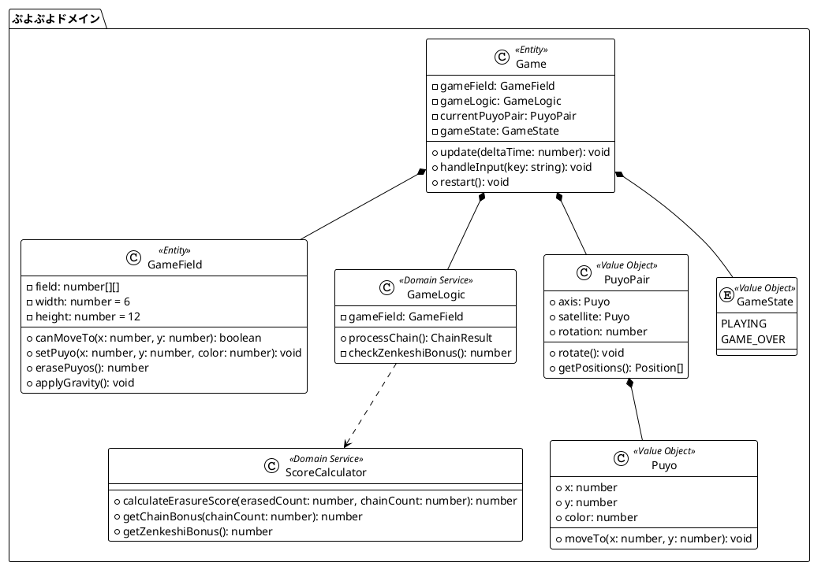
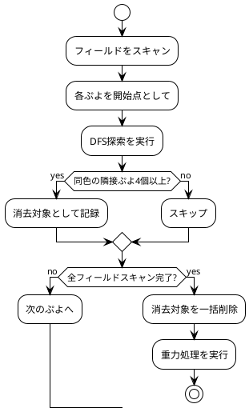
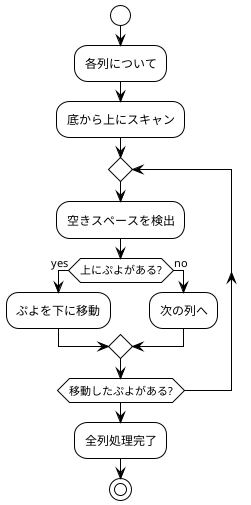
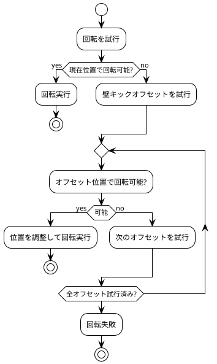
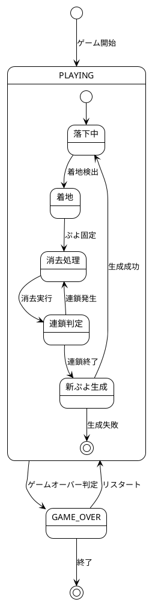
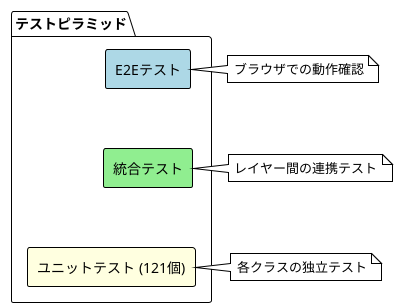
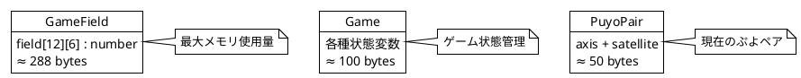
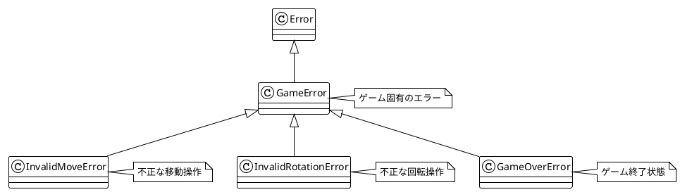

# 設計

## 概要

このドキュメントは、ぷよぷよゲームの詳細設計について説明します。テスト駆動開発（TDD）とドメイン駆動設計（DDD）の手法を適用し、保守性と拡張性の高いソフトウェア設計を実現しています。

## 設計原則

### ドメイン駆動設計（DDD）



### エンティティの設計

#### Game（ゲームエンティティ）
- **責務**: ゲーム全体の状態管理とライフサイクル制御
- **不変条件**: ゲーム状態の整合性維持
- **ライフサイクル**: 初期化 → プレイ中 → ゲームオーバー → リスタート

```typescript
export class Game {
  // ゲーム状態の管理
  private gameState = GameState.PLAYING
  private score = 0
  private chainCount = 0
  
  // コンポーネントの協調
  private gameField: GameField
  private gameLogic: GameLogic
  private currentPuyoPair: PuyoPair | null
  
  // ライフサイクル管理
  update(deltaTime?: number): void
  restart(): void
}
```

#### GameField（フィールドエンティティ）
- **責務**: ゲームフィールドの状態管理とぷよの物理的配置
- **不変条件**: フィールドサイズ（6x12）の維持、座標の妥当性
- **ビジネスルール**: ぷよの配置規則、消去規則、重力規則

```typescript
export class GameField {
  private field: number[][] // 6x12のフィールド
  private readonly width = 6
  private readonly height = 12
  
  // フィールド操作の基本メソッド
  canMoveTo(x: number, y: number): boolean
  setPuyo(x: number, y: number, color: number): void
  
  // ゲームルールの実装
  findConnectedPuyos(x: number, y: number, color: number): Position[]
  erasePuyos(): number
  applyGravity(): void
}
```

### 値オブジェクトの設計

#### PuyoPair（ぷよペア値オブジェクト）
- **不変性**: 作成後の状態変更は新しいインスタンスを生成
- **自己妥当性**: 軸-衛星の関係を常に維持
- **振る舞い**: 回転、移動、位置計算

```typescript
export class PuyoPair {
  public axis: Puyo      // 軸ぷよ
  public satellite: Puyo // 衛星ぷよ
  public rotation = 0    // 回転状態（0-3）
  
  // 回転状態に基づく位置計算
  updateSatellitePosition(): void {
    const offsets = [
      { x: 0, y: -1 }, // 上
      { x: 1, y: 0 },  // 右
      { x: 0, y: 1 },  // 下
      { x: -1, y: 0 }  // 左
    ]
    const offset = offsets[this.rotation]
    this.satellite.moveTo(
      this.axis.x + offset.x,
      this.axis.y + offset.y
    )
  }
}
```

#### Puyo（ぷよ値オブジェクト）
- **基本属性**: 位置（x, y）と色（color）
- **不変性**: 移動時は新しい位置に更新
- **妥当性**: 座標とカラーの有効性を保証

```typescript
export class Puyo {
  constructor(
    public x: number,
    public y: number,
    public color: number
  ) {}
  
  moveTo(x: number, y: number): void {
    this.x = x
    this.y = y
  }
}
```

### ドメインサービスの設計

#### GameLogic（連鎖処理サービス）
- **責務**: 複雑な連鎖ロジックのカプセル化
- **協調**: GameFieldとScoreCalculatorとの連携
- **状態管理**: 連鎖の進行状態を管理

```typescript
export class GameLogic {
  processChain(): { totalScore: number; chainCount: number } {
    let chainCount = 0
    let totalScore = 0
    
    // 連鎖ループ
    while (true) {
      const erasedCount = this.gameField.erasePuyos()
      if (erasedCount === 0) break
      
      chainCount++
      totalScore += ScoreCalculator.calculateErasureScore(erasedCount, chainCount)
      this.gameField.applyGravity()
    }
    
    // 全消しボーナスチェック
    totalScore += this.checkZenkeshiBonus()
    
    return { totalScore, chainCount }
  }
}
```

#### ScoreCalculator（スコア計算サービス）
- **責務**: スコア計算の純粋な計算ロジック
- **ステートレス**: 副作用のない純粋関数として実装
- **テスト容易性**: 入力に対する出力が決定的

```typescript
export class ScoreCalculator {
  // 連鎖ボーナス倍率テーブル
  private static readonly CHAIN_BONUS_TABLE = [1, 2, 4, 8, 16, 32, 64, 128]
  private static readonly ZENKESHI_BONUS = 2000
  
  static calculateErasureScore(erasedCount: number, chainCount: number): number {
    const baseScore = erasedCount * 10
    const chainBonus = this.getChainBonus(chainCount)
    return baseScore * chainBonus
  }
  
  static getChainBonus(chainCount: number): number {
    return chainCount <= this.CHAIN_BONUS_TABLE.length
      ? this.CHAIN_BONUS_TABLE[chainCount - 1]
      : 256 // 8連鎖以降は固定
  }
}
```

## アルゴリズム設計

### ぷよ消去アルゴリズム（DFS）



**実装の特徴**:
- **DFS（深度優先探索）**: 効率的な隣接ぷよの検出
- **visited配列**: 重複探索の防止
- **一括処理**: 消去とスコア計算を同時実行

```typescript
findConnectedPuyos(startX: number, startY: number, targetColor: number): Array<{ x: number; y: number }> {
  const visited: boolean[][] = Array(this.height).fill(null).map(() => Array(this.width).fill(false))
  const connected: Array<{ x: number; y: number }> = []
  
  const dfs = (x: number, y: number) => {
    // 境界チェックと訪問済みチェック
    if (x < 0 || x >= this.width || y < 0 || y >= this.height) return
    if (visited[y][x] || this.field[y][x] !== targetColor) return
    
    // 現在位置をマーク
    visited[y][x] = true
    connected.push({ x, y })
    
    // 4方向に再帰探索
    dfs(x + 1, y) // 右
    dfs(x - 1, y) // 左
    dfs(x, y + 1) // 下
    dfs(x, y - 1) // 上
  }
  
  dfs(startX, startY)
  return connected
}
```

### 重力処理アルゴリズム



**実装の特徴**:
- **底から上へ**: 効率的な空きスペース充填
- **繰り返し処理**: すべてのぷよが適切な位置に配置されるまで実行

```typescript
applyGravity(): void {
  for (let x = 0; x < this.width; x++) {
    // 底から上に向かってスキャン
    for (let y = this.height - 1; y >= 0; y--) {
      if (this.field[y][x] === 0) {
        // 空きスペース発見、上のぷよを探す
        for (let upperY = y - 1; upperY >= 0; upperY--) {
          if (this.field[upperY][x] !== 0) {
            // ぷよを下に移動
            this.field[y][x] = this.field[upperY][x]
            this.field[upperY][x] = 0
            break
          }
        }
      }
    }
  }
}
```

### 壁キックアルゴリズム



**壁キックオフセットパターン**:
```typescript
private tryWallKickPuyoPair(): boolean {
  const wallKickOffsets = [
    { x: -1, y: 0 }, // 左に1マス
    { x: 1, y: 0 },  // 右に1マス  
    { x: 0, y: -1 }, // 上に1マス
  ]
  
  for (const offset of wallKickOffsets) {
    const testX = this.currentPuyoPair.axis.x + offset.x
    const testY = this.currentPuyoPair.axis.y + offset.y
    
    if (this.canRotateAt(testX, testY)) {
      this.currentPuyoPair.moveTo(testX, testY)
      return true
    }
  }
  
  return false
}
```

## 状態管理設計

### ゲーム状態遷移



### 入力状態管理

```typescript
export class InputHandler {
  private keysPressed: Set<string> = new Set()
  private keyHandlers: Map<string, () => void> = new Map()
  
  // キー状態の管理
  private handleKeyDown(event: KeyboardEvent): void {
    const key = event.key
    
    // リピート制御
    if ((key === 'ArrowLeft' || key === 'ArrowRight') && event.repeat) {
      return
    }
    
    // 新規押下または高速落下の継続
    if (!this.keysPressed.has(key) || key !== 'ArrowDown') {
      this.keysPressed.add(key)
      this.executeKeyHandler(key)
    } else {
      this.keysPressed.add(key) // 高速落下の状態管理
    }
  }
}
```

## テスト設計

### テストピラミッド



### テスト戦略

#### ユニットテスト（121個）
- **ドメインロジックの網羅**: 各エンティティ・値オブジェクト・サービスの個別テスト
- **境界値テスト**: エッジケースと異常系の検証
- **不変条件テスト**: ビジネスルールの維持確認

```typescript
describe('GameField', () => {
  describe('ぷよの消去処理', () => {
    it('4つ以上つながった同色ぷよが消去されること', () => {
      // Arrange
      const gameField = new GameField()
      gameField.setPuyo(0, 11, 1) // 赤ぷよを4つ配置
      gameField.setPuyo(1, 11, 1)
      gameField.setPuyo(2, 11, 1)
      gameField.setPuyo(3, 11, 1)
      
      // Act
      const erasedCount = gameField.erasePuyos()
      
      // Assert
      expect(erasedCount).toBe(4)
      expect(gameField.getPuyo(0, 11)).toBe(0)
      expect(gameField.getPuyo(1, 11)).toBe(0)
      expect(gameField.getPuyo(2, 11)).toBe(0)
      expect(gameField.getPuyo(3, 11)).toBe(0)
    })
  })
})
```

#### 統合テスト
- **連鎖フローテスト**: 実際のゲームプレイシナリオの検証
- **レイヤー間連携**: ドメイン層とプレゼンテーション層の統合

#### エンドツーエンドテスト
- **ユーザー操作シミュレーション**: キーボード入力からゲーム状態変更まで
- **ブラウザ動作確認**: 実際の動作環境での検証

## パフォーマンス設計

### 計算量の最適化

| アルゴリズム | 時間計算量 | 空間計算量 | 備考 |
|-------------|-----------|-----------|------|
| ぷよ消去検索 | O(W×H) | O(W×H) | DFS探索、W=6, H=12 |
| 重力処理 | O(W×H) | O(1) | 底から上へのスキャン |
| 連鎖処理 | O(C×W×H) | O(W×H) | C=連鎖数 |
| 回転判定 | O(1) | O(1) | 固定位置チェック |

### メモリ使用量



### レンダリング最適化

```typescript
export class GameRenderer {
  // 差分更新によるレンダリング最適化
  private lastFieldState: number[][] | null = null
  
  public render(game: Game): void {
    const currentField = game.getField()
    
    // フィールド状態の変更検出
    if (this.hasFieldChanged(currentField)) {
      this.drawField(game)
      this.lastFieldState = this.deepCopyField(currentField)
    }
    
    // 現在のぷよは毎フレーム更新
    this.drawCurrentPuyo(game)
  }
}
```

## エラーハンドリング設計

### 例外階層



### エラー処理戦略

```typescript
export class Game {
  handleInput(key: string): void {
    try {
      if (this.gameState === GameState.GAME_OVER) {
        return // ゲームオーバー時は入力無効
      }
      
      switch (key) {
        case 'ArrowLeft':
        case 'ArrowRight':
          this.movePuyoPair(key === 'ArrowLeft' ? -1 : 1, 0)
          break
        case 'ArrowUp':
          this.rotatePuyoPair()
          break
        default:
          // 不明なキーは無視
          break
      }
    } catch (error) {
      console.warn('Input handling error:', error)
      // エラーログを記録し、ゲームを継続
    }
  }
}
```

## まとめ

この設計により、以下の品質特性を実現しています：

### 保守性
- **単一責任**: 各クラスが明確な責務を持つ
- **疎結合**: レイヤー間の依存関係を最小化
- **高凝集**: 関連する機能を適切にグループ化

### 拡張性
- **開放閉鎖**: 新機能追加時の既存コード変更を最小化
- **戦略パターン**: アルゴリズムの差し替えが容易
- **ファクトリパターン**: オブジェクト生成の柔軟性

### テスト容易性
- **依存性注入**: モックオブジェクトによるテスト
- **純粋関数**: 決定的な入出力関係
- **状態の可視性**: 内部状態の検証が容易

### パフォーマンス
- **効率的アルゴリズム**: 最適な時間・空間計算量
- **メモリ管理**: 不要なオブジェクト生成を回避
- **レンダリング最適化**: 必要最小限の描画更新

これらの設計により、**変更を楽に安全にできて役に立つソフトウェア**という目標を達成しています。