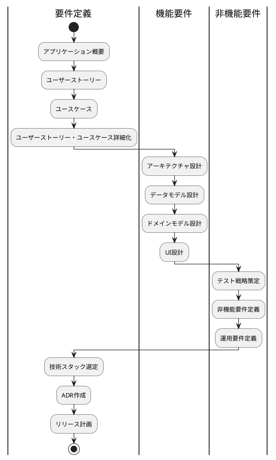
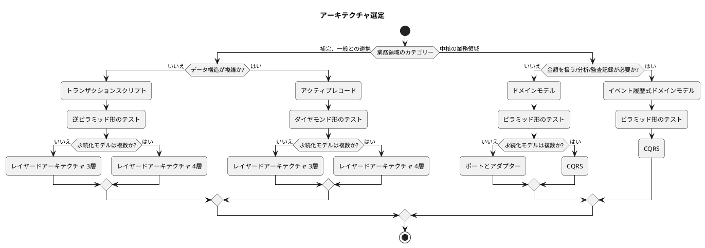
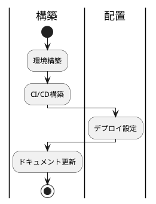
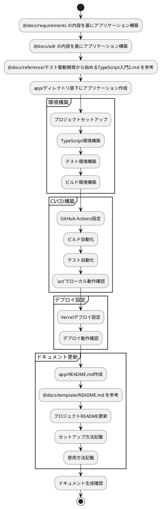
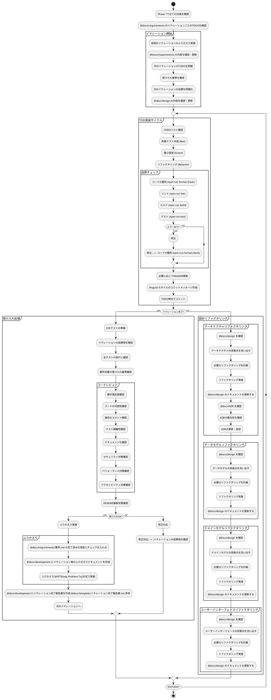
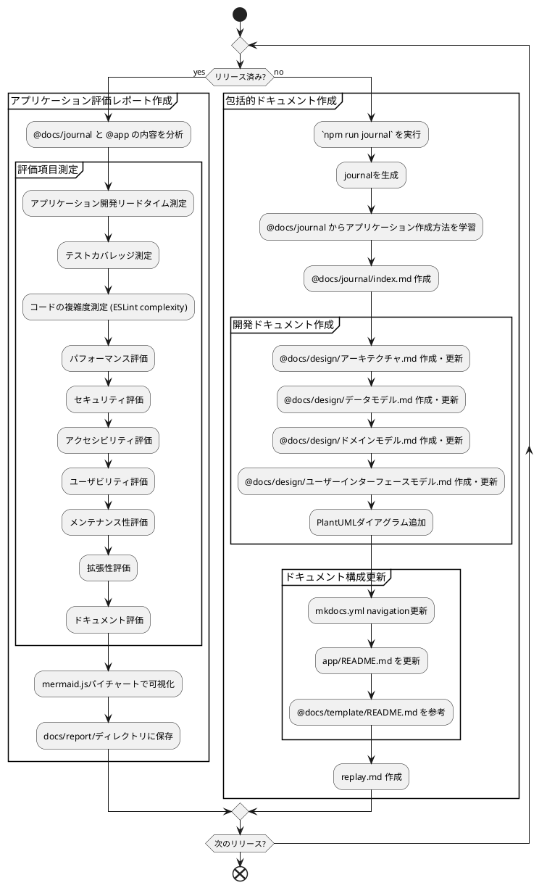

# CLAUDE.local.md

## Phase 1 要件

### 概要



### 詳細






```plantuml
@startuml "Phase 1 要件フェーズ"
start

partition "要件定義" {
  partition "アプリケーション概要" {
    :@docs/requirements/要件.md を作成;
  }
  partition "ユーザーストーリー" {
    :@docs/requirements/要件.md を作成;
  }
  partition "ユースケース" {
    :@docs/requirements/要件.md を作成;
  }
  partition "ユーザーストーリー・ユースケース詳細化" {
      partition "ユーザーストーリー作業" {
        :ユーザーストーリー詳細化;
        :受け入れ基準定義;
        :完了定義設定;
        :優先順位付け;
        :見積り;
      }
      
      partition "ユースケース作業" {
        :主要ユースケース詳細化;
        :事前条件・事後条件定義;
        :主な流れ・代替フロー記述;
        :システムユースケース追加;
      }
  }
  
  partition "機能要件" {
      partition "アーキテクチャ" {
        :アーキテクチャ選定;
        :レイヤードアーキテクチャ採用;
        :4層構造定義（Presentation/Application/Domain/Infrastructure）;
        :各層の責任分離;
        :依存関係図作成;
        :設計原則適用;
      }
      
      partition "データモデル" {
        :エンティティ設計;
        :エンティティ関係図作成;
        :データフロー図作成;
        :制約と規則定義;
        :パフォーマンス考慮事項記述;
      }
      
      partition "ドメインモデル" {
        :DDD原則適用;
        :3つの集約設計（Game/Puyo/Chain）;
        :ドメインサービス定義;
        :ドメインイベント設計;
        :ユビキタス言語確立;
        :エラー処理戦略;
      }
      
      partition "UI設計" {
        :全体レイアウト設計;
        :詳細UI設計（ゲームフィールド/ぷよ表示/コントロール）;
        :ゲーム状態別UI;
        :レスポンシブデザイン;
        :タッチ操作UI;
        :アクセシビリティ対応;
      }
  }
  
  partition "非機能要件" {
    partition "テスト戦略" {
      :TDD開発サイクル定義;
      :3層テスト戦略（単体/統合/E2E）;
      :レイヤー別テスト戦略;
      :パフォーマンステスト;
      :テストデータ管理;
      :CI/CDテスト実行;
    }
    
    partition "非機能要件定義" {
      :パフォーマンス要件;
      :セキュリティ要件;
      :可用性要件;
      :拡張性要件;
      :互換性要件;
      :アクセシビリティ要件;
      :メンテナンス性要件;
    }
    
    partition "運用要件定義" {
     :CI/CDパイプライン設計;
     :環境構成（Local/Staging/Production）;
     :監視・観測戦略;
     :デプロイメント手順;
     :運用手順書;
     :インシデント対応;
     :バックアップ・復旧計画;
     :開発フロー（Git Flow）;
    }
  }
  
  partition "要件定義" {
    partition "技術スタック選定" {
     :技術スタック選定;
    }
    
    partition "ADR作成" {
     :@docs/ADR に決定事項を記録;
    }
    
    partition "リリース計画" {
     :段階的リリース戦略（MVP→v1.1→v1.2）;
    }
  }
}

end
@enduml
```

- 要件定義のドキュメントは @docs/requirements に保存する
- 機能要件のドキュメントは @docs/design に保存する
- ドキュメントのダイアグラムはPlantumlを使用する
- ただしリリース計画のガントチャート及びレポートのチャートには mermaid.js を使用する
- ユーザーインターフェース設計.mdのダイアグラムはplantumlのSalt (Wireframe)を使う
- ドキュメントを追加したディレクトリにindex.mdを作成・更新する
- mkdocs.ymlを更新する
- レビューするのでコミットは実施しない
- 以下ような記述は**の次を改行してスペースを開けること
```markdown
- **対象:**
- ドメインモデル（Puyo, Field, Game, Chain）
```

## Phase 2 構築・配置

### 概要



### 詳細



## Phase 3 開発

### 概要

```plantuml
start

partition "イテレーション開始" {
}

repeat :TODO確認;
partition "TDD実装サイクル" {
    repeat
      :TODO選択;
      
      repeat
        :失敗テスト作成 (Red);
        :最小実装 (Green);
        :リファクタリング (Refactor);
        :品質チェック;
        if (品質OK?) then (yes)
          :コミット;
        else (no)
          :修正;
        endif
      repeat while (TODO完了?)
      partition "コードレビュー" {
      }
    repeat while (全TODO完了?)
}

if (イテレーション完了?) then (yes)
  partition "受け入れ" {
    partition "ユーザーレビュー" {
    }
    if (受け入れOK?) then (yes)
      partition "ふりかえり" {
      }
    else (no)
      partition "修正対応" {
      }
    endif
  }
else (no)
  partition "設計リファクタリング" {
      partition "アーキテクチャリファクタリング" {
      }
      partition "データモデルリファクタリング" {
      }
      partition "ドメインモデルリファクタリング" {
      }
      partition "UIリファクタリング" {
      }
  }
endif
repeat while (次のTODO?)

stop
```

### イテレーション別TODO

#### Iteration 1: ゲーム基盤（MVP）

1. **ドメインモデル実装**

    - [x] Puyo, Field, Game クラス
    - [x] 基本的なゲームロジック
    - [x] 単体テスト

2. **基本UI実装**

    - [x] GameBoard コンポーネント
    - [x] ゲーム状態表示
    - [x] 基本スタイリング

3. **操作システム**

    - [x] キーボード入力処理
    - [x] ぷよ移動・回転ロジック
    - [x] 統合テスト

#### Iteration 2: 消去・連鎖システム

1. **連鎖検出**

    - [x] 連結ぷよ検索アルゴリズム
    - [x] 消去判定ロジック
    - [x] 重力適用システム

2. **スコア計算**

    - [x] 基本スコア計算
    - [x] 連鎖ボーナス
    - [x] 表示システム

3. **ゲームオーバー**

    - [x] 終了判定
    - [x] 結果表示
    - [x] リトライ機能

#### Iteration 3: UI/UX改善（v1.1）+ 緊急修正

1. **アニメーション**

    - [x] ぷよ落下アニメーション
    - [x] 消去エフェクト
    - [x] 連鎖演出

2. **音響システム**

    - [x] 効果音実装
    - [x] BGM追加
    - [x] 音量制御

3. **ゲーム機能**

    - [x] ハイスコア機能
    - [x] ポーズ・リスタート
    - [x] 設定画面

4. **緊急修正対応**

    - [x] 重力バグ修正（重なったぷよの落下問題）
    - [x] 包括的重力処理テスト追加（11テスト）
    - [x] E2Eテスト安定化（Firefox対応）
    - [x] 開発環境改善（lint最適化）

#### Iteration 4: 最適化・モバイル対応（v1.2）

1. **パフォーマンス**

    - [x] 描画最適化
    - [x] メモリ管理
    - [x] バンドル最適化

2. **アクセシビリティ**

    - [x] キーボードナビゲーション
    - [x] ARIA属性追加
    - [x] 色覚多様性対応

3. **モバイル・PWA**

    - [x] タッチ操作実装
    - [x] レスポンシブ改善
    - [x] Service Worker追加


### 詳細


- TODO単位でコミットする
- 後で参照できるようにByteRover MCP に保存する
- CLAUDE.mdのコーディングとテストフローに厳密に従う
- 勝手に次のイテレーションに着手しない
- ユーザーによる受け入れを 確認するまで勝手にコミットしない
- ユニットテストは3A手法に従い日本語でテスト記述

## Phase 4 運用



### 包括的ドキュメントを作成する

`npm run journal` を実行して、journalを生成する
@docs/journal からアプリケーションをどのように作ったか学習する
@docs/journal に index.md を作成する
ダイアグラムにはplantumlを使用する
- @docs/design/アーキテクチャ.md を作成してアプリケーションのアーキテクチャをまとめる
- @docs/design/設計.md を作成してアプリケーションの設計をまとめる
- @docs/design/実装.md を作成してアプリケーションの実装をまとめる
- mkdocs.yml を更新してドキュメントを生成できるようにする
- app/README.md を更新してアプリケーションの概要と使い方をまとめる
- README.md のフォーマットは @docs/template/README.md を参考にする

最後に次回同様の手順を再現できるようにしたいため replay.md を作成する

### アプリケーション評価レポートの作成

@docs/journal と @app の内容を基に、アプリケーションの評価レポートを作成します。
評価レポートには以下の内容を含めます：
- アプリケーション開発リードタイム
- アプリケーションの品質評価
  - テストカバレッジ
  - コードの複雑度(Cyclomatic Complexity ESLintの complexityルールを使用)
- アプリケーションのパフォーマンス評価
- アプリケーションのセキュリティ評価
- アプリケーションのアクセシビリティ評価
- アプリケーションのユーザビリティ評価
- アプリケーションのメンテナンス性評価
- アプリケーションの拡張性評価
- アプリケーションのドキュメント評価
- mermaid.jsのパイチャートを使用して、各評価項目の結果を可視化します

結果はdocs/report/ディレクトリに保存します。
