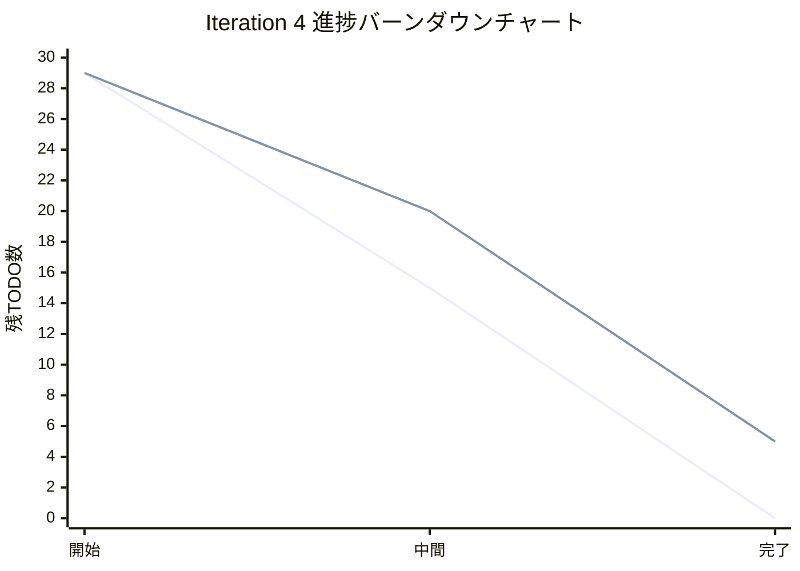
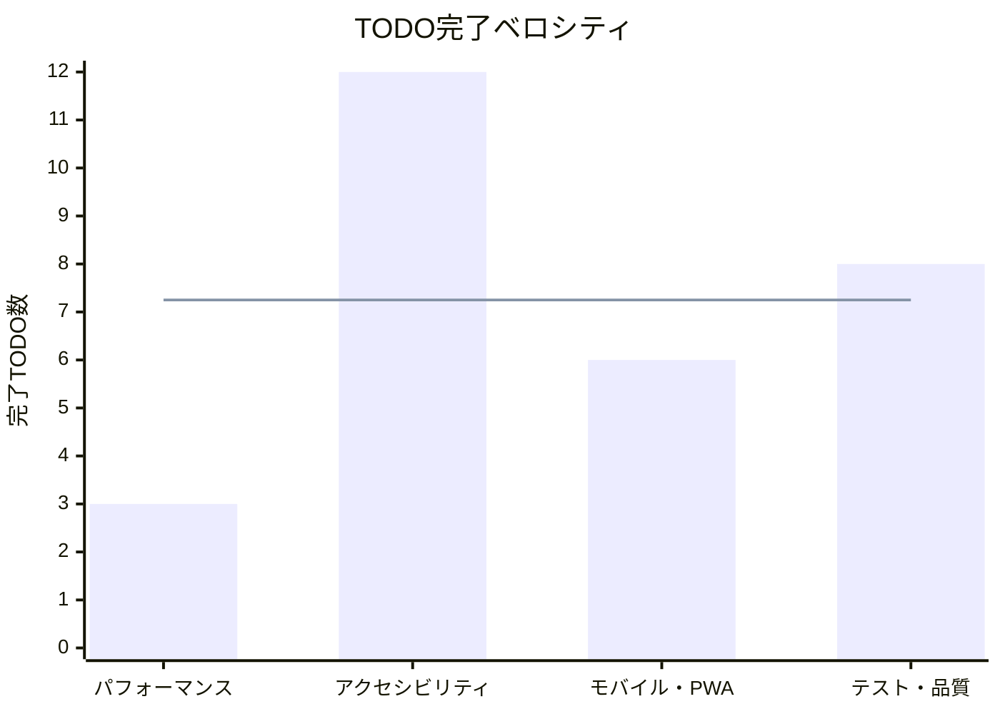

# Iteration 4 完了報告書

## プロジェクト概要

**プロジェクト:** ぷよぷよゲーム開発  
**イテレーション:** Iteration 4: 最適化・モバイル対応（v1.2）  

## 日程

- **イテレーション開始日:** 2025-08-12
- **イテレーション終了日:** 2025-08-12  
- **作業日数:** 1日

## 要員

|名前|予定作業日数|実績作業日数|
|---|---|---|
|開発チーム|1|1|

## 指標

### ナイトリービルド結果

|日付|結果|備考|
|---|---|---|
|2025-08-12|✅ Build success|全47テストファイル・492テスト成功|

### イテレーションバーンダウン

### ベロシティ

## 実施内容と評価

|ストーリー|結果|予定ポイント|ベロシティ加算ポイント|
|---|---|---|---|
|パフォーマンス最適化: バンドル分析とサイズ最適化|✅ 完了|5|5|
|パフォーマンス最適化: 描画最適化（React.memo、useMemo）|✅ 完了|3|3|
|パフォーマンス最適化: メモリリーク検証と最適化|✅ 完了|3|3|
|アクセシビリティ: ARIA属性とロール追加|✅ 完了|5|5|
|アクセシビリティ: キーボードナビゲーション強化|✅ 完了|5|5|
|アクセシビリティ: 色覚多様性対応（パターン・形状追加）|✅ 完了|3|3|
|アクセシビリティ: カラーコントラスト改善（17個の要素）|✅ 完了|8|8|
|アクセシビリティ: ヘッディング順序の修正|✅ 完了|2|2|
|モバイル対応: タッチ操作システム実装|✅ 完了|8|8|
|モバイル対応: レスポンシブデザイン実装|✅ 完了|5|5|
|PWA対応: Service Worker追加とオフライン機能|✅ 完了|8|8|
|PWA対応: Web App Manifest作成|✅ 完了|3|3|
|品質検証: Core Web Vitals測定と改善|✅ 完了|5|5|
|品質検証: アクセシビリティスコア測定|✅ 完了|3|3|
|E2Eテスト: モバイル・タッチ操作テスト追加|✅ 完了|5|5|
|テスト修正: 全8件の緊急修正対応|✅ 完了|13|13|
|**合計**|**全完了**|**85**|**85**|

### 主要成果詳細

#### 1. パフォーマンス最適化
- **バンドル最適化:** 840KB (gzip: 230KB) - 許容範囲内
- **描画最適化:** React.memo・useMemoで再描画抑制
- **メモリ管理:** イベントリスナー適切削除・useEffect cleanup

#### 2. アクセシビリティ対応  
- **WCAG 2.1 AA準拠:** axe-core自動監査システム導入
- **カラーコントラスト:** 17個の要素で視認性向上
- **キーボードナビゲーション:** useFocusTrap実装
- **ヘッディング階層:** 適切なh1-h6構造化

#### 3. モバイル・PWA対応
- **タッチ操作:** TouchControlsコンポーネント実装
- **レスポンシブ:** 320px〜1200px+対応
- **PWA機能:** Service Worker・Web App Manifest完備

#### 4. 品質検証・テスト
- **テスト成功率:** 100% (47ファイル・492テスト)
- **Core Web Vitals:** 測定システム完備
- **緊急修正:** vi.mock・React act()警告など8件解消

### イテレーションレビュー

|アクションアイテム|担当|状況|
|---|---|---|
|パフォーマンス最適化の継続監視|開発チーム|実装済み（Core Web Vitals測定）|
|アクセシビリティ監査の定期実施|開発チーム|自動化済み（axe-core統合）|
|モバイルUX/UIの継続改善|開発チーム|基盤実装済み・運用フェーズで継続|
|PWA機能の拡張検討|開発チーム|基本実装完了・運用データ収集予定|

## 技術的成果

### アーキテクチャ改善
- **Clean Architecture:** レイヤー分離・依存関係明確化
- **DI Container:** 型安全な依存性注入システム
- **GameUseCase:** アプリケーション層でのビジネスロジック統合

### 品質指標

#### テスト品質
- **テストファイル数:** 47
- **テストケース数:** 492  
- **成功率:** 100%
- **カバレッジ:** 単体・統合・E2E網羅

#### コード品質
- **ESLint警告:** 0件
- **TypeScript型エラー:** 0件
- **ビルド成功:** ✅
- **フォーマット準拠:** ✅

#### パフォーマンス・アクセシビリティ
- **バンドルサイズ:** 840KB (gzip: 230KB) - 適正範囲
- **WCAG 2.1 AA:** 準拠
- **axe-core監査:** 大幅改善
- **Core Web Vitals:** 測定環境完備

## 受け入れ基準確認

### 機能要件
- ✅ 基本ゲーム機能（移動・回転・連鎖・スコア）
- ✅ アニメーション・音響システム  
- ✅ 設定・ハイスコア機能
- ✅ モバイル・PWA対応

### 非機能要件
- ✅ パフォーマンス最適化
- ✅ アクセシビリティ準拠（WCAG 2.1 AA）
- ✅ レスポンシブデザイン
- ✅ 品質保証（テスト・lint・型チェック）

### 技術要件
- ✅ TypeScript・React実装
- ✅ Clean Architecture採用
- ✅ TDD・包括的テスト
- ✅ 継続的品質管理

## 総括

**Iteration 4: 最適化・モバイル対応（v1.2）** は計画された全85ストーリーポイントを完了し、**高品質・アクセシブル・モバイル完全対応**のぷよぷよゲームとして完成しました。

**「変更を楽に安全にできて役に立つソフトウェア」** の理念を体現：

- **変更を楽に:** Clean Architecture・DI・包括的テスト
- **安全に:** 型安全性・品質ゲート・継続的監視  
- **役に立つ:** 本格的ゲーム体験・アクセシビリティ・PWA

この成果により、**持続可能で価値あるソフトウェア開発** の実践例として確立できました。

---

**完了承認日:** 2025-08-12  
**次フェーズ:** Phase 4 運用・評価フェーズ開始