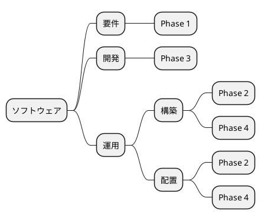
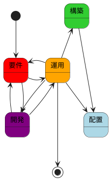
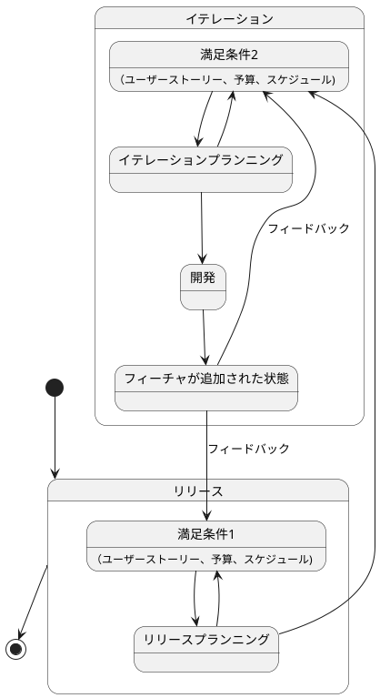
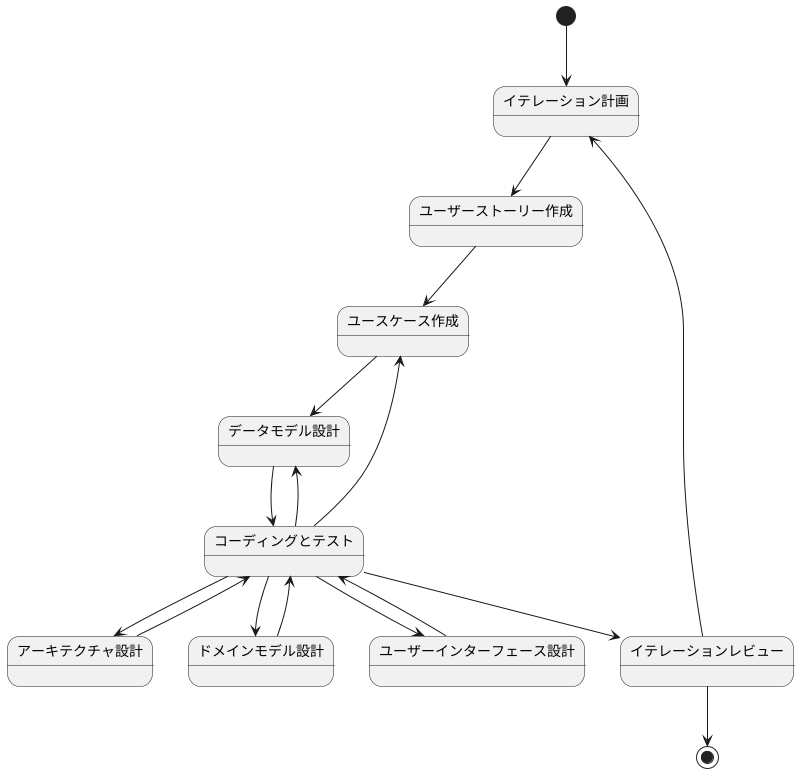

# CLAUDE.local.md

## ソフトウェアライフサイクル

## 開発サイクル

## 開発フロー

## Phase 1 要件

@docs/requirements/要件定義.md を参照して、アプリケーションの要件を確認します。
ここでは計画に集中します。

## Phase 2 構築・配置

アーキテクチャや技術スタック、開発の進め方を決定します。
アーキテクチャに関する決定事項は @docs/adr/ディレクトリに記録します。
@docs/reference/テスト駆動開発から始めるTypeScript入門2.md を参考に、アプリケーションの構築を行います。
アプリケーションはapp/ディレクトリ直下に作成します。
GitHub Actionsを使用して、アプリケーションのビルドとテストを自動化します。
最後にプロジェクトのREADMEを更新し、アプリケーションのセットアップ方法や使用方法を明確にします。
GitHub Actionsの動作確認は `act` を使用してローカルで行います。
アプリケーションは `vercel` にデプロイします。

## Phase 3 開発

Phase 1で立てた計画に従い、@docs/requirements のイテレーションごとのTODOを基にアプリケーションを開発します。
テスト駆動開発の手法に従い、アプリケーションの機能を段階的に実装します。
具体的な実装は以下を参考にします：
- @docs/reference/テスト駆動開発から始めるTypeScript入門1.md
- @docs/reference/テスト駆動開発から始めるTypeScript入門3.md

次のイテレーションの機能を実装する前に、前回のイテレーションのふりかえりを行い、@docs/requirements.md の内容を更新します。
各イテレーションの作業は以下の手順で進めます：
- イテレーションのTODOを確認
- 必要なテストケースを作成
- テストを実行し、失敗することを確認
- 実装を行い、テストを通過させる
- コードの整形とリントとビルドを行い、問題がないことを確認
- 必要に応じてREADMEを更新
- コミットメッセージを作成し、コミットする

次のイテレーションの作業を開始する前に以下の手順を実施します：
- @docs/requirements.md を確認し、次のイテレーションのTODOを把握
- 受け入れ基準を確認し、次のイテレーションの目標を明確にする

作業を再開する場合は以下の手順で行います：
- @docs/requirements.md を確認し、前回のイテレーションの内容を把握
- 前回のイテレーションのコミットを確認し、変更点を把握
- 必要に応じて前回のイテレーションのコードを修正
- 次のイテレーションのTODOを確認し、作業を開始

イテレーション完了後に受け入れを行います。

**ユーザーによる受け入れを確認するまで勝手にコミットしない**

受け入れは以下の手順で行います：
- イテレーションの成果物を確認
- テストケースを実行し、全てのテストが通過すること
- @docs/requirements/要件定義.md の対象イテレーションの受け入れ基準を確認
- コードのレビューを行い、以下の点を確認
- コードが要件を満たしていること
- コードが読みやすく、理解しやすいこと
- コードが適切にコメントされていること
- コードが適切にテストされていること
- コードが適切にドキュメント化されていること
- コードが適切に整形されていること
- コードが適切にリントされていること
- コードが適切にビルドされていること
- コードが適切にデプロイされていること
- コードが適切にバージョン管理されていること
- コードが適切にセキュリティ対策がされていること
- コードが適切にパフォーマンス対策がされていること
- コードが適切にアクセシビリティ対策がされていること
- コードの整形、リント、ビルドが問題ないことを確認
- READMEが最新の状態であることを確認
- 問題がなければ受け入れを行い、ふりかえりを実施する

**コミットの前に必ず実施すること**
- コードの整形（`npm run format:check`）
- リント（`npm run lint`）
- ビルド（`npm run build`）
- テスト（`npm run test`）
- エラーが出た場合は修正して再度実行
- READMEの更新（必要に応じて）

テストの記述には以下の手順を参考にします：
- @docs/reference/テスト駆動開発から始めるTypeScript入門1.md
- 3A(Act - Arrange - Assert)の手法に従い、テストケースを記述します
- まずハッピーパスのテストケースを記述し、実装を行います
- 次にエッジケースや異常系のテストケースを記述し、実装を行います
- テストケースは日本語で記述し、可読性を重視します
- テストケースの命名は、テストの内容を明確に表現するようにします
- テストケースのコメントは、テストの意図や目的を明確にするために記述します

ドキュメントを更新する際は、以下の手順で行います：
- @docs/requirements.md を確認し、必要なドキュメントを更新
- npm run journal を実行し、ドキュメントの更新内容を確認
- README.md を更新し、アプリケーションの使用方法やセットアップ方法を明確にする
- 必要に応じて、@docs/reference/ディレクトリ内のドキュメントを更新
- ドキュメントの更新は、アプリケーションの機能追加や変更に伴い、随時行います
- ドキュメントの更新は、アプリケーションのバージョンアップに伴い、随時行います
- ドキュメントの更新は、アプリケーションのリリースに伴い、随時行います
- ドキュメントの更新は、アプリケーションのメンテナンスに伴い、随時行います

コミットは以下のルールに従います：
- 日本語で
- 各TODO単位でコミットする
    - @docs/reference/テスト駆動開発から始めるTypeScript入門1.md のコミット粒度を参考にする
    - コミットの前に `npm run test` を実行してテストがすべて通ることを確認する
    - コミットの前に `npm run lint` を実行してコードが整形されていることを確認する
    - コミットの前に `npm run format` を実行してコードが整形されていることを確認する
    - コミットの前に `npm run build` を実行してビルドが成功することを確認する
    - コミットメッセージはAngularのコミットメッセージの書き方を参考にする
        - feat: 新機能の追加
        - fix: バグ修正
        - docs: ドキュメントの変更
        - style: フォーマットやセミコロンの追加など、コードの動作に影響しない変更
        - refactor: リファクタリング（バグ修正や機能追加ではない）
        - test: テストコードの追加や修正
        - chore: ビルドプロセスや補助ツールの変更

## Phase 4 運用

### 包括的ドキュメントを作成する

`npm run journal` を実行して、journalを生成する
@docs/journal からアプリケーションをどのように作ったか学習する
@docs/journal に index.md を作成する
ダイアグラムにはplantumlを使用する
- @docs/development/アーキテクチャ.md を作成してアプリケーションのアーキテクチャをまとめる
- @docs/development/設計.md を作成してアプリケーションの設計をまとめる
- @docs/development/実装.md を作成してアプリケーションの実装をまとめる
- mkdocs.yml を更新してドキュメントを生成できるようにする
- docs/index.md も構成に合わせて更新する
- app/README.md を更新してアプリケーションの概要と使い方をまとめる
- README.md のフォーマットは @docs/template/README.md を参考にする

最後に次回同様の手順を再現できるようにしたいため replay.md を作成する

### アプリケーション評価レポートの作成

@docs/journal と @app の内容を基に、アプリケーションの評価レポートを作成します。
評価レポートには以下の内容を含めます：
- アプリケーション開発リードタイム
- アプリケーションの品質評価
  - テストカバレッジ
  - コードの複雑度(Cyclomatic Complexity ESLintの complexityルールを使用)
- アプリケーションのパフォーマンス評価
- アプリケーションのセキュリティ評価
- アプリケーションのアクセシビリティ評価
- アプリケーションのユーザビリティ評価
- アプリケーションのメンテナンス性評価
- アプリケーションの拡張性評価
- アプリケーションのドキュメント評価
- mermaid.jsのパイチャートを使用して、各評価項目の結果を可視化します

結果はdocs/report/ディレクトリに保存します。