# アプリケーション設計

## 概要

ぷよぷよゲームの設計方針と実装アプローチについて説明します。
**テスト駆動開発（TDD）**と**ドメイン駆動設計（DDD）**を基盤とし、8つのイテレーションで段階的に機能を実装しました。

## 設計方針

### 基本方針

- **変更を楽に安全にできて役に立つソフトウェア**の実現
- **よいソフトウェア**の原則に従った実装
- **継続的な改善**によるコード品質の向上

### 開発手法

- **テスト駆動開発（TDD）**: Red-Green-Refactorサイクル
- **ドメイン駆動設計（DDD）**: ビジネスロジック中心の設計
- **イテレーション開発**: 段階的な機能実装

## イテレーション設計

### 全体計画

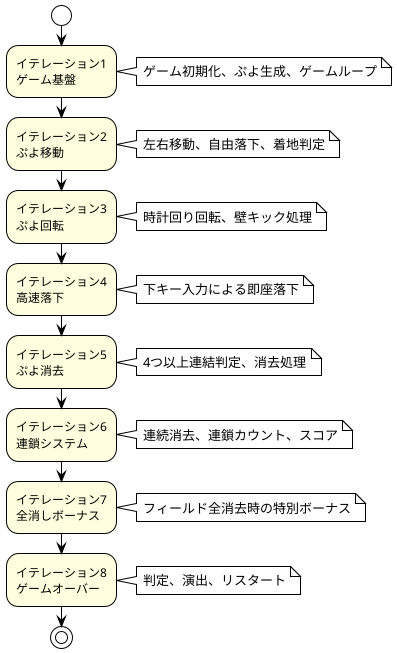

### 各イテレーションの設計

#### イテレーション1: ゲーム基盤

**設計目標**: 最小限の動作するゲームを作成

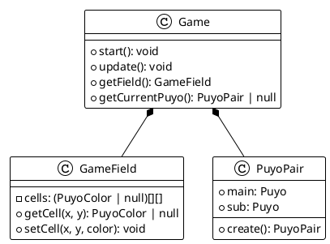

**主要決定事項**:
- 6x12のフィールドサイズ
- PuyoPairによるぷよペア管理
- 60FPSのゲームループ

#### イテレーション2: ぷよ移動

**設計目標**: ユーザー操作によるぷよ制御

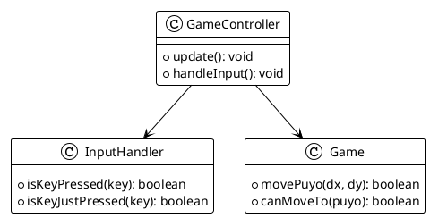

**主要決定事項**:
- イベント駆動型入力処理
- 衝突判定の実装
- 30フレーム間隔の自由落下

#### イテレーション3: ぷよ回転

**設計目標**: ぷよペアの回転機能

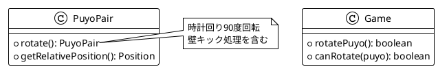

**主要決定事項**:
- 時計回り90度回転
- 左右1マスの壁キック
- 不変オブジェクトパターン

#### イテレーション4: 高速落下

**設計目標**: 下キーによる高速落下

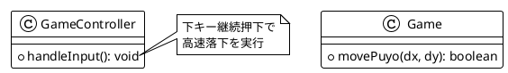

**主要決定事項**:
- 既存移動システムの再利用
- 継続押下検出
- 通常落下との併存

#### イテレーション5: ぷよ消去

**設計目標**: 4つ以上連結したぷよの消去

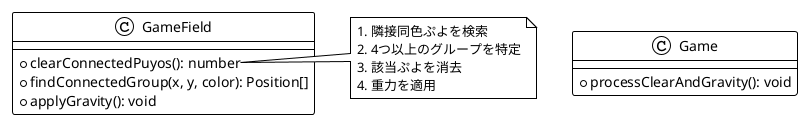

**主要決定事項**:
- 深度優先探索による連結判定
- 消去後の重力適用
- 複数グループの同時処理

#### イテレーション6: 連鎖システム

**設計目標**: 連続消去による連鎖反応

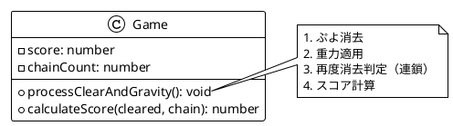

**主要決定事項**:
- 再帰的連鎖判定
- 連鎖ボーナス計算式: 2^(連鎖数-1)
- リアルタイムスコア表示

#### イテレーション7: 全消しボーナス

**設計目標**: フィールド全消去時の特別ボーナス

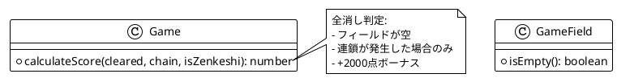

**主要決定事項**:
- 全消し判定のタイミング
- 連鎖発生時のみボーナス適用
- 固定ボーナス値（2000点）

#### イテレーション8: ゲームオーバー

**設計目標**: ゲーム終了とリスタート機能

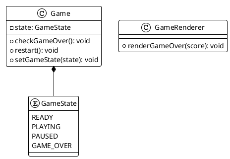

**主要決定事項**:
- ゲーム状態管理の導入
- 新ぷよ配置不可時のゲームオーバー
- Rキーによるリスタート機能

## 設計パターン

### 使用したデザインパターン

#### 1. State パターン

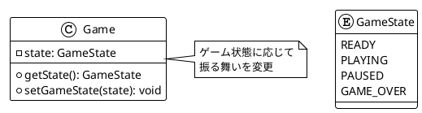

#### 2. Strategy パターン

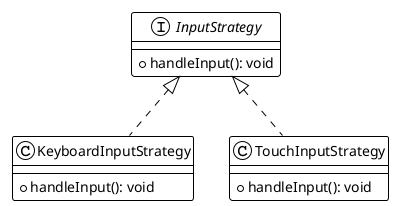

#### 3. Observer パターン

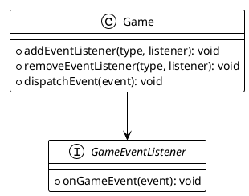

### SOLID原則の適用

#### 単一責任の原則（SRP）

- **Game**: ゲームロジックのみ
- **GameField**: フィールド状態管理のみ  
- **GameRenderer**: 描画処理のみ
- **InputHandler**: 入力処理のみ

#### 開放閉鎖の原則（OCP）

- 新しいぷよ色の追加: PuyoColor enum拡張
- 新しい入力方式: InputStrategy実装
- 新しい描画効果: GameRenderer拡張

#### 依存関係逆転の原則（DIP）

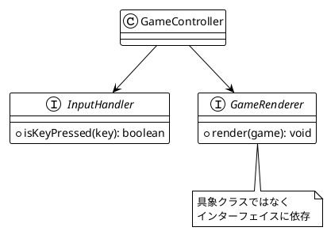

## テスト設計

### テスト戦略

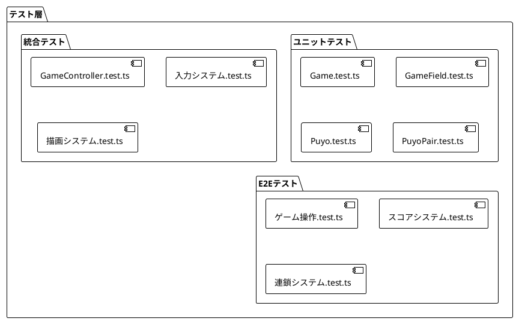

### TDDサイクル

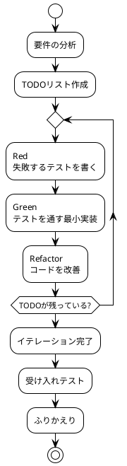

### テストケース設計

#### ドメインモデルのテスト

```typescript
// Game.test.ts の例
describe('ぷよ移動', () => {
  it('左に移動できる', () => {
    // Arrange
    const game = new Game()
    game.start()
    
    // Act  
    const result = game.movePuyo(-1, 0)
    
    // Assert
    expect(result).toBe(true)
  })
})
```

#### 境界値のテスト

```typescript
// GameField.test.ts の例  
describe('フィールド境界', () => {
  it('範囲外の座標はfalseを返す', () => {
    const field = new GameField()
    
    expect(field.isValidPosition(-1, 0)).toBe(false) // 左端外
    expect(field.isValidPosition(6, 0)).toBe(false)  // 右端外
    expect(field.isValidPosition(0, -2)).toBe(false) // 上端外
    expect(field.isValidPosition(0, 12)).toBe(false) // 下端外
  })
})
```

## パフォーマンス設計

### レンダリング最適化

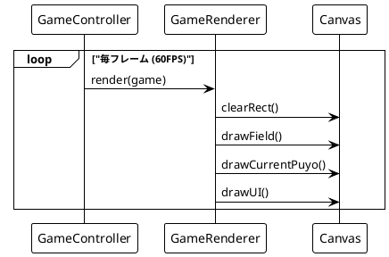

### メモリ管理

- **不変オブジェクト**: PuyoPair, Puyo
- **オブジェクトプール**: 使用していない（将来の最適化候補）
- **ガベージコレクション**: 最小限のオブジェクト生成

### 計算量の最適化

| 処理 | 計算量 | 最適化手法 |
|------|--------|------------|
| ぷよ移動判定 | O(1) | 座標計算のみ |
| 連結判定 | O(n) | 深度優先探索 |
| 重力適用 | O(n) | 列ごとの処理 |
| 描画処理 | O(n) | 差分描画（将来） |

## エラーハンドリング設計

### エラー分類

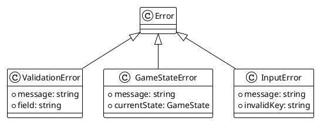

### エラー処理戦略

- **入力エラー**: 無視して続行
- **状態エラー**: ログ出力して安全な状態に復帰
- **システムエラー**: ゲーム停止とエラー表示

## セキュリティ設計

### 脅威モデル

| 脅威 | 対策 |
|------|------|
| 不正な入力 | 入力値検証 |
| チート行為 | クライアントサイドのみなので対象外 |
| XSS攻撃 | HTML要素への直接出力なし |

### セキュリティ対策

- **入力サニタイゼーション**: キー入力の妥当性チェック
- **状態整合性**: ゲーム状態の不正変更防止
- **型安全性**: TypeScriptによる静的チェック

## 拡張性設計

### 将来の拡張項目

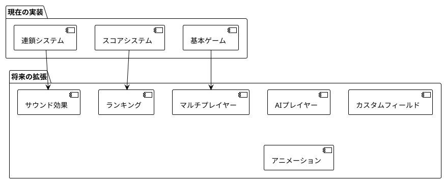

### 拡張ポイント

1. **新しいゲームモード**: GameState拡張
2. **新しい入力デバイス**: InputHandler拡張
3. **新しい描画効果**: GameRenderer拡張
4. **新しいAI**: Strategy パターンでAI実装

## まとめ

本設計により以下を実現：

- **高品質**: TDDによる網羅的テスト
- **保守性**: 明確な責務分離と設計パターン適用
- **拡張性**: SOLID原則に基づく柔軟な設計
- **パフォーマンス**: 効率的なアルゴリズムと描画
- **安全性**: 型安全性とエラーハンドリング