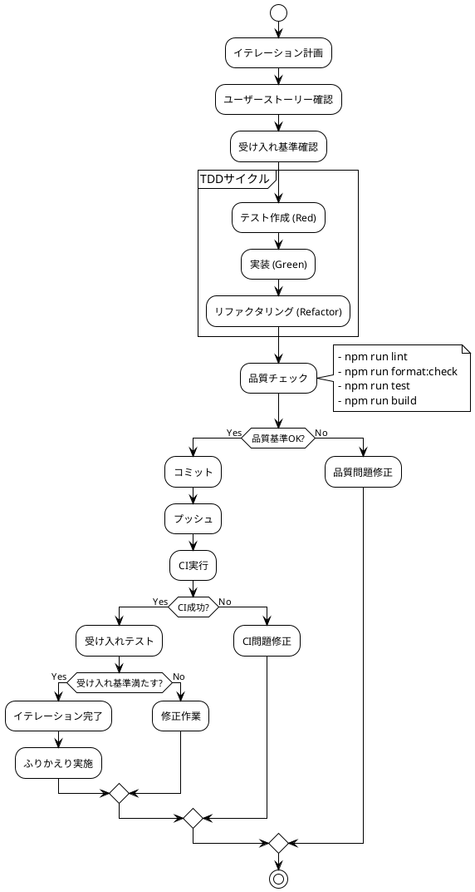

# 開発ドキュメント

## 概要

このセクションでは、ぷよぷよゲーム開発プロジェクトの開発に関する情報を提供します。テスト駆動開発（TDD）を基盤とした段階的な開発アプローチを採用しています。

## ドキュメント一覧

- [開発計画](./開発計画.md) - 開発全体の計画とプロセス
- [アーキテクチャ設計](./アーキテクチャ設計.md) - システムアーキテクチャの設計
- [データモデル設計](./データモデル設計.md) - ゲームデータ構造の設計
- [ドメインモデル設計](./ドメインモデル設計.md) - ビジネスロジックの設計
- [ユーザーインターフェース設計](./ユーザーインターフェース設計.md) - UIデザインと操作設計

## 開発方針

### 技術的原則

- **テスト駆動開発（TDD）**: Red-Green-Refactorサイクルによる品質向上
- **継続的リファクタリング**: コードの可読性と保守性の維持
- **型安全性**: TypeScriptによる開発時エラーの早期発見
- **自動化**: CI/CDによる品質チェックとデプロイの自動化

### 設計原則

- **SOLID原則**: オブジェクト指向設計の基本原則の遵守
- **単一責任の原則**: 各クラス・モジュールが単一の責任を持つ
- **オープン・クローズドの原則**: 拡張に開いて修正に閉じた設計
- **依存関係逆転の原則**: 抽象に依存した設計

## 開発フロー



## 技術スタック

| カテゴリ | 技術 | バージョン | 役割 |
|----------|------|----------|------|
| **言語** | TypeScript | 5.8.x | 型安全な開発 |
| **ランタイム** | Node.js | 20.x, 22.x | JavaScript実行環境 |
| **ビルドツール** | Vite | 7.x | 高速ビルド・開発サーバー |
| **テスト** | Vitest | 3.x | 単体テスト・統合テスト |
| **描画** | Canvas API | - | ゲーム画面の描画 |
| **品質管理** | ESLint | 9.x | 静的コード解析 |
| **フォーマット** | Prettier | 3.x | コードフォーマット |
| **カバレッジ** | c8 | 10.x | テストカバレッジ測定 |
| **CI/CD** | GitHub Actions | - | 自動テスト・デプロイ |
| **ホスティング** | Vercel | - | アプリケーションホスティング |

## 開発環境

### セットアップ

```bash
# リポジトリクローン
git clone <repository-url>
cd case-study-game-dev

# アプリケーション開発環境
cd app
npm install
npm run setup

# 開発サーバー起動
npm run dev
```

### 開発コマンド

| コマンド | 説明 |
|----------|------|
| `npm run dev` | 開発サーバー起動 |
| `npm run test` | テスト実行 |
| `npm run test:watch` | テスト監視実行 |
| `npm run test:coverage` | カバレッジ測定 |
| `npm run lint` | 静的解析 |
| `npm run lint:fix` | 自動修正 |
| `npm run format` | フォーマット |
| `npm run build` | プロダクションビルド |
| `npm run check` | 総合品質チェック |

## イテレーション計画

### Phase 3: 開発フェーズ

| イテレーション | 機能 | 期間 | 状態 |
|---------------|------|------|------|
| 1 | ゲーム開始の実装 | 1日 | 🔄 計画中 |
| 2 | ぷよの移動の実装 | 1日 | ⏳ 待機中 |
| 3 | ぷよの回転の実装 | 1日 | ⏳ 待機中 |
| 4 | ぷよの高速落下の実装 | 1日 | ⏳ 待機中 |
| 5 | ぷよの消去の実装 | 1日 | ⏳ 待機中 |
| 6 | 連鎖反応の実装 | 1日 | ⏳ 待機中 |
| 7 | 全消しボーナスの実装 | 1日 | ⏳ 待機中 |
| 8 | ゲームオーバーの実装 | 1日 | ⏳ 待機中 |

### 受け入れプロセス

各イテレーション完了時に以下を確認：

1. **機能要件**: 受け入れ基準の達成
2. **品質要件**: テスト・リント・ビルドの成功
3. **非機能要件**: パフォーマンス・ユーザビリティ
4. **ドキュメント**: 適切な更新と記録

## 品質管理

### コード品質基準

- **テストカバレッジ**: 80%以上
- **循環的複雑度**: 7以下
- **ESLintエラー**: 0件
- **型エラー**: 0件

### レビュープロセス

1. **自動チェック**: CI/CDパイプラインによる品質確認
2. **コードレビュー**: Pull Requestでの相互レビュー
3. **受け入れテスト**: 機能要件の確認
4. **統合テスト**: システム全体の動作確認

## 関連リンク

- [要件定義](../requirements/) - ゲーム仕様とユーザーストーリー
- [運用ドキュメント](../operation/) - 環境構築とCI/CD設定
- [アーキテクチャ決定ログ](../adr/) - 技術選択の記録
- [開発日誌](../journal/) - 開発進捗の記録