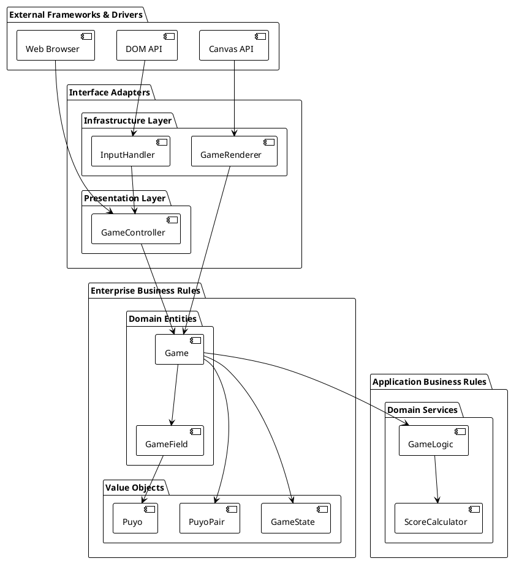
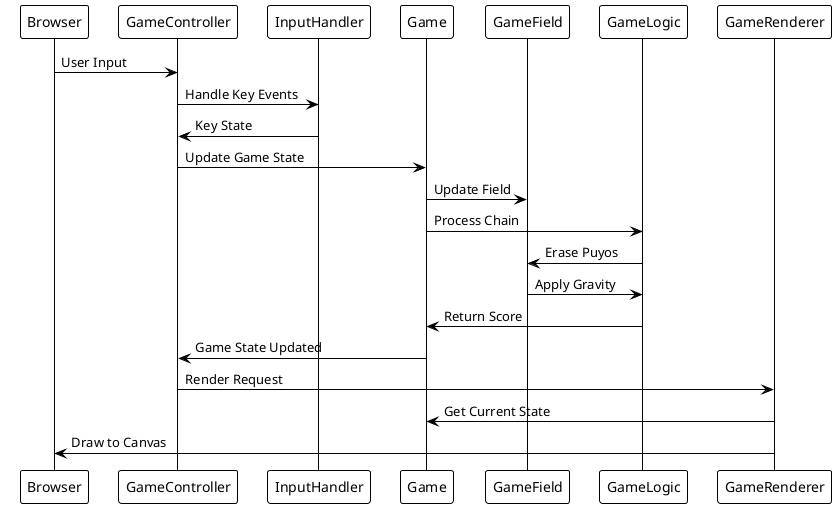

# アーキテクチャ

## 概要

このドキュメントは、ぷよぷよゲームアプリケーションのソフトウェアアーキテクチャについて説明します。本アプリケーションは、クリーンアーキテクチャの原則に従って設計されており、SOLID原則を適用して高い保守性と拡張性を実現しています。

## アーキテクチャ原則

### クリーンアーキテクチャ



### 依存関係の方向

- **外側の層は内側の層に依存する**
- **内側の層は外側の層を知らない**
- **ドメイン層は最も安定した層**

## レイヤー構成

### 1. ドメイン層（Domain Layer）

#### エンティティ（Entities）

**Game.ts**
- ゲーム全体の状態とライフサイクルを管理
- 責務：ゲーム状態、ぷよペア管理、入力処理の委譲

```typescript
export class Game {
  private gameField: GameField
  private gameLogic: GameLogic
  private currentPuyoPair: PuyoPair | null
  private gameState: GameState
  // ...
}
```

**GameField.ts**
- ゲームフィールドの状態とぷよの配置を管理
- 責務：フィールド状態、ぷよ配置、消去処理、重力処理

```typescript
export class GameField {
  private field: number[][]
  private readonly width = 6
  private readonly height = 12
  // ...
}
```

#### サービス（Services）

**GameLogic.ts**
- 連鎖処理とスコア更新のビジネスロジック
- 責務：連鎖判定、連鎖実行、全消しボーナス処理

```typescript
export class GameLogic {
  constructor(
    private gameField: GameField,
    private scoreUpdateCallback?: (score: number) => void,
    private zenkeshiCallback?: () => void
  ) {}
  
  processChain(): { totalScore: number; chainCount: number }
  // ...
}
```

**ScoreCalculator.ts**
- スコア計算の純粋な計算ロジック
- 責務：基本スコア計算、連鎖ボーナス計算、全消しボーナス計算

```typescript
export class ScoreCalculator {
  private static readonly ZENKESHI_BONUS = 2000
  
  static calculateErasureScore(erasedCount: number, chainCount: number): number
  static getChainBonus(chainCount: number): number
  // ...
}
```

#### 値オブジェクト（Value Objects）

**Puyo.ts / PuyoPair.ts**
- ぷよとぷよペアの不変なデータ構造
- 責務：ぷよの位置、色、回転状態の管理

```typescript
export class PuyoPair {
  public axis: Puyo
  public satellite: Puyo
  public rotation = 0
  
  rotate(): void
  getPositions(): Array<{ x: number; y: number; color: number }>
  // ...
}
```

**GameState.ts**
- ゲーム状態の列挙型
- 責務：ゲーム状態の定義

```typescript
export enum GameState {
  PLAYING = 'playing',
  GAME_OVER = 'game_over'
}
```

### 2. プレゼンテーション層（Presentation Layer）

**GameController.ts**
- UIとドメインロジックの仲介
- 責務：ユーザー操作の処理、UI更新、ゲームループ管理

```typescript
export class GameController {
  private game: Game
  private renderer: GameRenderer
  private inputHandler: InputHandler
  
  constructor() {
    this.setupEventListeners()
    this.setupInputHandlers()
    this.startGameLoop()
  }
  // ...
}
```

### 3. インフラストラクチャ層（Infrastructure Layer）

**GameRenderer.ts**
- Canvas APIを使用したレンダリング
- 責務：ゲーム画面の描画、グラフィック表示

```typescript
export class GameRenderer {
  private canvas: HTMLCanvasElement
  private ctx: CanvasRenderingContext2D
  
  render(game: Game): void
  private drawField(game: Game): void
  private drawCurrentPuyo(game: Game): void
  // ...
}
```

**InputHandler.ts**
- キーボード入力の処理
- 責務：入力イベントの管理、キー状態の追跡

```typescript
export class InputHandler {
  private keysPressed: Set<string>
  private keyHandlers: Map<string, () => void>
  
  setKeyHandler(key: string, handler: () => void): void
  isKeyPressed(key: string): boolean
  // ...
}
```

## SOLID原則の適用

### 単一責任原則（SRP）
- 各クラスが単一の責任を持つ
- Game: ゲーム状態管理
- GameField: フィールド管理
- GameLogic: 連鎖処理
- ScoreCalculator: スコア計算

### 開放閉鎖原則（OCP）
- 新機能追加時に既存コードを変更せずに拡張可能
- 例：新しいぷよの種類やゲームモードの追加

### リスコフ置換原則（LSP）
- 派生クラスは基底クラスと置換可能
- 値オブジェクトの一貫した振る舞い

### インターフェース分離原則（ISP）
- クライアントは使用しないインターフェースに依存しない
- 最小限のpublicメソッドの提供

### 依存性逆転原則（DIP）
- 高レベルモジュールは低レベルモジュールに依存しない
- GameLogicはGameFieldの抽象化に依存

## データフロー



## パフォーマンス考慮事項

### メモリ管理
- 値オブジェクトの不変性による安全なメモリ管理
- イベントリスナーの適切な削除

### 計算効率
- DFS（深度優先探索）による効率的な隣接ぷよ検出
- 底から上へのスキャンによる重力処理の最適化

### レンダリング最適化
- requestAnimationFrameを使用したスムーズなアニメーション
- 必要な部分のみの再描画

## 拡張ポイント

### 新機能の追加
1. **新しいぷよの種類**: PuyoクラスとPuyoPairクラスの拡張
2. **新しいゲームモード**: GameStateの拡張とGame状態管理の追加
3. **AI対戦**: 新しいInputHandlerの実装
4. **ネットワーク対戦**: 新しいInfrastructure層コンポーネントの追加

### パフォーマンス改善
1. **WebWorker**: 重い計算処理の並列化
2. **WebGL**: 高速なレンダリング
3. **キャッシュ機能**: 計算結果のメモ化

## テスト戦略

### ユニットテスト
- ドメイン層の各クラスの独立したテスト
- 121個のテストケースによる包括的なカバレッジ

### 統合テスト
- レイヤー間の相互作用のテスト
- ゲームプレイフローの検証

### エンドツーエンドテスト
- 実際のユーザー操作のシミュレーション
- ブラウザでの動作確認

## まとめ

このアーキテクチャにより、以下の利点を実現しています：

1. **保守性**: 各レイヤーの責務が明確で変更の影響範囲が限定的
2. **テスト容易性**: 各コンポーネントが独立してテスト可能
3. **拡張性**: 新機能追加時の既存コードへの影響最小化
4. **可読性**: 意図が明確で理解しやすいコード構造

クリーンアーキテクチャとSOLID原則の適用により、**変更を楽に安全にできて役に立つソフトウェア**を実現しています。