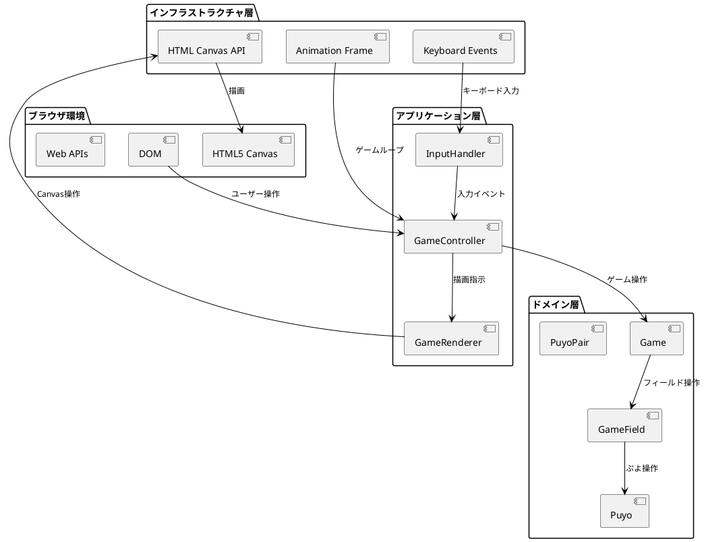
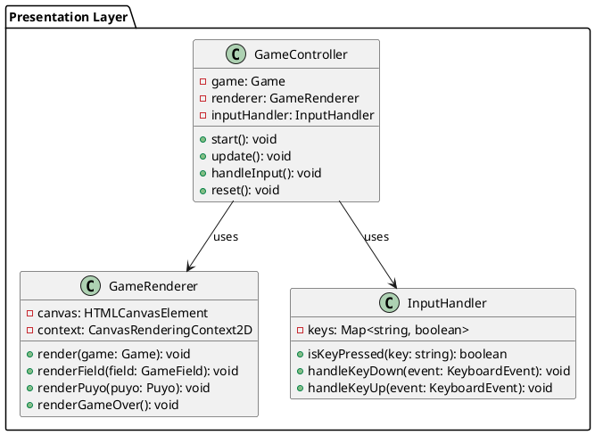
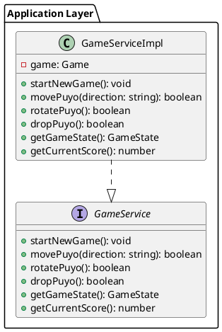
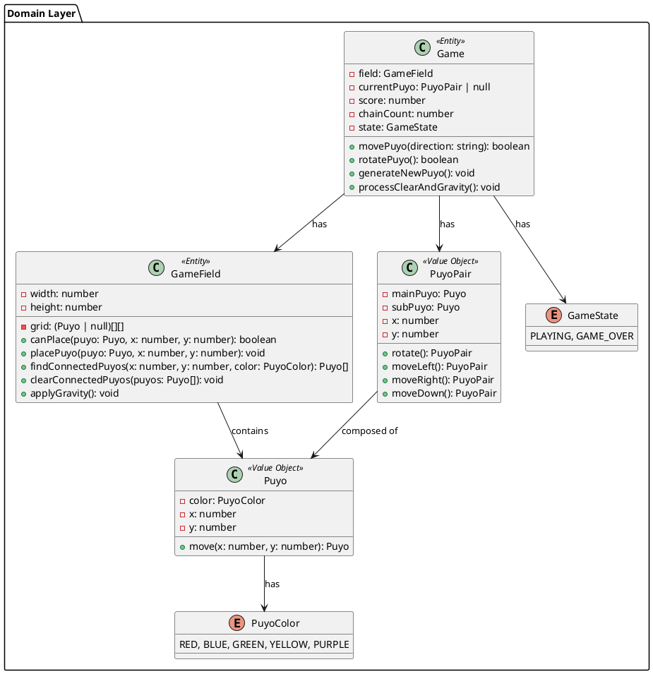
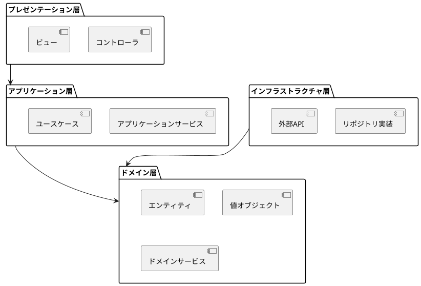
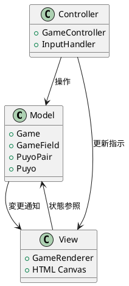
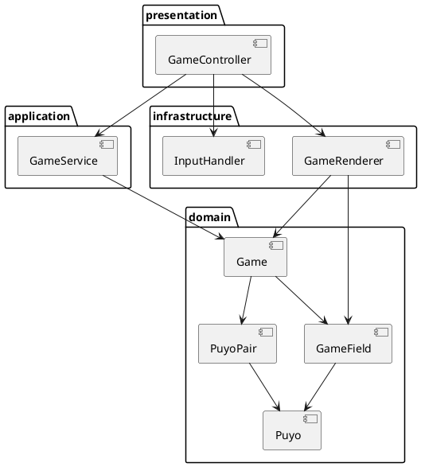

# アーキテクチャ設計

## 概要

ぷよぷよゲームシステムのアーキテクチャ設計を定義します。ドメイン駆動設計（DDD）を採用し、Web技術スタックを基盤としたクリーンアーキテクチャを実装します。

## システムアーキテクチャ概要



## レイヤードアーキテクチャ

### プレゼンテーション層


### アプリケーション層


### ドメイン層


## 技術スタック

### フロントエンド技術
| 技術 | 用途 | 理由 |
|------|------|------|
| TypeScript | 言語 | 型安全性、開発効率、コード品質 |
| HTML5 Canvas | 描画 | ゲーム描画に最適、パフォーマンス |
| Vite | ビルドツール | 高速開発、HMR、TypeScript統合 |
| Vitest | テストフレームワーク | Vite統合、高速実行 |

### 開発・運用技術
| 技術 | 用途 | 理由 |
|------|------|------|
| ESLint | 静的解析 | コード品質、一貫性 |
| Prettier | フォーマット | コードスタイル統一 |
| Vercel | デプロイメント | 簡単デプロイ、CDN |
| GitHub Actions | CI/CD | 自動化、品質ゲート |

## アーキテクチャパターン

### 1. ドメイン駆動設計（DDD）


### 2. MVCパターン


### 3. 不変オブジェクトパターン
- Value Object（Puyo, PuyoPair）は不変
- 状態変更時は新しいインスタンス作成
- サイドエフェクトの最小化

## モジュール構成

### ディレクトリ構造
```
app/
├── src/
│   ├── domain/          # ドメイン層
│   │   ├── entities/    # エンティティ
│   │   ├── valueObjects/# 値オブジェクト
│   │   └── services/    # ドメインサービス
│   ├── application/     # アプリケーション層
│   │   └── services/    # アプリケーションサービス
│   ├── infrastructure/ # インフラストラクチャ層
│   │   ├── rendering/   # 描画関連
│   │   └── input/       # 入力関連
│   └── presentation/    # プレゼンテーション層
│       └── controllers/ # コントローラ
├── tests/              # テストファイル
└── public/             # 静的ファイル
```

### 依存関係管理


## 設計原則

### SOLID原則の適用
1. **単一責任原則（SRP）**: 各クラスは一つの責任のみ
2. **開放閉鎖原則（OCP）**: 拡張に開いて、修正に閉じる
3. **リスコフの置換原則（LSP）**: インターフェース契約の遵守
4. **インターフェース分離原則（ISP）**: 必要最小限のインターフェース
5. **依存性逆転原則（DIP）**: 抽象に依存、具象に依存しない

### DRY（Don't Repeat Yourself）
- コードの重複排除
- 共通ロジックの抽出
- ユーティリティ関数の活用

### YAGNI（You Ain't Gonna Need It）
- 必要最小限の機能実装
- 過度な汎用化の回避
- イテレーティブな機能追加

## パフォーマンス設計

### レンダリング最適化
- 60FPS を目標とした描画ループ
- requestAnimationFrameの活用
- 差分描画の検討（将来拡張）

### メモリ管理
- オブジェクトプールの検討（将来拡張）
- 不要オブジェクトの早期解放
- メモリリークの防止

### ゲームループ最適化
- 固定タイムステップの実装
- 処理時間の最適化
- フレーム率の安定化

## 拡張性設計

### 機能拡張ポイント
- ぷよの色追加（PuyoColor enum拡張）
- ゲームモード追加（GameState拡張）
- エフェクト追加（Renderer拡張）
- AI対戦機能（新ドメインサービス）

### 設定可能項目
- フィールドサイズ
- 落下速度
- 色数設定
- スコア計算式

### プラットフォーム対応
- モバイル対応（タッチ操作）
- 異なる画面サイズ対応
- PWA対応（将来拡張）