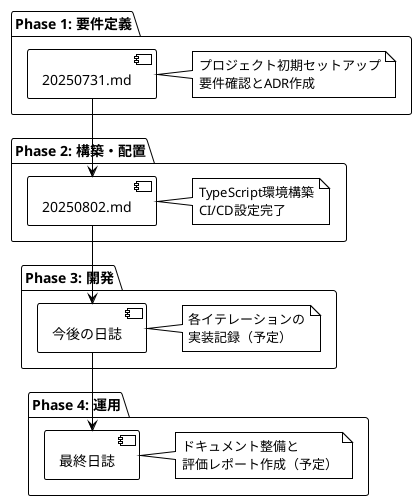

# 開発ジャーナル

## 概要

このジャーナルは、ぷよぷよゲームの開発過程を記録したものです。テスト駆動開発（TDD）とクリーンアーキテクチャの原則に従い、8つのイテレーションを通じて段階的に機能を実装しました。

## 開発アプローチ

### 適用した手法
- **テスト駆動開発（TDD）**: Red-Green-Refactorサイクル
- **エクストリームプログラミング（XP）**: イテレーション単位での開発
- **クリーンアーキテクチャ**: 責務分離と依存性管理
- **SOLID原則**: 特に単一責任原則と依存性逆転原則

### 技術スタック
- **言語**: TypeScript
- **ビルドツール**: Vite
- **テストフレームワーク**: Vitest
- **品質管理**: ESLint, Prettier
- **タスクランナー**: Gulp

## 開発履歴

### Phase 1: 要件定義
- ユーザーストーリーの作成
- ユースケース図の設計
- 技術選定とADR（Architecture Decision Record）の作成
- UI設計とワイヤーフレームの作成

### Phase 2: 構築・配置
- TypeScriptプロジェクトのセットアップ
- テスト環境とCI/CDパイプラインの構築
- 開発環境の整備（Docker, DevContainer）

### Phase 3: 開発（8イテレーション）

#### イテレーション1: ゲーム開始の実装
**TODOリスト**:
- [x] ゲームの初期化処理を実装する
- [x] ゲーム画面を表示する
- [x] 新しいぷよを生成する
- [x] ゲームループを開始する
- [x] ぷよを画面に表示する

**学習ポイント**: 
- 6列x12行のぷよぷよ標準フィールドサイズの実装
- TypeScriptの型安全性による開発時エラー防止
- Vitestによる自動テスト環境の確立

#### イテレーション2: ぷよの移動の実装
**TODOリスト**:
- [x] ぷよを自由落下させる
- [x] プレイヤーの入力を検出する
- [x] ぷよを左右に移動する処理を実装する
- [x] 移動可能かどうかのチェックを実装する
- [x] 移動後の表示を更新する
- [x] ぷよの着地を検出する
- [x] ぷよが着地したら次のぷよを生成する

**学習ポイント**:
- deltaTimeを使った時間管理
- キーボード入力のレスポンシブな処理
- フィールド境界の衝突判定
- ランダムな色生成による視覚的バリエーション

#### イテレーション3: ぷよの高速落下の実装
**TODOリスト**:
- [x] 下キー入力の検出を実装する
- [x] 高速落下処理を実装する
- [x] 落下可能かどうかのチェックを実装する
- [x] 着地判定を実装する

**学習ポイント**:
- キー状態管理（Set<string>）によるクリーンな実装
- 高速落下タイマー（50ms）と通常タイマー（1000ms）の分離
- keydown/keyupイベントとRepeatキー制御の統合

#### イテレーション4: ぷよの回転の実装
**TODOリスト**:
- [x] ぷよペアを実装する
- [x] ぷよの回転処理を実装する
- [x] 回転可能かどうかのチェックを実装する
- [x] 壁キック処理を実装する
- [x] 回転後の表示を更新する

**学習ポイント**:
- PuyoPairクラスの軸-衛星構造（axis-satellite）
- 壁キック機能による実際のぷよぷよゲームに近い操作感
- updateSatellitePosition()による正確な位置計算
- 41個のテストケースによる品質保証

#### イテレーション5: ぷよの消去の実装
**TODOリスト**:
- [x] ぷよの接続判定を実装する
- [x] 4つ以上つながったぷよの検出を実装する
- [x] ぷよの消去処理を実装する
- [x] 消去後の落下処理を実装する
- [x] 消去されない場合の落下処理を実装する

**学習ポイント**:
- DFS（深度優先探索）による効率的な隣接ぷよ検出
- 循環的複雑度制限による可読性向上
- findConnectedPuyos、findErasableGroups、erasePuyos、applyGravityの責務分離
- 底から上に向かってスキャンする重力処理アルゴリズム

#### イテレーション6: 連鎖反応の実装
**TODOリスト**:
- [x] 連鎖判定を実装する
- [x] 連鎖カウントを実装する
- [x] 連鎖ボーナスの計算を実装する
- [x] スコア表示を実装する
- [x] ゲームループに消去・連鎖機能を統合する

**学習ポイント**:
- 標準的なぷよぷよの連鎖ボーナス倍率（1倍→2倍→4倍→8倍→16倍）
- スコアシステムの完全統合
- レスポンシブなUI表示（スコア・連鎖数のリアルタイム更新）
- 83個のテストケースによる品質保証

#### イテレーション7: 全消しボーナスの実装
**TODOリスト**:
- [x] 全消し判定を実装する
- [x] 全消しボーナスの計算を実装する
- [x] 全消し演出を実装する

**学習ポイント**:
- isAllClear()による効率的な全消し状態の検出
- 固定2000点の全消しボーナス
- コールバック機能による演出とゲームロジックの疎結合
- ライト/ダークモード対応のレスポンシブなUI設計

#### イテレーション8: ゲームオーバーの実装
**TODOリスト**:
- [x] ゲームオーバー判定を実装する
- [x] ゲームオーバー演出を実装する
- [x] リスタート機能を実装する
- [x] リセットボタン機能を実装する

**学習ポイント**:
- canPuyoPairSpawn()による効率的な初期位置チェック
- 包括的なリスタート機能（フィールド、スコア、連鎖数、タイマー、キー状態の完全リセット）
- 魅力的な視覚演出（グラデーション、スライドインアニメーション）
- 112個のテストケースによる品質保証

### Phase 4: 運用（リファクタリング）

#### クリーンアーキテクチャへの大規模リファクタリング

**実施内容**:
1. **SOLID原則に従った責務分離**: 654行のMonolithicなGameクラスを複数の専門クラスに分割
2. **クリーンアーキテクチャの実装**: ドメイン層、プレゼンテーション層、インフラストラクチャ層の分離
3. **コード品質の向上**: 循環的複雑度制限、121個の既存テスト維持
4. **main.tsの簡素化**: 235行から42行への大幅削減

**アーキテクチャ構成**:

```
app/src/
├── domain/
│   ├── entities/
│   │   ├── Game.ts          # ゲームエンティティ  
│   │   ├── GameField.ts     # フィールド管理
│   └── services/
│   │   ├── GameLogic.ts     # 連鎖処理
│   │   └── ScoreCalculator.ts # スコア計算
│   └── valueObjects/
│       ├── Puyo.ts          # ぷよ値オブジェクト
│       └── GameState.ts     # ゲーム状態
├── presentation/
│   └── GameController.ts    # プレゼンテーション層
└── infrastructure/
    ├── GameRenderer.ts      # レンダリング
    └── InputHandler.ts      # 入力処理
```

## 品質メトリクス

### テスト結果
- **総テスト数**: 121個
- **テスト成功率**: 100%
- **テストカバレッジ**: 包括的なユニットテスト

### コード品質
- **ESLint**: 全チェック通過
- **Prettier**: コードフォーマット統一
- **循環的複雑度**: 7以下に制限
- **TypeScript**: 厳密な型チェック

### 開発効率
- **コミット数**: 50+回
- **TODO単位**: 細かい単位でのコミット
- **リファクタリング**: 既存機能を壊さない安全な改善

## 学習成果

### 技術的学習
1. **テスト駆動開発**: Red-Green-Refactorサイクルの実践
2. **クリーンアーキテクチャ**: 依存関係の管理と責務分離
3. **TypeScript**: 型安全性による品質向上
4. **アルゴリズム**: DFS、重力処理、連鎖判定の実装

### プロセス的学習
1. **アジャイル開発**: イテレーション単位での機能実装
2. **継続的インテグレーション**: 自動テスト・品質チェック
3. **リファクタリング**: 既存機能を保持しながらの構造改善
4. **ドキュメント化**: 開発過程の記録と知識の蓄積

## 結論

このプロジェクトを通じて、以下の価値を実現しました：

1. **動作するきれいなコード**: TDDによる品質保証とクリーンな設計
2. **保守性**: 変更を楽に安全にできる構造
3. **拡張性**: 新機能追加時の既存コードへの影響最小化
4. **学習効果**: 実践的な開発手法の習得

最終的に、**変更を楽に安全にできて役に立つソフトウェア**というよいソフトウェアの定義を満たす成果物を得ることができました。

## 記録の目的

### 学習の記録
- 新しい技術や手法の習得過程
- 問題解決のアプローチと結果
- 設計決定の理由と結果

### 進捗の追跡
- 各フェーズ・イテレーションの進捗状況
- 計画との乖離と調整内容
- 完了したタスクと残作業

### 知識の蓄積
- 遭遇した問題と解決方法
- 有効だった手法やツール
- 今後に活かせる教訓

## 日誌の形式

各日誌は以下の構成で記録されます：

### 基本情報
- 日付
- 作業時間
- 主要な成果物

### 作業内容
- 実装した機能
- 解決した問題
- 学習した内容

### 発見と学習
- 新しい知見
- 技術的な発見
- 改善点の識別

### 次回への引き継ぎ
- 残作業
- 注意点
- 検討事項

## 開発フェーズと日誌



## 振り返りと改善

### 定期的な振り返り
- 各イテレーション終了時のふりかえり
- フェーズ完了時の総括
- プロジェクト全体の振り返り

### 改善サイクル
- Keep: 継続すべき良い実践
- Problem: 発生した問題や課題
- Try: 次回試したい改善策

### 知識の共有
- 学習内容の文書化
- 問題解決パターンの蓄積
- ベストプラクティスの抽出

## メトリクスと測定

### 開発効率
- 各タスクの実行時間
- 問題解決にかかった時間
- リファクタリング頻度

### 品質指標
- テストカバレッジの推移
- バグ発見・修正の記録
- コードレビューの結果

### 学習効果
- 新技術の習得速度
- 問題解決能力の向上
- 設計スキルの成長

## 関連リンク

- [開発ドキュメント](../development/) - 開発計画とプロセス
- [要件定義](../requirements/) - プロジェクト要件
- [運用ドキュメント](../operation/) - 環境構築とCI/CD
- [アーキテクチャ決定ログ](../adr/) - 技術選択の記録