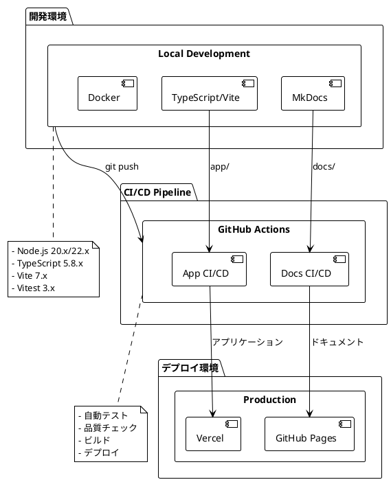
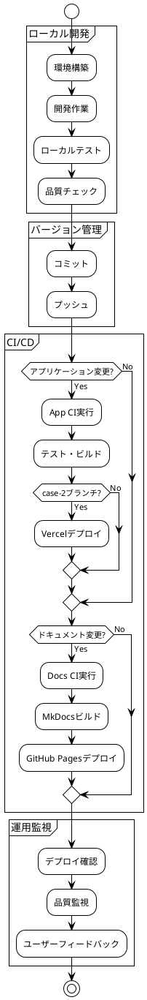

# 運用ドキュメント

## 概要

このセクションでは、ぷよぷよゲーム開発プロジェクトの運用に関する情報を提供します。開発環境のセットアップ、CI/CDパイプライン設定、ドキュメント管理などを含みます。

## ドキュメント一覧

- [セットアップ](./セットアップ.md) - 開発環境のセットアップ手順
- [CI/CD設定](./ci-cd設定.md) - GitHub Actions + Vercelを使用したCI/CDパイプライン設定手順
- [MkDocs GitHub Actions設定](./MkDocs_GitHub_Actions設定.md) - GitHub ActionsでMkDocsを自動化する手順

## 運用アーキテクチャ



## 技術スタック

| カテゴリ | 技術 | バージョン | 用途 |
|----------|------|----------|------|
| **アプリケーション** | TypeScript | 5.8.x | 型安全な開発 |
| | Vite | 7.x | ビルドツール |
| | Vitest | 3.x | テストフレームワーク |
| | Canvas API | - | ゲーム描画 |
| **ドキュメント** | MkDocs | 最新 | 静的サイト生成 |
| | Material for MkDocs | 最新 | テーマ |
| | PlantUML | 最新 | 図表作成 |
| **開発環境** | Node.js | 20.x/22.x | JavaScript実行環境 |
| | Docker | 最新 | コンテナ化 |
| | Docker Compose | 最新 | 複数コンテナ管理 |
| **品質管理** | ESLint | 9.x | 静的解析 |
| | Prettier | 3.x | コードフォーマット |
| | c8 | 10.x | カバレッジ測定 |
| **タスクランナー** | Gulp | 5.x | タスク自動化 |
| **CI/CD** | GitHub Actions | - | 自動化パイプライン |
| **ホスティング** | Vercel | - | アプリケーション |
| | GitHub Pages | - | ドキュメント |

## 運用フロー

### 開発サイクル



### セットアップ手順

1. **初期環境構築**
   ```bash
   # リポジトリクローン
   git clone <repository-url>
   cd case-study-game-dev
   
   # 依存関係インストール
   npm install
   ```

2. **アプリケーション環境**
   ```bash
   # アプリケーションディレクトリ
   cd app
   npm install
   npm run setup
   ```

3. **ドキュメント環境**
   ```bash
   # ドキュメントサーバー起動
   npm run docs:serve
   ```

### 品質管理

#### 自動チェック項目

- **静的解析**: ESLint による問題検出
- **フォーマット**: Prettier によるコード整形
- **テストカバレッジ**: 80%以上の維持
- **型チェック**: TypeScript による型安全性
- **ビルド確認**: 本番環境でのビルド成功

#### 手動チェック項目

- **機能テスト**: 各機能の動作確認
- **ユーザビリティ**: 操作性・視認性の確認
- **パフォーマンス**: 応答速度・描画性能
- **互換性**: 複数ブラウザでの動作確認

## 環境管理

### 開発環境

- **URL**: http://localhost:5173 (Vite dev server)
- **ドキュメント**: http://localhost:8000 (MkDocs)
- **テスト**: ローカル実行
- **デバッグ**: ブラウザ開発者ツール

### ステージング環境

- **URL**: Vercel Preview URL
- **用途**: レビュー・受け入れテスト
- **更新**: Pull Request作成時

### 本番環境

- **アプリケーション**: Vercel本番URL
- **ドキュメント**: GitHub Pages URL
- **更新**: case-2ブランチプッシュ時

## 監視とメトリクス

### パフォーマンス監視

- **ページ読み込み時間**: < 3秒
- **フレームレート**: 60FPS維持
- **メモリ使用量**: ブラウザリソース監視

### 品質メトリクス

- **テストカバレッジ**: 80%以上
- **ESLintエラー**: 0件
- **ビルド成功率**: 100%
- **デプロイ成功率**: 100%

### 使用状況

- **アクセス数**: Vercel Analytics
- **エラー率**: ブラウザコンソールエラー
- **ユーザーフィードバック**: GitHub Issues

## トラブルシューティング

### よくある問題

#### Node.js バージョン問題
```bash
# 現在のバージョン確認
node --version

# 推奨バージョン: 20.x または 22.x
# nodenv/nvm での切り替え推奨
```

#### ビルドエラー
```bash
# 依存関係の再インストール
rm -rf node_modules package-lock.json
npm install

# キャッシュクリア
npm run build -- --clear-cache
```

#### CI/CD失敗
1. **ローカルでの再現確認**
2. **GitHub Actions ログ確認**
3. **環境変数・シークレット確認**
4. **依存関係の更新確認**

## セキュリティ

### 機密情報管理

- **GitHub Secrets**: API トークン等
- **環境変数**: Vercel での設定
- **依存関係**: 定期的な脆弱性チェック

### アクセス制御

- **ブランチ保護**: main/develop ブランチ
- **レビュー必須**: Pull Request でのコードレビュー
- **権限管理**: 最小権限の原則

## 関連リンク

- [開発ドキュメント](../development/) - 開発プロセスと計画
- [要件定義](../requirements/) - プロジェクト要件
- [アーキテクチャ決定ログ](../adr/) - 技術選択の記録
- [開発日誌](../journal/) - 開発進捗の記録