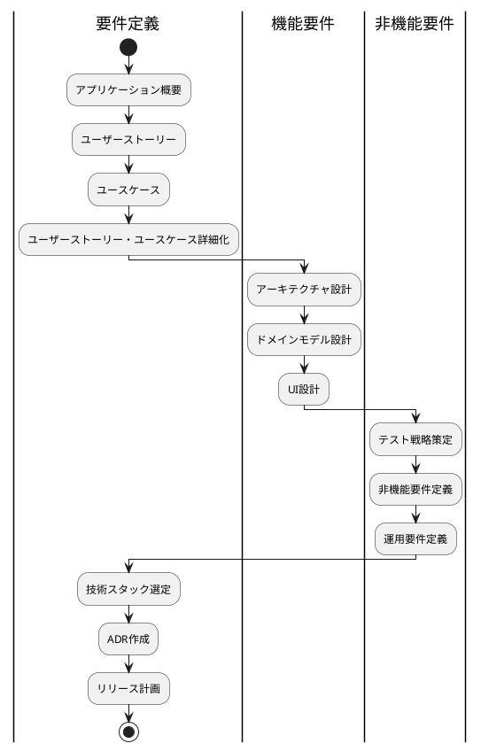
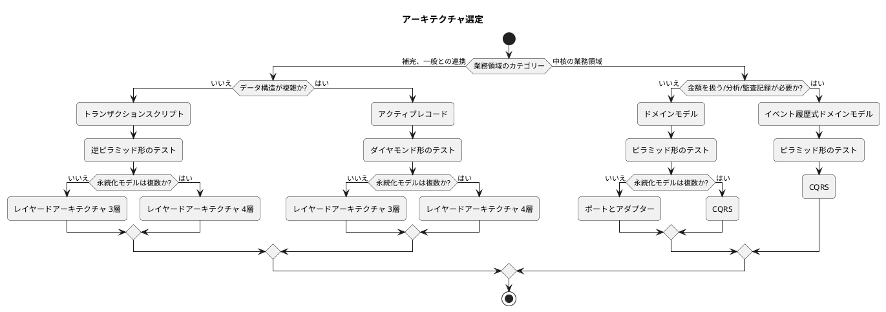
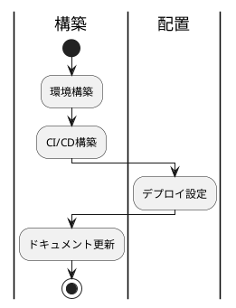
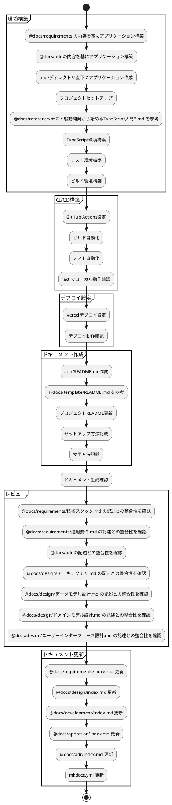
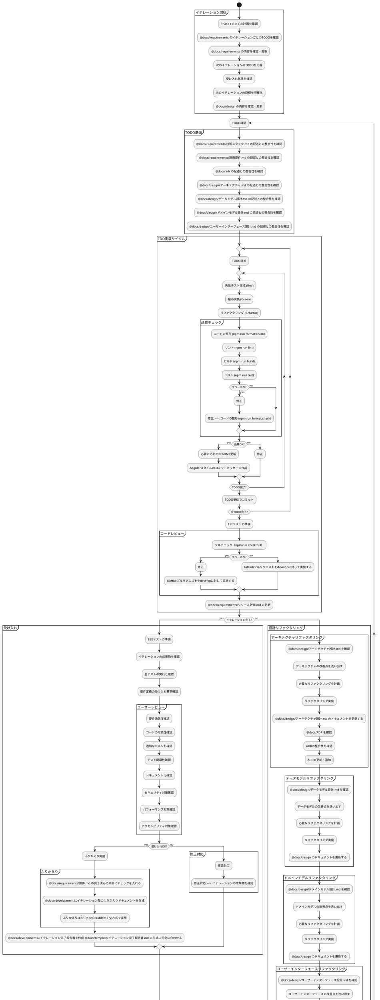
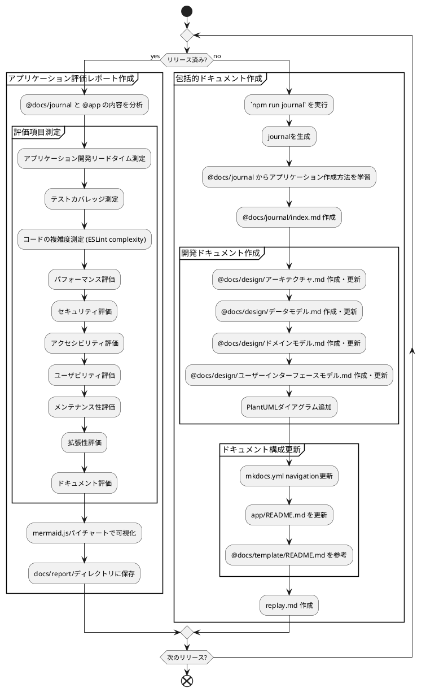

# CLAUDE.local.md

各インタラクションには以下の手順に従ってください：

1. ユーザー識別：
    - あなたはdefault_userと対話していると想定してください
    - もしdefault_userを識別していない場合は、積極的に識別を試みてください
2. 記憶の取得：
    - チャット内での最初の会話開始時に「Remembering...」とだけ言って、知識グラフから関連するすべての情報を取得してください
    - 知識グラフは常に「記憶」と呼んでください
3. 記憶：
    - ユーザーとの会話中、以下のカテゴリに該当する新しい情報に注意を払ってください：
    - a) 基本的なアイデンティティ（年齢、性別、場所、職業、学歴など）
    - b) 行動（興味、習慣など）
    - c) 好み（コミュニケーションスタイル、好みの言語など）
    - d) 目標（目標、ターゲット、願望など）
    - e) 人間関係（3次の隔たりまでの個人的および職業的関係）
4. 記憶の更新：
    - インタラクション中に新しい情報が得られた場合は、以下のように記憶を更新してください：
    - a) 繰り返し登場する組織、人物、重要なイベントについてエンティティを作成する
    - b) それらを関係を使って現在のエンティティに接続する
    - c) それらに関する事実を観察として保存する
5. 共有記憶:
    - 永続的に共有する記憶は ByteRover MCP に保存する
    - ByteRoverは常に 「共有記憶」と呼んでください

## Phase 1 要件

### 概要



### 詳細






```plantuml
@startuml "Phase 1 要件フェーズ"
start

partition "要件定義" {
  partition "アプリケーション概要" {
    :@docs/requirements/仕様.md を作成;
  }
  partition "ユーザーストーリー" {
    :@docs/requirements/ユーザーストーリー.md を作成;
  }
  partition "ユースケース" {
    :@docs/requirements/ユースケース.md を作成;
  }
  partition "ユーザーストーリー・ユースケース詳細化" {
      partition "ユーザーストーリー作業" {
        :ユーザーストーリー詳細化;
        :受け入れ基準定義;
        :完了定義設定;
        :優先順位付け;
        :見積り;
      }
      
      partition "ユースケース作業" {
        :主要ユースケース詳細化;
        :事前条件・事後条件定義;
        :主な流れ・代替フロー記述;
        :システムユースケース追加;
      }
  }
  
  partition "機能要件" {
      partition "アーキテクチャ" {
        :アーキテクチャ選定;
        :ヘキサゴナルアーキテクチャ採用;
        :@docs/reference/TypeScriptによるヘキサゴナルアーキテクチャ実装.md 参照;
        :各層の責任分離;
        :依存関係図作成;
        :設計原則適用;
      }
      
      partition "ドメインモデル" {
        :DDD原則適用;
        :ドメインサービス定義;
        :ドメインイベント設計;
        :ユビキタス言語確立;
        :エラー処理戦略;
      }
      
      partition "UI設計" {
        :全体レイアウト設計;
        :詳細UI設計（ゲームフィールド/ぷよ表示/コントロール）;
        :ゲーム状態別UI;
        :レスポンシブデザイン;
        :タッチ操作UI;
        :アクセシビリティ対応;
      }
  }
  
  partition "非機能要件" {
    partition "実装戦略" {
     :関数型アプローチ採用;
     :@docs/reference/JavaScriptで学ぶ関数型プログラミング.md を参照;
     :@docs/reference/JavaScriptで学ぶ関数型プログラミング実践入門.md を参照;
     :TDD開発サイクル定義;
    }
  
    partition "テスト戦略" {
      :3層テスト戦略（単体/統合/E2E）;
      :レイヤー別テスト戦略;
      :パフォーマンステスト;
      :テストデータ管理;
      :CI/CDテスト実行;
    }
    
    partition "非機能要件定義" {
      :パフォーマンス要件;
      :セキュリティ要件;
      :可用性要件;
      :拡張性要件;
      :互換性要件;
      :アクセシビリティ要件;
      :メンテナンス性要件;
    }
    
    partition "運用要件定義" {
     :CI/CDパイプライン設計;
     :環境構成（Local/Staging/Production）;
     :監視・観測戦略;
     :デプロイメント手順;
     :運用手順書;
     :インシデント対応;
     :バックアップ・復旧計画;
     :開発フロー（Git Flow）;
    }
  }
  
  partition "要件定義" {
    partition "技術スタック選定" {
     :技術スタック選定;
    }
    
    partition "ADR作成" {
     :@docs/ADR に決定事項を記録;
    }
    
    partition "リリース計画" {
    :@docs/requirements/ユーザーストーリー.md を参照;
    :@docs/requirements/ユースケース.md を参照;
     :@docs/requirements/リリース計画.md を作成;
    }
  }
}

end
@enduml
```

- 要件定義のドキュメントは @docs/requirements に保存する
- 機能要件のドキュメントは @docs/design に保存する
- 機能要件のドキュメントは要件段階では詳細に書かないで概要レベルにとどめる
- ドキュメントのダイアグラムはPlantumlを使用する
- ただしリリース計画のガントチャート及びレポートのチャートには mermaid.js を使用する
- ユーザーインターフェース設計.mdのダイアグラムはplantumlのSalt (Wireframe)を使う
- ドキュメントを追加したディレクトリにindex.mdを作成・更新する
- mkdocs.ymlを更新する
- レビューするのでコミットは実施しない
- 以下ような記述は**の次を改行してスペースを開けること
```markdown
- **対象:**
- ドメインモデル（Puyo, Field, Game, Chain）
```

## Phase 2 構築・配置

### 概要



### 詳細



- サイクロマティック複雑度は7に設定する
- アーキテクチャルール検証にはdependency-cruiserを採用する
- コード品質管理サービスにCodecovを採用する
- GihHub MCPセットアップ 
```
claude mcp add github npx @modelcontextprotocol/server-github -e GITHUB_PERSONAL_ACCESS_TOKEN=xxxxxxxxxxxxxx
claude mcp add github npx -y @modelcontextprotocol/server-github -s project  
```


## Phase 3 開発

### 開発実績

#### ✅ 完了済みイテレーション

- **イテレーション1（2025-08-13）**: 基本ゲーム機能実装 - 3日早期完了
- **イテレーション2（2025-01-16）**: テストカバレッジ向上 - 91.18%達成（目標80%超過）
- **イテレーション3（2025-08-18）**: AI機能基盤実装 - TensorFlow.js統合完了
- **イテレーション4（2025-08-19）**: AI分析・戦略機能 - 29 SP完了（100%）
- **イテレーション5（2025-08-25）**: mayah AI評価システム - 39 SP完了（100%、2,372行実装）

#### 🏆 主要成果
- **総Story Points**: 129 SP完了（計画達成率100%）
- **技術実装**: mayah AI 4要素評価システム完成
- **品質指標**: TypeScript型カバレッジ94%、テストカバレッジ80.57%
- **アーキテクチャ**: ヘキサゴナルアーキテクチャ + 関数型プログラミング実装
- **CI/CD**: GitHub Actions + Vercel自動デプロイ体制

### 概要

```plantuml
start

partition "イテレーション開始" {
}

repeat :TODO確認;
partition "実施準備" {
}
partition "TDD実装サイクル" {
    repeat
      :TODO選択;
      
      repeat
        :失敗テスト作成 (Red);
        :最小実装 (Green);
        :リファクタリング (Refactor);
        :品質チェック;
        if (品質OK?) then (yes)
          :コミット;
        else (no)
          :修正;
        endif
      repeat while (TODO完了?)
    repeat while (全TODO完了?)
    partition "コードレビュー" {
    }
}

if (イテレーション完了?) then (yes)
  partition "受け入れ" {
    partition "ユーザーレビュー" {
    }
    if (受け入れOK?) then (yes)
      partition "ふりかえり" {
      }
    else (no)
      partition "修正対応" {
      }
    endif
  }
else (no)
  partition "設計リファクタリング" {
      partition "アーキテクチャリファクタリング" {
      }
      partition "データモデルリファクタリング" {
      }
      partition "ドメインモデルリファクタリング" {
      }
      partition "UIリファクタリング" {
      }
  }
endif
partition "ドキュメント更新" {
}

repeat while (次のTODO?)

stop
```

### 詳細


### ⚠️ 開発における重要な制約・規律

- **TODO単位でコミット**: 必ずTODO完了ごとにコミット実施
- **共有記憶への保存**: 後で参照できるようにByteRover MCP に保存する
- **フロー厳守**: CLAUDE.mdのコーディングとテストフローに厳密に従う
- **勝手な進行禁止**: 勝手に次のイテレーションに着手しない
- **受け入れ確認必須**: ユーザーによる受け入れを確認するまで勝手にコミットしない
- **日本語テスト**: ユニットテストは3A手法に従い日本語でテスト記述
- **品質ゲート**: 品質チェックは全てパスするまで次のTODOにすすんではならない
- **ビルド必須**: ビルドエラーが出た場合は、必ず修正してから次のTODOに進む
- **品質チェック必須**: 勝手な判断で品質チェックをスキップしてはならない

## Phase 4 運用



### 包括的ドキュメントを作成する

`npm run journal` を実行して、journalを生成する
@docs/journal からアプリケーションをどのように作ったか学習する
@docs/journal に index.md を作成する
ダイアグラムにはplantumlを使用する
- @docs/design/アーキテクチャ.md を作成してアプリケーションのアーキテクチャをまとめる
- @docs/design/設計.md を作成してアプリケーションの設計をまとめる
- @docs/design/実装.md を作成してアプリケーションの実装をまとめる
- mkdocs.yml を更新してドキュメントを生成できるようにする
- app/README.md を更新してアプリケーションの概要と使い方をまとめる
- README.md のフォーマットは @docs/template/README.md を参考にする

最後に次回同様の手順を再現できるようにしたいため replay.md を作成する
